【考纲内容】

（一）总线：总线的基本概念；总线的组成及其性能指标；总线事务和定时

（二）设备：设备的基本概念；设备的分类；I/O接口；输入/输出应用程序接口

（三）I/O方式：程序查询方式；程序中断方式；DMA方式

（四）I/O软件层次结构：中断处理程序，驱动程序，设备独立性软件，用户层I/O软件

（五）外存管理：磁盘；磁盘调度算法固态硬盘

输入输出组织要解决的问题是对各种形式的信息进行输入和输出的控制，包括如何在CPU、主存和外设之间建立一个高效的信息传输“通路”？怎样将用户的I/O请求转换成对设备的控制命令？如何对外设进行编址？怎样使CPU方便地寻找到要访问的外设？I/O硬件和I/O软件如何协调完成主机和外设之间的数据传送？计算机组成原理着重讲三种I/O控制方式，操作系统里面着重讲I/O软件的处理过程，软硬件究竟是怎么协同工作？设备驱动程序和中断处理程序到底是什么，有什么区别和联系？不同的I/O控制方式对应不同的设备驱动程序，在工作流程上到底有什么样的区别？什么是设备控制器，用户缓冲区和内核缓冲区？数据究竟是怎么输入输出的，每个过程是由什么程序来控制？系统调用在I/O里面起了什么作用？中断软件机制和中断硬件是怎么协同工作的？

### 概述

输入输出组织主要用于控制外设与内存、外设与CPU之间进行数据交换，是计算机系统中软、硬件结合的子系统，通常把外部设备及其接口、I/O控制部件以及I/O软件统称为输入输出系统。

#### 基本功能

I/O系统管理的主要对象是I/O设备和相应的设备控制器，最主要的任务是满足用户进程提出的I/O请求，提高I/O速度，提高设备的利用率，以及为更高层的进程方便地使用I/O设备提供手段，主要提供的服务有文件系统空间分配、设备分配、I/O调度等。I/O系统的基本功能中，前两方面是为了方便用户使用I/O设备，第三、第四方面是为了提高处理机和IO设备的利用率最后两方面是为了给用户在共享设备时提供方便，以保证系统能有条不紊地运行，当系统发生错误时能及时发现错误，甚至自动修正错误。

**隐藏I/O设备的细节**

I/O设备的类型多样，彼此间存在差异，如它们接收和产生数据的速度、数据传输方向、数据粒度、数据的表示形式以及可靠性等。通常会为它们配置相应的设备控制器，这是一种硬件设备，其中包含若干个用于存放控制命令和参数的寄存器。用户通过这些命令和参数，可以控制I/O设备执行所要求的操作。对于不同的I/O设备，需要有不同的命令和参数。例如，在对磁盘进行操作时，不仅要给出本次是读命令还是写命令，还要给出源数据或目标数据的位置，包括磁盘的盘面号、磁道号和扇区号。要求程序员或用户编写直接面向这些I/O设备的程序是极其困难的，因此I/O系统必须通过对I/O设备加以适当的抽象，以隐藏I/O设备的实现细节，仅向上层进程提供少量的、抽象的读/写命令，如read、write等（命令是CPU发出的，但是由设备控制器提供的）。

**保证设备无关性**

保证设备无关性这一功能，是在隐藏I/O设备细节的基础上实现的。一方面，用户不仅可以使用抽象的I/O命令，还可以使用抽象的逻辑设备名来使用设备；另一方面，也可以有效地提高OS的可移植性和易适应性，安装新的设备时，不需要将整个OS进行重新编译即可增添新的设备驱动程序，例如在Windows系统可以为新的I/O设备自动寻找和安装设备驱动程序，做到即插即用。

**提高CPU和设备的利用率**

在一般的系统中，许多I/O设备间是相互独立的，能够并行操作，处理机与设备之间也能并行操作。为此，一方面要求处理机能快速响应用户的I/O请求，使I/O设备能够尽快运行起来；另一方面要求尽量减少在每个I/O设备运行时处理机的干预时间。

**对I/O设备进行控制**

设备驱动程序的功能之一，包括轮询的可编程I/O方式，中断的可编程I/O方式，DMA方式，I/O通道方式，应采用何种控制方式，与I/O设备的传输速率、传输的数据单位等因素有关。为了给上层软件和用户提供方便，显然I/O软件也应屏蔽掉这种差异，向上层软件和用户提供统一的操作接口。

**确保对设备的正确共享**

进程应互斥地访问独占设备，即系统一旦把此类设备分配给某进程后，便由该进程独占，直至用完释放，典型的独占设备有打印机、磁带机等。系统在对独占设备进行分配时，还应考虑分配的安全性。共享设备，是指在一段时间内允许多个进程同时访问的设备，典型的共享设备是磁盘，当有多个进程对磁盘执行读/写操作时，操作可以交叉进行而不会影响到读/写的正确性。

**处理错误**

大多数的设备都包括了较多的机械和电气部分，运行时容易出现错误和故障。由于多数错误是与设备紧密相关的，因此对于错误的处理，应该尽可能地在接近硬件的层面上进行，即低层软件能够解决的错误就不向上层报告，因此高层也就不能感知。只有低层软件解决不了的错误才向上层报告，请求上层软件解决。

**暂时性错误**是由暂时性事件如电源电压的波动引起的，可以通过重试操作来纠正。例如，在网络传输中，由于传输路途较远、缓冲区数量暂时不足等因素，会经常发生在网络中传送的数据包丢失或延误等暂时性错误。当网络传输软件检测到这种情况后，可以通过重新传送来纠正错误。再如，当磁盘传送发生错误后，开始时设备驱动程序并不会立即认为传送出错，而是会令磁盘重传，只有连续多次(如10次)均出错后，才认为磁盘出错，并向上层报告。一般来说，设备出现故障后，主要由设备驱动程序对其进行处理，与设备无关的I/O软件只处理那些设备驱动程序无法处理的错误。

**持久性错误**是由持久性故障如电源断电、磁盘划痕、除以零等情况引起，需要向上层报告。有些错误是只要重复执行相同的程序就会再现的错误，通常需要查清发生错误的原因才能排除，但也有某些持久性(硬件)错误可由OS进行有效处理，而不用涉及上层软件，如磁盘上的少数盘块遭到破坏而失效，此时无须更换磁盘，而只须将它们作为坏盘块记录下来，并放入一张坏盘块表中，以后不再使用它们即可。

#### 层次结构

上接口是**I/O系统接口**，它是I/O系统与上层系统之间的接口，向上层系统提供对设备进行操作的抽象I/O命令，以方便上层系统对设备进行使用。有不少OS在用户层提供了与I/O操作有关的库函数供用户使用。在上层系统中有文件系统、虚拟存储器系统以及用户进程等。

下接口是**软件/硬件接口**，它的上面是中断处理程序和用于不同设备的设备驱动程序。它的下面是各种设备的控制器，如CD-ROM控制器、硬盘控制器、键盘控制器、打印机控制器以及网络控制器等，它们都属于硬件。由于设备种类繁多，故该接口相当复杂。

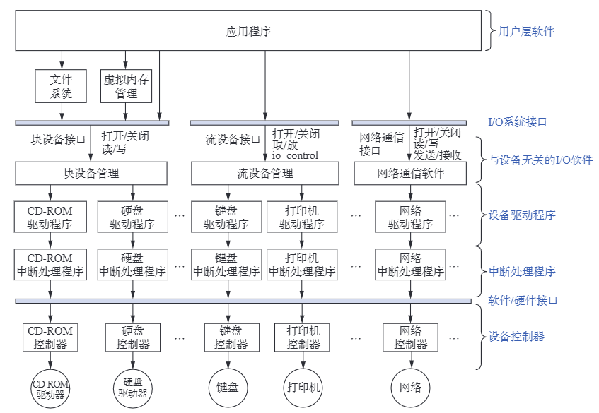

与计算机系统一样，I/O子系统也采用层次结构，包含I/O软件和I/O硬件两大部分。I/O软件向下与硬件密切关联，向上又与文件系统、虚拟存储器系统和用户直接交互，它们都需要I/O系统来实现I/O操作。为使复杂的IO软件能具有清晰的结构、更好的可移植性和易适应性，目前普遍采用具有层次结构的I/O系统。该结构是将IO系统中的设备管理模块分为若干个层次，每层都是利用其下层提供的服务来完成IO功能中的某些子功能，并且会屏蔽这些功能实现的细节，向上层提供服务。I/O软件包括最上层提出I/O请求的**用户空间I/O软件**，称为**用户I/O软件**，和在底层操作系统中对I/O进行具体管理和控制的**内核空间I/O软件**，称为**系统I/O软件**。系统I/O软件又分与设备无关的I/O软件层、设备驱动程序层和中断服务程序层3个层次。后两个层次与I/O硬件密切相关，I/O硬件在操作系统内核空间I/O软件的控制下完成具体的I/O操作。

与I/O软件的分层相对应，I/O系统本身也可分为以下3个层次。

中断处理程序处于I/O系统的最低层，直接与硬件进行交互。当有I/O设备发来中断请求信号时，在中断硬件做了初步处理后，便转向中断处理程序。它首先保存被中断进程的CPU现场环境，然后转入相应设备的中断处理程序处理中断，在中断处理完成后又恢复被中断进程的CPU现场环境，并返回断点继续运行。

设备驱动程序处于I/O系统的次低层，是进程和设备控制器之间的通信程序，其主要功能是：将上层发来的抽象I/O请求转换为针对I/O设备的具体命令和参数，并把它们装入设备控制器中的命令寄存器和参数寄存器中，或者相反。由于设备之间的差异很大，每类设备的驱动程序都不同，故必须由设备制造厂商提供设备驱动程序，而不是由OS设计者来设计。因此，每当在系统中增加一个新设备时，都需要由设备制造厂商提供新的驱动程序。

与设备无关的I/O软件/与设备无关的软件，I/O软件独立于具体使用的物理设备，提高了I/O系统的可适应性和可扩展性，使它们能应用于许多类型的设备，而且在每次增加新设备或替换老设备时，都不需要对I/O软件进行修改，这样就方便了系统的更新和扩展。与设备无关的I/O软件的内容包括设备命名、设备分配、数据缓冲和数据高速缓冲等。

#### 基本特点

现代计算机I/O系统的复杂性一般都隐藏在操作系统中，最终用户或用户程序只需通过一些简单的命令或系统调用就能使用各种外设，而无须了解设备具体工作细节。操作系统通过命令行方式、批命令方式或图形界面方式为最终用户提供了直接使用计算机资源的手段，用户通过输入相应的命令或操作键盘和鼠标将I/O请求传递给操作系统。对于用户程序，所有高级语言运行时系统都提供了执行I/O功能的高级机制，例如，C语言中提供了像printf（）和scanf（）等这样的**标准I/O库函数**；C++语言中提供了如<<（输入）和>>（输出）这样的**重载I/O操作符**。用户程序需要从某个设备输入信息或将结果送到外设时，只要通过系统调用（以低级语言方式提供）或库函数调用（以高级语言方式提供），将I/O请求提交给操作系统即可。操作系统在I/O子系统中承担极其重要的作用，这主要是由I/O子系统的以下3个特性决定的。

**共享性**。I/O子系统被多个进程共享，因此必须由操作系统对共享的I/O资源统一调度管理，以保证用户程序只能访问自己有权访问的那部分I/O设备或文件，并使系统的吞吐率达到最佳。

**复杂性**。I/O设备控制的细节比较复杂，如果由最上层的用户程序直接控制，则会给广大的应用程序开发者带来麻烦，因而需操作系统提供专门的驱动程序进行控制，应用程序只需要调用操作系统提供的相应服务例程，而无须了解设备控制的细节，从而简化应用程序的开发。

**异步性**。I/O子系统的速度较慢，而且不同设备之间的速度也相差较大，I/O设备与主机之间的信息交换通常使用异步的中断I/O方式，中断导致从用户态向内核态转移，因此I/O处理须在内核态完成，通常由操作系统提供中断服务程序来处理I/O。用户程序总是通过某种I/O函数或I/O操作符请求I/O操作（C库函数和系统调用封装函数），最终通过操作系统内核提供的系统调用来实现I/O。

对于一个C语言用户程序，若在某函数中调用了printf（），则在执行到调用printf（）的语句时，便会转到C语言函数库中对应的I/O标准库函数printf（）去执行，而printf（）最终又会转到调用函数write（）；在执行到调用write（）的语句时，便会通过一系列步骤在内核空间中找到write对应的系统调用服务例程来执行，从而从用户态转到内核态执行。

每个系统调用的封装函数会被转换为一组与具体机器架构相关的指令序列，这个指令序列中，至少有一条陷阱指令，在陷阱指令之前可能还有若干条传送指令用于将I/O操作的参数送入相应的寄存器。例如，在IA-32中，陷阱指令就是INTn指令，也称为软中断指令。在早期的IA-32架构中，Linux系统将int$0x80指令用作系统调用，在系统调用指令之前会有一串传送指令，用来将系统调用号等参数传送到相应的寄存器。系统调用号通常在EAX寄存器中，可根据系统调用号选择执行一个系统调用服务例程。用户进程的I/O请求通过调出操作系统中相应的系统调用服务例程来实现。

I/O子系统工作过程：首先CPU在用户态执行用户进程，当CPU执行到系统调用的封装函数对应的指令序列中的陷阱指令时，会从用户态陷入到内核态；转到内核态执行后，CPU根据陷阱指令执行时EAX寄存器中的系统调用号，选择执行一个相应的**系统调用服务例程**；在系统调用服务例程的执行过程中可能需要调用具体设备的驱动程序；在设备驱动程序执行过程中启动外设工作，外设准备好后发出中断请求，CPU响应中断后，就调出中断服务程序执行，在中断服务程序中控制主机与设备进行具体的数据交换。

假定用户程序中有一个语句调用了库函数printf（），在printf（）函数中又通过一系列的函数调用，最终转到调用write（）函数。在write（）函数对应的指令序列中，一定有一条用于系统调用的陷阱指令，在IA-32/Linux系统中就是指令int$0x80或sysenter。该陷阱指令执行后，进程就从用户态陷入内核态执行。Linux中有一个系统调用的统一入口，即系统调用处理程序systemcall（）。CPU执行陷阱指令后，便转到system_call（）的第一条指令执行。在system_call（）中，将根据EAX寄存器中的系统调用号跳转到当前系统调用对应的系统调用服务例程sys_write（）去执行。system_call（）执行结束时，从内核态返回到用户态下的陷阱指令后面一条指令继续执行。

### 外部设备

输入/输出设备，又称外部设备、外围设备，简称外设，是计算机系统与人或其他机器之间进行信息交换的装置。输入设备把数据、命令、字符、图形、图像、声音或电流、电压等信息，以计算机可以接收和识别的二进制代码形式输入计算机供其处理。输出设备把计算机处理的结果，变成人类可以识别的数字、文字、图形、图像或声音等信息，然后播放、打印或显示输出。

#### 外设的分类

**按信息交换单位分**

**块设备/成块传送设备**，与主机交换信息时采用成批方式。块设备是有结构设备，通常支持随机存取和寻址，能够指定输入的源地址和输出的目标地产，因此基本特征是可寻址到字节，如磁盘驱动器、光盘驱动器等。**字符型设备/面向字符的设备，**与主机交换信息以字符为单位，是无结构设备，通常不支持随机存取和寻址，而是以中断驱动方式进行输入和输出，如打印机。

**按信息的传输方向分**

**输入设备**用于接收外部信息，其中**媒体输入设备**把记录在媒体上的信息送入计算机，一般采用成批输入方式，输入过程中不需操作者干预，属于成块传送设备；**交互式设备**由操作者直接输入信息，如键盘、鼠标等。**输出设备**用于将计算机处理后的信息送向处理机外部的设备，如将计算机输出的数字信息转换成模拟信息，送往自动控制系统进行过程控制的数模转换设备。**输入/输出设备**既可以输入信息，又可以输出信息，包括磁盘驱动器、光盘驱动器、CRT终端、网卡之类的通信设备等。

**按传输速率分类**

**低速设备**传输速率仅为每秒几字节至数百字节，有键盘、鼠标等。**中速设备**传输速率为每秒数千字节至数十万字节，有行式打印机、激光打印机等。**高速设备**传输速率为每秒数十万字节至千兆字节，有磁带机、磁盘机、光盘机等。

**按功能/使用特性分类**

**存储设备**也称为外存、辅存，用于存储大容量数据，作为计算机的外存储器使用，大多数是块设备，存取速度较内存慢，容量较内存多，价格便宜。**I/O设备**又可分为输入设备、输出设备和交互式设备。其中，**人机交互设备**有键盘、鼠标等，大多数是面向字符的设备；**机机通信设备**有网卡、调制解调器、数/模和模/数转换设备等。

**按是否可共享分类**

共享设备是同一时间段内允许多个进程同时访问的设备，可以被分配给多个进程，这些进程可以交叉使用共享设备，但是同一时刻只有一个进程能使用。共享设备必须是可寻址和可随机访问的设备。共享设备破坏了互斥条件，不会导致死锁。

当然，外设的分类还有其他方式，例如按所处理信息的形态来分，可分成处理数字和文字的设备、处理图形与图像的设备以及处理声音与视频的设备等，这里不再赘述。

#### 外设的特点

**异步性**。外设与CPU之间是完全异步的工作方式，两者之间无统一的时钟。各类外设之间工作速度相差很大，它们的操作在很大程度上独立于CPU，但又要在某个时刻接受CPU的控制，造成I/O操作相对CPU时间的任意性与异步性。在连续两次CPU和外设的交往之间，必须保证CPU仍能高速地运行它自己的程序，以达到CPU与外设之间、外设与外设之间的并行工作。

**实时性**。一个计算机系统可能同时有慢速设备和快速设备，CPU必须及时按不同的传输速率和传输方式接收来自多个外设的信息或向多个外设发送信息，否则高速设备可能丢失信息。

**多样性**。不同外设的物理特性、信息类型和结构格式不同，这造成了主机与外设之间连接的复杂性。为简化控制，计算机系统中提供一些标准接口，以便各类外设通过自己的设备控制器与标准接口相连，主机无须了解各特定外设的具体要求，通过统一的驱动程序实现对外设的控制。

### 总线（bus）

#### 基本概念

计算机由CPU、主存和各种I/O外部设备组成，所有功能都是通过CPU执行指令实现的，在指令执行过程中，CPU、主存和外设之间要不断交换信息，因此计算机所有功能的实现，归根结底是各种信息在计算机内部的各部件之间进行交换的过程。

要进行信息交换必须在部件之间构建通信线路，通常把连接各部件的通路的集合称为**互连结构**，其中**分散连接**是各部件之间通过单独的连线互连，**总线连接**是将多个部件连接到一组公共信息传输线上。

总线上所连接的设备，按其对总线有无控制功能可分为主设备和从设备两种。**主设备**指发出总线请求且获得总线控制权的设备，它决定总线是否可以传输数据，占用总线时建立“总线忙”信号，释放总线时建立“总线闲”信号。**从设备**指被主设备访问的设备，只能响应从主设备发来的各种总线命令。在某个总线周期内，总线上只有一个主设备控制总线，选择一个从设备与之进行通信，或对所有设备进行广播通信。

引入总线后，总线上的各个设备分时共享同一总线，分时和共享是总线的两个特点。分时是指同一时刻只允许有一个部件向总线发送信息，当总线上多个设备同时请求使用总线时就会导致冲突。为解决多个设备同时竞争总线控制权的问题，应当采用总线仲裁部件，以某种方式选择一个主设备获得总线控制权，只有获得了总线控制权的设备才能开始数据传送。共享是指总线上可以挂接多个部件，各个部件之间互相交换的信息都可通过这组线路分时共享，多个部件可同时从总线上接收相同的信息。

总线特性是指机械特性（尺寸、形状）、电气特性（传输方向和有效的电平范围）、功能特性（每根传输线的功能）和时间特性（信号和时序的关系）。

总线连接结构的优点：主要优点是灵活和成本低。灵活是指便于系统的扩充、便于增减外设、更新与灵活配置，易于实现系统的模块化，新部件可以很容易地加到总线上，并且部件可以在使用相同总线的计算机系统之间互换。引入总线结构后，简化了系统结构，便于系统设计制造。大大减少信息传输线的条数，便于布线，减小体积，提高系统的可靠性。又因为一组单独的连线可被多个部件共享，所以总线的性价比高。便于接口设计，所有与总线连接的设备均采用类似的接口。便于设备的软件设计，所有接口的软件对不同的接口地址进行操作。便于故障诊断和维修。

总线连接的主要缺点是可能产生通信瓶颈，相对于专线结构也降低了信息传输的并行性及信息的传输速度。

#### 总线的分类（11，16，17）

**按功能层次分类分**

**片内/核内总线**，连接处理器核内部的元件，如核内寄存器、ALU、指令部件等。

**系统总线**，连接处理器芯片、存储器芯片和各种I/O模块等主要部件或模块，即通常所说的总线。系统总线通常由一组控制线、一组数据线和一组地址线构成，也有些总线没有单独的地址线，地址信息通过数据线来传送，这种情况称为数据线和地址线复用，可以减少信号线的数量，提高数据线的利用率。

**数据线**用来承载在源部件和目的部件之间传输的信息，如CPU和主存之间交换的数据或从主存取出的指令、CPU向I/O模块发出的控制命令或从I/O模块收集到的状态信息。数据通路是指各个功能部件通过数据总线连接形成的数据传输路径，而数据总线是数据传输的媒介，二者不同。

**地址线**用来给出源数据或目的数据所在的主存单元或I/O模块端口的地址，其位数反应最大的寻址空间。

**控制线**用来控制对数据线和地址线的访问和使用，传输定时信号和命令信息，包括除地址线和数据线以外的通信线，如用于传送时钟、复位、总线操作控制、总线请求和总线回答等信号的传输线。

总线上的信息传送方向：数据总线是是双向传输总线，数据信息既可由CPU传送至内存或外设，又可由内存、外设传送至CPU；地址总线是单向传输的，地址信息只能由CPU发送至内存或外设，随后传送给CPU要访问的主存储器或I/O模块；控制信息和状态信息也是单向传输的，它们的传输方向正好相反，控制信息通过控制总线由CPU发送至内存或外设，而状态信息则通过状态总线由内存或外设发送至CPU。

系统总线包含处理器总线和存储器总线，平常接触最多的系统总线就是存储器总线。**存储器总线**用于内存控制器和主存连接，早期由北桥芯片控制，处理器通过北桥芯片和主存储器、图形卡/显卡以及南桥芯片进行互连，支持突发传送方式（Cache传送）。Corei7以后的处理器芯片中集成了主存控制器，存储器总线直接连接到处理器。实际上，存储器总线就是内存条的卡槽（slot），一个主板上可有由多个存储器总线，采用这种结构的称为多通道结构，可以带来更多的总线带宽。根据芯片组设计时确定的芯片组能够处理的主存类型的不同，存储器总线有不同的运行速度。CPU与主存之间由**CPU总线/处理器总线/前端总线**和存储器总线相连。

**I/O总线**，连接中低速的I/O设备，通过I/O接口与系统总线相连接，用于为系统中的各种I/O设备提供输入/输出通路，物理上通常是主板上的一些I/O扩展槽，目的是将低速设备与高速总线分离，以提升总线的系统性能。各类I/O设备通过相应的设备控制器，如显示适配卡（显卡）、USB控制器、以太网卡、磁盘控制器等，连接到I/O总线上，而I/O总线通过芯片组与主存和CPU连接。

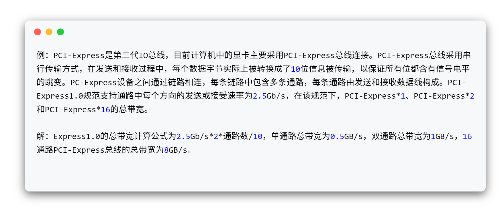

**通信总线，**也称外部总线，用于计算机系统之间或计算机系统与其他系统，如远程通信设备、测试设备之间传送信息。

**按时序控制和传输方式分类**

**同步并行总线**，采用公共的时钟信号进行定时，挂接在总线上的所有设备都从时钟线上获得定时信号。同步总线的传输协议非常简单，只要在规定的第几个时钟周期内完成特定的操作即可。对于处理器通过总线访问存储器的操作来说，可以规定以下“存储器读操作”协议：主控设备（即处理器）在第I个时钟周期发送地址和存储器读命令（可利用控制线表明请求的类型为“存储器读”），从设备（即存储器）总是在第5个时钟周期将数据放到总线上作为响应，处理器也在第5个时钟周期从数据线上取数据，或者处理器在第6个时钟周期从MDR上取数据。

同步通信方式下，总线定时以最慢设备所用时间为标准，因此同步总线适合于存取时间相差不大的多个功能部件之间的通信；由于时钟偏移问题，同步系统互连及输入输出组织总线不能过长，否则将会降低总线传输效率。

同步总线通常采用并行传输方式，即有多条双向传输的数据线，可以实现多比特位的同时传输，其效率比串行总线更高。同时并行传输的这些数据位信号的定时必须相同，使用更快传送速度、更长传输线的总线时，会导致传送到另一端的波形发生变形，从而使得所有位中最快和最慢的位信号之间的时间差较大。各条数据线的传输特点可能存在差异，比如有的信息位延迟，数据线之间的**总线串扰**还会造成传输错误，因此并行总线适合近距离通信。

**异步串行总线**，连接的部件没有统一的时钟，总线操作时序是不固定的，而以信号**握手方式/应答方式**协调各部件或设备之间的信息传输，即当主模块发出请求（Request）信号时，一直等待从模块反馈回来响应（Acknowledge）信号后，才开始通信传输信息。异步通信下，挂接在总线上的设备时钟不一致。因此在传输数据时，数据会设置起始位和终止位以及校验位，检测到终止位证明此数据帧发送完毕。

只有一条双向传输或单项传输的数据线，数据按比特位串行顺序传输，其效率低于并行总线。因为串行传输方式每次在一根信号线上传送数据位，因此传输速率可以比并行总线高得多，而且由于每个位各自传输，因而传输时延的细微变化不会影响其他数据位的传送。通过多个数据通道的组合，串行传输可以实现比传统并行总线高得多的数据传输带宽。

在实际时钟频率比较低的情况下，并行总线因为能同时传输若干比特数据，速率比串行总线快。但是随着时钟频率越来越高，并行总线之间的相互干扰也会越来越强，当时钟频率达到一定程度时，就会造成传输的数据无法恢复，而串行总线由于导线少，干扰小，反而可以通过不断提高时钟频率来提高传输速率，从而使得其传输速率比并行总线快。由于异步总线的控制方式比同步总线的控制方式要复杂，所以其速度比同步总线慢。

异步通信总线主要用于连接高速的外部设备，如PCI-express2.0总线就是采用异步串行方式进行传输用于连接声卡，USB控制器和USB设备连接的USB总线也采用异步串行方式进行传输。

#### 性能指标（09，12-14，18-20，23-24）

**总线宽度/位宽**，并行总线中数据线的条数称为总线宽度，它决定了每次能同时传输的信息的位数。

**总线时钟频率**，即机器的时钟频率，它为时钟周期的倒数，表示总线在1秒钟内可以传送数据的次数。

**总线传输周期**，指一次总线操作所需的时间，即从主设备申请总线，发出地址开始到主设备收到从设备数据为止的时间，包括申请阶段、寻址阶段、传输阶段和结束阶段。如果发送方和接受方均为CPU中的寄存器，比如CPU中的r2寄存器将数据通过CPU内部的片内总线发送到MDR寄存器，总线周期的申请分配阶段、寻址阶段、结束阶段可以忽略不记，总线周期等于传输阶段的时间。如果主设备为CPU，从设备为主存，总线周期的时间等于总线读事务的时间，也就是说一个总线传输周期通常由若干总线时钟周期构成。

**总线工作频率**，总线周期的倒数，实际指I秒内传送几次数据。早期的总线通常一个时钟周期传送一次数据，总线工作频率等于总线时钟频率。现在有些总线一个时钟周期可以传送2次或4次数据，总线工作频率是总线时钟频率的2倍或4倍。

**总线带宽**，指总线的最大数据传输率，即总线在进行数据传输时单位时间内最多可传输的数据量，不考虑其他如总线裁决、地址传送等所花的时间。总线带宽的计算公式为B=W×F/N，W为总线宽度，F为总线的时钟频率，N为完成一次数据传送所用的时钟周期数，F/N为总线工作频率。可以通过增加总线带宽，增加总线工作频率的方法提高总线带宽。

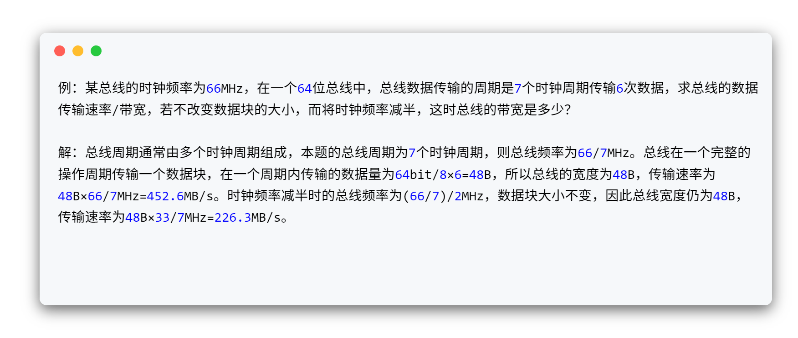

**总线寻址能力**，主要指由地址线位数所确定的可寻址地址空间的大小。例如，若地址线有I6位，不采用分时多次传送地址的话，则可访问的存储单元最多只能有2^I6个。

**总线定时方式**，主要有同步、异步、半同步和分离式四种定时方式。同步通信总线由时钟信号同步；异步通信总线指前一个信号的结束就是下一个信号的开始，信息的改变是顺序的；半同步通信总线则是同步和异步两种总线定时方式的结合。

**总线传送方式**，总线上数据传送分**非突发方式**和**突发（burst）方式**两种。非突发传送方式在每个传送周期内都是先传送地址，再传送数据，主、从设备之间通常每次只能传输一个字长的数据。在突发传送方式下，总线能够进行连续的成块数据传送，其寻址阶段先给出数据块在存储器中的首地址，在传输阶段连续传送数据块中的后续数据，每个时钟周期可以传送一个字长的信息，但是不释放总线，直到一组数据全部传送完毕后，再释放总线。突发传送无须在地址线上传送后续数据的地址信息，后续数据的地址默认为前面数据的地址加上一个数据所占的内存单元数，因而在总线宽度和总线时钟频率相同的情况下，比非突发传送方式的数据传输率高。

**总线的负载能力**，指总线上所能挂接的遵循总线电气规范的总线设备的数目。由于总线上只有扩展槽能由用户使用，所以总线的负载一般指总线上扩展槽的个数。

#### 总线标准*

#### 系统总线结构

##### 单总线结构

单总线结构将CPU、主存、I/O设备（通过I/O接口）都挂在一组总线上，允许I/O设备之间、I/O设备与主存之间直接交换信息。CPU与主存、CPU与外设之间都可以通过总线直接进行信息交换，而无须经过中间设备的干预。需要注意的是，单总线并不是指只有一根信号线，系统总线按传送信息的不同可细分为地址总线、数据总线和控制总线。结构简单，成本低，易于接入新的设备。带宽低、负载重，多个部件只能争用唯一的总线，且不支持并发传送操作。

##### 双总线结构

双总线结构有两条总线：一条是主存总线，用于在CPU、主存和通道之间传送数据；另一条是I/O总线，用于在多个外部设备与通道之间传送数据。将低速I/O设备从原单总线上分离出来，实现了存储器总线和I/O总线分离。需要增加通道等硬件设备。

当所有的设备都挂在单一总线上时，它们只能分时工作，这使得系统的数据传输效率和速率都受到了限制，而双总线结构可以大大减少这种冲突，从而提高传输效率和速度。

##### 三总线结构

三总线结构是在计算机系统各部件之间采用3条各自独立的总线来构成信息通路，这三条总线分别为主存总线、I/O总线和直接内存访问（DMA）总线。

主存总线用于在CPU和内存之间传送地址、数据和控制信息。I/O总线用于在CPU和各类外设之间通信。DMA总线用于在内存和高速外设之间直接传送数据。提高了I/O设备的性能，使其更快地响应命令，提高系统吞吐量。任意时刻只能使用一种总线，系统工作效率较低。

##### 传统多总线结构

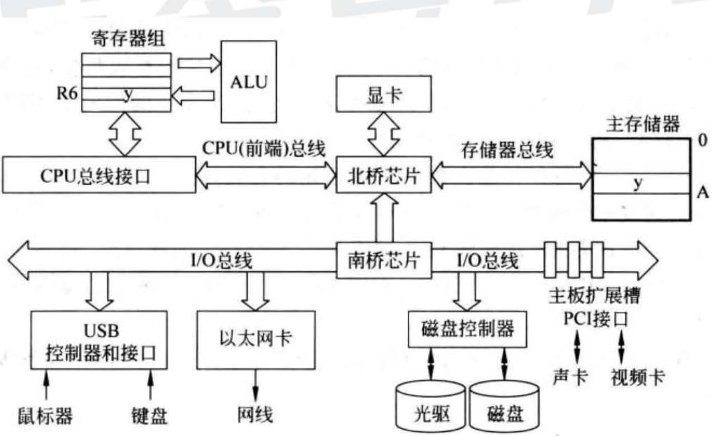

在互连结构中，除了CPU、主存储器以及各种接插在主板扩展槽上的I/O控制卡（如声卡、视频卡）外，还有北桥芯片和南桥芯片。这两块超大规模集成电路芯片组成一个“芯片组”，是计算机中各个组成部分相互连接和通信的枢纽。主板上所有的存储器控制功能和I/O控制功能几乎都集成在该芯片组内，它既实现了总线的功能，又提供了各种I/O接口及相关的控制功能。

其中，北桥是一个主存控制器集线器（memorycontrollerhub，MCH）芯片，支持突发传送方式为CPU内部的Cache提供主存块，可以为CPU内部寄存器提供对应数据。北桥芯片本质上是一个DMA（directmemoryaccess）控制器，可以控制主存中的数据和显卡中显存的数据进行交互。南桥是一个I/O控制器集线器（I/Ocontrollerhub，ICH）芯片，其中可以集成USB控制器、磁盘控制器、以太网络控制器等各种外设控制器，也可以通过南桥芯片引出若干主板扩展槽，用以接插一些I/O控制卡。

传统上，总线分为处理器-存储器总线和I/O总线。处理器-存储器总线比较短，通常是高速总线。离CPU越近，总线的速度越快，图中最快的是处理器总线。通常处理器总线和存储器总线是分开的，它们之间可以通过北桥芯片（桥接器）连接，CPU芯片通过CPU插座插在处理器总线上，内存条通过内存条插槽插在存储器总线上。

#### 总线事务

数据流通过称为总线的共享电子电路在CPU和DRAM主存之间来来回回，每次CPU和主存之间的数据传送都是通过一系列步骤来完成的，这些步骤称为总线事务。总线事务是在一个总线周期中发生的从请求总线到完成总线一系列活动，包括请求操作、仲裁操作、地址传输、数据传输和总线释放。

请求阶段，主设备（CPU或DMA）发出总线传输请求，并且获得总线控制权。仲裁阶段，总线仲裁机构决定将下一个传输周期的总线使用权授予某个申请者。寻址阶段，主设备通过总线给出要访问的从设备地址及有关命令，启动从模块。传输阶段，主模块和从模块进行数据交换，可单向或双向进行数据传送。释放阶段，主模块的有关信息均从系统总线上撤除，让出总线使用权。

**总线读事务**是指CPU访问主存中的数据，CPU首先跟总线控制器申请总线控制权，总线控制器将总线控制权给到CPU。CPU将地址送进MAR，并经过总线送到主存。主存收到地址后启DRAM准备数据，然后将数据发送到MDR。与之相对还有总线写事务。

**突发传送总线事务**方式下，总线能够进行连续的成块数据传送。传送开始时，先给出主存块在存储器中的首地址，然后连续地传送主存块中的存储单元。一次突发传送总线事务的过程包括送首地址和命令，存储器准备数据，总线传送数据。当CPU从主存读一个存储单元的内容时，采用读总线事务。当主存块从主存送入Cache时，采用突发传送总线事务。

未采用事务分离，CPU获取总线控制权后，作为主设备将地址从其内部的MAR给到主存。在主存准备好数据前，CPU一直占据着总线控制权。数据准备好后，主存向CPU申请总线控制权，在获得总线控制权后将数据传输出去。

采用事务分离，CPU获取总线控制权后，作为主设备将地址从其内部的MAR给到主存，并释放总线控制权。主存数据准备好后，主存向总线控制器申请总线控制权，在获得总线控制权后将数据传输出去。

#### 总线定时（15-16，21）

总线定时是指总线在双方交换数据的过程中需要时间上配合关系的控制，实质是一种协议或规则。

##### 同步定时方式

指系统采用一个统一的时钟信号来协调发送和接收双方的传送定时关系。时钟产生相等的时间间隔，每个间隔构成一个总线周期。在一个总线周期中，发送方和接收方可以进行一次数据传送。因为采用统一的时钟，每个部件或设备发送或接收信息都在固定的总线传送周期中，一个总线的传送周期结束，下一个总线的传送周期开始。传送速度快，具有较高的传输速率；总线控制逻辑简单。主从设备属于强制性同步；不能及时进行数据通信的有效性检验，可靠性较差。同步通信适用于总线长度较短及总线所接部件的存取时间比较接近的系统。同步串行通信方式是发送方时钟直接控制接收方时钟，使双方完全同步的一种逐位传输的信方式。使用同步串行通信时，收发双方的时钟严格一致，因此仅在数据块的头尾处添加了开和结束标记，传输效率较高，但实现的硬件设备也更复杂，所以较少采用。

##### 异步定时方式

没有统一的时钟，也没有固定的时间间隔，完全依靠传送双方相互制约的“握手”信号来实现定时控制，一个总线传输周期的过程是先传送地址，再传送数据。通常，主设备提出交换信息的“请求”信号，经接口传送到从设备：从设备接到主设备的请求后，通过接口向主设备发出“回答”信。总线周期长度可变，能保证两个工作速度相差很大的部件或设备之间可靠地进行信息交换，自动适应时间的配合。比同步控制方式稍复杂一些，速度比同步定时方式慢。根据“请求”和“回答”信号的撤销是否互锁，异步定时方式又分为以下3种类型。异步通信方式中全互锁方式需要三次“握手”，速度最慢，不互锁方式最快。同步通信方式由统一时钟控制，不需要多次“握手”，所以传输速度更快。

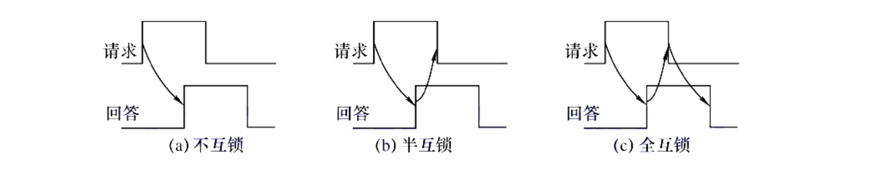

###### 不互锁方式

主设备发出“请求”信号后，不必等到接到从设备的“回答”信号，而是经过一段时间便撤销“请求”信号。而从设备在接到“请求”信号后，发出“回答”信号，并经过一段时间后自动撤销“回答”信号。

###### 半互锁方式

主设备发出“请求”信号后，必须在接到从设备的“回答”信号后，才撤销“请求”信号，有互锁的关系。而从设备在接到“请求”信号后，发出“回答”信号，但不必等待获知主设备的“请求”信号已经撤销，而是隔一段时间后自动撤销“回答”信号，不存在互锁关系。

###### 全互锁方式

主设备发出“请求”信号后，必须在从设备“回答”后才撤销“请求”信号；从设备发出“回答”信号后，必须在获知主设备“请求”信号已撤销后，再撤销其“回答”信号。

现在越来越多的总线采用异步串行通信方式，使用异步串行通信时，收发双方时钟不严格一致，因此每个字符都要用开始位和停止位作为字符开始和结束的标志，从而保证数据传输的准确性。异步串行通信的第一位是开始位，表示字符传送的开始。当通信线上没有数据传送时处于逻辑“1”状态，当发送方要发送一个字符时，首先发出一个逻辑“0”信号，即开始位。接收方检测到这个逻辑低电平后，就开始准备接收数据位。在字符传送过程中，数据位从最低位开始，一位一位地传输。当字符发送完后，就可以发送奇偶校验位（可选），以用于有限的差错检测。在奇偶位或数据位之后发送的是停止位，表示一个字符数据的结束。

##### 半同步定时方式

半同步定时方式保留了同步定时的特点，如所有地址、命令、数据信号的发出时间都严格参照系统时钟的某个前沿开始，而接收方都采用系统时钟后沿时刻来进行判断识别；同时，又像异步定时那样，允许不同速度的设备和谐地工作。为此增设一条Wait响应信号线。例如，某个半同步总线总是从某个时钟开始，在每个时钟到来时，采样Wait信号，若无效，则说明数据未准备好，下个时钟到来时，再采样Wait信号，直到检测到有效，再去数据线上取数据。半同步定时适用于系统工作速度不高，但又包含了由许多速度差异较大的各类设备组成的简单系统。控制方式比异步定时简单，各模块在系统时钟的控制下同步工作，可靠性较高。系统时钟频率不能要求太高，所以从整体上来看，系统工作的速度不是很高。

以上三种定时方式都从主设备发出地址和读/写命令开始，直到数据传输结束，在整个传输周期中，总线的使用权完全由主设备及由其选中的从设备占据。其实，从设备在准备数据的阶段，总线纯属空闲等待，为进一步挖掘总线的潜力，又提出了分离式定时方式。

##### 分离式定时方式

分离式定时方式将总线事务分解为请求和应答两个子过程。在第一个子过程中，主设备A获得总线使用权后，将命令、地址等信息发到总线上，经总线传输后由从设备B接收。此过程占用总线的时间很短，主设备一旦发送完，立即释放总线，以便其他设备使用。在第二个子过程中，设备B收到设备A发来的有关命令后，将设备A所需的数据准备好后，便由设备B申请总线使用权，一旦获准，设备B便将相应的数据送到总线上，由设备A接收。上述两个子过程都只有单方向的信息流，每个设备都变为主设备。在不传送数据时释放总线，使总线可接受其他设备的请求，不存在空闲等待时间。控制复杂，开销也大。

### I/O接口

#### 定义和功能（21）

主机和外设之间采用异步工作方式，在技术特性上有很大的差异，要有相应的逻辑部件解决它们之间的同步与协调、工作速度的匹配和数据格式的转换等问题，即外设的**I/O接口**，又称为**设备控制器、I/O控制器、I/O控制接口、I/O模块**。I/O接口通常独立于外部设备，可以集成在主板上（即ICH芯片内）或以插卡的形式插接在I/O总线扩展槽上。不同的外设往往对应不同的设备控制器，一个设备控制器可以连接多个外设，常见的设备控制器有各种适配器（Adapter）、网络控制器/网卡（NIC）、可编程中断控制器（PIC）、驱动器等，注意磁盘驱动器是就是磁盘本身，不是I/O接口。

设备控制器的主要功能是，控制一个或多个I/O设备，以实现I/O设备和计算机之间的数据交换。它是CPU与I/O设备之间的接口，接收从CPU发来的命令，去控制I/O设备工作，使CPU能够从繁杂的设备控制事务中解脱出来。设备控制器分为用于控制字符设备和用于控制块设备的控制器。

**数据交换、数据缓冲和速度匹配**。CPU和内存等主机部件采用高速元器件，在I/O接口中应引入**数据缓冲寄存器/缓冲区**暂存数据，以避免速度不一致造成的数据丢失，同时实现CPU与设备控制器之间、设备控制器与设备之间的数据交换。输出时用此缓冲区暂存由主机高速传来的数据，然后再以I/O设备所具有的传输速率将缓冲区中的数据传送给I/O设备；输入时缓冲区用于暂存从I/O设备传来的数据，待接收到一批数据后，再将缓冲区中的数据高速地传送给主机。

**错误或状态检测、差错控制**。在I/O接口中提供**状态寄存器**，用其中的某一位来反映设备的某一种状态供CPU查用，例如设备是否完成打印或显示，是否已准备好输入数据以供主机来读取，是否发生缺纸等出错情况。。当CPU将该寄存器的内容读入后，便可了解该设备的状态。设备控制器还兼管差错检测。若发现传送中出现了错误，则通常会将差错检测码置位，并向CPU报告，于是CPU将本次传送来的数据作废，并重新进行一次传送。这样便可保证数据输入的正确性。接口和外设发生的出错情况有两类，一类是设备电路故障或异常情况，另一类是数据传输错，这种错误是通过采用数据校验码来检测的。

**控制和定时**。CPU根据程序中的I/O请求，选择相应的设备进行通信，要求一些内部资源（如主存或寄存器、总线等）参与到I/O过程中。因此I/O接口必须提供**控制和定时逻辑**，接收从I/O总线传来的控制命令（命令字）和定时信号控制数据通信过程，协调内部资源与外设之间动作的先后关系，以保证整个计算机系统能统一、协调地工作。

**地址译码和设备选择。**设备控制器是一个可编址的设备，其必须能够识别自身所控制的每个设备的地址。当控制一个设备时，其只有一个唯一的设备地址；当控制多个设备时，其含有多个设备地址，并使每个设备地址对应一个设备。此外，为使CPU能向（或从）寄存器中写入（或读出）数据，这些寄存器都应具有唯一的地址。设备控制器中应有**地址译码逻辑**，将CPU通过地址线送来的地址码译码产生设备选择信息，使主机能和指定外设交换信息。

**信号格式转换。**接口应提供主机与外设的信号格式的转换功能，如电平转换、并/串或串/并转换（按数据传输个数，可分为串行接口和并行接口，接口可以通过移位寄存器完成数据格式转换）、模/数或数/模转换等。例如，磁盘驱动器采用串行方式向盘片磁道写入记录数据，磁盘控制器对读出的二进制数据进行串并转换，或对写入的二进制数据进行并串转换；对于网卡，要对发往外界的帧进行封装，对发往主机的帧进行拆封。

**接收、识别和传送命令**。设备控制器中具有相应的**控制寄存器**，用于存放从CPU接收的命令和参数，并对所接收的命令进行译码，并向外设发出。例如，磁盘控制器可以接收CPU发来的read、write、format等15条不同的命令，而且有些命令还带有参数，相应地有多个寄存器和命令译码器。

#### 通用硬件结构（12，15）

设备控制器位于CPU与设备之间，既要与CPU通信，又要与设备通信，还应具有按照CPU所发出来的命令去控制设备工作的功能，因此一般由内部接口、外部接口和I/O逻辑构成。

I/O接口在主机侧的接口称为**内部接口**，通过I/O总线（系统总线）和内存、CPU相连；在外设侧与通信总线连接的接口称为**外部接口**，提供相应的连接器插座，在插座上可连接相应的电缆，如USB线、IEEEI394线、串行电缆、并行电缆、网线或SCSI电缆等与外设连接。I/O接口在CPU和主存与外设之间建立一个高效的信息传输“通路”，即“CPU和内存一I/O总线—I/O接口（带连接器插座的设备控制器）—电缆—外设”，根据从CPU接收到的控制命令来对相应外设进行控制。

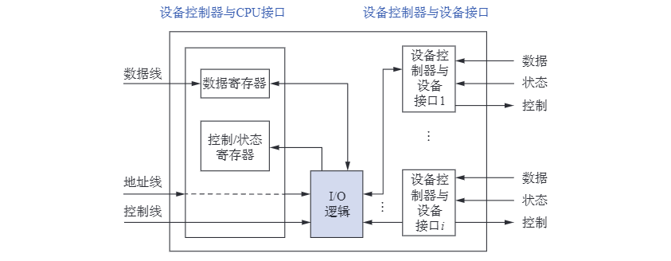

##### 内部接口

I/O接口通过IO总线中的数据线，实现数据缓冲寄存器与内存或CPU的寄存器之间进行数据传送；同时I/O接口和设备的状态信息被记录在状态寄存器中，通过数据线可将状态信息送到CPU以供查用；CPU对外设的控制命令也是通过数据线传送的，一般将其送到I/O接口的控制寄存器；除此之外，还可以传输中断类型号。从功能上来说，状态寄存器和控制寄存器在传送方向上是相反的，而且CPU对它们的访问在时间上一般是错开的，因此有的I/O接口中将它们合二为一。

I/O总线的地址线用于给出要访问的I/O接口中寄存器的地址，它和读写控制信号一起被送到I/O控制逻辑部件中，其中地址信息用于选择和主机交换数据的寄存器，通过控制线传送来的读/写控制信号也有可能参与地址译码，例如，可以用读/写信号确定是接收寄存器（写信号）还是发送寄存器（读信号）。此外，控制线还可以传输中断请求和响应信号、仲裁信号和握手信号。

I/O控制逻辑还要能对**控制寄存器/命令寄存器**中的命令字进行译码，并将译码得到的控制信号通过外设界面控制逻辑送外设，同时将数据缓冲寄存器的数据发送到外设或从外设接收数据到数据缓冲寄存器。另外，还要具有收集外设状态到状态寄存器的功能。

如果某个I/O接口能够作为数据通信的主控设备，例如DMA控制器，那么它就可以发起总线事务并控制总线进行数据传送，控制线上的控制信号由它确定，地址线方向是输出。有了设备控制器这一类的I/O接口，底层I/O软件就可以通过I/O接口来控制外设，因而编写底层I/O软件的程序员只需要了解I/O接口的工作原理，包括其中有哪些程序可访问的寄存器、控制/状态寄存器中每一位的含义、I/O接口与外设之间的通信协议等，而关于外设的机械特性，程序员则无须了解。

在底层I/O软件中，可以将控制命令送到控制寄存器来启动外设工作，可以读取状态寄存器来了解外设和设备控制器的状态，可以通过直接访问数据缓冲寄存器来进行数据的输入和输出。这些CPU寄存器和I/O接口寄存器之间的数据传送通过**I/O指令**完成，它们是一种特权指令，只能在操作系统内核的底层I/O软件中使用。例如，IA-32中提供了4条专门的I/O指令，in和ins指令用于将I/O接口中某个寄存器的内容取到CPU内的通用寄存器中，out和outs用于将通用寄存器的内容输出到I/O接口的某个寄存器中。

##### 外部接口

在一个设备控制器上可以连接一个或多个设备，相应的便可以有一个或多个设备接口，每个接口都存在数据、控制和状态这三种类型的信号，各对应一条信号线。

数据信号线用于在设备和设备控制器之间传送数据信号。对输入设备而言，由外界输入的信号经转换器转换所形成的数据，通常会先送入缓冲器中，当数据量达到一定的比特（字节）数后，再从缓冲器通过一组数据信号线传送给设备控制器。对输出设备而言，则是将从设备控制器经过数据信号线传送来的一批数据，先暂存于缓冲器中，经转换器做适当转换后再逐个字符地输出。

控制信号线被作为由设备控制器向I/O设备发送控制信号的通路。该控制信号规定了设备将要执行的操作，如读操作（由设备向设备控制器传送数据），或写操作（从设备控制器接收数据），或执行磁头移动操作等。

状态信号线用于传送指示设备当前状态的信号，设备的当前状态有正在读（或写）、设备已读（或写）完成、准备好了新的需要传送的数据等。

#### I/O接口的分类

块设备接口

流设备接口

网络通信男性口

#### I/O端口及其编址（14）

驱动程序将抽象I/O命令转换出一系列具体的指令、参数等数据，装入设备控制的的相应寄存器中，由设备控制器执行命令控制I/O设备。这些寄存器就是I/O端口，数据缓存寄存器就是数据端口，控制/状态寄存器就是控制/状态端口。为了便于CPU对I/O设备的快速选择和对I/O端口的方便寻址，必须给所有I/O接口中各个可访问的寄存器进行编址。两种编址方式都是通过相同的地址总线进行访问的，通过不同的编址策略和控制信号来区分。

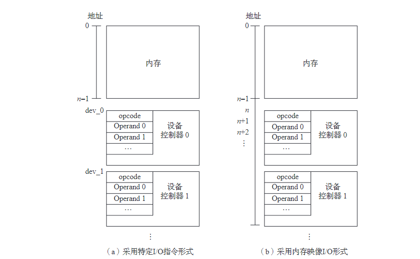

##### 独立编址方式/特定的I/O指令形式

对所有的I/O端口单独进行编号，使它们成为一个独立的I/O地址空间。指令系统中需要有专门的I/O指令来访问I/O端口，I/O指令的地址码部分给出I/O端口号，这使得程序清晰，便于理解和检查。但是I/O指令数目少，往往只提供简单的传输操作，故程序设计灵活性差些。因为独立编址方式中的I/O地址空间和主存地址空间是两个独立的地址空间，因而无法从地址码的形式上区分，所以需用专门的I/O指令来表明访问的是I/O地址空间，I/O指令与通用的指令格式有所不同。CPU执行I/O指令时，会产生I/O读或I/O写总线事务访问I/O端口。通常I/O端口数比存储器单元少得多，选择I/O端口时只需少量地址线，因此I/O端口译码简单，寻址速度快。另外，CPU需要提供存储器读/写，I/O设备读/写两组控制信号，增大了控制的复杂性。

##### 统一编址方式/内存映射I/O形式

I/O地址空间与主存地址空间统一编号，将I/O端口映射到主存空间的某个地址段上，即从主存地址空间中分出一部分地址给I/O端口。因为I/O端口和主存单元在同一个地址空间的不同分段中，根据指令地址码中的地址范围就可区分访问的是I/O端口还是主存单元，因而无须设置专门的I/O指令。一般的访存指令就可以存取I/O端口，所有有关主存的寻址方式也都可用于I/O端口的寻址，这给编程提供了非常大的灵活性，还使端口有较大的编制空间。I/O访问的保护机制可由虚拟存储器管理系统（分段或分页存储管理）实现，而无须专门设置。但是端口地址占用了部分主存空间，使得主存的可用容量变小。此外，由于识别I/O端口时全部地址线都需要参加译码，使得译码电路变得复杂，降低了译码速度。大多数RISC架构都采用统一编址方式，如RISC-V和MIPS，对I/O端口中信息的读/写是通过load/store指令实现的。

### 数据传送控制方式

I/O控制指外设与主机之间的数据传送，在发展过程中逐步减少了CPU对I/O控制的干预。I/O控制方式中，三种基本的**程序控制方式**即直接程序传送、程序中断、通道控制都需要程序的干预，前两者通过CPU执行程序实现，后者是通道执行程序实现，只有DMA方式是靠硬件电路实现的。

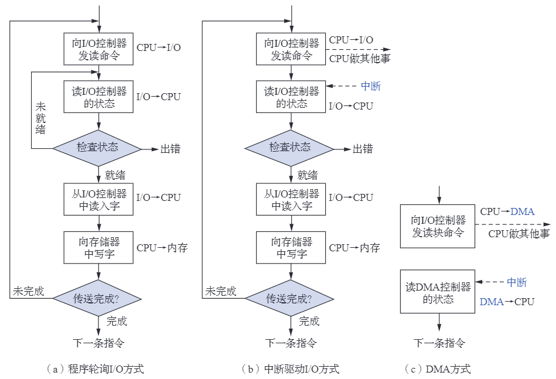

#### 程序直接控制/轮询的可编程IO方式/程序轮询方式（11，18，23）

主机和外设之间的数据交换直接由CPU执行**查询程序**控制。

##### 无条件/同步传送方式*

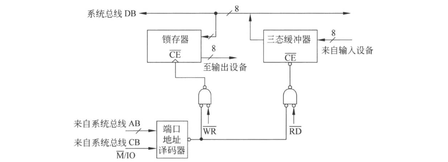

无条件传送的I/O接口无须任何定时信号和状态查询，只需要进行相应的读/写控制和地址译码。接口处只有一个数据锁存器和一个三态缓冲器，它们共用同一个地址，可以看成同一个**输入/输出数据寄存器**，通过相应的I/O指令可直接对该寄存器进行存取，在读/写信号的控制下进行数据的输入和输出。处理器对I/O接口进行周期性的定时访问，无需读取设备状态，直接对I/O端口进行数据存取，其实质是通过程序来定时，以同步传送数据，如各类巡回采样检测或过程控制。

无条件传送方式适合慢速设备，因为其定时访问时间间隔长，I/O操作所用的处理器时间占整个处理器时间的比例较少，对处理器效率影响不大。快速设备需要频繁进行I/O访问，很多处理器时间会被I/O操作占用，因而这种方式不宜用于高速设备的I/O。

##### 条件传送/异步传送/程序查询/轮询方式

###### 基本思想

一些较复杂的I/O接口往往有多个控制、状态和数据端口，CPU对设备的控制须在一定的状态条件下进行，可以在查询程序中安排相应的I/O端口访问指令，直接取得外设和接口的状态，如“就绪（Ready）”“忙（Busy）""完成（Done）”等，根据这些状态进行信息交换。

程序查询方式的工作流程如下：1）CPU执行初始化程序，并预置传送参数，包括存储器地址、计数器参数。2）向I/O接口发出命令字，启动I/O设备，同时把状态寄存器中的忙/闲标志busy置为1。3）CPU周期或持续地轮询设备状态，busy=1表示输入机尚未输完一个字（节），处理机应继续对该标志进行测试，直至busy=0直到外设准备就绪。4）传送一次数据，处理机将数据寄存器中的数据取出，送入内存的指定单元中。5）修改地址和计数器参数。6）判断传送是否结束，若未结束转第3步，并置busy=1，直到计数器为0。

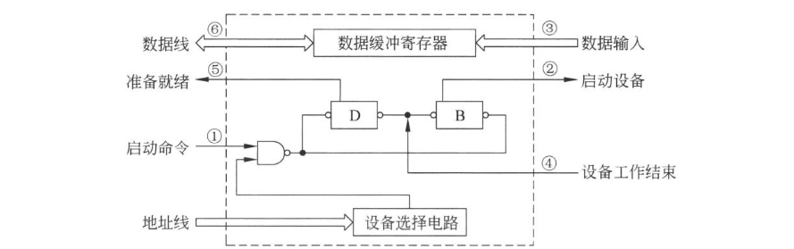

I/O接口的工作流程如下：1）CPU执行相应的I/O访问指令，通过I/O总线向I/O接口送出“启动”命令。2）设备选择电路对CPU送出的地址进行译码，选中本I/O接口，与非门输出信号使“完成”状态触发器D清零，而使“启动”命令触发器B置1。3）I/O接口通过电缆向外设发送“启动设备”命令。4）外设准备好一个数据，通过电缆向I/O接口中的数据缓冲寄存器输入数据。5）外设向I/O接口回送“设备工作结束”状态信号，使状态触发器D置1，使命令触发器B清零。6）CPU通过执行指令不断读取I/O接口状态，触发器D被置1时查询到外设“准备就绪”。7）CPU通过执行I/O访问指令从数据缓冲寄存器读取数据。

###### 查询方式

**定时查询**是指周期性地查询接口状态，每次查询总是一直等到条件满足，才进行一个数据的传送，传送完成后返回到用户程序。定时查询的时间间隔与设备的数据传输率有关，若时间间隔过长数据会被覆盖。

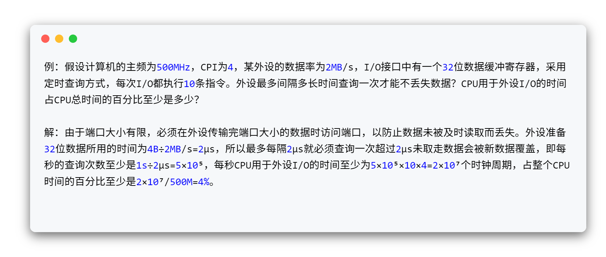

**独占查询**是指一旦设备被启动，CPU就一直持续对设备进行查询，外设和CPU完全串行工作。每次数据传送前CPU必须先读接口的状态，只有接口“就绪”时才继续进行传送，否则一直处于等待状态，直到外设完成任务而使接口满足条件为止。对于输入设备而言，就绪意味着设备已将数据送入接口中的数据缓冲器，CPU可以从接口取数据；对于输出设备而言，就绪意味着数据缓冲器已空，CPU可以将数据送到接口中。

打印机的输出控制方式可采用独占查询方式。假定用户进程请求打印机上打印一个字符串，执行open系统调用打开打印机，若打印机空闲，执行write系统调用陷入内核进行字符串打印。内核首先将用户进程缓冲区中的字符串复制到内核空间，然后查看打印机是否“就绪”。如果“就绪”，则将内核空间缓冲区中的一个字符输出到打印控制器的数据端口中，并发出“启动打印”命令控制打印机打印数据端口中的字符；如果打印机“未就绪”，则等待直到其“就绪”。上述过程循环执行，直到字符串中所有字符打印结束。

程序查询I/O方式的特点是设计简单、易控制、硬件量少（外围接口控制逻辑少），但是CPU要花费很多时间来查询和等待，且在一段时间内只能和一台外设交换信息，CPU与设备串行工作，效率很低。

设备是否适合采用条件传送方式，主要取决于I/O设备本身的特点以及设备是否能够独立启动I/O等。像针式打印机等字符类设备，每个字符之间的传输时间较长，并且每传送一个字符需要启动一次，因而可以采用程序查询方式。键盘和鼠标等是随机独立启动的低速I/O设备，当用户按下键盘、移动鼠标或单击鼠标按钮时，便启动了I/O设备的输入操作。虽然可以采用定时程序查询方式，但是由于设备的启动是由用户随机进行的，所以有可能用户长时间没有输入而引起查询程序长时间等待，从而降低处理器的使用效率，因此这类设备大多采用中断方式进行I/O。对于由操作系统启动的设备，则只有被操作系统激活后才需要查询。对于像磁盘、磁带和光盘存储器等成块传送设备一旦被启动，便可连续不断地传送一批数据，处理器无须对每个数据的传送进行启动，而且每个数据之间的传输时间很短，如果用定时查询方式，则会因为频繁查询而使处理器为I/O操作所花费的时间比例变得很大，因此这类设备大多采用DMA方式进行I/O。

#### 中断控制方式/中断的可编程IO方式/中断驱动IO方式（09-10，12，14，16-19，20-24）

##### 基本思想

**程序中断（interrupt）**是指在程序执行的过程中，若CPU检测到异常或中断，就暂时中止执行现行程序，转去进行异常和特殊请求的处理，处理完毕后再返回原程序的断点处继续执行。由CPU对各个中断信号源进行测试，以确定引起本次中断的I/O设备，并向提供中断信号的设备发送确认信号。在该设备收到确认信号后，就立即取消它所发出的中断请求信号。然后将相应设备的中断处理程序的入口地址装入程序计数器中。这样，当CPU运行时，便可自动转入相应设备的中断处理程序。

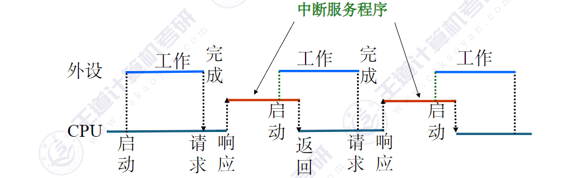

从设备控制器的角度看，先是从CPU接受到一个读命令，然后从设备中读取数据，一旦数据被读入设备控制器的数据寄存器，便通过控制线给CPU发出中断信号，表示数据已经准备好，然后等待CPU请求该数据。设备控制器接收到CPU发出的取数据请求后，将数据放到数据线上，传到CPU的寄存器中，本次I/O操作完成。

从CPU的角度看，当前运行的进程P1发出I/O命令，先启动外设进行第一个数据的传输，同时挂起P1使其阻塞，从就绪队列中选择另一个进程P2执行。此时CPU和外设并行工作，外设在准备P1所需的数据，CPU在执行P2进程。在每个指令周期的末尾，CPU会检查中断信号，当外设完成I/O操作，便向CPU发中断请求。CPU响应请求后，就中止正在执行的进程P2，转去执行中断服务程序。在中断服务程序中，CPU检查输入过程是否出错，若无错便向设备控制器发送取走数据的信号，从设备控制器读一个字的数据传送到寄存器，并存入主存。中断服务程序还会判断是否已完成全部数据的传输，若完成则将进程P1解除阻塞，使其进入就绪队列；否则启动随后数据的I/O传送任务，执行中断返回，返回原被中止的用户进程P2的断点处继续执行，外设和CPU又开始并行工作。

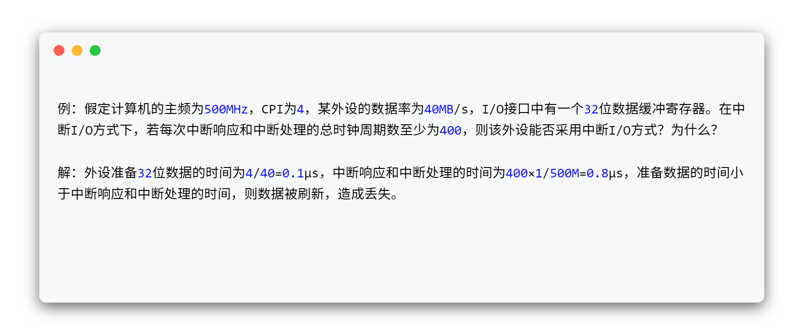

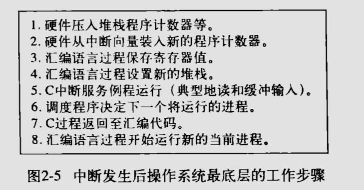

##### 中断控制器

中断系统中存在两种中断优先级。**中断响应优先级**是由查询程序或硬件判优电路决定的，硬件出厂时就已确定，它反映的是多个中断同时请求时选择哪个先被响应，不可动态改变。**中断处理优先级**指多重中断的实际优先级处理次序，通过在每个中断服务程序中设置对应的中断屏蔽字实现，反映了本中断与其他所有中断之间的处理优先关系。屏蔽字中的每一位对应某一个中断源，1表示屏蔽该中断源的请求，0表示可以正常请求（袁书中，用1表示允许中断，0表示屏蔽中断）。CPU可以通过在程序中执行相应的特权指令来修改屏蔽字的内容，从而动态地改变中断处理的先后次序，灵活地调整中断服务程序的优先级，使中断处理更加灵活。

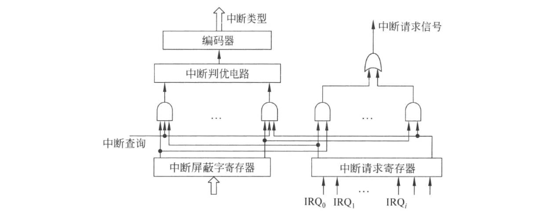

外部设备通过**中断请求信号线（IRQ线）**发出中断请求，**中断请求信号（IRQ）**记录在**中断请求寄存器**中的对应位中，并在**INTR**汇集成一个公共的**中断请求信号（INT）**送往CPU。每个中断源有各自对应的**中断屏蔽字**，在进行相应的中断处理之前送到**中断屏蔽字寄存器（IMR）**中。

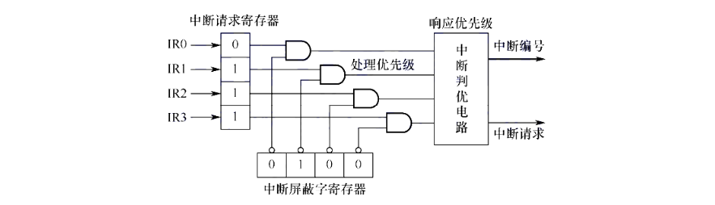

CPU运行任意程序时，在每条指令执行完、下条指令取出前（中断周期），就会通过采样中断请求信号引脚是否有INT。若采样到INT有效，则进入中断响应周期，发出一个相应的**中断回答/查询信号（INTA）**回送给中断控制器，以启动**中断查询**。所有来自外设的中断请求信号和来自CPU对应的中断屏蔽字进行“与”操作，然后在该信号的作用下，所有未被屏蔽的中断请求信号送到**优先级分析器**进行优先级排队仲裁。被屏蔽的中断请求将无法送到中断判优电路，未被屏蔽的中断请求仍然按照中断判优电路的响应优先级次序被处理。优先级分析器的**中断判优电路**选择一个响应优先级最高的中断源，然后**编码器**输出对应的**中断设备类型号**（即中断源的标识信息，称为**中断类型**）通过数据总线送给CPU。CPU取得中断类型后，经过相应的转换形成向量地址，据此访问中断向量表，得到对应的中断服务程序首地址，在下一个CPU时钟周期开始，执行相应的中断服务程序。

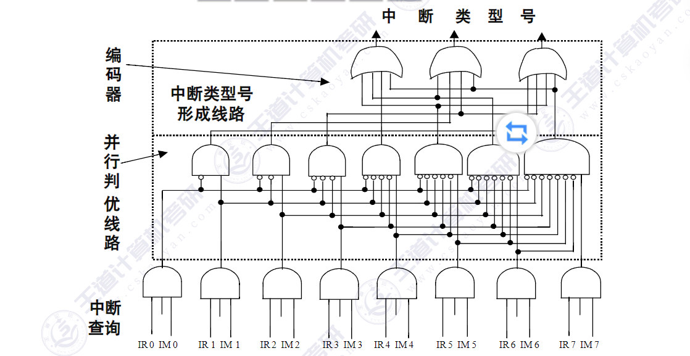

中断处理优先级由借助屏蔽寄存器实现，中断响应优先级借助判优电路实现。通过配置中断屏蔽字，可以动态改变中断处理优先级。但是中断屏蔽字寄存器的内容只有在执行中断服务程序时才会被更新，所以中断屏蔽只在CPU运行中断服务程序时才有用，其并不能改变CPU运行主程序时的中断响应优先级。即使在CPU运行中断服务程序时，同时到达的多个未屏蔽中断请求的处理也只能按中断判优电路的响应优先级进行处理。

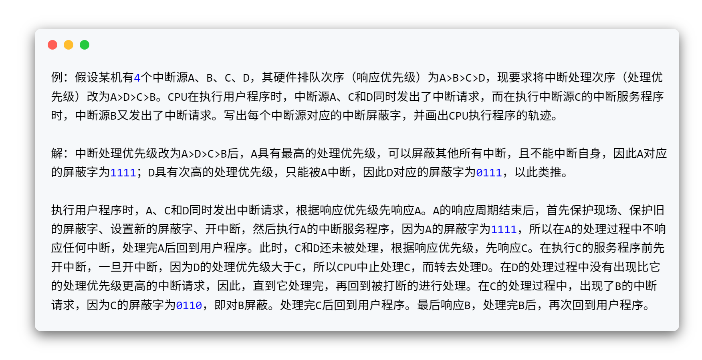

从宏观上看，虽然程序中断方式克服了程序查询方式中CPU的等待现象，提高了CPU的利用率。但从微观操作分析，CPU在处理中断时，仍需暂停原程序的运行，尤其是当高速设备频繁成批地与主存交换信息时，需要不断打断CPU执行现行程序而去执行中断服务程序。

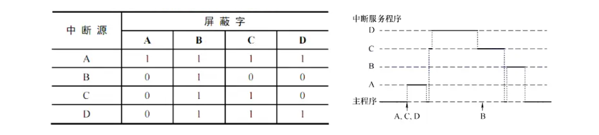

##### 程序中断过程

中断处理流程如下：1）关中断；2）保存断点；3）中断服务程序寻址；4）保存现场和屏蔽字；5）开中断，允许更高级中断请求得到响应，以实现中断嵌套；6）执行中断服务程序；7）关中断，保证在恢复现场和屏蔽字时不被中断；8）恢复现场和屏蔽字；9）开中断、中断返回。

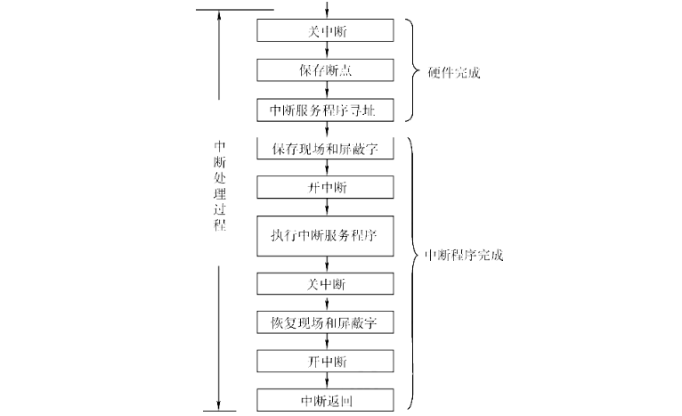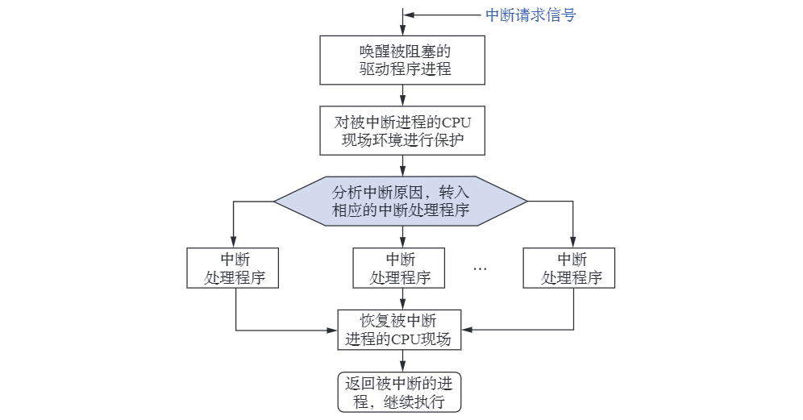

中断过程主要包括中断响应和中断处理两个阶段，其中1-3是中断响应阶段，由中断隐指令完成，即由硬件自动实现；4-9是中断处理阶段，由CPU执行中断服务程序完成；若是单重中断，则在上述流程中去掉5和7即可。

###### 中断请求过程

**中断源**是请求CPU中断的设备或事件，一台计算机允许有多个中断源，每个中断源向CPU发出中断请求的时间是随机的。为记录中断事件并区分不同的中断源，中断系统需对每个中断源设置**中断请求标记触发器**，当其状态为“1”时，表示该中断源有请求。这些触发器可组成中断请求标记寄存器，该寄存器可集中在CPU中，也可分散在各个中断源中。

通过INTR线发出的是可屏蔽中断，通过NMI线发出的是**不可屏蔽中断（NMI）**。可屏蔽中断的优先级最低，在关中断模式下不被响应；不可屏蔽中断用于处理紧急和重要的事件，通常是由硬件故障或其他严重错误引起的中断，无法被处理器屏蔽或禁用，如时钟中断、电源掉电等，其优先级最高。

在多重中断系统中通常用中断屏蔽技术对中断处理优先权进行动态分配，中断屏蔽字用于指出中断服务程序执行时，在中断周期查询到多个中断信号时，是响应其中一个中断，还是不响应中断继续执行。若不使用中断屏蔽技术，则处理优先级和响应优先级相同。在多重中断系统中，中断处理优先级决定了本中断是否能打断正在执行的中断服务程序，决定了多个中断服务程序执行完的次序。

在中断处理，即执行中断服务程序的过程中，若又出现了新的优先级更高的中断请求，而CPU对新的中断请求不予响应，则称这种中断为**单重中断/单级中断**；若CPU暂停现行的中断服务程序，转去处理新的中断请求，新中断处理结束后再回到被暂停的中断服务程序继续执行，则称这种中断为**多重中断**。通过开关中断实现。

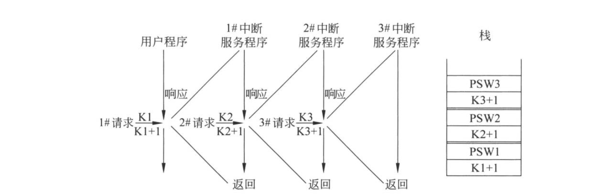

CPU在执行主程序时发生中断请求1#，主程序未屏蔽任何中断，因此响应中断请求1#，将主程序的断点压栈保存，然后转去执行中断服务程序1。在执行中断服务程序1时，又发生中断请求2#，而其处理优先级比中断请求1#的更高，此时须中止中断请求1#的处理，响应中断请求2#，将中断服务程序1的断点压栈保存，然后转去执行中断服务程序2。同样，拥有更高处理优先级的中断请求3#可以打断中断请求2#的处理。当中断请求3#处理完后，CPU从栈顶取出断点信息，回到中断服务程序2的断点（K3+1）处继续执行。以此类推，直到所有中断服务程序执行完毕，最终回到原程序的断点（K1+1）处继续执行主程序。

###### 中断响应过程

CPU响应中断必须满足以下3个条件：中断源有未被屏蔽的中断请求，这样CPU才能从INTR线中采样到中断请求信号，并发出中断回答信号使其进入判优电路；CPU允许中断及开中断，异常和不可屏蔽中断不受此限制；一条指令执行完毕，指令执行的最后操作是检测中断请求信号，若检测到则进入中断响应周期，但是异常是由指令执行过程引起的，不受此限制。在中断响应周期中，通过执行一条**中断隐指令**完成关中断、保护断点和程序状态、识别中断源并引出中断服务程序的任务，该指令并不是指令系统中一条真正的指令，而是硬件的一系列操作。

**1）保存断点和程序状态信息**

**断点**是程序被中断时处的PC的内容，存放着中断返回地址；**状态信息**是PSWR（如X86中的FLAGS）中的内容，存放着机器状态信息。由于中断服务程序必须将首地址和初始程序状态字装入PC和PSWR中后才能执行，所以原来在PC和PSWR中的断点和状态信息应在CPU响应中断过程中由硬件自动保存到栈或专门寄存器中。

在保护断点、机器状态和现场的过程中，如果又有新的中断被响应，则原被保存的断点、状态和现场等信息就会被破坏，因此本阶段应在关中断/中断禁止（将中断允许标志清零）条件下完成，即由CPU直接将中断允许触发器清零。

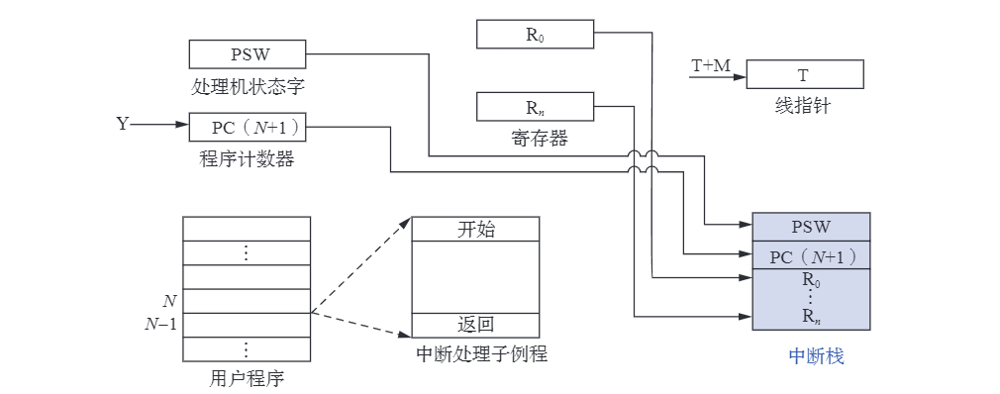

**2）识别中断源和中断判优**

在中断响应过程中，CPU必须能够识别出哪些中断有请求，并且在有多个未屏蔽的中断请求出现的情况下，选择响应优先级最高的中断。

由于许多中断源提出中断请求的时间都是随机的，当同时有多个未屏蔽的中断时，需通过**中断判优逻辑**来确定响应哪个中断源的请求，中断响应的判优通常是通过**硬件排队器**或**中断查询程序**实现的。一般来说，不可屏蔽中断>内部异常>可屏蔽中断；内部异常中，硬件故障>软件故障；DMA中断请求>I/O设备传送的中断请求；在I/O传送类中断请求中，高速设备>低速设备，输入设备>输出设备，实时设备>普通设备。

**采用软件查询方法**

该方法中断接口的硬件结构很简单，只要一根**中断请求线（IRQ）**和一个**中断请求寄存器（IRR）**，IRR中记录了各设备的I/O中断请求状态。当CPU检测到IRQ线上有中断请求时，通过中断响应自动转到中断查询程序执行。中断查询程序按中断优先顺序依次查询IRR中记录了哪个设备有I/O中断请求，并转到第一个查询到有请求的中断服务程序去执行。这种方式可通过改变中断查询顺序来改变中断响应优先级，因而比较灵活。但软件查询速度慢，可能导致中断请求无法得到实时响应。

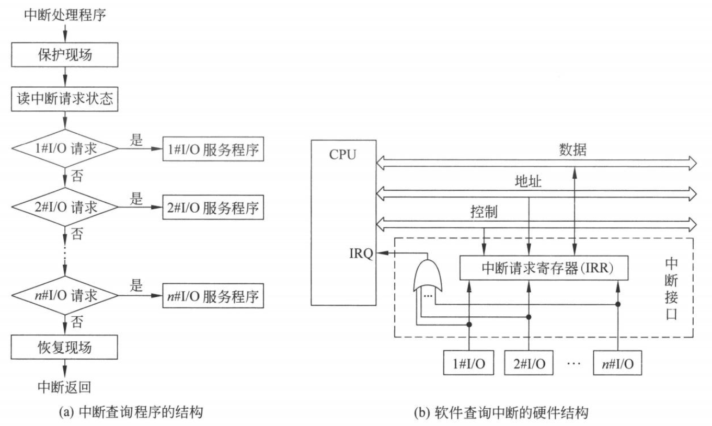

例如在MIPS中，使用一个异常状态寄存器（MIPS中为Cause寄存器）记录异常原因，操作系统使用一个统一的异常处理程序（MIPS的入口为0x80000180），按优先级顺序查询异常状态寄存器，识别出异常事件。

**采用硬件判优方法**

硬件判优不同于软件查询中断识别技术，而是一种**向量中断方式**。它根据**中断控制器接口**中的中断判优电路和编码器等，得到当前所有未被屏蔽的中断请求中具有高响应优先权的中断类型。

在向量中断方式下，每个中断源都有一个唯一的**中断类型号，**每个中断类型号都对应一个中断服务程序，每个中断服务程序都有一个入口地址PC和初始状态PSW，即**中断向量IV（interruptvector）**。系统中所有中断向量都存放在存储器的某个区域中，这个存储区称为**中断向量表/中断入口地址表**，中断向量所在的地址称为**向量地址VA（vectoraddress）。**

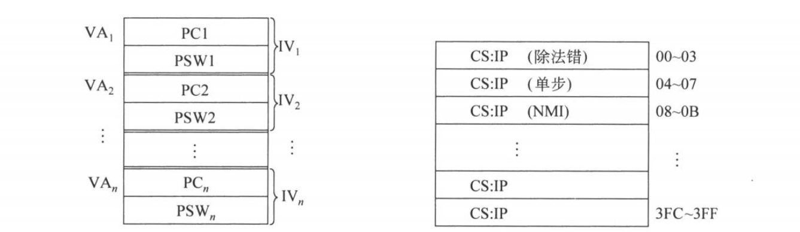

中断请求和响应信号是在I/O总线的控制线上传送的，CPU响应中断后，就从数据线上获取该中断源的中断类型号，然后据此计算出对应中断向量在中断向量表中的位置，从而得到中断服务程序的入口地址，并送入程序计数器PC，以转去执行中断服务程序。

这种方式的中断响应速度快，如果是可编程的中断控制器（PIC），响应优先级可灵活设置。

**3）调出中断服务程序**

中断响应的结果是调出相应的中断服务程序来执行，CPU通过相应步骤得到所响应的中断源对应的中断服务程序首地址和初始程序状态字，并把它们分别送PC和PSWR，在中断响应结束后的下一个时钟周期，CPU就转入相应的中断服务程序执行。

中断响应时间是中断系统设计时需考虑的一个重要指标，它反映了计算机系统的灵敏度，不同中断响应处理机制得到的中断响应时间不同。例如，MIPS处理器采用一种简单的响应机制，断点直接保存在特殊寄存器EPC中，不需要访问内存来存取栈，中断源的识别和判优处理也由软件进行，CPU只要把进行中断源识别和判优处理的中断查询程序的首地址送PC即可完成中断响应过程。

###### 中断处理过程

而中断处理就是CPU执行一个中断服务程序的过程，完全由软件完成。虽然不同的中断源对应的中断服务程序不同，但是所有中断服务程序的结构是相同的。中断服务程序包含3个阶段：准备阶段、处理阶段和恢复阶段。

**1）先行段/准备阶段**

**现场信息**是用户可见的通用寄存器的内容，存放着被中断程序执行到断点处的现行值。因为现场可以用指令直接访问，所以通常在中断服务程序中把它们保存到堆栈中，即由软件实现保存。在保存断点、保护现场和旧的屏蔽字、设置新屏蔽字的过程中，CPU一直处于关中断状态，在进行具体的中断服务之前，通过执行“开中断”指令来使中断允许触发器置1，因此，在进行具体的中断服务过程中，若有新的未被屏蔽的中断请求出现，则CPU可以响应新的中断请求。在软件识别中断方式下，要在先行段查明中断原因。

**2）本体段**

该程序首先会从设备控制器中读出设备状态，以判别本次中断是正常完成中断还是异常结束中断。若是正常完成中断，中断处理程序便做结束处理。假如这次是字符设备的读操作，则来自输入设备的中断表明该设备已经读入了一个字节(字)的数据，并已放入数据寄存器中。此时中断处理程序应将该数据传送给CPU，再将它存入缓冲区中，并修改相应的缓冲区指针，使其指向下一个内存单元。若还有命令，则可再向设备控制器发送新的命令，进行新一轮的数据传送。若是异常结束中断，则根据发生异常的原因做相应的处理。

**3）结束段/恢复阶段**

在恢复阶段也要让CPU关中断，并在返回前开中断。如果在准备阶段和恢复阶段CPU处在“开中断”状态，那么有可能在断点保存、现场和屏蔽字的保护和恢复、清除中断请求触发器的过程中响应新的中断，这样断点或现场及屏蔽字等重要信息就会被新中断破坏，因而不能回到原来的断点继续执行或因为现场或屏蔽字被破坏而不能正确执行。

“保护现场和旧屏蔽字”和“恢复现场和旧屏蔽字”分别通过“压栈”和“出栈”指令来实现，“设置新屏蔽字”和“清除中断请求”通过执行I/O访问指令来实现，这些指令将对可编程中断控制器（PIC）中的中断请求寄存器和中断屏蔽字寄存器进行访问，以使这些寄存器中相应的位清零或置1。在设备驱动程序和中断服务程序中使用到的I/O访问指令、“开中断”和“关中断”指令都是特权指令，只能在操作系统内核程序中使用。

中断返回指令不是无条件转移指令，其会修改PC的值。此刻是否返回被中断的进程，取决于两个因素：本中断是否采用了屏蔽(禁止)中断驱动I/O方式，若是则返回被中断的进程；针对中断处理方式为中断嵌套方式的情况，如果没有优先级更高的中断来请求I/O，则在中断处理完成后仍返回被中断的进程；反之，系统将处理优先级更高的中断请求。

如果要返回到被中断的进程，则可将保存在中断栈中的被中断进程的CPU现场信息取出，并装入相应的寄存器中，其中包括该程序下一次要执行的指令的地址N+1、处理机状态字以及各通用寄存器和段寄存器的内容。这样，当CPU再执行本程序时，便会从N+1处开始，最终返回被中断的进程。

I/O操作完成后，驱动程序必须检查本次I/O操作中是否发生了错误，并向上层软件报告，最终向调用者报告本次I/O的执行情况。除了处理中断外，其他步骤对所有I/O设备都是相同的，在UNIX系统把这些共同的部分集中起来，形成中断总控程序，每当要进行中断处理时，都要首先进入中断总控程序。

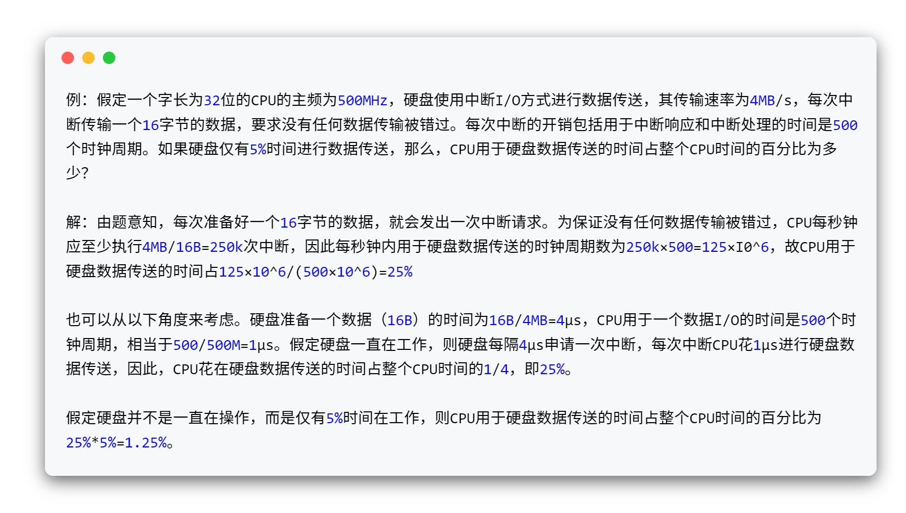

对于程序查询方式，在外设准备数据时，由于CPU一直在等待外设完成，所以CPU在这段时间100%为I/O服务。对于中断I/O方式，设备控制器通过中断主动向CPU报告I/O操作已完成，不再需要轮询；在外设准备数据时，CPU被安排执行其他程序，外设和CPU并行工作，因而CPU在外设准备数据时没有开销，只有响应和处理中断来进行数据传送时CPU才需要花费时间为I/O服务。在程序中断方式中，额外开销主要来自于现行程序和中断服务程序来回切换的过程中所耗费的时间，而程序查询方式的额外开销主要来源于CPU轮询外设状态时的等待时间，程序中断方式的额外指令执行时间更大。

但是该方式中设备和内存的数据交换必须经过CPU，CPU是以字或字节为单位进行干预的，不适合块设备的I/O操作。对于硬盘这种高速外设的数据传送，中断请求频率高，CPU会被频繁打断，而且由于CPU需要保存断点和程序状态以及现场信息、开中断/关中断、设置中断屏蔽字等，使得中断响应和中断处理的额外开销很大，因此在高速外设情况下，通常采用DMA方式。

#### 直接存储器访问（DMA，directmemoryaccess）方式（11-13，18-20，22-24）

##### 基本思想

DMA方式是一种完全由专门的硬件进行成组信息传送的控制方式，使用**DMA控制器/DMA接口**控制外设与主存间的直接数据交换。在进行DMA传送时，CPU将总线控制权让给DMA控制器，DMA控制器通过“窃取”一个主存存储周期完成和主存之间的一次数据交换，或独占若干存储周期完成一批数据的交换。

DMA方式主要用于磁盘、显卡、声卡、网卡等高速设备的数据传送，硬件开销比较大。这类高速设备的记录方式多采用数据块组织方式，数据块之间有间隙。数据传输时，数据块之间的时间间隔较长，数据块内部数据间的传输时间间隔较短，这类设备大多采用**成批数据交换方式**，因此DMA方式基本传送单位是数据块，而不再是字或字节。**选择型DMA**不适合慢速设备，但是**多路型DMA**却适合为多个慢速外围设备服务。

中断方式需要保护和恢复现场，而DMA方式中，主存和DMA接口之间有一条直接数据通路——DMA总线，信息传送无须经过CPU内部寄存器，因此不必中断先行程序，不需要保护、恢复CPU现场等烦琐操作。对中断请求的响应只能发生在每条指令执行结束时，而对DMA请求的响应发生在一个总线事务后，可以在任意一个机器周期结束时，任意两个存取周期之间，取指、间址、执行周期后响应。

DMA方式与中断I/O方式都采用“请求-响应”的方式，只是中断I/O方式请求的是处理器的时间，中断传送过程需要CPU的干预，而DMA方式下请求的是总线控制权，DMA传送过程不需要CPU的干预，仅在传输一个或多个数据块的开始和结束时才需要CPU干预，中断的作用仅限于故障和正常传送结束时的处理，因此数据传输速率非常高，适合于高速外设的成组数据传送。

在程序查询方式中，CPU与外设串行工作，传送与主程序串行工作；在中断方式中，CPU与外设并行工作，当数据准备好时仍需中断主程序以执行数据传送，因此传送与主程序仍是串行的；在DMA方式中，CPU与外设、传送与主程序都是并行的。与程序查询和中断I/O方式不同，CPU不直接执行I/O访问指令来实现数据传送，仅在最初的DMA控制器初始化和最后“DMA结束”中断处理（即预处理和后处理）阶段做一些辅助工作，数据传送过程完全由DMA控制器进行控制，即一个完整的DMA过程，大部分由DMA控制器控制，小部分由CPU控制，因而CPU用于I/O的开销非常小。

DMA请求的优先级高于中断请求。中断方式具有处理异常事件的能力，而DMA方式仅局限于大批数据的传送。从数据传送来看，中断方式靠程序传送，DMA方式靠硬件传送。

##### DMA控制器（DMAC）

DMA控制器由主机侧接口、块设备侧接口、I/O控制逻辑组成。当I/O设备需要进行数据传送时，DMA控制器接受外设发出的DMA请求，并向CPU发出总线请求。CPU响应之后将让出系统总线，发出总线响应信号，DMA接管总线控制权，进入DMA操作周期，此时CPU不能响应外部中断。DMA负责确定传送数据的主存起始地址及长度，并自动修改主存地址计数和传送长度计数。DMA规定数据在主存和外设间的传送方向，发出读/写等控制信号，执行数据传送操作，向CPU报告DMA操作结束。

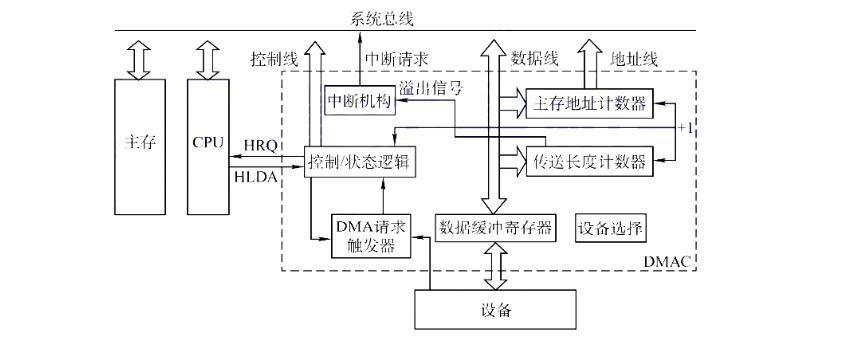

DMA控制器与设备控制器一样，其中也有若干寄存器，用于存放I/O传送所需的各种参数。**主存地址寄存器/计数器（MAR）**存放要交换数据的主存地址，在传送前保存的是传送数据的主存起始地址，每传送一个字地址寄存器的内容就加1，直至该批数据传送完毕。**传送长度计数器（datacounter，DC）**记录传送数据的总长度，在传送前记录的是该批数据的总字数，每传送一个字计数器就减1，直至计数器为0，表示该批数据传送完毕。**数据缓冲寄存器（dataregester，DR）**暂存每次传送的数据，通常DMA接口与主存之间的传送单位为字，而DMA与设备之间的传送单位可能为字节或位。**DMA请求触发器**，每当I/O设备准备好数据后，发出一个控制信号，使DMA请求触发器置位。控制寄存器（命令/状态寄存器commandregister，CR）用于接受从CPU发来的I/O命令、控制信息和设备状态。除此之外还有设备地址寄存器等。

**“控制/状态”逻辑**控制设备通过总线与主存直接交换数据，指定传送方向，修改传送参数，并对DMA请求信号、CPU响应信号进行协调和同步。**中断机构**，当一批数据传送完毕后触发中断机构，向CPU提出中断请求。

##### DMA传送方式

由于DMA控制器和CPU共享主存，所以可能出现两者争用主存的现象，为使两者协调使用主存，DMA通常采用以下3种方式之一进行数据传送。

**CPU停止法**。DMA传输时，由DMA控制器向CPU发送一个停止信号，使CPU脱离总线停止访问主存，直到DMA传送一块数据结束。该方法控制简单，适用于数据传输速率很高的I/O设备实现成组数据的传送。但是DMA在访问主存时，CPU基本处于不工作状态。

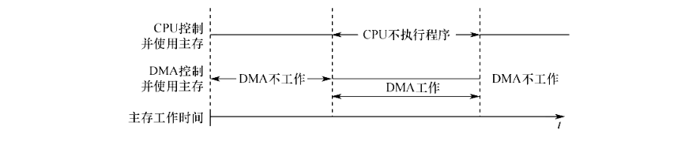

**周期挪用法。**DMA传输时，CPU让出一个总线事务周期，由DMA控制器挪用一个存储周期来访问主存，传送完一个数据后立即释放总线，然后CPU可以访存，这是一种**单数据/单字传送方式**。当I/O设备有DMA请求时，会遇到3种情况：CPU不在访存，因此I/O的访存请求与CPU未发生冲突；CPU正在访存，DMA必须待存取周期结束后CPU再将总线占有权让出；I/O和CPU同时请求访存，出现访存冲突，此时CPU要暂时放弃总线占有权。因为I/O不立即访存就可能丢失数据，所以I/O访存的优先级高于CPU访问。周期挪用法既实现了I/O传送，又较好地发挥了主存与CPU的效率，但是每挪用一个主存周期，DMA接口都要申请、建立和归还总线控制权。

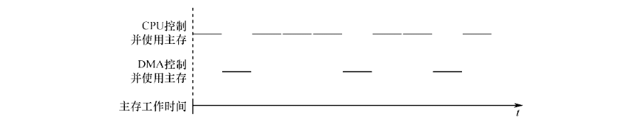

**交替分时访问法**。当CPU的工作周期比主存存取周期长时才能实现（即主存速度高于CPU访存速度），可将一个CPU周期分为C₁和C₂两个周期，其中C₁专供DMA访存，C₂专供CPU访存，把每个存储周期分成两个时间片，使得在每个存储周期内，CPU和DMA控制器都可访问存储器。这种方式不需要申请、建立和归还总线使用权，总线使用权是通过C₁和C₂分时控制的，具有很高的传送速率，但是相应的硬件逻辑变得更复杂。

周期挪用需要CPU与DMA交换使用总线控制权；交替访存是在一个CPU周期中分别让CPU与DMA在不同时间段内使用总线，不会发生冲突，所以不需要交换总线控制权；停止CPU方式中DMA控制器独自占有总线控制权，传送结束后才交还给CPU。

##### DMA传送过程

DMA在传送开始前要通过程序进行预处理，结束后要通过中断方式进行后处理。主存中要开辟专用缓冲区，以及时提供和接收外设的数据。

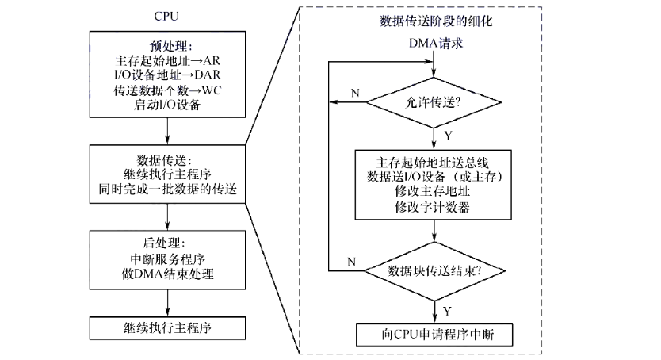

**1）DMA控制器的初始化**。在进行数据传送之前，CPU先执行一段初始化程序，完成对DMA控制器中各参数寄存器的初始值、传送方向的设定，测试并启动设备。1）准备内存区，若是从外设输入数据，则进行内存缓冲区的申请，并对缓冲区进行初始化；若是输出数据到外设，则先在内存准备好数据。2）设备驱动程序设置传送参数，执行I/O访问指令来测试外设状态，并对DMA控制器设置各种参数，如将内存首址送地址寄存器，字计数值送字计数器，传送方向送控制寄存器，设备地址送设备地址寄存器。3）发送“启动DMA传送”命令，然后CPU继续执行原程序，直到I/O设备准备好发送的数据或接收的数据时，I/O设备向DMA控制器发送DMA请求，再由DMA控制器向CPU发出总线请求（这两个过程也可统称DMA请求），用以传输数据。

**2）DMA数据传送**。CPU对DMA控制器进行初始化并发送“启动DMA传送”命令后，就把数据传送的工作交给了DMA控制器。在整个DMA传送过程中，不再需要CPU的参与，完全由DMA控制器实现数据的传送。DMA控制器直接与内存交互，给出内存地址，并在其读/写线上发出“读”命令或“写”命令，随后在数据总线上给出数据。DMA以数据块为基本传送单位，DMA占用总线后的数据输入/输出操作都是通过循环来实现的，每完成一个数据的传送，就将字计数值减1，并修改主存地址，当字计数器为0时，完成所有I/O操作。

**3）DMA结束处理**。当字计数器为0，则发出“DMA结束”中断请求信号给CPU，转入中断服务程序，进行DMA结束处理工作，包括叫数据（出错则转诊断程序）等后处理工作。

以主存和磁盘之间数据传送为例，其流程如下：1）进程P1先采用程序查询方式设置传送参数，通过执行相应的指令对有关参数寄存器进行初始化。2）然后CPU执行I/O指令发出“寻道”命令到磁盘控制器，由磁盘控制器控制磁盘驱动器开始移动磁头，同时CPU切换到其他进程P2执行。3）当磁盘完成寻道操作后，向CPU发出**“寻道结束”中断请求**。4）CPU响应并处理该中断请求，中止正在执行的进程P2，在中断服务程序中通过执行I/O指令发出“查找扇区”命令到磁盘控制器，返回被中止的进程P2执行。4）当磁盘完成扇区查找操作，就向CPU发出**“查找结束”中断请求**。5）CPU响应并处理该中断，又一次中止正在执行的进程P2，然后在中断服务程序中启动DMA传送，由DMA控制器控制数据在主存和磁盘之间进行数据传送。6）CPU启动DMA传送后，又回到被中止的进程P2继续执行，直到DMA传送结束。7）DMA控制器发出**“DMA结束”中断请求**，CPU响应并处理该中断请求，对传送的数据进行校验等后处理。

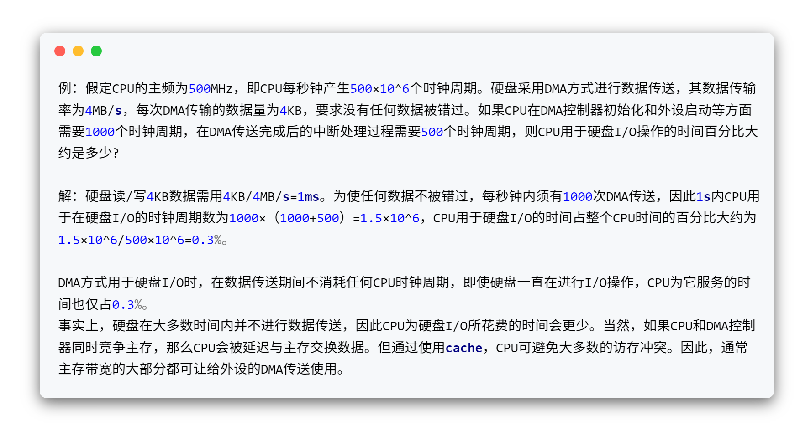

##### DMA与存储系统

DMA方式中使主存与CPU的固定联系脱钩，主存既可被CPU访问，又可被外设访问。没有DMA控制器时，所有对主存的访问都来自CPU，通过MMU中的地址转换和cache进行访存。有了DMA控制器后，系统中就有了另一个访问主存的路径，它不通过地址转换机制和cache层次。

在采用虚拟存储器的系统中同时有物理地址和虚拟地址，DMA若用虚拟地址，则在DMA接口中应有一个小的类似页表的地址映射表，用于将虚拟地址转换为物理地址；若用物理地址，则每次DMA传送不能跨页，否则一次请求的一个数据块就可能不在主存的一个连续的存储区中，需要由操作系统把一次传送分解成多次小数据量传送，以保证每次只限定在一个物理页面内进行。

采用cache的系统中，数据项cache和主存储器中都可能有一份副本。DMA控制器直接向主存储器发出访存请求而不通过cache，因此它看到的主存单元的值与CPU看到的Cache中的副本可能不同，这个问题称为**过时数据问题**或**I/O一致性问题**，其解决方法有以下3种。

**让I/O活动通过cache进行**，保证了在I/O读时能读到最新的数据，I/O写时能更新cache中的任何数据。但是I/O数据通常很少马上被CPU要用到，如果这样的数据把CPU正在使用的有用数据替换出去，就会影响cache的命中率，给CPU的性能带来很多负面影响，代价很大。

**cache刷新，**让操作系统在I/O读时有选择地使某些cache块无效，而在I/O写时迫使cache进行一次写回操作，这种方式需要少量硬件支持。因为大部分cache刷新操作仅发生在DMA数据块访问时，而DMA访问又不经常发生，所以如果软件能方便而有效地实现这种方法，则性价比更高。

**硬件保证**，通过一个硬件机制来选择被刷新或使无效的cache项，这种方式大多用在多处理器系统中。

#### I/O通道控制方式*

##### 通道（channel）

当主机所配置的I/O设备有很多时，即使配置了设备管理器，CPU的负担仍然会很重。为此，在CPU和设备控制器之间又增设了通道，以建立独立的I/O操作，使一些原来由CPU处理的I/O任务转由通道来承担，这样不仅使数据的传送能独立于CPU，而且使对I/O操作的组织、管理及其结束处理尽量独立，以保证CPU有更多的时间进行数据处理，把CPU从繁杂的I/O任务中解脱出来。设置了通道后，CPU只须向通道发送一条I/O指令，指明通道程序在内存中的位置和要访问的I/O设备。通道在接收到该指令后，便会从内存中取出本次要执行的通道程序，然后执行该程序，仅当通道完成了规定的I/O任务后，才向CPU发送中断信号。

实际上，I/O通道是一种特殊的处理机，它具有执行I/O指令的能力，并能通过执行（I/O）通道程序来控制I/O操作。但I/O通道又与一般的处理机不同，通道硬件比较简单，因此I/O通道指令类型单一，主要局限于与I/O操作有关的指令；I/O通道没有自己的内存，所执行的通道程序是放在主机的内存中的，即I/O通道与CPU共享内存。通道方式可以实现CPU、通道和I/O设备三者的并行工作，从而更有效地提高整个系统的资源利用率。

通道程序是由一系列通道指令（或称为通道命令）所构成的。通道指令与一般的机器指令不同，在它的每条指令中都包含：操作码、内存地址、计数、通道程序结束位P、记录结束标志R。

##### 通道类型

###### 字节多路通道（bytemultiplexorchannel）

一种按字节交叉方式工作的通道，不适用于连接高速设备，通常含有许多非分配型子通道，其数量可为几十到数百个，每个子通道均连接一台I/O设备，并控制该设备的I/O操作。这些子通道按时间片轮转方式共享主通道，当第一个子通道控制其I/O设备完成一个字节的交换后，其便会立即腾出主通道，让给第二个子通道使用；当第二个子通道也完成一个字节的交换后，同样也会把主通道让给第三个子通道；依此类推。当所有子通道轮转一周

后，再由第一个子通道去使用字节多路主通道。这样，只要字节多路主通道扫描每个子通道的速率足够快，并且连接到子通道上的设备的速率又不是太高，便不会导致丢失信息。

如图所示的字节多路通道含有多个子通道A，B，C，D，…，N，分别通过设备控制器各与一台设备相连。设备A所传送的数据流为A1，A2，A3，…；设备B所传送的数据流为B1，B2，B3，…；以此类推。假定这些设备的速率相近，且都同时向主机传送数据，把这些数据流合成后，通过主通道送往主机，合成以后的数据流为A1，B1，C1，D1，A2，B2，C2，D2，A3，B3，C3，D3……。

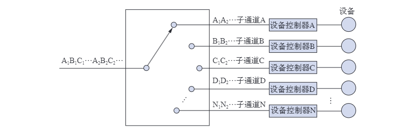

###### 数组选择通道（blockselectorchannel）

一种按数组方式进行数据传送的通道，可以连接多台高速设备，但只有一个分配型子通道，在一段时间内只能执行一道通道程序，控制一台设备进行数据传送。某台设备占用了该通道后，便会一直由它独占，即使它无数据传送，闲置的通道也不允许其他设备使用，直至该设备传送完毕并释放该通道，因此通道的利用率很低。

###### 数组多路通道（blockmultiplexorchannel）

通过结合数组选择通道传输速率高，字节多路通道能使各子通道分时并行操作而形成的一种新通道，含有多个非分配型子通道，因而这种通道既具有很高的数据传输速率，又能获得令人满意的通道利用率，用于连接多台高、中速的外围设备，其数据传送是按数组方式进行的。

##### “瓶颈”问题

由于通道价格昂贵，机器中所设置的通道数量势必较少，这往往又会使它成为I/O的瓶颈，进而造成整个系统吞吐量下降。如图，为了启动磁盘4，必须用通道1和设备控制器2，但若这两者已被其他设备占用，则必然无法启动磁盘4。类似地，若要启动磁盘1和磁盘2，则由于它们都要用到通道1，因而也不可能启动。

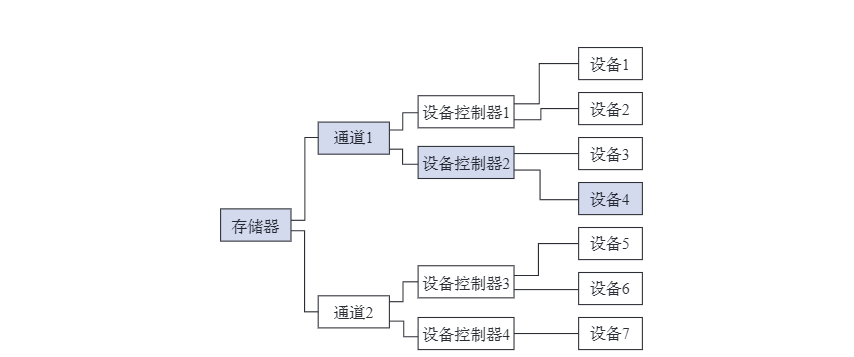

解决“瓶颈”问题最有效的方法，便是增加设备到主机间的通路而不增加通道，即把一个设备连接到多个设备控制器上，而把一个设备控制器又连接到多个通道上。如图，设备4可通过设备控制器1和通道1到存储器，也可通过设备控制器2和通道1到存储器。多通路方式不仅解决了“瓶颈”问题，而且提高了系统的可靠性，因为个别通道或设备控制器的故障不会使设备和存储器之间没有通路。

通道与DMA方式的区别是：DMA方式需要CPU来控制传输的数据块大小、传输的内存位置，而通道方式中这些信息是由通道控制的。另外，每个DMA控制器对应一台外部设备与内存传递数据，而一个通道可以控制多台外部设备与内存的数据交换。

### 用户空间I/O软件

大部分的I/O软件都放在OS内部，但仍有一小部分放在用户层，其中包括与用户程序链接在一起的库函数，在网络传输文件时经常使用的守护进程，以及完全运行于内核之外的假脱机系统等。

#### 系统调用

应用进程在运行时必须取得OS所提供的服务，否则几乎无法运行。但是为了使各进程能有条不紊地使用I/O设备，且能保护设备的安全性，运行在用户态的应用进程不能直接调用运行在内核态的OS过程。因此，OS在用户层中引入了一个中介过程——系统调用，应用程序可以通过它间接地调用OS中的I/O过程，对I/O设备进行操作。当OS捕获到应用程序中的该系统调用后，便会将CPU的状态从用户态转换到内核态，然后转向OS中的相应过程，由该过程执行所需的I/O操作。执行完成后，系统又将CPU状态从内核态转换到用户态，返回应用程序继续执行。

事实上，由OS向用户进程提供的所有功能，都必须通过系统调用来获取，即系统调用是应用程序取得OS所有服务的唯一途经。在早期的OS中，系统调用是以汇编语言形式提供的，因此只有在用汇编语言书写的程序中才能直接使用系统调用，这对用户是非常不方便的；后来在C语言中，首先提供了与系统调用相对应的库函数。

#### 库函数

内核提供了OS的基本功能，而库函数扩展了OS内核，使用户能方便地取得OS的服务。在C语言以及UNIX系统中，系统调用（如read）与其所使用的库函数（如read）之间几乎是——对应的。在I/O方面，主要提供的是对文件和设备进行读/写操作的库函数，以及控制/检查设备状态的库函数，这些库函数的集合也应是I/O系统的组成部分。在许多现代OS中，系统调用本身已经采用C语言编写，并以函数形式提供，因此在使用C语言编写的用户程序中可以直接使用这些系统调用。

#### 假脱机系统

多道程序技术可将一台物理CPU虚拟为多台逻辑CPU，从而允许多个用户共享一台主机；假脱机技术就可以将一台物理I/O设备虚拟为多台逻辑I/O设备，这样就可以允许多个用户共享一台物理I/O设备。

##### 假脱机（SPOOLing，simultaneausperiphernaloperatingonline）技术

早期为了缓和CPU的高速性与I/O设备的低速性之间的矛盾，利用专门的**外围控制机**先把低速I/O设备上的数据传送到高速磁盘上，或把数据从磁盘传送到低速输出设备上。当CPU需要输入数据时，便可以直接从磁盘中读取数据，极大地提高了输入速度；在CPU需要输出数据时，也能以很快的速度把数据先输出到磁盘上，然后便可以去做其它的工作。

引入多道程序技术后，系统可以利用程序模拟外围控制机的功能，在主机的直接控制下就可以实现以前的脱机输入/脱机输出功能，外围操作与CPU对数据的处理同时进行，这种在联机情况下实现的同时外围操作技术，称为假脱机技术。

##### 假脱机系统的组成

假脱机技术建立在通道技术和多道程序技术的基础上，以高速随机外存（通常为磁盘）为后援存储器，主要由4部分组成。

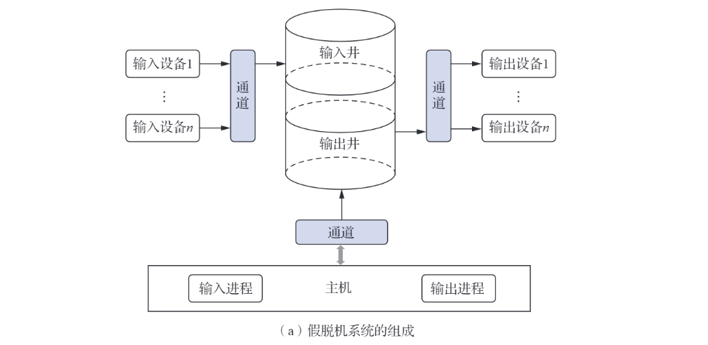

**输入井和输出井**，是在磁盘上开辟出来的两个存储区域。输入井模拟脱机输入时的磁盘，用于收容I/O设备输入的数据；输出井模拟脱机输出时的磁盘，用于收容用户程序的输出数据。输入/输出井中的数据一般以文件的形式组织管理，我们把这些文件称为**井文件**，一个文件仅存放某一个进程的输入（或输出）数据，所有进程的数据输入（或输出）文件可链接成为一个输入（或输出）队列。

**输入缓冲区和输出缓冲区**，是在内存中开辟的两个缓冲区，用于缓和CPU和磁盘之间速度不匹配的矛盾。输入缓冲区用于暂存由输入设备传送来的数据，之后再将其传送到输入井；输出缓冲区用于暂存从输出井传送来的数据，之后再将其传送到输出设备。

**输入进程和输出进程**，前者也称为**预输入进程**，用于模拟脱机输入时的外围控制机，将用户要求的数据从输入设备传送到输入缓冲区，再存放到输入井，当CPU须输入数据时，直接从输入井读入内存；后者也称为**缓输出进程**，用于模拟脱机输出时的外围控制机，把用户要求输入的数据从内存传送（并存放）到输出井，待输出设备空闲时，再将输出井中的数据经输出缓冲区输出至输出设备。

**井管理程序**，用于控制作业（用户进程）与磁盘井之间信息的交换。当作业执行过程中向某台设备发出启动输入或输出操作请求时，由OS调用井管理程序，由该程序控制从输入井读取信息或将信息输出至输出井。

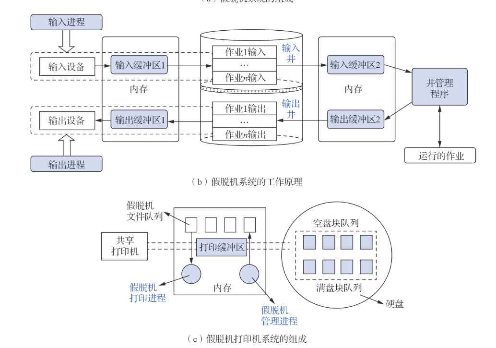

##### 假脱机系统的特点

**提高了I/O速度**，使对数据所执行的I/O操作从对低速I/O设备执行的I/O操作演变为对磁盘缓冲区中的数据进行的存取操作，缓和了CPU与低速I/O设备之间速度不匹配的矛盾。

**将独占设备改造为共享设备**。在假脱机打印机系统中，实际上并没有为任何进程分配设备，只是在磁盘缓冲区中为进程分配了一个空闲盘块和建立了一张**I/O请求表**，这样便把独占设备改造成了共享设备。

**实现了虚拟设备功能**。宏观上，虽然多个进程在同时使用一台独占设备，但对于每个进程而言，它们都会认为自己独占了一个设备，即实现了将独占设备变换为若干台对应的逻辑设备的功能。

##### 假脱机打印机系统

**共享打印机技术**利用假脱机技术将打印机（独占设备）改造为一台可供多个用户共享的打印设备，提高了设备的利用率。

假脱机打印机系统主要包含以下3部分。**磁盘缓冲区**（输出井）是在磁盘上开辟的一个存储空间，用于暂存用户程序的输出数据，在该缓冲区中可以设置几个盘块队列，如空盘块队列、满盘块队列等。**打印缓冲区**（输出缓冲区）用于缓和CPU和磁盘之间速度不匹配的矛盾，设置在内存中，暂存从磁盘缓冲区发送来的数据，以后会再传送给打印设备进行打印。**假脱机管理进程**（井管理程序）为每个要求打印的用户数据建立一个**假脱机文件**（用户请求打印表），并把它放入**假脱机文件队列**中，由**假脱机打印进程**（输出进程）依次对队列中的文件进行打印。

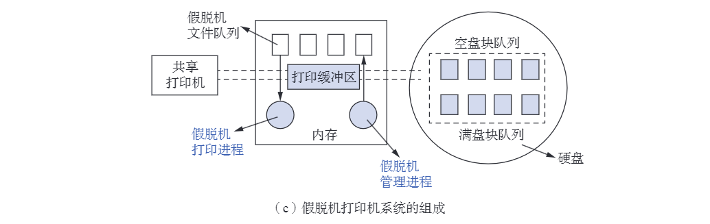

当用户进程发出打印输出请求时，假脱机打印机系统并不会立即把打印机分配给该用户进程，而是会由假脱机管理进程完成两项工作：1）在磁盘缓冲区中为之申请一个空闲盘块，并将要打印的数据（内存缓冲区）送入其中暂存；2）为用户进程申请一张空白的用户请求打印表，并将用户的打印要求填入其中，再将该表挂到假脱机文件队列上。在这两项工作完成后，虽然还没有进行任何实际的打印输出，但对于用户进程而言，其打印请求已经得到了满足，打印输出任务已经完成。

真正的打印输出是假脱机打印进程负责的，当打印机空闲时，该进程首先从假脱机文件队列的队首摘取一张请求打印表，然后根据表中的要求将要打印的数据由磁盘缓冲区传送到内存缓冲区，再交付打印机进行打印。一个打印任务完成后，假脱机打印进程将会再次查看假脱机文件队列，若队列非空，则重复上述工作，直至队列为空。此后，假脱机打印进程会将自己阻塞起来，仅当再次有打印请求时，其才会被重新唤醒运行。

对每个用户而言，系统并非即时执行其程序输出数据的真实打印操作，而只是即时将数据输出到缓冲区，这时的数据并未真正被打印，只是让用户感觉系统已为他打印；真正的打印操作，是在打印机空闲且该打印任务在等待队列中已排到队首时进行的；而且，打印操作本身也是利用CPU的一个时间片，没有使用专门的外围机。以上过程是对用户屏蔽的，即用户是不可见的。

##### 守护进程

取消共享打印技术方案中的假脱机管理进程，为打印机建立一个守护进程，实现一部分原来由假脱机管理进程实现的功能，如为用户在磁盘缓冲区中申请一个空闲盘块，并将要打印的数据送入其中，将该盘块的起始地址返回给请求进程；另一部分功能由请求进程自己实现，每个要求打印的进程，首先生成一份要求打印的文件，其中包含对打印的要求和指向装有打印输出数据盘块的指针等信息，然后将用户请求打印文件放入假脱机文件队列（目录）中。

守护进程是允许使用打印机的唯一进程，所有需要使用打印机进行打印的进程，都需要将一份要求打印的文件放在假脱机文件队列（目录）中。如果守护进程正在睡眠，则将它唤醒，由它按照目录中第一个文件中的说明进行打印，打印完成后，再按照目录中第二个文件中的说明进行打印，如此逐份文件地进行打印，直到目录中的全部文件打印完毕为止，此时守护进程无事可做，便又去睡眠，同时等待用户进程再次发来打印请求。

除了打印机守护进程之外，还可能有许多其他的守护进程，如服务器守护进程和网络守护进程等。事实上，凡在需要将独占设备改造为可供多个进程共享的设备时，都要为该设备配置一个守护进程和一个假脱机文件队列（目录）。同样，守护进程是允许使用该独占设备的唯一进程，所有其他进程都不能直接使用该设备，而只能将对该设备的使用要求写入一份文件中，并将该文件放在假脱机目录中。由守护进程按目录中的文件，依次来完成各进程对该设备的请求。

### 内核空间I/O软件

#### 设备无关性/独立性(deviceindependence)软件

应用程序中所用的设备不局限于使用某个具体的物理设备，为每个设备所配置的设备驱动程序，是与硬件紧密相关的软件。CPU一旦通过陷阱指令调出系统调用处理程序执行，就开始执行内核空间的I/O软件。首先执行的是与具体设备无关的I/O软件，主要完成所有设备公共的I/O功能，并向用户层软件提供一个统一的接口。通常包括设备驱动程序统一接口、缓冲处理、错误报告、打开与关闭文件以及逻辑块大小处理等功能。

##### 设备名管理

早期OS中应用程序使用物理设备名请求使用指定设备，系统只能根据设备的物理名分配外设，如果应用进程请求的设备已分配给其他进程，尽管还有其他相同的设备空闲，也无法将它们分配给应用进程，致使该进程请求I/O失败而被阻塞。应用程序直接与物理设备相关，当程序所需要的设备在系统中被更新，该程序就无法再在该系统上请求到指定设备而继续运行。这非常不灵活的，也不利于提高I/O设备的利用率。

为了实现与I/O设备的无关性，引入了逻辑设备名和物理设备名两个概念。逻辑设备名是抽象的设备名，如/dev/printer，只是说明需要使用打印机，但并没有指定具体是哪一台打印机。应用程序通过逻辑设备名请求使用某类设备，系统会逐个查找该类设备中尚未被分配的设备分配给该进程。只要系统中有一台该类设备未被分配，进程就不会被阻塞，仅当所请求的此类设备已全部分配完毕时，进程才会因请求失败而阻塞。

与设备无关的I/O软件还可实现**I/O重定向**，可以更换用于I/O操作的设备而不必改变应用程序，应用进程也不会由于某台指定设备退役而无法在本系统中运行。例如，在调试程序时程序的输出在屏幕显示，调试完成后，需要将程序的运行结果打印出来，这时可以将I/O重定向的数据结构——**逻辑设备表**中的显示终端改为打印机，而不必修改应用程序。

为了简化对外设的处理，在内核高层I/O软件中，将所有外设都抽象成一个文件，设备名和文件名在形式上没有任何差别，因而被称为**设备文件名**。

系统只能识别物理设备名，在程序执行时，必须先将逻辑地址转换为物理地址。与地址转换机制类似，可以在系统中需要配置一张**逻辑设备表，**每个表目中逻辑设备名、物理设备名和设备驱动程序的入口地址。当进程用逻辑设备名请求分配I/O设备时，系统会根据当时的具体情况为它分配一台相应的物理设备。与此同时，在逻辑设备表上会建立一个表目，填上应用程序中使用的逻辑设备名和系统分配的物理设备名，以及该设备驱动程序的入口地址。当以后进程再利用该逻辑设备名请求I/O操作时，系统通过查找逻辑设备表便可找到该逻辑设备所对应的物理设备及其设备驱动程序。

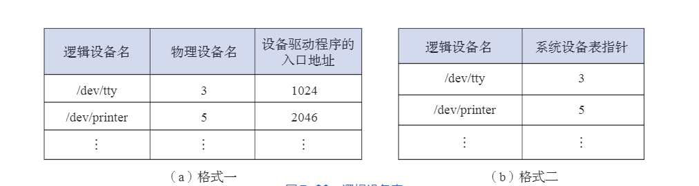

在系统中，可采取两种方式设置逻辑设备表。第一种方式是在整个系统中只设置一张逻辑设备表。由于系统中所有进程的设备分配情况都记录在同一张逻辑设备表中，因而不允许在逻辑设备表中存在相同的逻辑设备名，这就要求所有用户都不能使用相同的逻辑设备名。在多用户系统中这通常是难以做到的，因而这种方式主要用于单用户系统。第二种方式是为每个用户设置一张逻辑设备表。每当用户登录系统时，系统便会为该用户建立一个进程，同时也会为之建立一张逻辑设备表，并将该表放入进程的PCB中。由于通常在多用户系统中都配置了系统设备表，故此时的逻辑设备表可以第二种格式。

与设备无关软件是I/O系统的最高层软件，下面是设备驱动程序，它们的界限因OS和设备的不同而有所差异。例如，对于一些本应由与设备无关软件实现的功能，却放在设备驱动程序中实现。这样的差异，主要是出于对OS、设备独立性和设备驱动程序运行效率等多方面因素的权衡和考虑。总体来说，在与设备无关软件中包含以下几项面向设备的共有操作。

##### 设备驱动程序的统一接口

某个外设具体的I/O操作需要通过执行设备驱动程序来完成，而外设的种类繁多、控制接口不一致，导致不同外设的设备驱动程序千差万别。如果计算机系统中每次出现一种新的外设，都要为添加新设备的驱动程序而修改操作系统，那么就会给操作系统开发者和系统用户带来很大的麻烦。

为此，操作系统为所有外设的设备驱动程序规定了一个统一的接口。一方面，新设备驱动程序只要按照统一的接口规范来编制，就可以在不修改操作系统的情况下，在系统中添加新设备驱动程序并使用新的外设进行I/O。另一方面，因为采用了统一的设备驱动程序接口，内核中与设备无关的I/O软件包含了所有外设统一的公共接口中的处理部分。例如，刚陷入内核后所执行的system_call（）函数就是与设备无关的I/O软件的一部分。内核中与设备无关的I/O软件必须将抽象的设备名映射到对应的设备驱动程序上，或者说将抽象的设备名转换为具体的物理设备名，并进一步找到相应物理设备的设备驱动程序入口。此外，还应对设备进行保护，禁止用户直接访问设备，以防止无权访问的用户使用设备。

##### 缓冲区管理

每个设备的I/O都需要使用缓冲区，因而缓冲区的申请和管理等处理是所有设备公共的，可以包含在与设备无关的I/O软件部分。此外，为了充分利用数据访问的局部性特点，操作系统通常在内核空间开辟高速缓存，将大多数最近从块设备读出或写入的数据保存在作为高速缓存的RAM区中。与设备无关的I/O软件会确定所请求的数据是否已经存在在高速缓存RAM中，如果存在就可能不需要访问磁盘等外存设备。

用户进程在提出I/O请求时，指定的用来存放I/O数据的缓冲区在用户空间中，例如文件读函数fread（buf，size，num，fp）中的缓冲区buf在用户空间中。在外设进行I/O期间，用户进程会被挂起，在用户空间的缓冲区所在页面有可能被替换出去。因此通过陷阱指令陷入内核态后，内核会在内核空间中再开辟一个或两个缓冲区，底层I/O软件控制设备进行I/O操作时，直接使用内核空间中的缓冲区来存放I/O数据。

**缓冲区的引入**

**缓和CPU与I/O设备间速度不匹配的矛盾**。凡在数据的到达速率与离去速率不同的地方，都可设置缓冲区来缓和它们之间速率不匹配的矛盾。例如，无论是字符设备还是块设备的运行速度都远低于CPU的速度，为了缓和CPU与I/O设备之间的矛盾、提高CPU的利用率。

**减少对CPU中断的频率，放宽对CPU中断响应时间的限制**。在远程通信系统中，如果从远程终端发来的数据仅用一位缓冲来接收，则必须在每收到一位数据时便中断一次CPU，这样，对于速率为9.6kbit/s的数据通信来说，就意味着其中断CPU的频率为9.6kHz，即约每100µs就要中断CPU一次，而且CPU必须在100µε内予以响应，否则缓冲区内的数据将被冲掉。倘若设置一个8位缓冲寄存器，则可使CPU被中断的频率降低为原来的1/8；若再设置一个8位缓冲寄存器，，则可以把CPU对中断的响应时间从100µs放宽到800µs。类似地，在磁盘控制器和磁带控制器中，都需要配置缓冲寄存器，以减少对CPU的中断频率，放宽对CPU中断响应时间的限制。随着数据传输速率的提高，需要配置位数更多的寄存器进行缓冲。

**解决数据粒度不匹配的问题**。当生产者所生产的数据粒度比消费者消费的数据粒度小时，生产者进程可以一连生产好几个数据单元的数据，当其总和已达到消费者进程所要求的数据单元大小时，消费者便可从缓冲区中取出数据进行消费。当生产者所生产的数据粒度比消费者消费的数据粒度大时，生产者每次生产的数据，消费者可以分几次从缓冲区中取出消费。

**提高CPU和I/O设备之间的并行性**。在CPU(生产者)和打印机(消费者)之间设置了缓冲区后，生产者在生产了一批数据并将其放入缓冲区后，便可立即去进行下一次的生产。与此同时，消费者可以从缓冲区中取出数据进行消费，这样便可使CPU与打印机处于并行工作状态。

缓冲区可以由昂贵的硬件寄存器实现，也可以在内存中开辟，有多种形式，如单缓冲区、双缓冲区、环形缓冲区、缓冲池等，以满足不同情况的需要。

**单缓冲区(singlebuffer)**

每当用户进程发出一个I/O请求时，OS便会在内存中为之分配一缓冲区。在块设备输入时，假定从I/O设备把一块数据输入缓冲区的时间为T，OS将该缓冲区中的数据传送到工作区的时间为M，而CPU对这一块数据进行处理(计算)的时间为C。由于T和C是可以并行的，当T>C时，系统对每块数据的处理时间为M+T；反之则为M+C。因此可把系统对每块数据的处理时间表示为Max(C，T)+M。

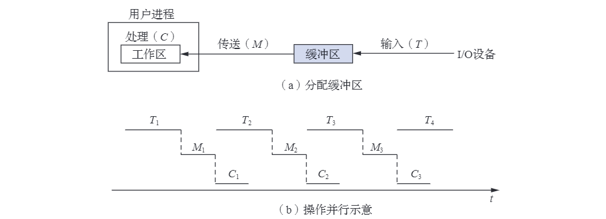

在字符设备输入数据时，缓冲区用于暂存用户输入的一行数据，在输入期间，用户进程被挂起以等待数据输入完毕；在输出时，用户进程将一行数据输入缓冲区后，继续进行处理。当用户进程已有第二行数据输出时，如果第一行数据尚未被提取完毕，则此时用户进程应阻塞。

**双缓冲区（doublebuffer）/缓冲对换(bufferswapping)**

由于缓冲区是共享资源，生产者与消费者在使用缓冲区时必须互斥。如果消费者尚未取走缓冲区中的数据，则即使生产者又生产出新的数据，也无法将它送入缓冲区，此时生产者需要等待。如果为生产者与消费者设置了两个缓冲区，便能加快输入和输出速度，提高设备利用率解决这一问题。

在设备输入数据时，先将数据送入第一缓冲区，装满后便转向第二缓冲区。此时OS可以从第一缓冲区中移出数据，并送入用户进程，接着由CPU对数据进行计算。在双缓冲区情况下，系统处理一块数据的时间可以认为是Max(C+M，T)，如果C+M<T，则可使块设备连续输入；如果C+M>T，则可使CPU不必等待设备输入。对于字符设备，在行输入方式下，若采用双缓冲区，则通常能消除用户的等待时间，即用户在输入完第一行数据后，在CPU执行第一行中的命令时，用户可以继续向第二缓冲区输入下一行数据。

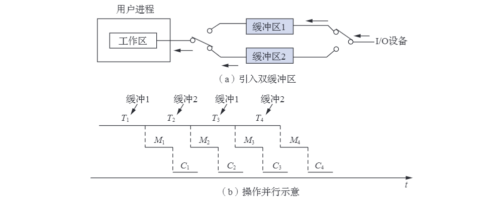

如果在实现两台机器之间的通信时仅为它们设置了单缓冲区，那么它们之间在任一时刻都只能实现单方向的数据传输。例如，只允许把数据从A机传送到B机，或者从B机传送到A机，而绝不允许双方同时向对方发送数据。为了实现双向数据传输，必须在两台机器中都设置两个缓冲区，一个用作发送缓冲区，另一个用作接收缓冲区。

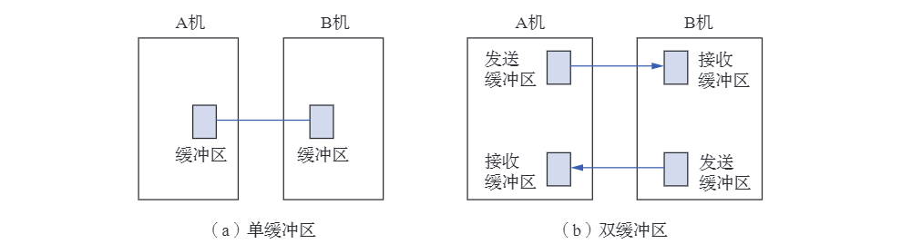

**环形缓冲区**

当输入与输出的速度基本匹配时，采用双缓冲区能获得较好的效果，可使生产者和消费者基本上实现并行操作。但若两者的速度相差甚远，则双缓冲区的效果不会太理想，不过可以随着缓冲区数量的增加而使情况有所改善。因此，又引入了多缓冲区机制，可将多个缓冲区组成环形缓冲区的形式。

在环形缓冲区中包含多个缓冲区，各缓冲区的大小相同。作为输入的多缓冲区可分为3种类型：用于装输入数据的空缓冲区R、已装满数据的缓冲区G、计算进程正在使用的现行工作缓冲区C。作为输入的缓冲区可设置3个指针：用于指示计算进程下次可用缓冲区G的指针Nextg，用于指示输入进程下次可用空缓冲区R的指针Nexti，以及用于指示计算进程正在使用的缓冲区C的指针Current。

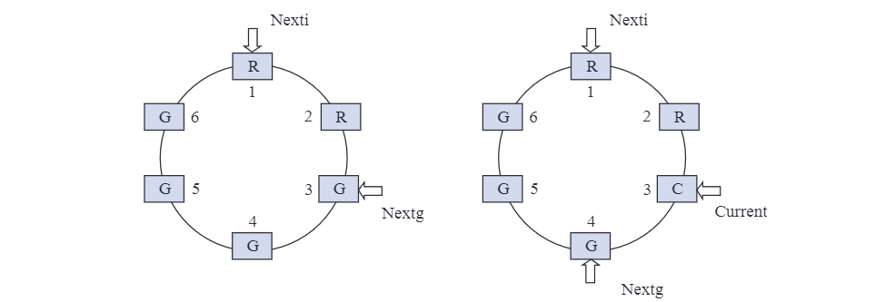

当计算进程要使用缓冲区中的数据时，可调用Getbuf过程，该过程将由指针Nextg所指示的缓冲区提供给进程使用，相应地，须把它改为现行工作缓冲区，并令Current指针指向该缓冲区的第一个单元，同时将Nextg移向下一个可用缓冲区G。类似地，每当输入进程要使用空缓冲区来装入数据时，也调用Getbuf过程，由该过程将指针Nexti所指示的缓冲区提供给输入进程使用，同时将Nexti指针移向下一个空缓冲区R。

当计算进程把C缓冲区中的数据提取完毕时，便调用Releasebuf过程，将缓冲区C释放。此时，把该缓冲区由当前(现行)工作缓冲区C改为空缓冲区R。类似地，当输入进程把缓冲区装满时，也应调用Releasebuf过程，将该缓冲区释放，并将其改为可用缓冲区G。

使用输入循环缓冲，可使输入进程和计算进程并行执行。相应地，指针Nexti和指针Nextg将不断地沿着顺时针方向移动，这样就可能出现下述两种情况。

Nexti指针追赶上Nextg指针，这意味着输入进程输入数据的速度大于计算进程处理数据的速度，已把全部可用的空缓冲区装满，再无缓冲区可用。此时，输入进程应阻塞，直到计算进程把某个缓冲区中的数据全部提取完，使之成为空缓冲区R，并调用Releasebuf过程将它释放后，才可将输入进程唤醒。这种情况被称为“系统受计算限制”。

Nextg指针追赶Nexti指针，这意味着输入数据的速度小于计算进程处理数据的速度，使装有输入数据的缓冲区都被抽空，再无装有数据的缓冲区供计算进程提取数据。这时，计算进程只能阻塞，直至输入进程又装满某个缓冲区，并调用Releasebuf过程将它释放后，才可将计算进程唤醒。这种情况被称为“系统受I/O限制”。

**缓冲池**(bufferpool)

前述缓冲区是专门为特定的生产者与消费者设置的，属于专用缓冲。当系统较大时，循环缓冲过多不仅要消耗大量的内存空间，而且缓冲区利用率不高。为了提高缓冲区的利用率，引入并广泛应用既可用于输入、又可用于输出的(公用)缓冲池，该池中设置了多个可供若干进程共享的缓冲区。缓冲池与缓冲区的区别在于：缓冲区仅是一组内存块的链表，而缓冲池则是包含了一个用于管理自身的数据结构和一组操作函数的管理机制，用于管理多个缓冲区。

缓冲池管理着多个缓冲区，每个缓冲区由用于标志和管理的缓冲首部以及用于存放数据的缓冲体两部分组成。缓冲首部一般包括缓冲区号、设备号、设备上的数据块号、同步信号量以及队列链接指针等。为了管理上的方便，一般将缓冲池中具有相同类型的缓冲区链接成一个队列，于是可形成3个队列。①空白缓冲队列emq：这是由空缓冲区所链成的队列，其队首指针F(emq)和队尾指针L(emq)分别指向该队列的首缓冲区和尾缓冲区。②输入队列inq：这是由装满输入数据的缓冲区所链成的队列，其队首指针F(inq)和队尾指针L(inq)分别指向输入队列的队首缓冲区和队尾缓冲区。③输出队列_outq_：这是由装满输出数据的缓冲区所链成的队列，其队首指针F(outq)和队尾指针L(outq)分别指向该队列的队首缓冲区和尾缓冲区。

除了上述3个队列外，还应具有4种工作缓冲区：用于收容输入数据的工作缓冲区、用于提取输入数据的工作缓冲区、用于收容输出数据的工作缓冲区以及用于提取输出数据的工作缓冲区。

缓冲池可以工作在如下4种工作方式下。

**收容输入**，输入进程可调用Getbuf(emq)过程，从空缓冲区队列emq的队首摘下一空缓冲区，并把它作为收容输入工作缓冲区hin。然后，把数据输入其中，装满后再调用Putbuf(inq，hin)过程，将它挂在输入队列inq上。

**提取输入**，计算进程可调用Getbuf(inq)过程，从输入队列inq的队首取得一缓冲区，并将它作为提取输入工作缓冲区sin，计算进程从中提取数据。计算进程用完该数据后，再调用Putbuf(emq，sin)过程，将它挂到空缓冲区队列emq上。

**收容输出**，计算进程可调用Getbuf(emq)过程，从空缓冲区队列emq的队首取得一空缓冲区，并将它作为收容输出工作缓冲区hout。当其中装满输出数据后，再调用Putbuf(outq，hout)过程，将它挂在输出队列outq末尾。

**提取输出**，输出进程可调用Getbuf(outq)过程，从输出队列的队首取得——装满输出数据的缓冲区，并将它作为提取输出工作缓冲区sout。在数据提取完后，再调用Putbuf(emq，sout)过程，将它挂在空缓冲区队列emq末尾。

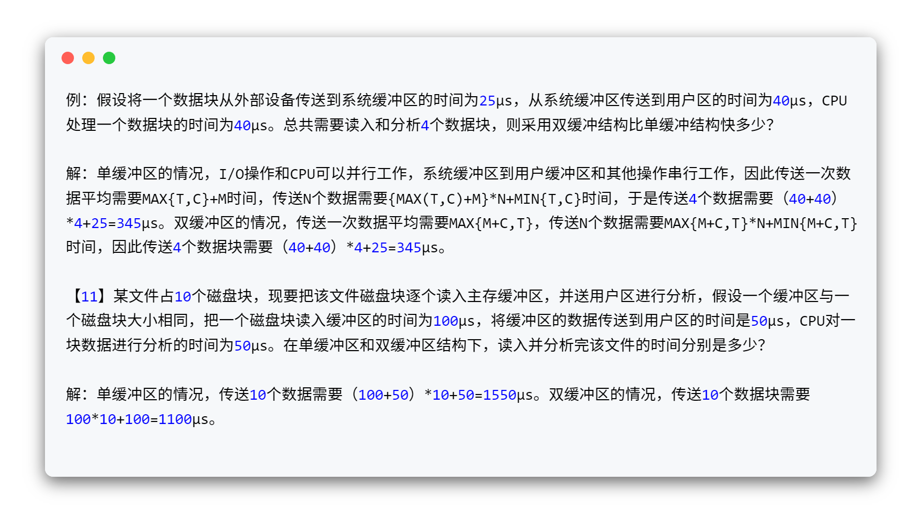

##### 差错控制/错误报告

在用户进程中，通常要对所调用的I/O库函数返回的信息如错误码进行处理，例如fopen（）函数的返回值为NULL时，表示无法打开指定文件。虽然很多错误与特定设备相关，必须由对应的设备驱动程序来处理，但是所有I/O操作在内核态执行时发生的错误信息，都是通过与设备无关的I/O软件返回给用户进程的，也就是说错误处理的框架是与设备无关的。

**编程错误，**由与设备无关的I/O软件检测出来并直接返回给用户进程，无须再进入更底层的I/O软件处理，例如，请求了某个不可能的I/O操作，写信息到一个输入设备或从一个输出设备读信息，指定了一个无效的缓冲区地址或者参数，指定了不存在的设备等。

**I/O操作错误**，由相应的设备驱动程序检测出来并处理，若驱动程序无法处理，则驱动程序将错误信息返回给与设备无关的I/O软件，再由与设备无关的I/O软件返回给用户进程，例如，写一个已被破坏的磁盘扇区，打印机缺纸，读一个已关闭的设备等。

##### 独占设备的分配与回收

对于独占设备，为了避免各进程对独占设备的争夺，必须由系统来统一分配此类设备，而不允许进程自行使用。每当进程需要使用某独占设备时，必须先提出申请。OS接到对设备的请求后，先对进程所请求的独占设备进行检查，看该设备是否空闲。若空闲，则把该设备分配给请求进程。否则，进程将被阻塞，并放入该设备的请求队列中等待。等到其他进程释放该设备后，如果该设备的请求队列中存在进程，则将队列中的第一个进程唤醒，该进程得到设备后继续运行；否则，将该设备的状态置为“空闲”，实现设备回收。

**数据结构**

**系统设备表(systemdevicetable，SDT)**是系统范围的数据结构，记录了系统中全部设备的情况，每个设备占一个表目。系统为每个通道设置了一张**通道控制表(channelcontroltable，CHCT)**，为每个控制都器设置一张**控制器控制表(controllercontroltable，COCT)**。

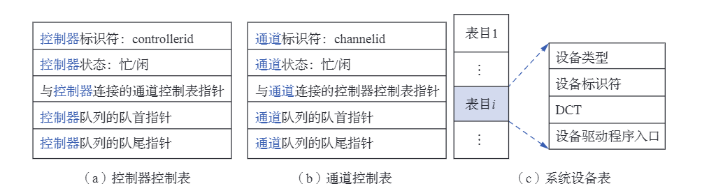

系统为每个设备配置了一张**设备控制表(devicecontroltable，DCT)。**凡因请求本设备而未得到满足的进程，应将其PCB按照一定的策略排成一个**设备请求队列**，其队首指针指向队首PCB。由于外部设备在传送数据时较易发生数据传送错误，因而在许多系统中规定了设备在工作中发生错误时应重复执行的次数，在重复执行时若能恢复正常传送则仍认为传送成功，仅当重复执行次数达到规定值而仍不成功时才认为传送失败。

当某进程释放某设备，且无其他进程请求该设备时，系统将该设备DCT中的设备状态改为空闲，即可实现设备回收。

分配应该考虑的问题如下：

**设备的固有属性。**对具有不同固有属性的设备应采取不同的分配策略，例如独占设备被分配给某进程后便被该进程独占，直至该进程完成或释放该设备；共享设备可将其同时分配给多个进程，但是要对进程访问该设备的次序进行合理调度；虚拟设备属于可共享设备，也可以将它同时分配给多个进程使用。

**设备分配算法。**针对设备分配，通常只采用FCFS算法和最高优先级优先算法，将进程排成一个设备请求队列，设备分配程序总会把设备首先分配给队首进程。

**设备分配中的安全性。**在**安全分配方式/阻塞IO**中，每当进程发出I/O请求后，便进入阻塞状态，此时不能再请求任何资源，也不保持任何资源，直到其I/O操作完成时才被唤醒。因此，这种分配方式摒弃了造成死锁的“请求和保持”条件，故设备分配是安全的，缺点是CPU与I/O设备顺序工作。在**不安全分配方式非阻塞IO**中，进程在发出I/O请求后仍继续运行，需要时又会发出第二个I/O请求、第三个I/O请求等，仅当进程所请求的设备已被另一进程占用时，才进入阻塞状态。该策略的优点是，一个进程可同时操作多个设备，这使进程能够迅速推进。其缺点是分配不安全，因为这种分配方式可能具备“请求和保持”条件，从而可能造成死锁。因此，在设各分配程序中，应对本次的设备分配是否会发生死锁进行安全性计算，仅当计算结果表明分配安全时，才进行设备分配。

**设备分配程序**

1）**分配设备**。首先根据I/O请求中的逻辑设备名查找SDT，系统首先会从SDT中找出第一个该类设备DCT。若该设备忙，则查找第二个该类设备的DCT，仅当所有该类设备都忙时，才把进程挂在该类设备的等待队列上。只要有一个该类设备可用，系统便会按照一定的算法计算本次设备分配的安全性。如果不会导致系统进入不安全状态，则将设备分配给请求进程。否则，仍将其PCB插入设备等待队列。

2）**分配控制器**。在系统把设备分配给请求I/O的进程后，再到其DCT中找出与该设备连接的控制器的COCT，从COCT的状态字段中可知该控制器是否正忙。若忙，则将请求I/O进程的PCB挂在该控制器的等待队列上。否则，将该控制器分配给进程。

3）**分配通道**。在该COCT中又可找到与该控制器连接的通道的CHCT。根据CHCT内的状态信息可知该通道是否正忙。若忙，则将请求I/O的进程挂在该通道的等待队列上；否则，将该通道分配给进程。只有在设备、控制器和通道三者都分配成功时，这次的设备分配才算成功。然后，便可启动该I/O设备进行数据传送。

##### 独立于设备的逻辑数据块

不同类型设备（如字符设备和块设备）的数据交换单位不同，读取和传输数据的速率也各不相同；同一类型的设备的数据交换单位的大小也可能有差异的，例如不同的磁盘扇区大小不同。与设备无关软件提供一个统一的抽象视图，以隐藏不同设备之间的差异，并向上层软件提供大小统一的逻辑数据块。例如，对于块设备，不管磁盘扇区和光盘扇区有多大，所有逻辑数据块的大小相同。高层I/O软件就只需要处理简化的抽象设备，从而简化了数据定位等处理。

##### 打开与关闭文件、系统调用的参数翻译

对设备或文件进行打开或关闭等I/O函数所对应的系统调用，并不涉及具体的I/O操作，只要直接对RAM中的一些数据结构进行修改即可，这部分工作也是由设备无关的软件来处理。

##### I/O调度

调度I/O操作是I/O系统提高计算机效率的一种方法，应用程序执行系统调用的顺序很少是最佳的，调度一组I/O请求意味着按照确定好的顺序来执行它们，这可以改善系统整体性能，可以在进程间公平共享设备访问，可以减少完成I/O调度所需的平均等待时间。假设磁臂位于磁盘开头，3个应用程序对这个磁盘执行阻塞读调用。应用程序1请求磁盘结束附近的块，应用程序2请求磁盘开始附件的块，而应用程序3则请求磁盘中间部分的块。OS按照2、3、1的顺序来处理应用程序，可以减少磁臂移动的距离。

OS开发人员通过为每个设备维护一个**请求等待队列**来实现其调度。当应用程序发出阻塞I/O的系统调用时，该请求会被添加到相应设备的队列中。I/O调度程序重新安排队列顺序，以便提高系统的总体效率和应用程序的平均响应时间，没有应用程序会得到特别差的访问；或者对那些延迟敏感的请求，可以给予比较优先的服务。例如，虚拟存储器子系统的请求可能优先于应用程序的请求。

#### 设备驱动/处理程序

##### 功能和特点

设备驱动程序是与设备相关的I/O软件部分，每个设备驱动程序只处理一种外设或一类紧密相关的外设，每个外设或每类外设都有一个设备控制器，其中包含各种I/O端口。设备驱动程序中包含许多I/O访问指令，通过执行设备驱动程序中的I/O访问指令，CPU可以访问设备控制器中的I/O端口，如向控制端口发送控制命令来启动外设，从状态端口读取状态来了解外设及外设控制器的状态，从数据端口中读取数据或向数据端口发送数据等，从而控制外设的I/O操作。

为了实现I/O系统的上层与设备控制器之间的通信，设备驱动程序应具有以下功能：接收由与设备无关的软件发来的命令（如read或write命令）和参数，并将命令中的抽象I/O要求转换为与设备相关的低层操作序列传送给设备控制器；检查用户I/O请求的合法性，了解I/O设备的工作状态，传递与I/O设备操作有关的参数，设置I/O设备的工作方式；发出I/O命令，如果I/O设备空闲则立即启动它，完成指定的I/O操作，如果I/O设备忙碌则将请求者的请求块挂在I/O设备队列上等待；及时响应由设备控制器发来的中断请求，并根据其中断类型，调用相应的中断处理程序进行处理。

设备驱动程序属于低级系统程序，它与一般的应用程序及系统程序之间有下述明显差异：设备驱动程序是实现在与设备无关的软件和设备控制器之间通信和转换的程序，它将抽象的I/O请求转换成具体的I/O操作后传送给设备控制器，又把设备控制器中所记录的设备状态和I/O操作的完成情况及时地反映给请求I/O的进程；设备驱动程序与设备控制器以及I/O设备的硬件特性紧密相关，对于不同类型的I/O设备，应配置不同的设备驱动程序，但可以为相同的多个I/O设备设置一个设备驱动程序；设备驱动程序与I/O设备所采用的I/O控制方式紧密相关，常用的I/O控制方式是中断驱动I/O方式和DMA方式；由于设备驱动程序与硬件紧密相关，因而其中的一部分必须用汇编语言书写，目前有很多设备驱动程序的基本部分都已固化在ROM中；设备驱动程序应允许可重入，一个正在运行的设备驱动程序常会在一次调用完成前被再次调用。

不同的OS中采用的设备处理方式并不完全相同：为每类设备设置一个进程，专门用于执行这类设备的I/O操作，适合较大的系统，例如为所有的交互式终端设置一个交互式终端进程，为同一类型的打印机设置一个打印进程；在整个系统中设置一个I/O进程，专门用于执行系统中各类设备的I/O操作，也可以设置一个输入进程和一个输出进程，分别处理系统中的输入操作和输出操作；不设置专门的设备处理进程，而只为各类设备设置相应的设备驱动程序，供用户或系统进程调用，这种方式目前用得较多。

##### 程序执行过程

设备驱动程序的主要任务是启动指定设备，完成上层软件指定的I/O工作。但在启动设备之前，应先完成必要的准备工作，如检测设备状态是否为“忙”等，在完成所有的准备工作后，才向设备控制器发送一条启动命令。

**1）将抽象要求转换为具体要求**

在操作系统中，只有设备驱动程序同时了解命令和设备控制器中的寄存器情况，用户及上层软件只能发出命令（抽象要求），驱动程序将这些命令转换为具体要求后才能传送给设备控制器，例如将抽象要求中的盘块号转换为磁盘的盘面号、磁道号及扇区号。

**2）校验服务请求**

设备驱动程序在启动I/O设备之前，必须先检查该用户的I/O请求是不是该设备能够执行的，例如用户试图请求从一台打印机读入数据就是一个非法请求。如果设备驱动程序能检查出这类错误，则认为此次I/O请求非法，它将向I/O系统报告I/O请求出错。I/O系统可以根据具体情况做出不同的决定，可以停止请求进程的运行，或者仅通知请求进程它的I/O请求有错，但仍然让它继续运行。

**3）检查设备的状态**

启动某个设备进行I/O操作，其前提条件应是该设备正处于就绪状态。设备驱动程序在启动设备之前，要先把状态寄存器中的内容读入CPU的某个寄存器中，通过测试寄存器中的不同位来了解设备的状态。例如，为了向某设备写入数据，此前应先检查状态寄存器中接收就绪的状态位，仅当它处于接收就绪状态时才能启动其设备控制器，否则只能等待。

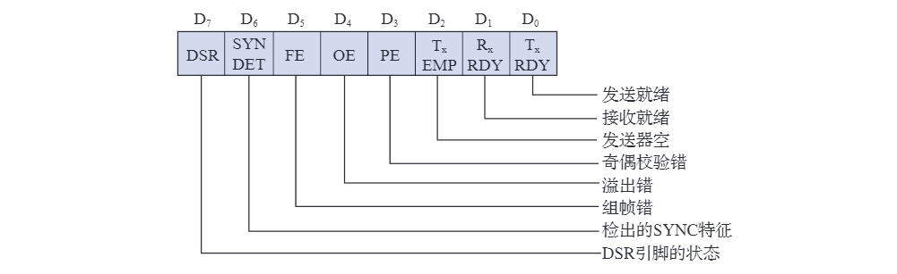

**4）传送必要的参数**

在确定设备处于接收（发送）就绪状态后，便可向设备控制器的相应寄存器传送数据以及同控制本次数据传送有关的参数。例如，在某种设备控制器中配置了两个控制寄存器，其中一个是命令寄存器，用于存放CPU发来的各种控制命令，以决定本次I/O操作是接收数据还是发送数据等；另一个是方式寄存器，用于存放本次传送数据的速率、发送的字符长度等数据。如果利用RS232接口进行异步通信，则在启动该接口之前，应先按通信规程设定波特率、奇偶校验方式、停止位数目及数据字节长度等参数。对于较为复杂的块设备，除了必须向其设备控制器发出启动命令外，还须传送更多的参数。

**5）启动I/O设备**

在完成上述各项准备工作后，驱动程序便可向设备控制器中的命令寄存器传送相应的控制命令。对于字符设备，若发出的是写命令，则设备驱动程序会把一个字节(或字)传送给设备控制器；若发出的是读命令，则设备驱动程序会等待接收数据，并通过读入设备控制器的状态寄存器中状态字的方法来确定数据是否到达。

在多道程序系统中，设备驱动程序一旦发出I/O命令、启动一个I/O操作后，便会把控制权返回给I/O系统，把自己阻塞起来，直到中断到来时再被唤醒，具体的I/O操作是在设备控制器的控制下进行的，此时CPU与I/O设备的并行操作。

##### 驱动程序接口

计算机中有各种各样的设备，每种设备都有自己的设备驱动程序，因而设备驱动程序的代码在内核中占比较大。另外，设备驱动程序可由设备生产厂家提供，也可由程序爱好者编制，有必要对设备驱动程序与外界的接口进行严格的定义与管理。

**设备驱动程序与OS内核的接口**。为了实现设备无关性，在UNIX和Linux系统中，设备被作为特别文件处理，用户的I/O请求、对命令的合法性检查以及参数处理任务等，都在文件系统中统一处理。只在需要各种设备执行具体操作时，系统才会通过相应的数据结构(如UNIX系统的块设备转接表、字符设备转接表等)转入不同的设备驱动程序。

**设备驱动程序与系统引导的接口**，利用设备驱动程序对设备进行初始化，初始化内容包括为管理设备而分配的数据结构、设备的请求队列等。

**设备驱动程序与设备的接口**，与具体设备密切相关，描述了设备驱动程序如何与设备交互作用。

##### 驱动程序组成

**设备驱动程序的注册与注销**。设备驱动程序可在系统初启时初始化，也可在需要时动态加载。初始化的一项重要工作就是设备登记(或注册)，即把设备驱动程序的地址登记在设备表的相应表项中。经登记后，只要知道设备的主设备号，就可以找到该类设备的各种驱动函数。这样，在设备驱动程序上的其他内核模块中就可以“看见”这个模块了。当关闭设备时，要从内核中注销设备驱动程序。

**设备的打开与释放**。打开设备需要完成以下工作：增加设备的使用计数；检查设备的状态，以及是否存在设备尚未准备好或者类似的硬件问题；若是首次打开，则初始化设备；识别次设备号；根据需要更新相关的数据结构。释放设备又称关闭设备，是打开设备的逆过程，主要需要完成以下工作：释放打开设备时所分配的内存；若是最后一个释放，则关闭设备；减少设备的使用计数。

**设备的读/写操作**。一般来说，设备驱动程序接受来自上层与设备无关软件的抽象请求，并使该请求得以执行。如果请求到来时设备驱动程序是空闲的，它就会立即执行该请求；若正忙于处理前面的请求，则把新请求放入未完成队列中，并尽快处理。设备驱动程序确定发给设备控制器的命令后，会把它们写入设备控制器的设备寄存器中。

**设备的控制操作**。除了需要执行读/写操作外，有时还需要控制设备，该控制主要用于对特殊文件的低层参数进行操作。如果对象是设备文件且有相应的I/O控制函数，则转到该函数，依据上层模块提供的I/O控制命令读取并设置有关的参数。

**设备的中断与轮询**。如果设备支持中断，则按照中断驱动I/O方式进行处理，即设备驱动程序发出命令之后，可采取下述两种方式中的一种来处理。在很多情况下，设备驱动程序等待设备控制器完成某些工作时它会阻塞自己，直至出现中断对它解除阻塞。在另一些情况下，操作没有延迟就完成了，此时设备驱动程序不必阻塞。例如，在终端上的滚屏就是把一些字节写入设备控制器的寄存器，速度很快，整个动作几微秒内就完成了。上述操作完成后，必须检查是否有错。如果一切正常，设备驱动程序就会把数据结构传到与设备无关的软件。最后，返回某些出错状态信息，向调用者报告。如果有排队请求，就从中选出一个，启动它并执行。如果没有排队请求，则该设备驱动程序阻塞，等待后面请求的到来。对于不支持中断的设备，读/写时需要轮询设备状态，以决定是否继续进行数据传送。例如，打印机驱动程序在默认情况下会轮询打印机的状态。

##### 程序实现方式

根据设备所采用的I/O控制方式的不同，设备驱动程序的实现方式也不同。若采用程序直接控制I/O方式，那么设备驱动程序的执行与外设的I/O操作完全串行，驱动程序一直等到全部完成I/O请求后结束。驱动程序执行完成后，返回到与设备无关的I/O软件层，最后再返回到用户进程。这种情况下，请求I/O的用户进程在I/O过程中不会被阻塞，内核空间的I/O软件一直代表用户进程在内核态进行I/O处理。

若采用中断控制I/O方式，则设备驱动程序启动第一次I/O操作后，将调用处理器调度程序来调出其他进程执行，而请求I/O的用户进程被阻塞。在CPU执行其他进程的同时，外设进行I/O操作，此时CPU和外设并行工作。当外设完成I/O任务时，再向CPU提出中断请求，CPU检测到中断请求后，会暂停正在执行的其他进程的执行，转到中断服务程序去执行，以启动下一次I/O操作。

若采用DMA方式，驱动程序对DMA控制器进行初始化后，便发送“启动DMA传送”命令，使设备控制器控制外设开始进行I/O操作，发送完启动命令后，将执行处理器调度程序，使CPU转去其他进程执行，而使请求I/O的用户进程阻塞。DMA控制器完成所有I/O任务后，向CPU发送一个“DMA完成”中断请求信号。CPU在中断服务程序中解除用户进程的阻塞状态，然后中断返回。

中断控制和DMA两种I/O方式下，在执行设备驱动程序过程中，都会进行处理器调度，以使请求I/O的当前用户进程被阻塞；也都会产生中断请求信号，前者由设备在每完成一个数据的I/O后产生中断请求，后者由DMA控制器在完成整个数据块的I/O后产生中断请求。中断请求是由于执行了设备驱动程序而产生的，外设完成驱动程序要求的I/O操作后，设备控制器或DMA控制器会通过中断控制器向CPU发出中断请求，从而调出中断服务程序执行。

#### 中断服务程序

见程序中断方式。

### 考研真题

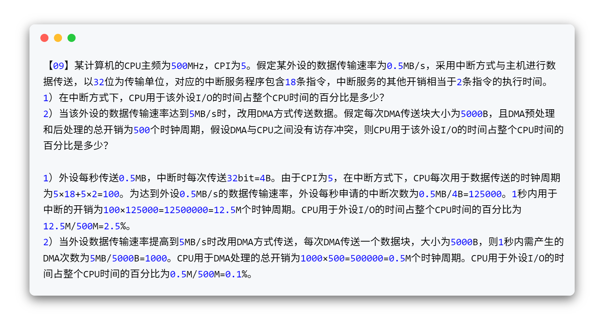
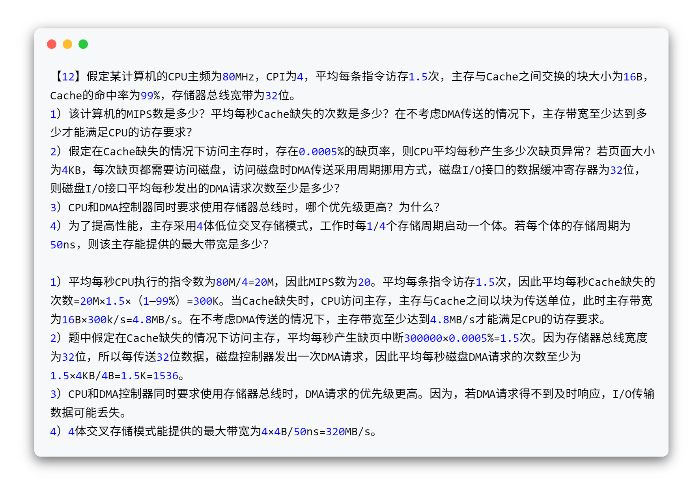
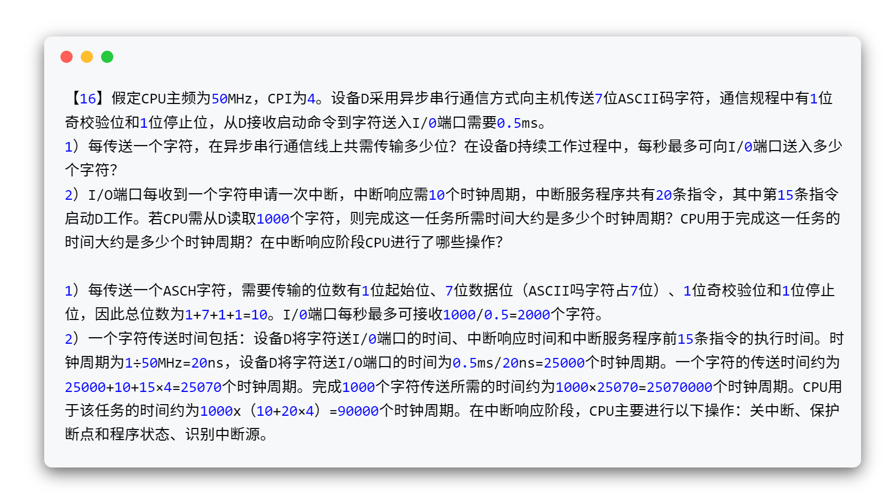
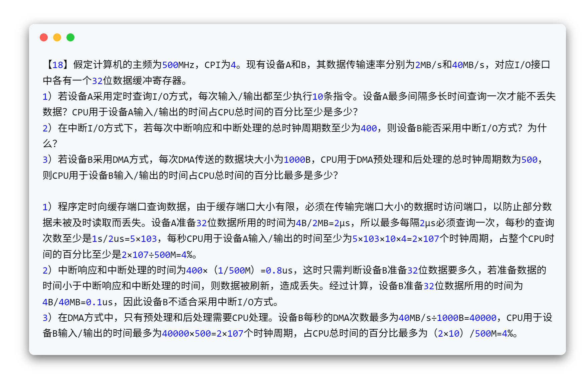
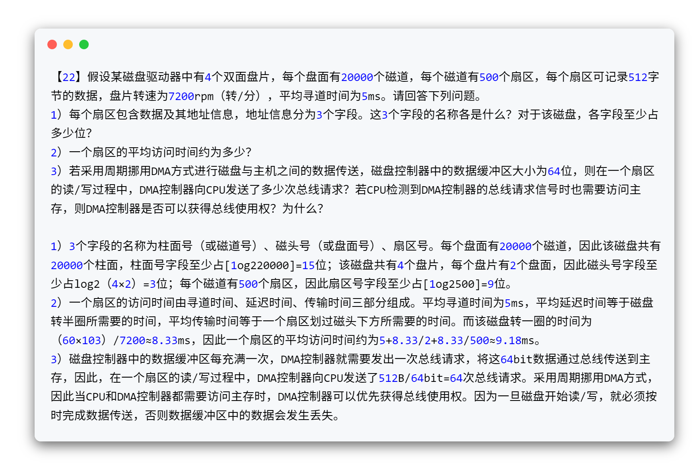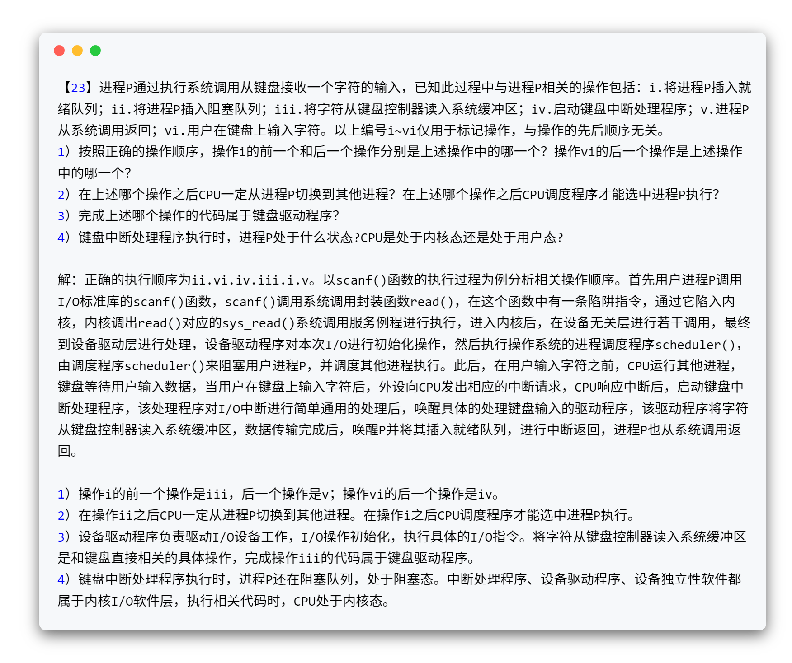

### 参考资料

[1]袁春风.计算机组成与系统结构[M].北京：清华大学出版社，2015.

[2]唐朔飞.计算机组成原理[M].北京：高等教育出版社，2008.

[3]全国考研计算机大纲配套教材专家委员会.全国硕士研究生入学统一考试计算机专业基础综合考试大纲解析[M].北京：高等教育出版社，2014.

[4]汤小丹，梁红兵，哲凤屏，等.计算机操作系统[M].4版.西安：西安电子科技大学出版社，2014.

[5]王道计组

[6]王道操作系统

