## 基本概念


**进程同步**，指异步环境下因直接制约而互相发送消息、互相合作、互相等待的一组并发进程，按一定的速度执行的过程，具有同步关系的一组并发进程称为**协作进程**。互相协作的进程或能直接共享逻辑地址空间（代码和数据），或能通过文件或消息来共享数据。前者可以通过轻量级进程或线程来实现，后者的并发访问可能会产生数据的不一致问题。**进程同步机制**负责协调并发执行的多个协作进程的执行次序，使它们能按照一定的规则或时序共享系统资源，从而使程序的执行具有可再现性。


协作进程间的制约关系可以统称为进程同步，根据制约形式的不同，其又可细分为同步关系和互斥关系，互斥是同步的一个特例。同步强调的是保证进程之间操作的先后次序的约束，而互斥强调的是对共享资源的互斥访问。


**间接相互制约/互斥关系**，是指多个程序在并发执行时，由于共享如CPU、I/O设备等系统资源而形成的相互制约的关系。对于系统中的这类资源，必须由系统实施统一分配，即用户在要使用这类资源之前应先提出申请，而不能直接使用。


**直接相互制约/同步关系**，是指某些应用程序为了完成某项任务，会建立两个或多个进程，这些进程会为了完成同一任务而相互合作而形成的关系。例如，有两个相互合作的进程——输入进程A和计算进程B，它们共享一个缓冲区。输入进程A通过缓冲区向计算进程B提供数据。计算进程B从缓冲区中读取数据，并对数据进行处理。但在该缓冲区为空时，计算进程B会因不能获得所需数据而被阻塞。一旦输入进程A把数据输入缓冲区，计算进程B便会被唤醒；反之，当缓冲区已满时，输入进程A会因不能再向缓冲区投放数据而被阻塞，当计算进程B将缓冲区中的数据读取走后便可唤醒输入进程A。


在多道程序环境下，由于存在着上述两类相互制约关系，进程在运行过程中能否获得处理机运行以及以怎样的速度运行，这些都不能由进程自身所控制，此即进程的**异步性**。进程的异步性会使进程对共享变量或数据结构等资源产生不正确的访问次序，从而造成进程每次执行的结果均不一致。这种差错往往与时间有关，故称之为“与时间有关的错误”。为了杜绝这种差错，必须对进程的执行次序进行协调，以保证各进程能按“序”执行。


**临界资源（critical resource）**需要互斥访问，既可以是硬件资源，如打印机、磁带机等，也可以是软件资源，如共享变量、文件等。


**生产者-消费者（producer-consumer）问题**是一个著名的进程同步问题。


在每个进程中访问临界资源的那段代码称为临界区（critical section）。显然，若能保证各进程互斥地进入自己的临界区，便可实现各进程对临界资源的互斥访问。为此，每个进程在进入临界区之前，应先对欲访问的临界资源进行检查，看它是否正在被访问。如果此刻该临界资源未被访问，进程便可进入临界区对该资源进行访问，并将访问标志设置为“正被访问”；如果此刻该临界资源正在被某进程访问，则本进程不能进入临界区。因此，必须在临界区前面增加一段用于进行上述检查的代码，把这段代码称为进入区（entry section）。在临界区后面也要相应地加上一段被称为退出区（exit section）的代码，用于将临界区正被访问的标志恢复为未被访问的标志。进程中除上述进入区、临界区及退出区之外的其他部分的代码，在这里都被称为剩余区。这样，即可将一个访问临界资源的循环进程描述如下：

1     while(TURE)

2        {

3       进入区

4       临界区 ；

5       退出区

6       剩余区 ；

7      }


解决临界区问题的同步机制都应遵循下述4条准则。

（1）空闲让进。当无进程处于临界区时，表明临界资源处于空闲状态，应允许1个请求进

入临界区的进程立即进入自己的临界区，以有效地利用临界资源。

（2）忙则等待。当已有进程进入临界区时，表明临界资源正在被访问，因而其他试图进入

临界区的进程必须等待，以保证对临界资源的互斥访问。

（3）有限等待。对于要求访问临界资源的进程，应保证其在有限时间内能进入自己的临界 

区，以免陷入“死等”状态。

（4）让权等待（原则上应遵循，但非必须）。当进程不能进入自己的临界区时，应立即释

放处理机，以免进程陷入“忙等”状态。


## 软件同步机制

### 单标志法

### 双标志先检查法


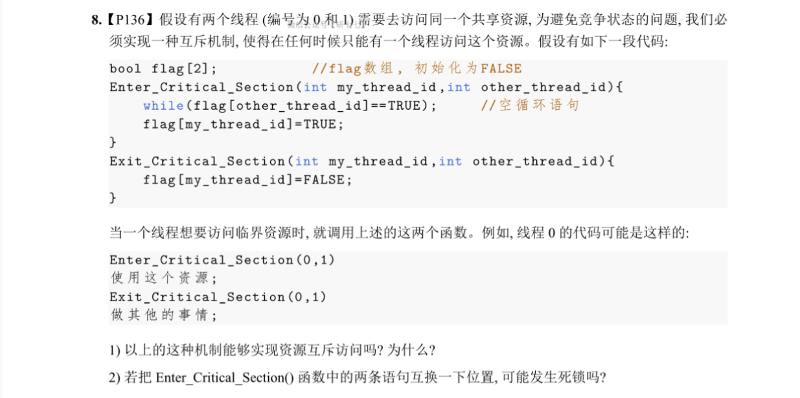

### 双标志后检查法

### Peterson算法


适用于两个进程交替执行临界区的情况。设两个进程分别为P0和P1，为了

方便，当使用Pi时，用Pj表示另一个进程，即j==i-1。

Peterson解决方案要求两个进程共享两个变量：

int turn;

boolean flag[2];

变量turn表示哪个进程可以进入临界区，即如果turn==i，那么允许进程Pi进入临界区内执

行。数组flag[]表示哪个进程准备进入临界区。例如，如果flag[i]为TRUE，则表示进程Pi准备进

入临界区。下面所示为Peterson解决方案中进程Pi的结构。

1     do {

2         f lag[i] = TRUE;

3         turn = j;

4         while (flag[ j] && turn == j);

5         临界区 ;

6         flag[i] = FALSE;

7         剩余区 ;

8     } while (TRUE);

为了进入临界区，进程Pi先设置f lag[i]的值为TRUE，并设置turn的值为j，这表示如果另一

个进程希望进入临界区，那就让它进入，并令当前进程处于“忙等”状态。如果两个进程同时

试图进入临界区，那么turn的值会几乎同时被设置成i或j，但只有一个赋值语句的结果会被保 

留。因此，最终将由turn的值来决定哪个进程被允许进入临界区执行。

若要证明Peterson解决方案是正确的，则须证明该方案满足解决临界区问题的3个准则：忙则等待、空闲让进、有限等待。需要说明的是，尽管在4.1.2小节中提到了解决临界区问题的同

步机制需要遵循4个准则，但此处只须满足前3个。这是因为第4个准则“让权等待”属于较高要

求，在早期的解决方案中均未对此做出要求，因为这样的做法虽会影响系统效率，但不影响临

界区问题的解决。

证明满足“忙则等待”准则，即须保证进程对临界资源进行互斥访问。当一个进程Pi已在其

临界区中进行操作，而另一个进程Pj希望进入临界区时，flag[i]=TRUE，turn=i，flag[ j]=TRUE， 

这意味着进程Pj中while语句的判断条件始终为真，进程处于“忙等”状态而无法进入临界区。

由此说明满足“忙则等待”准则。

证明满足“空闲让进”和“有限等待”准则时，假设临界区目前没有进程在执行，有两种

情况：第一种情况是只有一个进程希望进入临界区，另一个进程没有要求进入；第二种情况是两

个进程都希望进入临界区。①针对第一种情况，假设P0希望进入临界区，P1没有提出要求，此时

flag[0]=TRUE，flag[1]=FALSE，turn=1，因此P0中while语句的判断条件为FALSE，P0能够进入临界

区执行。②针对第二种情况，如果两个进程都希望进入临界区，那么flag[0]=flag[1]=TRUE，这就

意味着P0和P1进程不可能同时执行while语句，因为turn的值只可能取0或1，不可能同时取两个值。

因此，这两个进程不可能同时进入临界区，而只有一个进程可以进入其临界区，另一个进程将在

进入临界区的进程进入一次临界区后进入，满足了“有限等待”的准则。


## 硬件同步机制


虽然利用软件方法可以解决各进程互斥进入临界区的问题，但有一定难度，并且存在很大

的局限性，因而现在已很少采用它。目前许多计算机已提供了一些特殊的硬件指令，允许对一

个字中的内容进行检测和修正或是对两个字的内容进行交换等。因此，可利用这些特殊的指令

来解决临界区问题。


实际上，在对临界区进行管理时，可以将标志看作一个锁，“锁开”进入，“锁关”等

待，初始时锁是打开的。每个要进入临界区的进程，必须先对锁进行测试，当锁未开时，则

必须等待，直至锁被打开。当锁打开时，则应立即把其锁上，以阻止其他进程进入临界区。显

然，为防止多个进程同时测试到“锁开”，测试和关锁操作必须是连续的，不允许分开进行。


### 关中断


关中断是实现互斥最简单的方法之一。在进入锁测试之前，关闭中断，直到完成锁测试并上锁之后，才能打开中断。这样，进程在临界区执行期间，计算机系统不响应中断，从而不会引发调度，也就不会发生进程或线程切换。由此，保证了对锁的测试和关锁操作的连续性和完整性，进而有效地保证了互斥。


关中断的方法存在着许多缺点：①滥用关中断权力可能导致严重后果，对内核来说,在它执行更新变量的几条指令期间,关中断是很方便的,但将关中断的权限交给用户则很不明智,若一个进程关中断后不再开中断,则系统可能因此终止。②关中断时间过长会影响系统效率，进而会限制CPU交叉执行程序的能力；③关中断方法不适用于多CPU系统，因为在一个CPU上进行关中断并不能防止进程在其他CPU上执行相同的临界区代码。


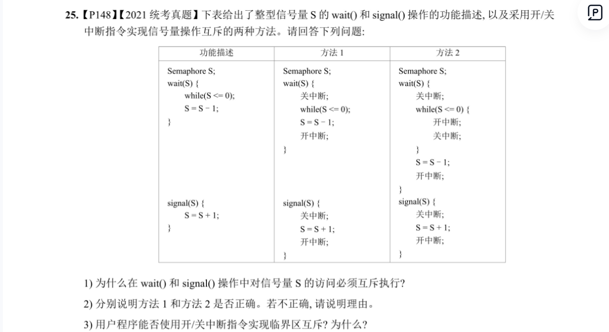

### TS指令

这是借助硬件指令——（Test-and-Set，测试并建立）来实现互斥的一种方法。在许多计算机

中都提供了这种TS指令，其一般性描述如下：

1     boolean TS（boolean *lock） {

2         boolean old ；

3         old = *lock ；

4         *lock = TRUE ；

5         return old;

6     }

这条指令可以被看作一个函数，其执行过程是不可分割的，即一条原语。其中，lock有两

种状态：当lock=FALSE时，表示该资源空闲；当lock=TRUE时，表示该资源正在被使用。

用TS指令管理临界区时，须为每个临界资源设置一个布尔变量lock，由于变量lock代表了该

资源的状态，可把它看作一把锁。lock的初值为FALSE，表示该临界资源空闲。进程在进入临

界区之前，首先用TS指令测试lock，如果其值为FALSE，则表示没有进程在临界区内，可以进

入，并将TRUE值赋予lock，这等效于关闭了临界区，使任何进程都不能进入临界区，否则必须

循环测试直到TS（&lock）为TRUE。利用TS指令实现互斥的循环进程结构可描述为：

1     do {

2        …

3        while TS（&lock）；          /* do skip */     

4        critical section ；

5        lock ：=FALSE ；

6        remainder section;

7     } while（TRUE）；


### swap指令/XCHG指令


swap指令被称为对换指令，在Intel 80x86中又被称为XCHG指令，用于交换两个字的内容。

其处理过程描述如下：

1     void swap（boolean *a, boolean *b）{

2          boolean temp;

3          temp = *a;

4          *a = *b;

5          *b = temp;

6     }

用对换指令可以简单有效地实现互斥，方法是为每个临界资源设置一个全局的布尔变量

lock，其初值为FALSE，在每个进程中再设置一个局部的布尔变量key，使用swap指令与lock进

行数值交换，以此来循环判断lock的取值。只有当key为FALSE时，进程才可以进行临界区操

作。利用swap指令实现进程互斥的循环过程描述如下：

1     do { 

2       key=TRUE ；

3       do {

4          swap（&lock，&key）；

5       } while (key!=FALSE);

6       临界区操作 ；

7       lock =FALSE ；

8       …

9     }  while (TRUE) ；

利用上述硬件指令能有效地实现进程互斥。需要说明的是，当临界资源被访问时，其他访

问进程必须不断地进行测试，即处于一种忙等状态，这不符合“让权等待”的原则，因而会造

成处理机时间的浪费，同时也很难将它们用于解决复杂的进程同步问题。


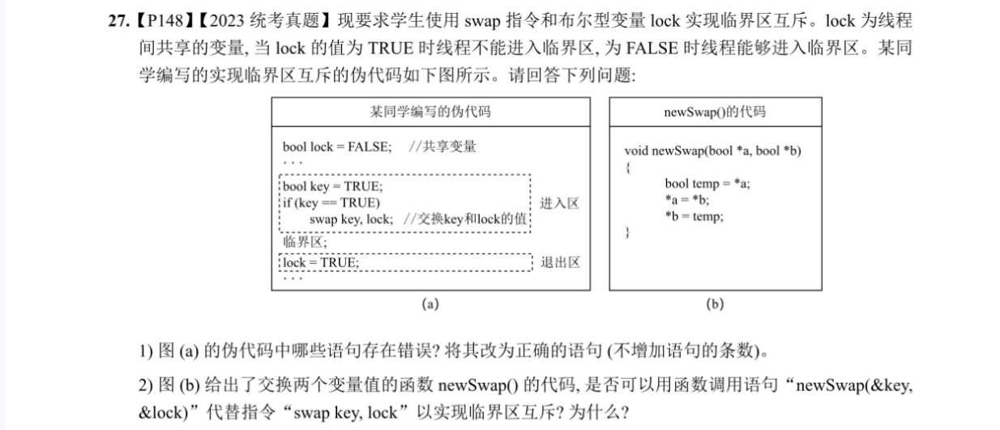

## 信号量机制

信号灯是人类社会中应用于交通管理等领域的一种设备，人们可以利用

信号灯的状态（颜色）来规范相关活动，如十字路口的交通管理等。OS中的

信号量机制类似于信号灯，起着规范进程运行的作用。

1965年，荷兰学者迪杰斯特拉最初提出了信号量（semaphores）机制，其是一种卓有成效

的进程同步工具。在长期且广泛的应用中，信号量机制又得到了很大的发展，它从整型信号量

经记录型信号量、AND型信号量，最终发展为信号量集。现在，信号量机制已被广泛应用于单

处理机和多处理机系统以及计算机网络中。

4.4.1  信号量机制介绍

1．整型信号量

最初由迪杰斯特拉把整型信号量定义为一个用于表示资源数目的整型量S，它与一般整

型量不同，除初始化外，仅能通过两个标准的原子操作(atomic operation)来访问，即wait(S)和

signal(S)操作。很长的一段时间以来，这两个操作一直被分别称为P操作和V操作。wait(S)和

signal(S)操作可描述为：

1     wait(S){

2       while (S<=0) ;   /* do no-op */

3       S-- ；

4     }

5     signal(S){

6       S++ ；

7     }

wait(S)和signal(S)是两个原子操作，因此，它们在执行时是不可中断的。亦即，当一个进程

在修改某信号量时，没有其他进程可同时对该信号量进行修改。此外，在wait(S)操作中，对S值

进行测试和做S:=S-1操作时都不可中断。

2．记录型信号量

整型信号量机制中的wait(S)操作，只要信号量S＜=0，就会不断地进行测试。因此，该机制

并未遵循“让权等待”准则，而是使进程处于“忙等”状态。记录型信号量机制，是一种不存

在“忙等”现象的进程同步机制。但在采取了“让权等待”策略后，又会出现多个进程等待访

问同一临界资源的情况。为此，在信号量机制中，除了需要一个用于代表资源数目的整型变量

value外，还应增加一个进程链表指针list，用于链接上述所有等待进程。记录型信号量是由于它

采用了记录型的数据结构而得名的。它所包含的上述两个数据项可描述为：

1     typedef struct {

2         int value;

3         struct process_control_block *list;

4     } semaphore;

相应地，wait(S)和signal(S)操作可描述为：

1     wait(semaphore *S) {

2           S->value--;

3           if (S->value<0) block(S->list);

4     }

5     signal(semaphore *S){

6           S->value++ ；

7           if (S->value<=0) wakeup(S->list);

8     }

在记录型信号量机制中，S->value的初值表示系统中某类资源的数目，因而又被称为资源

信号量，对它进行的每次wait(S)操作，意味着进程请求一个单位的该类资源，这会使系统中可

供分配的该类资源数减少一个，因此描述为S->value--；当S.value＜0时，表示该类资源已分

配完毕，因此进程应调用block原语，进行自我阻塞，放弃处理机，并将该进程插入信号量链表

S->list中。可见，该机制遵循了“让权等待”准则。此时S->value的绝对值表示在该信号量链表

中已阻塞进程的数目。对信号量的每次signal(S)操作，表示执行进程释放一个单位的资源，这会

使系统中可供分配的该类资源数增加一个，故S->value++操作表示资源数目加1。若加1后仍是

S->value＜=0，则表示在该信号量链表中仍有等待该资源的进程被阻塞，故还应调用wakeup原

语以将S->list链表中的第一个等待进程唤醒。如果S->value的初值为1，则表示只允许一个进程

访问临界资源，此时的信号量会转化为互斥信号量，用于进程互斥。

3．AND 型信号量

前面所述的进程互斥问题，针对的是多个并发进程仅共享一个临界资源的情况。在有些应

用场合，一个进程往往需要获得两个或更多的共享资源后方能执行其任务。假定现有进程A和进

程B，它们都要求访问共享数据D和E，当然，共享数据都应作为临界资源。为此，可为这两个

数据分别设置用于互斥的信号量Dmutex和Emutex，并令它们的初值都为1。在两个进程中都要

相应地包含两个针对Dmutex和Emutex的操作，如下所示。

1     process A:    process B:

2     wait(Dmutex) ；  wait(Emutex) ；

3     wait(Emutex) ；  wait(Dmutex) ；

令进程A和进程B按下述次序交替执行wait(S)操作。

1     process A: wait(Dmutex) ； 于是 Dmutex=0。

2     process B: wait(Emutex) ； 于是 Emutex=0。

3     process A: wait(Emutex) ； 于是 Emutex=-1，A 阻塞。

4     process B: wait(Dmutex) ； 于是 Dmutex=-1，B 阻塞。

最后，进程A和进程B处于僵持状态。在无外力作用下，两者都将无法从僵持状态中解脱出

来。我们称此时的进程A和进程B已进入死锁状态。显然，当进程同时要求的共享资源越多时，

发生进程死锁的可能性就越大。

AND型信号量机制的基本思想是：将进程在整个运行过程中需要的所有资源，一次性全部

分配给进程，待进程使用完后再一起释放。只要尚有一个资源未能分配给进程，其他所有可能

为之分配的资源，也不分配给它。亦即，对若干个临界资源的分配，采取原子操作方式：要么

把它所请求的资源全部分配给它，要么一个也不分配。由死锁理论可知，这样可以避免上述死

锁情况的发生。为此，在wait(S)操作中增加了一个“AND”条件，故称之为AND同步，或同时

wait(S)操作，即Swait(simultaneous wait)，其定义如下：

1     Swait(S1，S2，…，Sn){

2          while (TRUE) {

3           if (S1>=1 && … && Sn>=1) {

4                for (i =1; i<=n; i++) Si--; ；

5                break;

6           }

7           else  {

8                place the process in the waiting queue associated with the first 

9                Si found with Si<1，and set the program count of this process to 

10                the beginning of Swait operation

11           }

12          }

13     }

14     Ssignal(S1，S2，…，Sn){

15         while (TRUE) {

16              for (i=1; i<=n; i++) {

17                              Si++ ；

18                              Remove all the process waiting in the queue associated with Si 	  

19                              into the ready queue.

20              }

21         }

22     }

4．信号量集

在前述记录型信号量机制中，wait(S)或signal(S)操作仅能对信号量施以加1或减1操作，这意

味着每次只能对某类临界资源进行一个单位的申请或释放。当一次需要N个单位时，便要进行N

次wait(S)操作，这显然是低效的，甚至会增加死锁的概率。此外，在有些情况下，为确保系统

的安全性，当所申请的资源数量低于某一下限值时，还必须进行管制，不予以分配。因此，当

进程申请某类临界资源时，在每次分配之前，都必须测试资源的数量，判断其是否大于可分配

的下限值，进而决定是否予以分配。

基于上述两点，可以对AND信号量机制加以扩充，即针对进程所申请的所有资源以及每类

资源不同的需求量，在一次wait(S)或signal(S)操作中完成它们的申请或释放。进程对信号量Si的

测试值不再是1，而是该资源的分配下限值ti，即要求Si＞=ti，否则不予分配。一旦允许分配，则

基于进程对该资源的需求值di（表示资源占用量）进行Si:=Si-di操作，而不是简单的Si=Si-1。由

此可以形成一般化的“信号量集”机制。对应的Swait()和Ssignal()格式为：

Swait(S1，t1，d1 ；… ；Sn，tn，dn) ；

Ssignal(S1，d1 ；… ；Sn，dn) ；

119

第

4

章 

进

程

同

步

一般化的“信号量集”还有下列3种特殊情况。

（1）Swait(S, d, d)。此时在信号量集中只有一个信号量S，但允许它每次申请d个资源，当

现有资源数少于d时，不予分配。

（2）Swait(S, 1, 1)。此时的信号量集已蜕化为一般的记录型信号量（S＞1时）或互斥信号

量(S=1时)。

（3）Swait(S, 1, 0)。这是一种特殊且很有用的信号量操作。当S＞=1时，允许多个进程

进入某个特定的临界区；当S=0时，将阻止任何进程进入特定区。换言之，它相当于一个可控

开关。

4.4.2  信号量的应用

1．利用信号量实现进程互斥

为使多个进程能互斥地访问某临界资源，只须为该资源设置一个互斥型信号量mutex，并设

其初值为1，然后将各进程访问该资源的临界区置于wait(mutex)和signal(mutex)操作之间即可。

这样，每个欲访问该临界资源的进程，在进入临界区之前，都要先对mutex执行wait操作。若该

资源此刻未被访问，则本次wait操作必然成功，进程便可进入自己的临界区，这时若再有其他进

程也欲进入自己的临界区，则由于对mutex执行wait操作定会失败，因而该进程阻塞，从而保证

了该临界资源能被互斥地访问。当访问临界资源的进程退出临界区后，又应对mutex执行signal

操作，以便释放该临界资源。利用信号量实现两个进程互斥的描述如下。

（1）设mutex为互斥型信号量，其初值为1，取值范围为（-1,0,1）。当mutex=1时，表示两

个进程皆未进入需要互斥访问的临界区；当mutex=0时，表示有一个进程进入临界区运行，另一

个必须等待，挂入阻塞队列；当mutex=-1时，表示有一个进程正在临界区运行，而另一个进程

因等待而阻塞在信号量队列中，需要被当前已在临界区运行的进程在退出时唤醒。

（2）代码描述：

1    semaphore mutex=1;

2         PA( ) {                                PB ( ) {

3          while（1） {                      while（1） {

4             wait(mutex) ；                            wait(mutex) ；

5             临界区 ；                                临界区 ；

6             signal(mutex) ；                           signal(mutex) ；

7                剩余区 ；                                剩余区 ；

8          }                                      }

9         }                                     }

在利用信号量机制实现进程互斥时应注意，wait(mutex)和signal(mutex)必须成对出现。缺少

wait(mutex)将会导致系统混乱，无法保证对临界资源的互斥访问；缺少signal(mutex)将会导致临

界资源永远不被释放，从而使因等待该资源而阻塞的进程不能被唤醒。

2．利用信号量实现进程同步

协作进程间除了互斥地访问临界资源外，还需要相互制约和传递信息，以同步它们之间的

运行，利用信号量同样可以达到这一目的。下面举一个简单的例子来说明同步型信号量的使用

方法。

120

计

算

机

操

作

系

统 

（

慕

课

版

）

假设进程P1和P2中有两段代码C1和C2，若要强制C1先于C2执行，则须在C2前添加

wait(S)，在C1后添加signal(S)。需要说明的是，信号量S的初值应该被设置为0。这样，只有P1

在执行完C1后，才能执行signal(S)以把S的值设置为1。这时，P2执行wait(S)才能申请到信号量

S，并执行C2。如果P1的C1没有提前执行，则信号量S的值为0，P2执行wait(S)时会因申请不到

信号量S而阻塞。

（1）设S为同步型信号量，其初值为0，取值范围为（-1,0,1）。当S=0时，表示C1还未执

行，C2也未执行；当S=1时，表示C1已经执行，C2可以执行；当S=-1时，表示C2想执行，但由

于C1尚未执行，C2不能执行，进程P2处于阻塞状态。

（2）代码描述：

1    semaphore S=0;

2          P1( ) {                       P2( ) {

3           while（1） {               while（1） {

4           C1                               wait(S) ；

5         signal(S) ；                         C2 ；

6              …                               …         

7           }                              }

8          }                           }

同步型信号量的使用通常比互斥型信号量的使用要复杂。一般情况下，同步型信号量的

wait(S)和signal(S)操作位于两个不同的进程内。另外还有一种比较复杂的同步，如C1和C2没有

一种固定的执行次序，在某种条件下，C1要先于C2执行；而在另一种条件下，C2要先于C1执

行。有关这种复杂的同步，我们将在4.7节中进行具体介绍。

请思考互斥和同步的关系。它们有哪些地方相同？哪些地方不同？

思考题

## 管程机制

虽然信号量机制是一种既方便、又有效的进程同步机制，但每个要访问临界资源的进程都

必须自备同步操作wait(S)和signal(S)。这就使大量的同步操作分散在各个进程中。这不仅给系统

的管理带来了麻烦，而且还会因同步操作的使用不当而导致系统死锁。为此，在解决上述问题

的过程中，便产生了一种新的进程同步工具——管程（monitor）。

1．管程的定义

针对系统中的各种硬件资源和软件资源，均可利用数据结构抽象地描述它们的资源特性，

即用少量信息和对该资源所执行的操作来表征该资源，而忽略了它们的内部结构和实现细节。

因此，可以利用共享数据结构抽象地表示系统中的共享资源，并且将对该共享数据结构实施的

特定操作定义为一组过程。进程对共享资源的申请、释放和其他操作，必须通过由这组过程

间接地对共享数据结构进行操作加以实现。对于请求访问共享资源的诸多并发进程，可以根据

资源的情况接受或阻塞，以确保每次仅有一个进程进入管程。通过执行这组过程来使用共享资

源，可以实现对共享资源所有访问的统一管理，进而有效地实现进程互斥。

代表共享资源的数据结构，以及由对该共享数据结构实施操作的一组过程所组成的资源管

121

第

4

章 

进

程

同

步

理程序，共同构成了一个OS的资源管理模块，我们称之为管程。管程被请求和释放资源的进程

所调用。汉森（Hansan）为管程所下的定义是：一个管程定义了一个数据结构和能被并发进程 

（在该数据结构上）所执行的一组操作，这组操作能同步进程和改变管程中的数据。”

由上述定义可知，管程由4个部分组成：①管程的名称；②局限于管程内的共享数据结构说

明（尽管数据结构是共享的，但该共享变量局限于管程内）；③对该数据结构进行操作的一组

过程；④设置局限于管程内的共享数据初值的语句。图4-2所示为一个管程的示意。

条件（不忙）队列

共享数据

一组操作过程

…

初始化代码

进入队列

图4-2  管程示意

管程的语法描述如下：

1     monitor monitor_name {        /* 管程名 */

2         share variable declarations ；    /* 共享变量说明 */

3         cond declarations ；            /* 条件变量说明 */

4         public:                       /* 能被进程调用的过程 */

5         void P1(……)                 /* 对数据结构操作的过程 */

6                 {……}

7         void P2(……)

8                 {……}

9         ……

10         void (……)

11               {……}

12         ……

13         {                       /* 管程主体 */       

14         initialization code;      /* 初始化代码 */ 

15          ……    

16         }

17      }

实际上，管程中包含了面向对象的思想，将表征共享资源的数据结构及其对数据结构操作

的一组过程（包括同步机制），都集中并封装在了一个对象内部，隐藏了实现细节。封装于管

程内部的数据结构仅能被封装于管程内部的过程所访问，管程外的任何过程都不能访问它；同

时，封装于管程内部的过程也仅能访问管程内的数据结构。所有进程当要访问临界资源时，都

只能通过管程间接访问，而管程每次只准许一个进程进入管程，执行管程内的过程，从而实现

122

计

算

机

操

作

系

统 

（

慕

课

版

）

了进程互斥。

管程是一种程序设计语言结构的成分，它和信号量有同等的表达能力，从语言的角度看，

管程主要有以下特性：①模块化，管程是一个基本程序单位，可以单独编译；②抽象数据类

型，管程中不仅有数据，而且有对数据的操作；③信息掩蔽，管程中的数据结构只能被管程中

的过程访问，这些过程也是在管程内部被定义的，供管程外的进程调用，而管程中的数据结构

以及过程（函数）的具体实现，外部不可见。

管程和进程不同：①虽然二者都定义了数据结构，但进程定义的是私有数据结构——

PCB，管程定义的是公共数据结构，如消息队列等；②二者都存在针对各自数据结构的操作，

但进程是由顺序程序执行有关操作的，而管程则主要进行同步操作和初始化操作；③设置进程

的目的在于实现系统的并发性，而管程的设置则是为了解决共享资源的互斥使用问题；④进程

通过调用管程中的过程来对共享数据结构进行操作，该过程就像通常的子程序被调用一样，因

而管程为被动工作方式，进程则为主动工作方式；⑤进程之间能并发执行，而管程则不能与其

调用者并发；⑥进程具有动态性，由创建而诞生，由撤销而消亡，而管程则是OS中的一个资源

管理模块，仅供进程调用。

2．条件变量

在利用管程实现进程同步时，必须设置同步工具，如两个同步操作原语wait和signal。当某

进程通过管程请求获得临界资源而未能被满足时，管程便会调用wait原语以使该进程处于等待状

态，并将其排在等待队列上，如图4-2所示。仅当另一进程访问完成并释放该资源后，管程才会

调用signal原语，唤醒等待队列中的队首进程。

但是仅有上述同步工具是不够的，考虑一种情况：当一个进程调用了管程，在管程中运

行时被阻塞或挂起，直到阻塞或挂起的原因解除，而在此期间，如果该进程不释放管程，则

其他进程就会因无法进入管程而被迫进行长时间的等待。为了解决这个问题，引入了条件变量

condition。通常，一个进程被阻塞或挂起的条件（原因）可以有多个，因此在管程中设置了多个

条件变量，且对这些条件变量的访问，只能在管程中进行。

管程中对每个条件变量都须予以说明，其形式为：condition x, y。对条件变量的操作仅仅

是wait和signal，因此条件变量也是一种抽象数据类型，每个条件变量均保存了一个链表，用

于记录因该条件变量而阻塞的所有进程，同时提供的两个操作可表示为x.wait和x.signal，含义 

如下。

x.wait：如果正在调用管程的进程因x条件需要而被阻塞或挂起，则调用x.wait将自己插入

到x条件的等待队列上，并释放管程，直到x条件变化。此时其他进程可以使用该管程。

x.signal：如果正在调用管程的进程发现x条件发生了变化，则调用x.signal，重新启动一个

因x条件而阻塞或挂起的进程，如果存在多个这样的进程，则选择其中的一个；如果没有，则继

续执行原进程，而不产生任何结果。这与信号量机制中的signal操作不同，因为后者总是要执行

s=s+1操作，所以总会改变信号量的状态。

如果有进程Q因x条件而处于阻塞状态，则当正在调用管程的进程P执行了x.signal操作后，

进程Q会被重新启动，此时，针对两个进程P和Q，应该如何确定哪个执行、哪个等待呢？可采

用下述两种方式之一进行处理。

（1）P等待，直至Q离开管程或等待另一条件。

（2）Q等待，直至P离开管程或等待另一条件。

采用哪种处理方式更好，尚无定论。霍尔（Hoare）采用了第一种处理方式，而汉森则采用了两者的折中，他规定管程中的过程所执行的signal操作是过程体的最后一个操作，于是，进程

P执行signal操作后会立即退出管程，因而，进程Q就可以马上被恢复执行。


## 经典的进程同步问题

### 简单同步互斥问题

##### 互斥问题

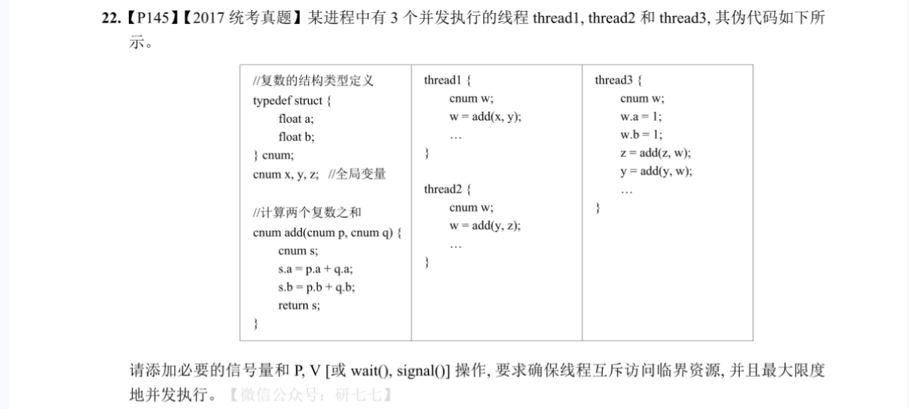
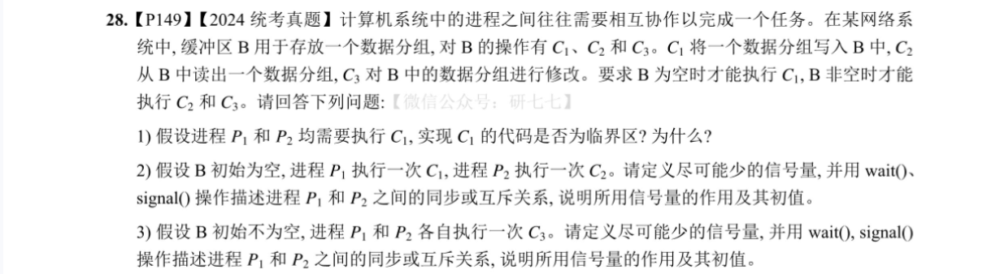
#### 同步问题

##### 前驱图和并发执行

##### PV题目

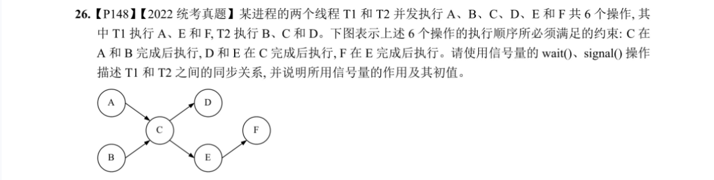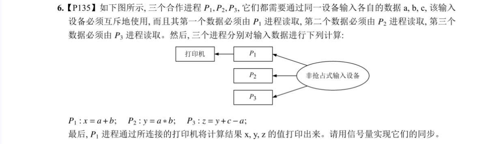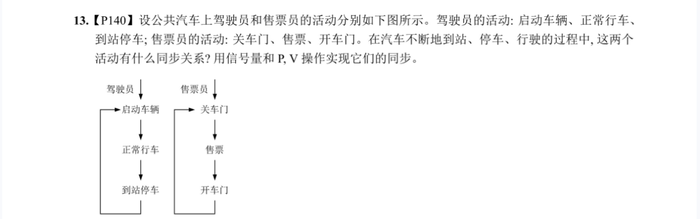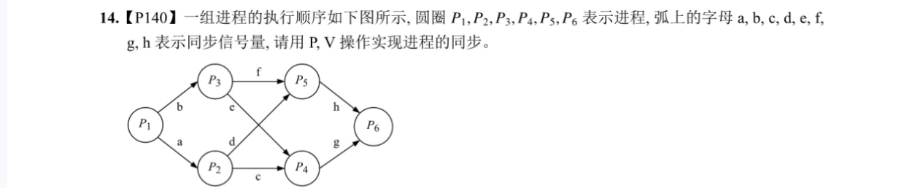


### 生产者 - 消费者问题（the producer-consumer problem）


	生产者-消费者问题是相互合作进程关系的一种抽象，大部分问题都是生产者-消费者问题或其变体。在输入时，输入进程是生产者，计算进程是消费者；而在输出时，计算进程是生产者，而打印进程是消费者。首先辨别缓冲区，生产者和消费者，其中生产者产生资源放进缓冲区，消费者从缓冲区取资源消费，缓冲区一般有容量限制，可能是一个队列、数组、消息队列等。


按数量，按缓冲区（无缓冲、有界缓冲、环形有序，无限缓冲区）

	

#### 单生产者-单消费者（SPSC，一对一）


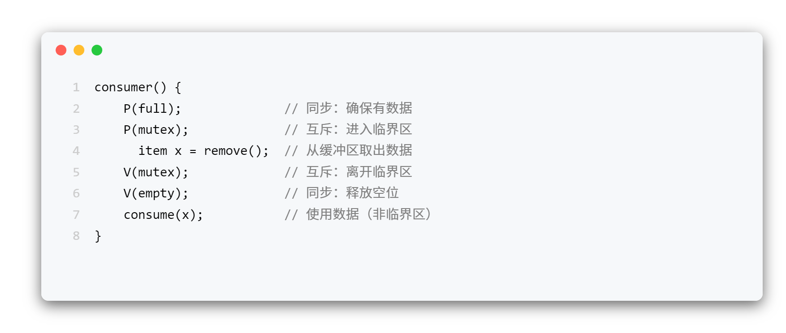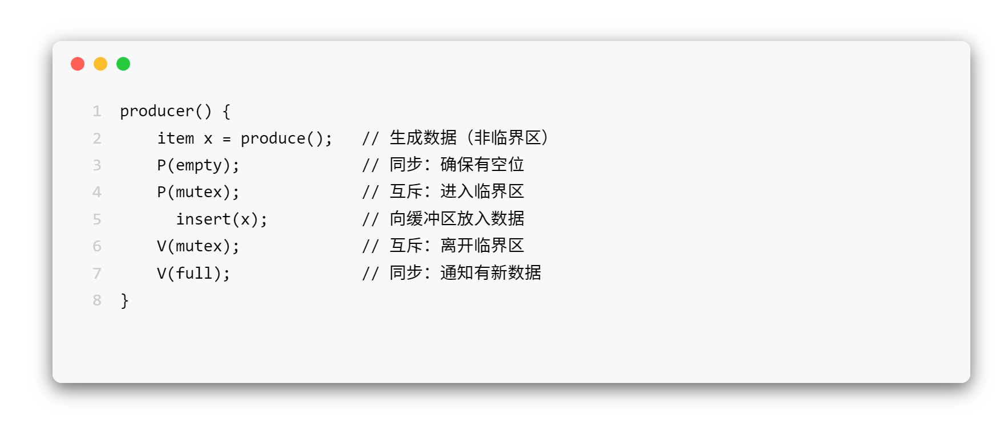

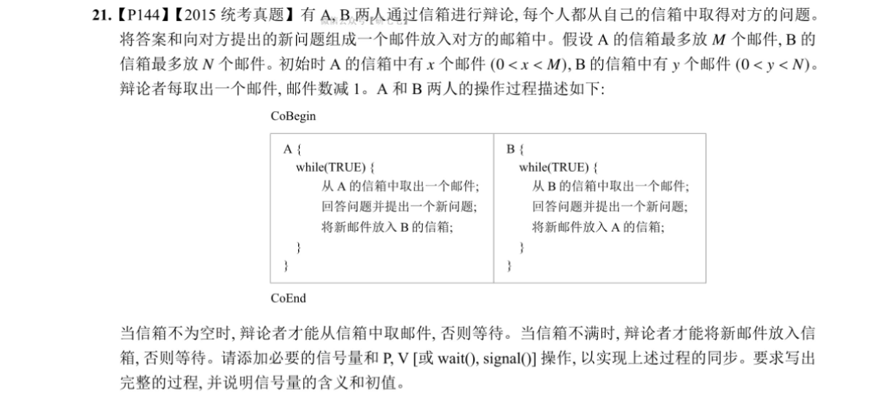

	A为生产者、B为消费者，缓冲区为B的信箱；B为生产者、A为消费者，缓冲区为A的信箱;


	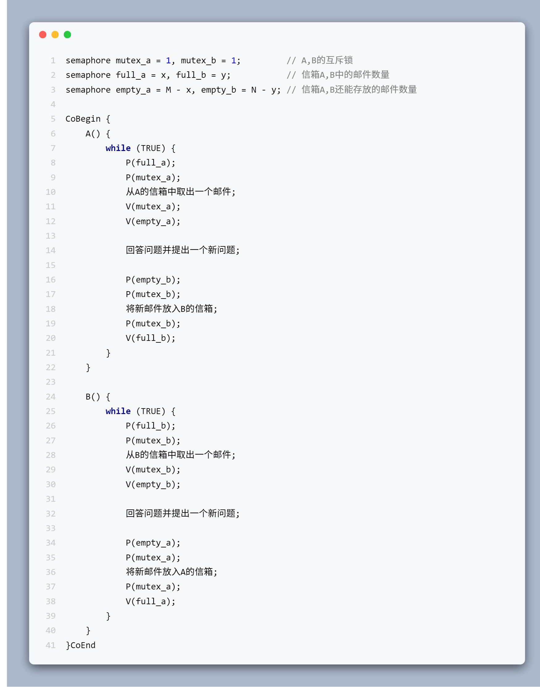


empty和full是信号量，在并发环境下被多可能个进程同时操作，所以“直接判断empty<n”或“full>0”在实际同步代码里是不安全的。如果需要判断缓冲区状态，必须引入额外的共享变量（如共享计数器、共享标志位）并加锁保护，如下是使用标志位的方法。


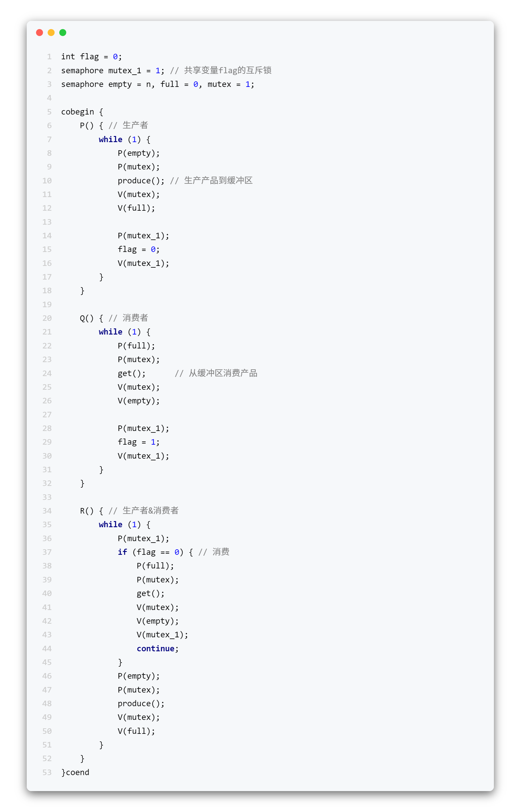


#### 多生产者–单消费者（MPSC，多对一）


多个生产者并发写缓冲区，消费者单个取，必须防止多个生产者同时写入导致数据破坏，使用 互斥锁（mutex） 保证写缓冲区时的互斥。


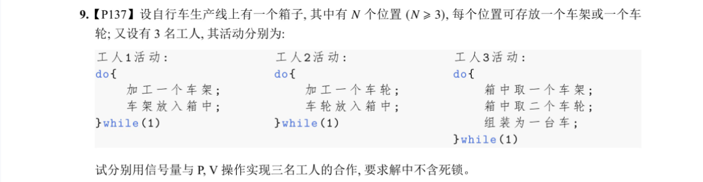

如理发师、营业员问题、银行叫号问题；理发师、营业员、柜台服务员 = 消费者（叫号或处理顾客请求）。顾客 = 生产者（取号产生任务或请求）。候客区 = 有界缓冲区。


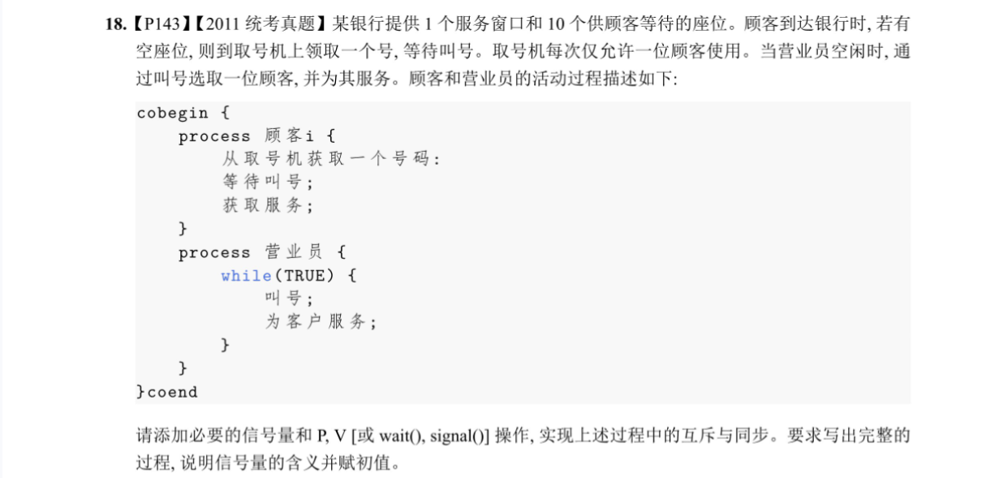

#### 单生产者–多消费者（SPMC，一对多）


一个生产者不断生产，多个消费者并发取数据。消费者取时需要互斥。常用于 任务分发 或 工作队列（work queue）场景，如吸烟者问题；


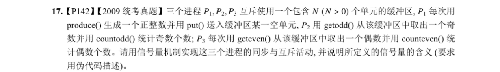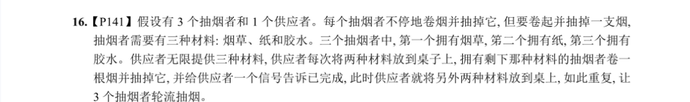

#### 多生产者–多消费者（MPMC，多对多）


最一般的情况，多个生产者并发生产，多个消费者并发消费。缓冲区同时被多个进程访问，必须使用 互斥量 + 信号量 控制。这是操作系统教材里“有界缓冲区问题”的标准版本。


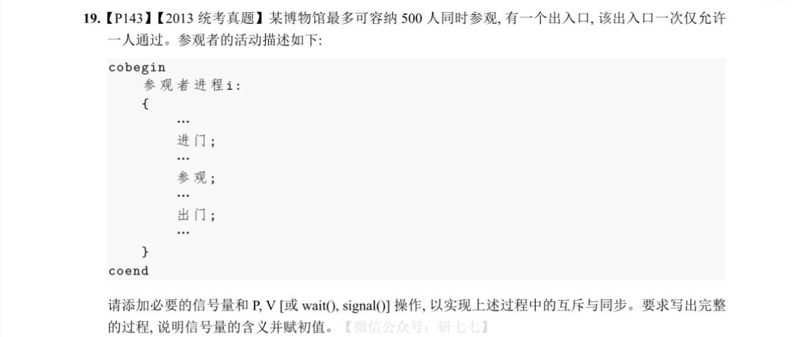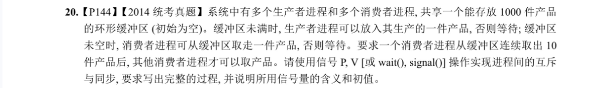


### 哲学家进餐问题


对于这样的死锁问题，可采取以下3种方法进行解决。

（1）至多只允许有4位哲学家同时去拿左边的筷子，最终能保证至少有1位哲学家能够进餐，并在进餐毕时能释放出他用过的2根筷子，从而使更多的哲学家能够进餐。

（2）仅当哲学家的左右两根筷子均可用时，才允许他拿起筷子进餐。

（3）规定奇数号哲学家先拿他左边的筷子，然后再去拿他右边的筷子；而偶数号哲学家则相反。按此规定，1号、2号哲学家将竞争1号筷子；3号、4号哲学家将竞争3号筷子。即5位哲学家都先竞争奇数号筷子，获得后，再去竞争偶数号筷子，最后总会有一位哲学家能获得两根筷子而进餐。


### 读者 - 写者问题（reader-writer problem）


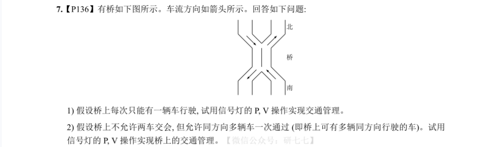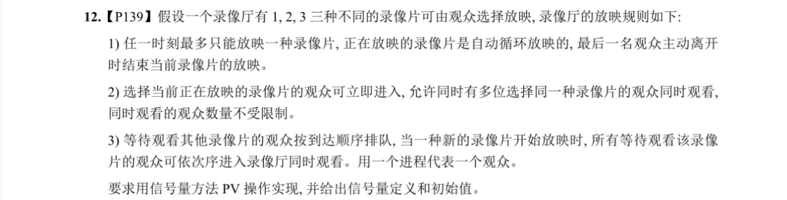

```python
1    semaphore rmutex=1，wmutex=1 ；
2    int readcount=0 ；
3      void reader( ) {
4       do {
5         wait(rmutex) ；
6         if (readcount==0) wait(wmutex) ；
7         readcount++ ；
8         signal(rmutex) ；
9         …
10          perform read operation ；
11          …
12          wait(rmutex) ；
13          readcount-- ；
14          if (readcount==0) signal(wmutex) ；
15          signal(rmutex) ；
16         } while(TRUE);
17       }

18       void writer( ) {
19            do {
20          wait(wmutex) ；
21          perform write operation ；
22          signal(wmutex) ；
23            } while(TRUE) ；
24       }
```


