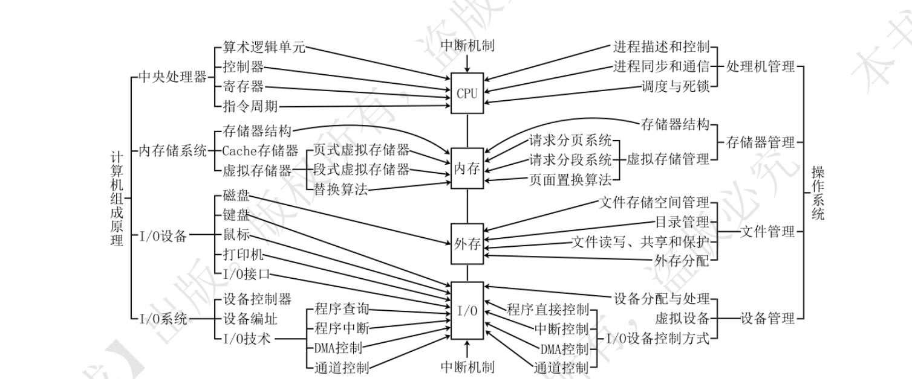
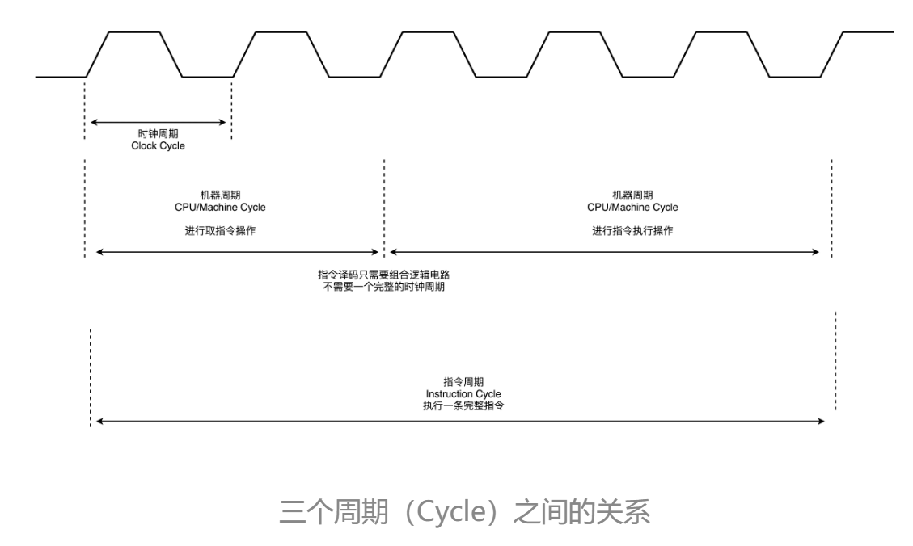
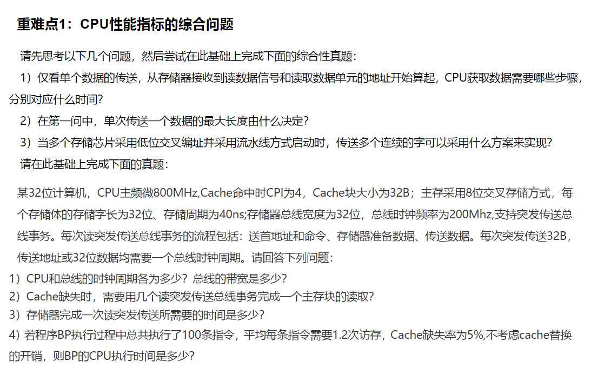
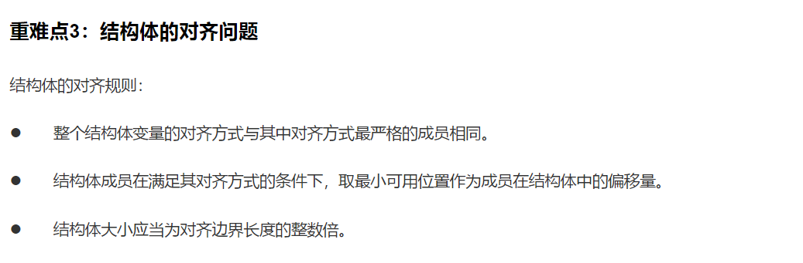
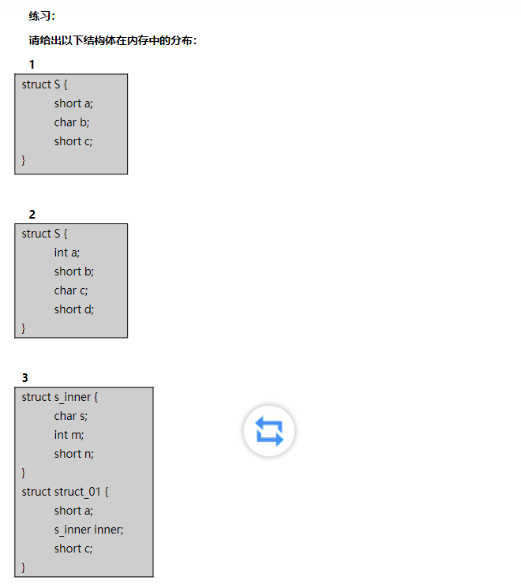
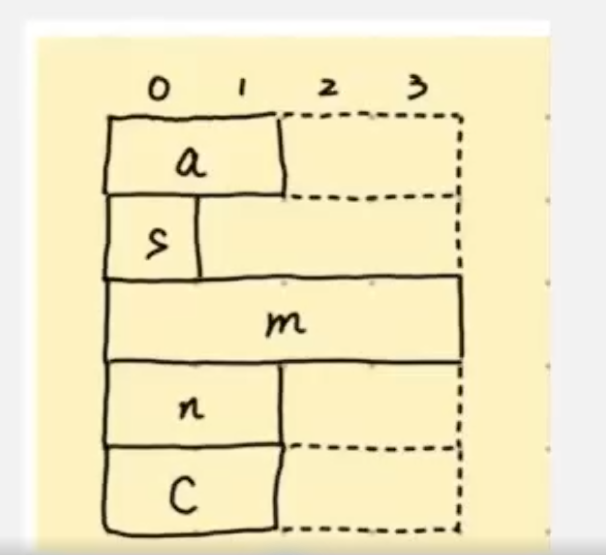
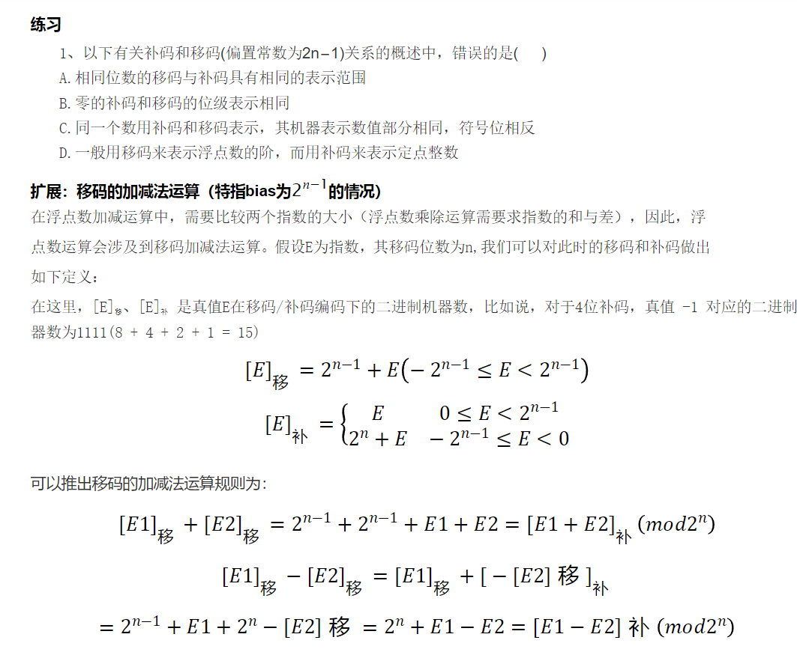
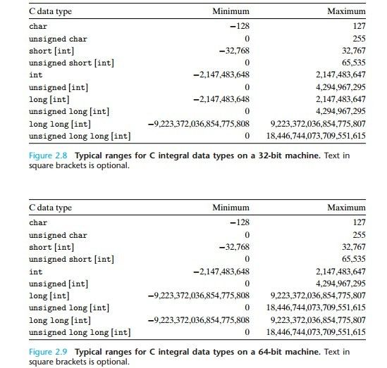

数据运算：https://share.mubu.com/doc/2C6KGTQRdZY

采用整体性学习策略，能30s画出任意模块的结构图，能对工作原理侃侃而谈；

计算机体系结构研究属性，计算机组成原理研究硬件细节，即服务于功能和性能的结构实现。组成原理主硬件，应当从硬件结构开始思考功能和工作原理，再从工作原理和功能的角度加深对结构设计的理解。组成原理是发展中的知识，唯一不变的是命题，具体实现则一直在发展，可以以冯机为图示学习，逐步建立起一个系统。

计算机体系结构是指机器语言或汇编语言程序员所看得到的传统机器的属性，包括指令集、数据类型、存储器寻址技术等，大都属于抽象的属性。

计算机组成是指如何实现计算机体系结构所体现的属性，它包含许多对程序员来说透明的硬件细节。例如，指令系统属于结构的问题，但指令的实现即如何取指令、分析指令、取操作数、如何运算等都属于组成的问题。因此，当两台机器的指令系统相同时，只能认为它们具有相同的结构，至于这两台机器如何实现其指令，则完全可以不同，即可以认为它们的组成方式是不同的。例如，一台机器是否具备乘法指令是一个结构的问题，但实现乘法指令采用什么方式则是一个组成的问题。许多计算机厂商提供一系列体系结构相同的计算机，而它们的组成却有相当大的差别，即使是同一系列的不同型号机器，其性能和价格差异也很大。

## 计算机系统概述

### 计算机系统

软件系统包括系统软件和应用软件，系统软件提供无差别服务，例如操作系统、语言处理程序、服务型程序、数据库管理系统、计算机网络软件等，应用软件提供个性化服务。

软件和硬件具有逻辑等价性，能完成相同的功能，但性能不同，硬件快，软件慢，修改灵活。

**冯机**

采用存储程序思想，需要先将程序和数据存储存储器，计算机通过PC等机制自动地将其取出并处理。二进制基本工作方式是指令流驱动控制，操作顺序由指令顺序决定。

计算机由运算器、控制器、存储器、输入设备及输出设备五大部分构成，现代计算机通常把运算器和控制器集成在一个芯片上，合称中央处理器。在微处理器面世之前，运算器和控制器分离，而且存储器的容量很小，因此设计成以运算器为中心的结构，其他部件都通过运算器完成信息的传递。随着微电子技术的发展，同时计算机需要处理、加工的信息量也与日俱增，大量I/O设备的速度和CPU的速度差距悬殊，因此以运算器为中心的结构不能满足计算机发展的要求。现代计算机已发展为以存储器为中心，使I/O操作尽可能地绕过CPU，直接在I/O设备和存储器之间完成，以提高系统的整体运行效率。

### 计算机层次结构

分层方式目前没有统一的标准，从语言的角度，可以将计算机分成多个机器级构成的层次结构，其中，第一第二级是硬件部分，称为裸机，也是组成原理研究的内容；第3-5级称为虚拟机上。

**应用程序层**由解决实际问题的处理程序组成。

**高级语言层**面向用户，由高级语言编译程序支持和执行。

**汇编语言层**由汇编程序支持和执行，可以编写汇编语言程序。汇编语言、机器语言与硬件相关。

**操作系统层/混合层**由使用操作系统程序实现，操作系统程序由机器指令和广义指令/系统调用组成，广义指令是操作系统定义和解释的软件指令，用于扩展机器的功能。

**软硬件交界面**是**指令集体系结构（ISA）/软件可见部分**，定义了一台计算机可以执行的所有指令的集合，指令规定了计算机执行什么操作，处理的操作数的存放地址空间、操作数类型，是软件能感知得到的部分。

**传统机器语言层**由微程序解释机器指令系统，是一个实际的机器层。

**微程序机器层**使用机器硬件直接执行微指令，是一个实在的硬件层。

### 计算机系统的工作原理

**翻译程序**分为编译程序和解释程序。​**编译程序**将高级语言翻译成低级语言/机器级目标代码文件（如汇编语言、机器语言）；**​汇编程序**将汇编语言翻译成机器语言；**​解释程序**将源程序的一条语句翻译成对应的目标代码并立即执行，然后翻译下一条语句并执行，并不会生成目标程序，速度比编译程序慢。

1.预处理：使用预处理器扩展源代码，对源程序中以#开头的命令进行处理，输出一个.i源文件；插入所有用#include命令指定的文件，并扩展所有用#define声明指定的宏；

3.编译：使用编译器对预处理后的源程序进行编译，输出.s的汇编语言源程序/汇编代码；汇编语言程序文件中的每条语句都以汇编代码的形式描述了一条低级机器语言；有的语言可以编译成机器语言​

3.汇编：使用汇编器（如NASM、MASM）将汇编代码翻译成.o的二进制可重定位目标代码文件；二进制目标代码文件是机器代码的一种形式，包含所有指令的二进制表示，但是没有填入全局值得地址；

4.链接：使用连接器将多个可重定位目标文件和标准库函数所在得可重定位目标模块合并，生成可执行文件，保存在磁盘上，准备好在计算机上运行；静态连接和动态连接；可执行文件时机器语言代码得第二种形式，即处理器执行的代码格式；

5.（程序/进程）执行阶段：装载，作业调度进入内存，当可执行文件在计算机上运行时，操作系统将机器语言指令加载到内存中，进行进程调度，将使得该进程占有CPU，执行这些指令。PC值等于该程序的逻辑地址；

要了解指令周期、流水线工作方式，CPU（控制器（）、运算器（），MMU等的结构），以及更加具体的各个部件的微观结构，总线，信号等；

指令的执行：每一条指令执行需要经过一个指令周期，或者流水线：取指译码执行访存写回；取指时，CPU先通过控制器自动进行取指公共操作，将指令写入MDR，IR；

* CU怎么产生信号，CU的内部结构；

* 逻辑地址到物理地址的转换；

* 形式地址到有效地址的转换；

* 如果发生中断；

* x.解释：逐条将指令翻译成机器语言指令，而非产生文件；

程序各级编码/表示；

* 高级语言：编译型和解释型，动态和静态；

* 汇编语言：机器语言的助记符，由AT&T和Inter两种；

* 机器语言：操作码：地址码；

* 微指令：

* 电信号；

##### 中断系统

现代计算机系统中都配有完善的异常和中断处理系统，CPU的数据通路中有相应的异常和中断的检测和响应逻辑，在外设接口中有相应的中断请求和控制逻辑，操作系统中有相应的中断服务程序。这些中断硬件线路和中断服务程序有机结合，共同完成异常和中断的处理过程。

随着计算机的发展，中断技术不断被赋予新的功能。1）实现CPU与I/O设备的并行工作。2）处理硬件故障和软件错误。3）实现人机交互，用户干预机器需要用到中断系统。4）实现多道程序、分时操作，多道程序的切换需借助于中断系统。5）实时处理需要借助中断系统来实现快速响应。6）实现应用程序和操作系统（管态程序）的切换，称为软中断。7）多处理器系统中各处理器之间的信息交流和任务切换。

异常

内部异常

内部异常：是指由CPU内部异常引起的意外事件。根据其发生的原因又分为硬故障中断和程序性异常。

硬故障中断（比如存储器出现问题）：是由硬连线路出现异常引起的，如电源掉电、存储器线路错等；

程序性异常（由当前正在执行的程序引起）：也称软中断，是由CPU执行某个指令而引起的发生在CPU内部的异常事件。如整除0、溢出、缺页、地址越界等。按发生异常的报告方式和返回方式的不同，内部异常可分为故障、自陷和终止三类。程序性异常一般出现在指令的取值周期，间址周期，执行周期。并在出现时就响应，不用等到中断周期。中断一般由外设或内部的时钟产生，中断或许出现在取值周期，间址周期，执行周期，但必须在中断周期响应。

程序性异常

1）故障

故障：是在引起故障的指令启动后、执行结束前被检测到的一类异常事件。例如，指令译码时，出现“非法操作码”；取指令或数据时，发生缺页；执行整数除法指令时发现“除数为0”等。“缺页”等这类异常处理后，已将需要的页面从磁盘调到主存，可继续回到发生故障的指令继续执行。对于“非法操作码”、“保护错”、“除数为0”等，因为无法通过异常处理程序恢复故障，因此必须终止程序的执行。

2）自陷

自陷：与故障等其他意外发生的异常事件不同，是预先安排的一种“异常”事件，首先通过某种方式将CPU

设定为处于某个特定状态，在程序执行过程中，一旦某条指令的执行发生了相应状态所满足的条件，则CPU调出特定的程序进行相应的处理。如操作系统中的系统调用指令。事先在程序中用一条特殊指令或设定特殊控制标志，当执行到被设置了“陷阱”的指令时，CPU在执行完自陷指令后自动根据不同“陷阱"类型进行相应的处理，然后返回到自陷指令的

下一条指令执行。当自陷指令是转移指令时并不能返回到下一条指令执行，而是返回到转移目标指令执行。

3）终止

如果在执行指令过程中发生了使机器无法继续执行的硬件故障，如电源掉电、线路故障等，则程序将无法继续执行只好终止，此时，调出中断服务程序来重启系统。这种异常与故障和自陷不同，不是由特定指令产生的，而是随机发生的。

异常与中断的关系

（1）“缺页”或“溢出”等异常事件是由特定指令在执行过程中产生的，发生在指令的取指周期，间址周期以

及执行周期。而中断相对于指令的执行则是异步的。中断不和任何指令相关联，也不阻止任何指令的完成，而是在执行周期结束后的中断周期，CPU查询是否有中断信号。

（2）异常的发生和异常事件的类型是由CPU自身发现和识别，不必通过外部的某个信号通知CPU。比如当指令的执行周期发现溢出，由专门的电路进行判断。而对于中断CPU必须通过对外部中断请求线进行采样，并从总线上获取，相应的中断源设备的标识信息，才能获知哪个设备发生了何种中断。

Intel8086/8088微处理器不区分异常和中断，把两者统称为中断，由CPU内部产生的异常称为内中断，内中断皆为不可屏蔽中断。通过中断请求线INTR和NMI从CPU外部发出的中断请求为外中断。通过INTR信号线发出的外中断是可屏蔽中断，而通过NMI信号发出的是不可屏蔽中断。不可屏蔽中断的处理优先级最高，任何时候只要发生不可屏蔽中断都要终止先行程序的执行，转到不可屏蔽中断处理程序执行。

在计算机领域中，站在某类用户的角度，若感觉不到某个事物或属性的存在，即“看”不到某个事物或属性，则称为“对该用户而言，某个事物或属性是透明的”。这与日常生活中的“透明”概念（公开、看得见）正好相反。例如，对于高级语言程序员来说，浮点数格式、乘法指令等这些指令的格式、数据如何在运算器中运算等都是透明的；而对于机器语言或汇编语言程序员来说，指令的格式、机器结构、数据格式等则不是透明的。在CPU中，IR、MAR和MDR对各类程序员都是透明的。

### 性能指标

**机器字长/字长**

指计算机的位数，指CPU内部用于整数运算的数据通路的宽度，因此与计算机进行一次定点整数运算所能处理的二进制数据的位数，反映了计算机处理信息的能力。一般与通用寄存器、ALU宽度相同，与寄存器位数寻址空间大小、一次浮点数运算能处理的二进制位数不同。字长越长,数的表示范围越大,计算精度越高，通常选定为字节(8位)的整数倍。

**存储字长**是一个存储单元存储的二进制代码的位数，机器字长通常是存储字长的整数倍，最常见的情况是相等，这样可以充分发挥机器字长的作用，一次性把数据取到CPU中，一次性处理计算。机器字长也可以是存储字长的两倍，四倍，因为能处理64位定点数的CPU当然也能处理存放32位、16位的定点数。早期的存储字长一般与指令字长、字长相等，因此访问一次主存储器便可取出一条指令或一个数据。随着计算机的发展，指令字长、字长都可变，但必须都是字节的整数倍。

**指令字长**，指一个指令字中包含的二进制代码的位数，可以是存储字长的一半，也可以是存储字长的整数倍，通常把这些指令叫做半存储字长指令、单存储字长指令、双存储字长指令。CPU要从内存中取一条双存储字长指令，那就要获取两个存储单元；若指令字长等于存储字长，则取指令周期等于机器周期。指令字长决定了IR寄存器的位数，如果指令字长最大为32位，那么IR寄存器至少需要32位。

指令字长和机器字长两者互不影响，没有任何约束关系，只是恰巧各自与存储字长有倍数关系。因为机器字长强调的是参与ALU运算的操作数位数，而操作数位数显然与指令长度也就是指令字长无关。有的指令可以没有参与ALU运算的操作数，甚至没有显式操作数。

**存储容量**

主存能存储信息的最大容量，通常以字节衡量，也可以用字数*字长来表示。例如，MAR16位，MDR32位的计算机，存储容量为64K*32位。

**运算速度**

**吞吐量**指系统在单位时间内处理的请求数量，主要取决于存储的存取周期。

响应时间

**CPU执行时间/CPU性能**取决于主频、CPI和指令条数，三者相同制约。

**CPU时钟周期/时钟周期/节拍/T周期/ClockCycle**，指机器内部主时钟脉冲信号（由机器脉冲源发出的脉冲信号整形和分频得到）的宽度。时钟周期是CPU工作的最小时间单位，计算机执行一条指令的过程分为若干步骤/微操作，每一步都需要控制信号进行控制，这些控制信号的发出时间和作用时间需要定时信号同步。时钟周期以相邻状态单元/存储逻辑电路间的组合逻辑电路的最大延迟确定（即数据流从一个状态单元经过组合逻辑到达另一个状态单元的时间），也以指令流水线的每个流水段的最大延迟时间确定（即，取决于时间最长的流水段）。**主频/CPU时钟频率**，是机器内部主时钟的频率，即时钟周期的倒数，表示每秒有多少个时钟周期，通常以Hz为单位。主频是衡量机器速度的重要参数，同一个型号的计算机，其主频越高，完成指令的一个执行步骤的时间越短，执行指令的速度越快。

衡量CPU运算速度的指标有很多，不能以单独的某个指标来判断CPU的好坏。CPU的主频表示CPU内数字脉冲信号振荡的速度，主频和实际的运算速度存在一定的关系，但目前还没有一个确定的公式能够定量两者的数值关系，因为CPU的运算速度还要看CPU的流水线的各方面的性能指标（架构、缓存、指令集、CPU的位数、Cache大小等）。主频并不直接代表运算速度，因此在一定情况下很可能出现主频较高的CPU实际运算速度较低的现象。

* **机器周期/CPU周期/MachineCycle/存取周期**，指从内存里面读取一条指令的最短时间。

* **指令周期**至少包括取指和执行，故至少两个CPU周期，复杂的指令则需要更多的CPU周期；而一个CPU周期，通常会由几个时钟周期累积

**CPI (Cycles Per Instruction)**表示执行一条指令所需的时钟周期数。不同指令的功能不同,在不同机器上实现方式也不同,因而所需时钟周期数也不同。对于一台机器上的一个特定程序来

说,其CPI指的是该程序所有指令执行所需的平均时钟周期数。**IPS（Instruction Per Second）**指每秒执行的指令数目，等于主频除以平均CPI。**MIPS (Million Instructions Per Second)**指每秒执行多少百万条指令，**MFLOPS、GFLOPS、TFLOPS、PFLOPS、EFLOPS、ZFLOPS**分别为每秒执行多少次浮点运算，用于科学计算机的评估。思考机器A的MIPS比机器B大,能说明机器A的性能就一定比机器B好吗?

**基准程序（Benchmarks）**一般情况下能够反映机器性能的好坏，但是基准程序中的语句存在频度的差异，因此运行结果并不能完全说明问题。

## 数据的表示和运算

### 数制与转换

二进制转八进制，三位一组，二进制转十六进制，四位一组。

任意进制转十进制，按位权展开相加。

十进制转任意进制，整数部分除基取余，或者先转二进制；小数部分乘积取整，另外，任何二进制小数都能转为十进制，但是十进制小数未必能够转为二进制。

### 定点数的表示和运算

机器数：用0表示负号，1表示正号的二进制数，有原码、补码、反码、移码表示法

​真值：带+/-号的数字，如+15，-9，是机器数的实际值；

第一个结构体必须是4B的整数倍

#### 定点数表示

计算机中根据小数点的位置是否确定，有定点表示和浮点表示两个数据格式，通常用补码整数表示整数，用原码小数原始浮点数的尾数，用移码表示浮点数的阶码。

定点表示用来表示定点小数和定点整数，定点整数分为有符号数和无符号数。机器内部并不存储小数点，定点数的小数点位置由人为约定，不需要考虑定点数是整数还是小数，只关心符号位和数值位。浮点数可以由一个定点小数和一个定点整数表示。

​定点整数：纯整数，其中第一位是符号位，符号位后是数值位，小数点隐含在数值位末尾。例如$$X=x_0x_1...x_n$$，其中$$x_0$$表示符号位，尾数$$x_1x_2...x_n$$是数值部分。

定点小数：纯小数，其中第一位是符号位，符号位后是数值位，小数点隐含在符号位和数值位之间。例如，$$X=x_0.x_1x_2...x_n$$，$$x_0$$表示符号位，尾数$$x_1x_2...x_n$$是数值部分。

|原码 Sign-Magnitude|反码 Ones's Complement|补码 Two's Complement|移码 Biased Representation|
|:----|:----|:----|:----|
|最高位为符号位正数为0，负数为1|正数与原码相同负数数值位取反|正数与原码相同负数数值位取反再加1|偏置值为128时，移码与原码仅符号位不同|
|0的原码有两种表示$$[+0]_原=0,0000000$$$$[-0]_原=1,0000000$$|0的反码有两种表示$$[+0]_反=0,0000000$$$$[-0]_反=1,1111111$$|0的补码只有一种表示$$[+0]_补=0,0000000$$$$[-128]_补=1,0000000$$表示补码最小数|0的补码只有一种表示$$[+0]_移=1,0000000$$$$[-128]_移=0,0000000$$表示移码最小数|
|若数值位为n位，则原码整数范围$$[-(2^n-1)，2^n-1]$$，关于原点对称；原码小数范围为$$(0，1-2^{-n})$$。|与原码相同|若数值位为n位，则补码整数的表示范围为$$(-2^n,2^n-1)$$；补码小数范围为$$(-1,1-2^{-n})$$。|只能表示整数，与补码表示范围相同，不能表示小数。|
|符号和数值位必须分开处理。用原码实现乘除法简单，但是实现加减法复杂，对于不同符号数的加法或相同符号数的减法，需要用绝对值大的数减绝对值小的数，然后选择正确的符号。|反码表示必须考虑循环进位，见运输层协议的检验|从右到左，数值位第一个1左侧的所有数值位取反，即可快速由原码求补码。符号和数值位可以同时处理。补码容易实现加减法，将所有位取反加一即可得到负数补码，但是最小负数取负后会发生溢出。可用加法来实现$$[A]_补-[B]_补=[A]_补+[-B]_补$$负数补码的数值部分越大，其真值越大。|移码保留了数据原有的大小顺序，移码大小和真值成正比，便于数据大小比较。全0时，对应真值的最小值为$$-2^n$$，全1对应真值的最大值$$2^n-1$$。|

* 原码、反码、补码的符号位相同；正数的原码、反码、补码相同。

* 原码、反码在数轴上对称，二者都存在+0，-0，表示范围比补码少一个最小负数；补码、移码在数轴上不对称，0的表示唯一。

* 变形补码/模4补码，有两个符号位，00表示正，11表示负，左符是真正的符号位，右符用于判断溢出，用在执行运算的ALU中。

* 同一个真值在不同位数的补码表示中，对应的机器数不同。

#### 定点数运算

##### 移位运算

在没有乘法除法电路的计算机中，移位运算与加法结合实现乘除运算。二进制左移一位，若不产生溢出相当于乘2，右移一位，相当于除以2。

**逻辑移位**：将操作数视为无符号数，无论怎么移动都添0；对于无符号数的逻辑左移，若高位的1移出，则发生溢出；

**算数移位**：将操作数视为有符号数，计算机中的有符号整数都是用补码表示的，因此有符号整数的移位操作采用补码算术移位方式；左移时，高位移出低位补0，若移出的高位不同于移位后的符号位，即左移前后符号位不同，则发生溢出；右移时，低位移出高位补符号位，若低位的1移出则影响精度。而其他编码的算数移位，正数原码、反码、补码都添0；负数原码添0，反码添1，补码右移添1左移添0；

**循环移位**：右移，移出的低位进高位；左移，移出的高位进低位；

##### 符号扩展：扩展位数时，和移位操作一样；

定点整数的符号扩展：符号位和数值位之间添加新位，正数填0，负数原码填0、反码补码填1；负数的补码，从右向左数，第一个1的右侧与原码相同与反码相反，左侧与反码相同，数值位与原码相反；

定点小数的符号扩展：符号位和数值位之间添加新位，正数填0，负数原码补码填0、反码填1；负数的补码，从右向左数，第一个1的右侧与原码相同与反码相反，左侧与反码相同，数值位与原码相反；

##### 加减法；计算机普遍采用反码做加减法；

* 原码加减法先判断符号位是否相同，相同做加法，不同做减法，溢出位丢掉；

* 补码加法直接运算，减法将被减数，和减数的负数补码相加，溢出位丢掉，结果也为补码形式的值；

**溢出判断**

* 仅当两个正数或负数相加才可能溢出，正数减正数，负数减负数，整数加负数，负数加整数不会溢出。

* 手算方法是根据位数计算出取值范围，与十进制数的运算结果比较看是否越界；

* 一位符号法：当两个操作数符号位相同时，结果符号位和操作数符号位不同，即两个正数相加得到负数，或两个负数相加得到正数，则为溢出；

* 双位符号/变形补码/模4补码法：**当结果符号位为01时，为正溢出（上溢）；为10时，为负溢出（下溢），第一符号位代表结果正负。由于数值不溢出两个符号位必然相等，因此实际存储只需要一位，仅在ALU中使用双符号位；**

* 一符号位根据进位判断：当符号位和进位都有进位或都无进位时无溢出，反之则溢出，即最高数值位和符号位的进位异或为一，或二者仅有一个产生进位时溢出；

##### 乘除法

* 原码一位乘法

* 补码一位乘法

* 原码除法运算

* 补码除法运算

#### 整数的表示与运算

整数的小数点隐含在数的最右边，故无须表示小数点，因而也被称为定点整数。整数可分为无符号整数（unsigned integer）和带符号整数（signed integer）两种。

##### 整数的表示

**无符号整数**的全部二进制位均是数值位，没有符号位，此时，默认数的符号为正，所以无符号整数就是正整数或非负整数。由于无符号整数省略了一位符号位，所以在字长相同的情况下，它能表示的最大数比带符号整数所能表示的大。应用在整数运算且没有负值结果的情况下，例如地址运算，指针表示。

另外，只有无符号整数，没有无符号小数，如unsigned int， unsigned long，而unsigned float is wrong。C语言中的数据都以补码形式存储，无符号数的补码是由对原码所有位取反加一得到，即从右到左第一个1左面按位取反。

**带符号整数**也称为有符号整数，它必须用一个二进位来表示符号，补码占据优势，在计算机中采用补码表示。

##### C语言中的整数类型

整型数据类型是表示有限范围的整数。C和CPP默认采用有符号数，但也支持无符号数，而Java只支持有符号数，无论是无符号数还是有符号数，都是按照补码形式存储的，只是signed型的最高位是符号位，而unsigned型最高位也是数值位。C语言标准定义了每种数据类型必须能够表示的最小取值范围，下图是32位、64位程序上C语言整型数据类型的典型取值范围。其中long的取值范围与机器字长相关，char默认是无符号整数；

##### C语言整数类型转换

**有符号数和无符号数转换**，不会改变二进制数本身，只是改变了最高位的解释方式。若无符号数和有符号数参与运算，C语言标准规定按照无符号数进行运算。

**不同字长整数之间的转换**，长变短，高位截断，低位保留；短变长，若原数字是有符号数，则进行符号扩展，否则进行零扩展，其实也可以理解为符号扩展。

### 实数/浮点数的表示和运算

**进程和程序的区别？**

#考研/OS 

1. **结构性；**

* 进程或进程实体由程序段、相关的数据段和PCB三部分；

* 程序只包含程序段。

1. **动态性（进程最基本的特征）；**

* 进程的实质是进程实体的执行过程；进程实体有一定的生命期，它由创建而产生，由调度而执行，由撤消而消亡。

* 程序则只是一组有序指令的集合（可执行文件），并存放于某种介质存（磁盘）上，其本身并不具有活动的含义，因而是静态的。

1. **并发性；**

* 多个进程实体同存于内存中，且能在一段时间内同时运行（并发执行），这也是引入进程的目的。

* 程序，没有建立PCB，不能参与并发执行。

1. **独立性；**

* 在传统的OS中，独立性是指进程实体是一个能独立运行、独立获得资源和独立接受调度的基本单位。

* 凡未建立PCB的程序都不能作为一个独立的单位参与运行。

1. **异步性；**

* 进程是按异步方式运行的，即按各自独立的、不可预知的速度向前推进。

* 异步性导致传统意义上的程序若参与并发执行，会产生其结果的不可再现性，所以引入了进程的概念， 并且配置相应的进程同步机制解决异步问题； 

**为什么要引入进程？**

#考研/OS 

多道程序环境下的程序执行是并发执行，程序的顺序执行是顺序的、封闭的、可再现的，而程序的并发执行是间断的、失去封闭性的、不可再现的。为了使得程序在并发环境下独立运行，即可以正常并发执行，并且还方便对并发执行的程序加以描述和控制，这才引入了“进程”的概念。

为了更清楚的理解引入进程的原因，要对并发执行和并行执行的特征加以对比，在并发环境下，程序是无法正常执行的，为了使得程序间断也能正常执行，即无法保证具有相同的机会获得处理机，无法保证系统程序和其他程序破坏自己的资源，无法保证结果的可再现，而引入了进程，既方便描述程序，也方便进程调度、进程同步、进程通信。

1. **顺序性和间断性；**

* **顺序执行的顺序性**：指处理机严格地按照程序所规定的顺序执行,即每一操作必须在下一个操作开始之前结束；

* **并发执行的间断性**。程序在并发执行时，由于它们共享系统资源，以及为完成同一项任务而相互合作，致使在这些并发执行的程序之间形成了相互制约的关系。由此可见，相互制约将导致并发程序具有“执行一暂停一执行”这种间断性的活动规律。（静态程序不具备保护自己运行现场的手段，间断后无法保证结果的可再现性，而动态进程具有PCB）

1. **封闭性和失去封闭性：是独占全机资源还是共享资源；**

* **封闭性**：指程序在封闭的环境下运行，即程序运行时独占全机资源，资源的状态（除初始状态外）只有本程序才能改变它，程序一旦开始执行，其执行结果不受外界因素影响；

* **失去封闭性**。当系统中存在着多个可以并发执行的程序时，系统中的各种资源不再为单一程序独占，而这些资源的状态也由共享的程序来改变，致使其中任一程序在运行时，其环境都必然会受到其它程序的影响。例如，当处理机已被分配给某个进程运行时，其它程序必须等待。（如何并发执行但是不影响封闭性-->引入进程作为分配资源的单位，调度时将断点保存）

1. **可再现性和不可再现性；**

* **可再现性**：指只要程序执行时的环境和初始条件相同，当程序重复执行时，不论它是从头到尾不停顿地执行，还是“停停走走”地执行，都可获得相同的结果。程序顺序执行时的这种特性，为程序员检测和校正程序的错误带来了很大的方便。

* **不可再现性**。程序在并发执行时，由于失去了封闭性，也将导致其不可再现性。程序在并发执行时，由于失去了封闭性，也将导致其又失去可再现性。

