## 计算机网络概述


【考纲内容】

（一）概述：计算机网络的概念、组成与功能；计算机网络的分类；计算机网络的性能指标

（二）体系结构与参考模型：网络分层结构；网络协议、接口、服务的概念；ISO/OSI模型和TCP/IP模型


### 概述


#### 概念、组成和功能


**计算机网络的概念**


计算机网络是一个将众多分散的、自治的计算机系统，通过通信设备与线路连接起来，由功能完善的软件实现资源共享和信息传递的系统。计算机网络由若干节点/结点（Node）和连接这些节点的链路（Link）组成，网络中的节点可以是计算机、集线器、交换机或路由器等。自治计算机由软件和硬件两部分组成，拥有独立的操作系统和硬件资源，能完整地实现计算机的各种功能。计算机之间之间是有联系的，能实现相互通信，通过网络协议和通信介质进行数据交换和资源共享。


网络把许多计算机连在一起，而互连网则把许多网络通过路由器连在一起。**互连网（internet）**是一个通用名词，泛指由多个计算机网络通过路由器互连而成的覆盖范围更广的计算机网络，在这些网络之间可以使用任意的通信协议作为通信规则。**Internet（互联网或因特网）**则是一个专用名词，指当前全球最大的、开放的、由众多网络和路由器互连而成的特定计算机网络，它采用TCP/IP族作为通信规则。


**计算机网络的组成**


从**组成部分**看，计算机网络主要由硬件、软件、协议三大部分组成。硬件主要由主机（也称端系统）、通信链路（如双绞线、光纤）、交换设备（如路由器、交换机等）和通信处理机（如网卡）等组成。软件主要包括各种实现资源共享的软件和方便用户使用的各种工具软件（如E-mail程序、FTP程序、聊天程序等）。协议是计算机网络的核心，规定了网络传输数据时所遵循的规范。


从**工作方式**看，计算机网络（主要指Internet，即互联网）可分为边缘部分和核心部分。边缘部分由所有连接到互联网上的供用户直接使用的主机组成，用来进行通信（如传输数据、音频或视频）和资源共享；核心部分由大量网络和连接这些网络的路由器组成，它为边缘部分提供连通性和交换服务。


从**功能组成**看，计算机网络由通信子网和资源子网组成。**通信子网**由各种传输介质、通信设备和相应的网络协议组成，它使网络具有数据传输、交换、控制和存储的能力，实现联网计算机之间的数据通信。**资源子网**是实现资源共享功能的设备及其软件的集合，向网络用户提供共享其他计算机上的硬件资源、软件资源和数据资源的服务。


**计算机网络的功能**


计算机网络使各计算机之间的联系更加紧密，三大主要功能是数据通信、资源共享和分布式处理。**数据通信**是最基本和最重要的功能，实现联网计算机之间各种信息如文件和电子邮件的传输。**资源共享**既可是软件共享、数据共享，又可是硬件共享，它使计算机网络中的资源互通有无、分工协作，从而极大地提高了硬件资源、软件资源和数据资源的利用率。**分布式处理**，当计算机网络中的某个计算机系统负荷过重时，可将其处理的某个复杂任务分配给网络中的其他计算机系统，从而利用空闲计算机资源来提高整个系统的利用率。**提高可靠性**，计算机网络中的各台计算机可以通过网络互为替代机。**负载均衡**，将工作任务均衡地分配给计算机网络中的各台计算机。


#### 计算机网络的分类


**按分布范围分类**


**广域网（WAN）/网络核心**是由互联因特网端系统的分组交换机和链路构成的网状网络，提供长距离通信，覆盖范围通常是直径为几十米到几千千米的区域，是互联网的核心部分。连接广域网的各节点交换机的链路一般都是高速链路，具有较大的通信容量。


**城域网（MAN）**覆盖范围可以跨越几个街区甚至整个城市，覆盖区域的直径为5-50km。城域网大多采用以太网技术，因此有时也常并入局域网的范围讨论。


**局域网（LAN）**一般用主机通过高速线路相连，覆盖范围较小，通常是直径为几十到几千米的区域。传统上，局域网使用广播技术，而广域网使用交换技术。


**个人区域网（PAN）/无线个人区域网（WPAN）**是指在个人工作的地方将消费电子设备如平板电脑、智能手机等用无线技术连接起来的网络。


**按传输技术分类**


**广播式网络**，所有联网计算机都共享一个公共通信信道。当一台计算机利用共享通信信道发送报文分组时，所有其他计算机都会“收听”到这个分组。“收听”到该分组的计算机将通过检查目的地址来决定是否接收该分组。局域网基本上都采用广播式通信技术，广域网中的无线、卫星通信网络也采用广播式通信技术。


**点对点网络**，每条物理线路连接一对计算机。若通信的两台主机之间没有直接连接的线路，则它们之间的分组传输就要通过中间节点进行存储和转发，直至目的主机。


**按拓扑结构分类**


网络拓扑结构是指由网中节点（路由器、主机等）与通信线路之间的几何关系表示的网络结构，主要指通信子网的拓扑结构。基本的网络拓扑结构还可以互连为更复杂的网络，其中星形、总线形和环形网络多用于局域网。


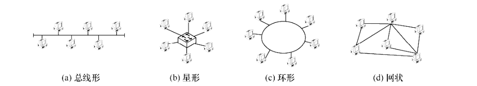

**总线形网络**用单根传输线把计算机连接起来，优点是建网容易、增/减节点方便、节省线路，缺点是重负载时通信效率不高、总线任意一处对故障敏感。


**星形网络**的每个终端或计算机都以单独的线路与中央设备相连，中央设备一般是交换机或路由器，优点是便于集中控制和管理，缺点是成本高、中央设备对故障敏感。


**环形网络**所有计算机接口设备连接成一个环。环既可以是单环，又可以是双环，环中信号是单向传输的。环形网络最典型的例子是令牌环局域网。


**网状网络**，通常每个节点至少有两条路径与其他节点相连，多用在广域网/网络核心中，有规则型和非规则型两种，优点是可靠性高，缺点是控制复杂、线路成本高。


**按使用者分类**


**公用网（Public Network）**指电信公司出资建造的大型网络，所有愿意按电信公司的规定缴纳费用的人都可使用这种网络。


**专用网（Private Network）**指某个单位为满足本单位特殊业务的需要而建造的网络，不向本单位外的人提供服务，如铁路、电力、军队等部门的专用网。


**按传输介质分类**


传输介质可分为有线和无线两大类，因此网络可分为有线网络和无线网络。有线网络又可分为双绞线网络、同轴电缆网络等，而无线网络又可分为蓝牙、微波、无线电等类型。


**按数据交换技术分类**


从通信资源分配的角度看，交换就是按照某种方式动态地分配传输线路的资源。


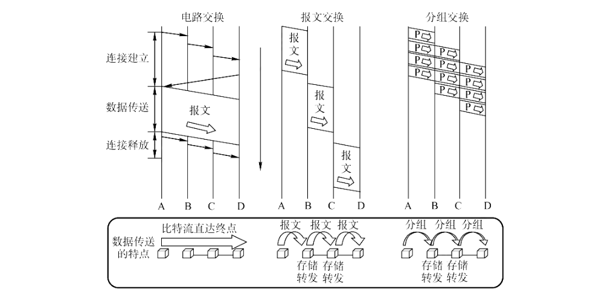

**电路交换（circuit switching）**


最典型的电路交换网是传统电话网。在进行数据传输前，两个用户之间必须先建立一条专用的物理通信路径，该路径由通信双方之间的交换设备和链路逐段连接而成。在数据传输过程中，这一物理通信路径始终被两个用户独占，直到通信结束后才被释放。电路建立后，除源节点和目的节点外，电路上的任何节点都采取“直通方式”发送数据和接收数据，即不存在存储转发所耗费的时间（除了源点，经过结点无需重算传输时间）。在电路交换的整个通信阶段，比特流连续地从源节点直达目的节点，就好像在一个管道中传送。


电路交换技术的优点：通信时延小，因为通信线路为通信双方专用，数据直达，所以传输速率高；有序传输，双方通信时按发送顺序传送数据，不存在失序问题；没有冲突，不同的通信双方拥有不同的信道，不会出现争用物理信道的问题；实时性强，通信双方之间的物理通路一旦建立，双方就可随时通信，适用于交互式会话类通信。


电路交换技术的缺点：建立连接时间长，当要连续传送大量的数据，且其传送时间远大于连接建立时间时，采用电路交换较为合适；线路利用率低，物理通路被通信双方独占，即使线路空闲也不能供其他用户使用，计算机之间的数据传送往往是突发式（高频、少量）的，已被用户占用的通信线路资源在绝大部分时间里都是空闲的，其利用率往往不到10%甚至1%；灵活性差，物理通路中的任何一点出现故障，就必须重新拨号建立新的连接；难以实现差错控制，中间节点不具备存储和检验数据的能力，无法发现并纠正错误；系统效率低，不具备存储数据的能力。


**报文交换**


主要使用在早期的电报通信网。数据交换的单位是报文（Message），报文携带有用户数据、目标地址、源地址等信息。报文交换在交换结点采用**存储转发技术（store-and-forward transmission）**，整个报文先传送到相邻的节点，全部存储后查找转发表，转发到下一个节点，如此重复直至到达目的节点。采用存储转发技术，每个报文都可单独选择到达目的端的路径。


报文交换技术的优点：无建立连接时延，用户可随时发送报文；灵活分配线路，交换节点存储整个报文后，选择一条合适的空闲线路转发报文，若某条传输路径发生故障，则可重新选择另一条路径传输数据；线路利用率高，报文在一段链路上传送时才占用这段链路的通信资源。支持差错控制，交换节点可对缓存下来的报文进行差错检验。


报文交换技术的缺点：转发时延高，交换节点要将报文整体接收完后，才能查找转发表转发到下一个节点（每次经过一个结点都要重新计算传输时延）；缓存开销大，报文的大小没有限制，这就要求交换节点拥有较大的缓存空间；错误处理低效，报文较长时发生错误的概率相对更大，重传整个报文的代价也很大。


**分组交换（packet switching）**


路由器先接收整个分组，然后对分组进行错误检查，若出错则丢弃错误的分组，否则存储这个正确的分组，最后根据路由选择协议将正确的分组转发到合适的端口，这种机制称为存储转发机制。分组交换也采用存储转发方式，但解决了报文交换中大报文传输的问题。分组交换限制了每次传送的数据块大小的上限，把大的数据块划分为合理的小数据块，再加上一些必要的控制信息（如源地址、目的地址和编号信息等）构成分组（Packet）。


源主机将分组发送到分组交换网中，其中的分组交换机收到一个分组后，先将其缓存并排队等待传，然后从其首部中提取目的地址，据此查找自己的转发表，再后将分组转发给下一个分组交换机。经过多个分组交换机的存储转发后，分组最终到达目的主机。


网络层有两个分组交换方式，如虚电路方式和数据报告方式。数据报方式是一种无连接的分组交换技术，它先将报文拆分成若干较小的数据段，加上地址等控制信息后构成分组，这样做虽然会增加一些控制开销，但并不意味着数据报方式只适合于短报文的通信。因为控制信息占比过大，会使得数据传输效率过低。数据报方式提供尽最大努力的交付，不保证可靠性，分组可能出错或丢失，网络为每个分组独立地选择路由，转发的路径可能不同，因此分组不一定按序到达目的节点。


分组交换除继承报文交换的诸多优点外，还有如下优点：报文交换传送数据的长度不固定且较长，分组交换要将传送的长报文分割为多个固定且长度有限的分组，因此方便存储管理，传输时延较报文交换的小，存储转发开销小，因为分组的长度固定，所以相应缓冲区的大小也固定；传输效率高，分组是逐个传输的，可以使后一个分组的存储操作与前一个分组的转发操作并行，这种流水线方式减少了报文的传输时间；减少了出错概率和重传代价，因为分组较短，其出错概率必然减小，所以每次重发的数据量也就大大减少，这样不仅提高了可靠性，还减小了传输时延；相比其他交换方式，分组交换信道利用率高。从提高整个网络的信道利用率看，报文交换和分组交换优于电路交换，其中分组交换比报文交换的时延小，也更为灵活，尤其适合突发式数据传送。


分组交换技术的缺点：尽管分组交换比报文交换的传输时延小，但相对于电路交换仍存在存储转发时延，且其节点交换机必须具有更强的处理能力；需要传输额外的信息量，每个小数据段都要加上控制信息以构成分组，这使得传送的信息量增大了5%-10%，进而使得控制复杂；传送数据的总开销较大，降低了通信效率；当分组交换网采用数据报服务时，可能出现失序、丢失或重复分组的情况，分组到达目的主机时，要对分组按编号进行排序等工作，若采用虚电路服务，虽然没有失序问题，但有呼叫建立、数据传输和虚电路释放三个过程。


#### 计算机网络的性能指标（10、13、23-24）


**速率（Speed）/数据传输速率/数据率/比特率**指连接到网络上的节点在数字信道上传送数据的速率，单位为b/s（比特/秒）、bit/s或bps。当数据率较高时，可用kb/s（k=10^3）、Mb/s（M=10^6）或Gb/s（G=10^9）表示。


**带宽（Bandwidth）**原本表示通信线路允许通过的信号频率范围（模拟信道），单位是赫兹（Hz）。但在计算机网络中，带宽表示网络的通信线路所能传送数据的能力，是数字信道所能传送的“最高数据传输速率”的同义语，单位是比特/秒（b/s）。一条由多段链路组成的信道，其带宽取决于带宽最小的那段链路。


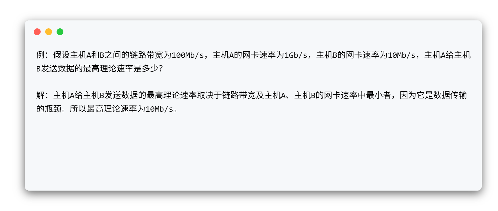

**吞吐量（Throughput）**指单位时间内通过某个网络（或信道、接口）的实际数据量，常用于对实际网络的测量。


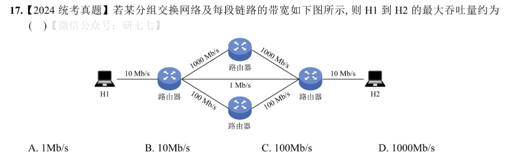

如图，两台主机之间总共有三条路径，它们的链路带宽瓶颈（即最大吞吐量）分别为10MB/s，1MB/s，10MB/s，因此两台主机之间的最大吞吐量为三者的最大值，即10MB/s。


**时延（Delay）**指数据（一个报文或分组）从网络（或链路）的一端传送到另一端所需的总时间，是以下四个时延之和。**发送时延/传输时延（transmission delay）**指节点将分组的所有比特推向链路所花的时间，即从发送分组的第一个比特算起，到该分组的最后一个比特发送完毕所花的时间，等于分组长度除以发送速率。**传播时延（propagation delay）**指电磁波在信道（传输介质）中传播一定的距离所花的时间，即一个比特从链路的一端传播到另一端所需的时间，等于信道长度除以电磁波在信道上的传播速率，取决于传播介质及收发双方的距离。**处理时延（nodal processing delay）**指分组在交换节点为存储转发而进行的一些必要处理所花的时间，例如分析分组的首部、差错检验或查找合适的路由等的时间。**排队时延（queuing delay）**指分组在路由器的输入队列或输出队列中排队等待所花的时间。在考试中，除非另有说明，否则通常不用考虑处理时延和排队时延。


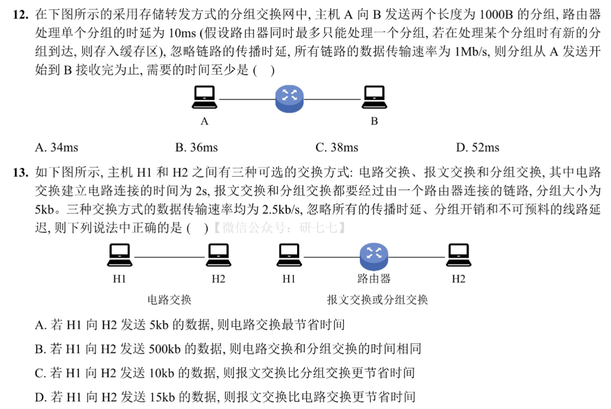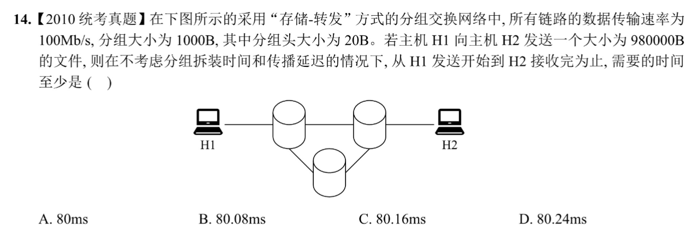

**时延带宽积**指发送端发送的第一个比特即将到达终点时，发送端已发出了多少比特，也称以比特为单位的链路长度，即时延带宽积=传播时延×信道带宽。


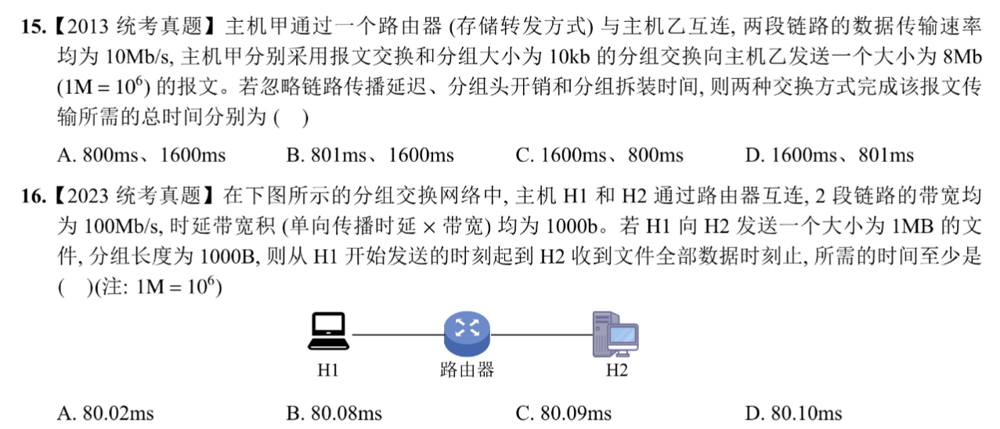

**往返时延（Round-Trip Time，RTT）**指从发送端发出一个短分组，到发送端收到来自接收端的确认（接收端收到数据后立即发送确认）总共经历的时间。在互联网中，往返时延还包括各中间节点的处理时延、排队时延及转发数据时的发送时延。


**信道利用率**用来指出某个信道有百分之多少的时间是有数据通过的，等于有数据通过的时间除以有数据通过的时间与无数据通过的时间之和。信道利用率并非越高越好，太低会浪费网络资源，太高会产生较大的时延，导致网络拥塞。


### 体系结构与参考模型


#### 分层结构（10）


**网络的体系结构（Architecture）**是指计算机网络的各层及其协议的集合，即这个计算机网络及其所应完成的功能的精确定义。计算机网络体系结构通常都具有可分层的特性，分层的基本原则如下：每层都实现一种相对独立的功能，降低大系统的复杂度；各层之间的接口自然清晰，易于理解，相互交流尽可能少；各层功能的精确定义独立于具体的实现方法，可以采用最合适的技术来实现；保持下层对上层的独立性，上层单向使用下层提供的服务；整个分层结构应能促进标准化工作。


在网络分层结构中，第n层的活动元素通常称为第n层实体。具体来说，实体指任何可发送或接收信息的硬件或软件进程，通常是某个特定的软件模块。不同机器上的同一层称为对等层，同一层的实体称为对等实体。第n层向第n+1层提供的服务包括在其以下各层提供的服务，第n层的实体称为服务提供者，服务提供者上一层的实体称为服务用户。


**协议数据单元（PDU）**指对等层之间传送的数据单位，第n层的PDU记为n-PDU。每层的协议数据单元都有一个通俗的名称，如应用层称为报文（message），传输层称为报文段（segment），网络层称为数据报（datagram），数据链路层称为帧（frame），物理层称为比特流，另外，无论是在哪一层传送的数据单元都可以笼统地用“分组”来表示。


**服务数据单元（SDU）**指层与层之间交换的数据单位，第n层的SDU记为n-SDU。**协议控制信息（PCI）**指控制协议操作的信息，第n层的PCl记为n-PCI。PDU都分为SDU和PCI两部分，当各层之间传输数据时，将从第n+1层收到的PDU作为第n层的SDU，加上第n层的PCI，就封装成了第n层的PDU，交给第n-1层后作为SDU发送，接收方接收时做相反的处理，因此可知三者的关系为n-SDU+n-PCI=n-PDU=（n-1）-SDU。


#### 协议、接口、服务 （20）


**网络协议（Network Protocol）**是指为了在网络中进行数据交换而建立的规则、标准或约定。协议是在对等实体之间进行通信的规则的集合，定义了交换的报文格式和顺序，以及报文的发送/接收或其他事件所采取的操作，由语法、语义和同步三部分组成。**语法**是指数据与控制信息的格式，**语义**是指需要发出何种控制信息、完成何种动作及做出何种应答，**同步/时序**是指执行各种操作的条件、时序关系等或事件实现顺序的详细说明。例如，TCP协议中，报文段格式是由TCP的语法定义的，建立连接时执行的握手操作是由TCP的语义定义的，三次握手操作的时序关系就是由TCP的同步定义的。


**服务访问点 （Service Access Point，SAP）**，同一节点内相邻两层的实体交换信息的逻辑接口。每层只能在紧邻的层之间定义接口，而不能跨层定义接口。协议号将网络层和运输层联系起来，端口号将运输层和应用层联系起来。


**服务 （Service）**是指下层为紧邻的上层提供的功能调用。协议是“水平的”，控制的是对等实体之间通信的规则，不对等实体之间是没有协议的；服务是“垂直的”，是由下层通过层间接口向上层提供的。本层的服务用只能看见服务而无法看见下面的协议，即下面的协议对上层的服务用户是透明的。另外，并非在一层内完成的全部功能都称为服务，只有那些能够被高一层实体“看得见”的功能才称为服务。计算机网络提供的服务可按以下三种方式分类。


**面向连接服务与无连接服务**


在**面向连接服**务中，通信前双方必须先建立连接，分配相应的资源（如缓冲区），以保证通信能正常进行，传输结束后释放连接和占用的资源。因此这种服务可分为连接建立、数据传输和连接释放三个阶段，TCP就是一种面向连接服务的协议。在**无连接服务**中，通信前双方不需要先建立连接，需要发送数据时可直接发送，将每个带有目的地址的包（报文分组）传送到线路上，由系统选定路线进行传输。这种服务常被描述为“**尽最大努力交付**”，是一种不可靠的服务，IP、UDP就是一种无连接服务的协议。


**可靠服务和不可靠服务**


**可靠服务**是指网络具有纠错、检错、应答机制，能保证数据正确、可靠地传送到目的地。**不可靠服务**是指网络只是尽量让数据正确、可靠地传送到目的地，是一种尽力而为的服务。对于提供不可靠服务的网络，其网络的正确性、可靠性要由应用或用户来保障。例如，用户收到信息后要判断信息的正确性，若不正确，则用户就要把出错信息报告给信息的发送者，以便发送者采取纠正措施。通过用户的这些措施，可将不可靠服务变成可靠服务。


**有应答服务和无应答服务**


**有应答服务**是指接收方在收到数据后向发送方给出相应的应答，该应答由传输系统内部自动实现，而不由用户实现，文件传输服务就是一种有应答服务。发送的应答既可以是肯定应答，又可以是否定应答，通常在接收到的数据有错误时发送否定应答。**无应答服务**是指接收方收到数据后不自动给出应答，若需要应答，则由高层实现，如WWW客户端收到服务器发送的页面文件后就不给出应答。


#### 网络参考模型（09，11，13，16，19，21-22）


**OSI参考模型**


OSI参考模型是国际标准化组织（ISO）提出的七层网络体系结构模型，又称为**开放系统互连参考模型（OSI/RM）** 。


**应用层（Application Layer）**是 OSI 参考模型的最高层，是用户与网络的接口。应用层为特定类型的网络应用提供访问OSI参考模型环境的手段。用户的实际应用多种多样，这就要求应用层采用不同的应用协议来满足不同类型的应用要求，因此应用层是最复杂的一层，使用的协议也最多。


**表示层（Presentation Layer）**主要处理在不同主机中交换信息的表示方式。不同机器采用的编码和表示方法不同，为了使不同表示方法的数据和信息之间能够互相交换，表示层采用抽象的标准方法定义数据结构，并采用标准的编码形式。此外，数据压缩、加密和解密也是表示层的功能。


**会话层 （Session Layer）**允许不同主机上的各个进程之间进行会话。会话是指为表示层实体或用户进程建立连接，并在连接上有序地传输数据，也称**建立同步 （SYN）**。会话层负责管理主机间的会话进程，包括建立、管理和终止进程间的会话。会话层包含一种称为检查点的机制来维持可靠会话，使通信会话在通信失效时从检查点继续恢复通信，即断点下载的原理。


**传输层/运输层（Transport Layer）**负责主机中两个进程之间的通信（端到端通信，end-to-end connection），提供端到端的流量控制、差错控制、连接建立与释放、可靠传输管理等服务，仅提供有连接可靠的服务。通过传输层的屏蔽，高层用户看不到通信子网的交替和变化。因为一台主机可同时运行多个进程，所以传输层具有复用和分用的功能。


**网络层（Network Layer）**将网络层的协议数据单元（分组）从源主机传输到目的主机，为分组交换网上的不同主机提供通信服务，传输单位是数据报，关键问题是利用相应的路由算法计算出一条合适的路径对分组进行路由选择，并实现流量控制、拥塞控制、差错控制和网际互联等功能。网络层既提供有连接可靠的虚电路服务，又提供无连接不可靠的数据报服务。


**数据链路层（Data Link Layer）**加强物理层传输原始比特流的功能，将物理层提供的可能出错的物理连接改造为逻辑上无差错的数据链路，传输单位是帧。数据链路层将网络层交来的IP分组封装成帧，并且可靠地传输到相邻节点的网络层（点到点通信，或称主机和主机之间的通信），实现节点之间的差错控制和流量控制的功能。因为外界噪声的干扰，所以原始的物理连接在传输比特流时可能发生错误。差错控制可以检测出这些差错，然后将收到的错误信息丢弃。流量控制可以协调两个节点的速率，使节点的发送速率刚好是节点B的接收速率。广播式网络在数据链路层还要控制对共享信道的访问。


**物理层（Physical Layer）**负责在物理介质上为数据端设备透明地传输原始比特流，传输单位是比特。通信链路与通信节点的连接需要一些电路接口，物理层规定了这些接口的一些参数，如机械形状和尺寸、引脚的数量和排列等，例如笔记本电脑上的网线接口。物理层规定了通信链路上所传输的信号的意义和电气特征，例如规定信号X代表数字0。传输信息所用的一些物理介质（如双绞线、光缆、无线信道等）并不在物理层协议之内，而在物理层协议下面，因此物理介质又称第0层。


链路层提供点到点通信，一个点是指一个硬件地址或 IP 地址，因为主机通过硬件地址或 IP 地址标识；传输层提供端到端通信，端是指主机中的进程，因为而进程由端口标识。


**TCP/IP 模型**


TCP/IP因为得到广泛应用而成为事实上的国际标准。


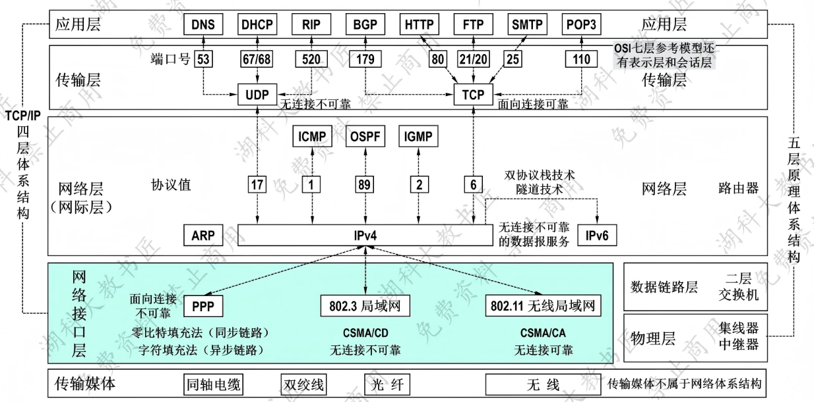

**应用层**对应OSI参考模型的会话层、表示层和应用层，包含所有的高层协议，如虚拟终端协议（Telnet）、文件传输协议（FTP）、域名解析服务（DNS）、电子邮件协议（SMTP）和超文本传输协议（HTTP）。


**传输层**使得发送端和目的端主机上的对等实体进行会话，与OSI参考模型中的传输层类似。传输层主要使用传输控制协议（Transmission Control Protocol，TCP）和用户数据报协议（User Datagram Protocol，UDP）。


**网际层**将分组发往任何网络，并为其独立地选择合适的路由，但不保证各个分组有序地到达，各个分组的有序和可靠交付由高层负责，功能上与OSI参考模型的网络层非常相似。网际层仅提供无连接不可靠的IP，它是互联网中的核心协议，TCP/IP可为各式各样的应用提供服务（everything over IP），还允许IP在由各种网络构成的互联网上运行（IP overevery thing）。


**网络接口层**负责从主机或节点接收IP分组，并将它们发送到指定的物理网络上，类似于OSI参考模型的物理层和数据链路层。但TCP/IP并未具体描述网络接口层的功能和协议，只是指出主机必须使用某种协议与网络连接，以便在其上传送IP分组。因此在学习计算机网络时，通常采用折中模型这种的方式，即五层模型。具体的物理网络既可是各种类型的局域网，如以太网、令牌环网等，又可是诸如电话网、ATM等公共数据网络。


**TCP/IP模型和OSI参考模型的比较**


OSI参考模型的最大贡献是精确定义了服务、协议和接口三个主要概念，这与现代的面向对象程序设计思想非常吻合，而TCP/IP 模型在这三个概念上没有明确区分。


OSI参考模型是7层模型，而TCP/IP模型是4层结构。TCP/IP 模型将OSI参考模型的表示层和会话层的功能合并到了应用层，还将数据链路层和物理层合并为网络接口层。


OSI参考模型先有模型，后有协议规范，通用性良好，适合描述各种网络。TCP/IP 模型正好相反，即先有协议栈，后建立模型，因此不适合任何其他的非TCP/IP 网络。


OSI参考模型在网络层支持无连接和面向连接的通信，但在传输层仅有面向连接的通信。而TCP/IP 模型认为可靠性是端到端的问题，因此它在网际层仅有一种无连接的通信模式，但传输层支持无连接和面向连接两种模式。


OSI 参考模型和TCP/IP模型都不是完美的。OSI参考模型从技术角度追求一种完美的理想状态，导致基于OSI参考模型的软件效率极低，缺乏市场与商业动力，结构复杂，运行效率低。


**报文封装**


每个协议栈的顶端都是一个面向用户的接口，下面各层是为通信服务的协议。用户传输的数据通常是用户能够理解的自然语言，通过应用层将自然语言转化为用于通信的通信数据。


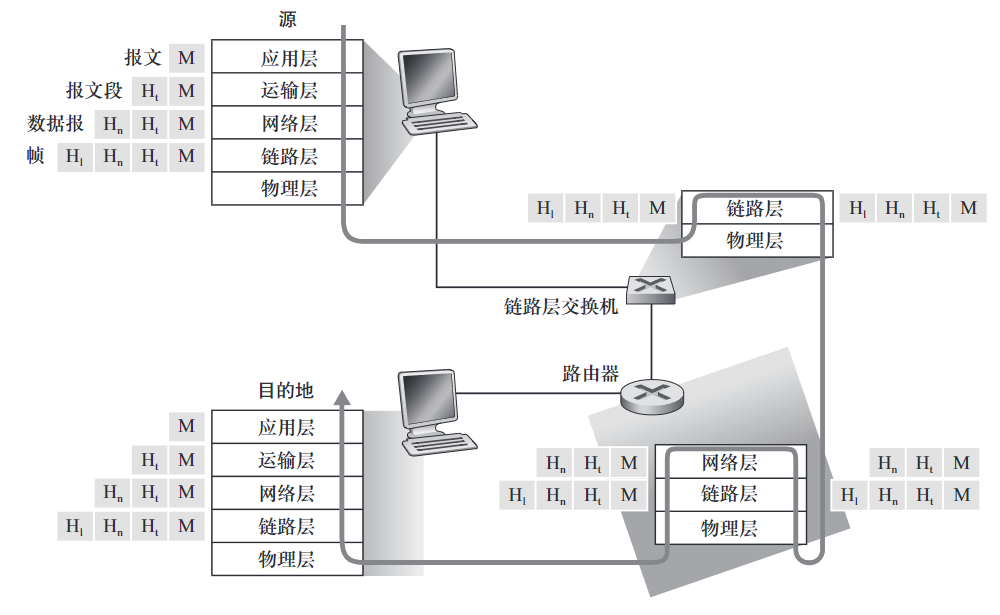

### 中继系统（09-10、13-16、20-21）


#### 冲突域和广播域


**冲突域**是指连接到同一物理介质上的所有节点的集合，这些节点之间存在**介质争用**的现象。在OSI参考模型中，冲突域被视为第1层的概念，简单复制转发信号的第1层设备所连接的节点都属于同一个冲突域，也就是说它们不能划分冲突域，而第2层、第3层设备都可以划分冲突域。


**广播域**是指接收同样广播消息的节点集合，在该集合中的任何一个节点发送一个广播帧，其他能收到这个帧的节点都被认为是该广播域的一部分。在OSI参考模型中，广播域被视为第2层的概念，第1层、第2层设备所连接的节点都属于同一个广播域，而路由器作为第3层设备则可以划分广播域，即可以连接不同的广播域。通常所说的局域网（LAN）特指使用路由器分割的网络，也就是广播域。


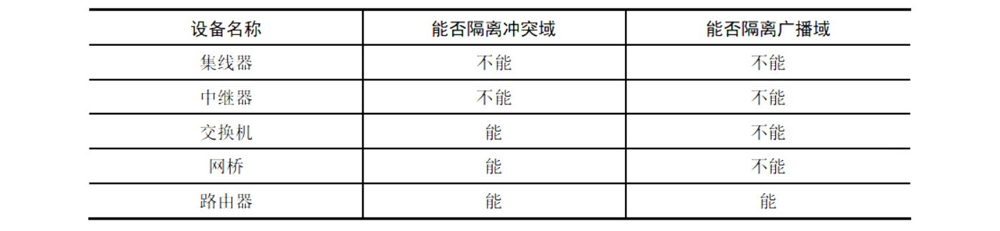

#### 中继器


中继器的主要功能是放大、整形并转发信号，以消除信号经过一长段电缆后产生的失真和衰减，使信号的波形和强度达到所需的要求，进而扩大网络传输的距离。放大器和中继器都起放大作用，只不过放大器放大的是模拟信号，其原理是放大衰减的信号，而中继器放大的是数字信号，其原理是**整形再生**衰减的信号。


中继器有两个端口，数据从一个端口输入，从另一个端口发出，端口仅作用于信号的电气部分，而不管是否有错误数据或不适于网段的数据。中继器两端的网络部分是网段，而不是子网，使用中继器连接的几个网段仍是一个局域网。中继器若出现故障，则对相邻两个网段的工作都产生影响。若某个网络设备没有存储转发功能，则认为它不能连接两个不同的协议。中继器没有存储转发功能，因此它连接两个速率不同的网段可能会出现问题，若两个网段的速率分别为10Mb/s和10/100Mb/s，则用中继器连接后，都只能工作在10Mb/s的速率。


从理论上讲，中继器的使用数量是无限的，网络因而也可无限延长。但事实上这是不可能的，因为网络标准中对信号的延迟范围做了具体规定，中继器只能在该范围内进行有效的工作，否则会引起网络故障。例如，在采用粗同轴电缆的10BASE5以太网规范中，互相串联的中继器的个数不能超过4个，而且用4个中继器串联的5段通信介质中，只有3段可以挂接计算机，其余2段只能用作扩展通信范围的链路段不能挂接计算机，这就是所谓的“**5-4-3规则**”。


#### 集线器（Hub）


当Hub工作时，一个端口接收到数据信号后，因为信号在从端口到Hub的传输过程中已有衰减，所以Hub便对该信号进行整形放大，使之再生（恢复）到发送时的状态，紧接着转发到其他所有（除输入端口外）处于工作状态的端口。集线器在一个时钟周期内只能传输一组信息，当一台集线器连接的机器数较多且多台机器经常需要同时通信时，会同时有两个或多个端口输入，输出时将发生冲突，致使这些数据都无效，使得集线器的工作效率很差。


从Hub的工作方式可以看出，它在网络中只起信号放大和转发作用，目的是扩大网络的传输范围，而不具备信号的定向传送能力，即信息传输的方向是固定的，是标准的共享式设备。使用Hub组网灵活，它将所有节点的通信集中在以其为中心的节点上，由Hub组成的网络是共享式网络，但逻辑上仍是总线网。Hub实质上是一个多端口的中继器，每个端口连接的是同一网络的不同网段，不能分割冲突域，所有端口都属于同一个冲突域，同时Hub也只能在半双工状态下工作，网络的吞吐率因而受到限制。


#### 网桥*


网桥是早期的数据链路层设备，现已被以太网交换机取代，它可以在数据链路层扩展以太网，原来的每个以太网称为一个**网段**，各个网段相对独立，一个网段的故障不影响另一个网段的运行。网桥具有识别帧和转发帧的能力，能够根据帧首部中的目的MAC地址和网桥的**帧转发表**来转发或丢弃所收到的帧，起到了过滤通信量的功能，使用网桥进行扩展时，不会将原本独立的两个冲突域合并成一个更大的冲突域。


#### 以太网交换机


**以太网交换机/二层交换机**实质是一个多接口的网桥，工作在数据链路层，能将网络分成小的冲突域，为每个用户提供更大的带宽。对于传统使用集线器的共享式10Mb/s以太网，若共有N个用户，则每个用户的平均带宽为总带宽10Mb/s的1/N。使用以太网交换机（全双工方式）连接这些主机时，虽然从每个接口到主机的带宽还是10Mb/s，但是用户通信时独占带宽，不与其他网络用户共享传输介质带宽，所以拥有N个接口的交换机的总容量为N×10Mb/s。交换机具有并行性，能同时连通多对接口，使每对相互通信的主机都能像独占通信介质那样，无冲突地传输数据，这样就不需要使用CSMA/CD协议。


当交换机的接口直接与主机或其他交换机连接时，通常都工作在全双工方式。当交换机的接口连接集线器时，只能使用CSMA/CD协议且只能工作在半双工方式。当前的交换机和计算机中的网卡都能自动识别上述两种情况。交换机是一种即插即用设备，其内部的帧转发表是通过自学习算法，基于网络中各主机间的通信，自动地逐渐建立的。交换机因为使用专用交换结构芯片，交换速率较高。


**交换模式**


**直通交换方式**，接收到帧的同时就立即按该帧的目的MAC地址决定转发接口。这种方式的转发时延非常小，缺点是不检查差错就直接转发，因此可能将一些无效帧转发给其他站。直通交换方式不适用于需要速率匹配、协议转换或差错检测的线路。如果以太网交换机采用直通模式，则只需要检验帧的目的地址，启动内部的动态查找表转换成相应的输出接口，转发时延只算8B目的地址的时延。


**存储转发交换方式**，首先缓存接收到的帧，然后检查帧是否正确，确认无误后根据目的MAC地址决定转发接口，否则将其丢弃。优点是可靠性高，且支持不同速率接口间的转换，缺点是时延较大。转发之前还可能还需要进行速率匹配或协议转换，交换机一般都具有多种速率的接口，如10Mb/s、100Mb/s的接口，以及多速率自适应接口。


**自学习功能**


**过滤**是指决定一个帧是转发到某个接口还是丢弃，而**转发**是指决定一个帧应被移至哪个接口。交换机的过滤和转发借助**交换表（switch table）**完成其一个表项至少包含一个MAC地址，和连通该MAC地址的接口。


如图，以太网交换机有4个接口，每个各连接一台计算机，MAC地址分别为A、B、C和D，交换机的交换表初始为空。


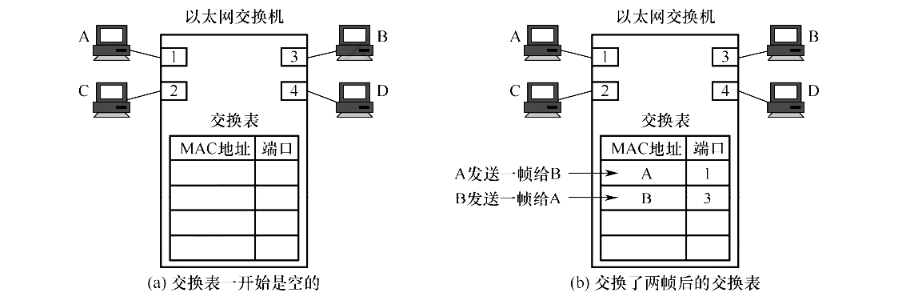

假定A先向B发送一帧，从接口1进入交换机。交换机收到帧后，先查找交换表，找不到MAC地址为B的表项。于是，交换机将该帧的源地址A和接口1写入交换表，并向除接口1外的所有接口广播这个帧（该帧是从接口1进入的，因此不应将它再从接口1转发出去）。因为目的地址不匹配，C和D丢弃该帧，只有B才收下这个目的地址正确的帧。


交换表中写入（A，1）后，从任何接口收到目的地址为A的帧都应从接口1转发出去。接下来，假定B通过接口3向A发送一帧，交换机查找交换表后，发现有表项（A.1），将该帧从接口1转发给A。显然，此时已没有必要再广播收到的帧。将该帧的源地址B和接口3写入交换表，表明以后若有发送给B的帧，则应从接口3转发出去。经过一段时间后，只要C和D也向其他主机发送帧，交换机就把C和D及对应的接口号写入交换表。这样，转发给任何主机的帧，就都能很快地在交换表中找到相应的转发接口。


因为交换机所连的主机会随时变化，所以需要更新交换表中的表项。为此，交换表的每个表项都设有一定的有效时间，过期表项会被自动删除，保证了交换表中的数据符合当前网络的实际状况。这种自学习算法使得交换机能即插即用，而不必手工配置，非常方便。


**共享式以太网和交换式以太网的对比**


假设交换机已通过自学习算法逐步建立了完整的转发表，下面说明使用集线器的共享式以太网与全部使用交换机的交换式以太网的区别。


若主机发送普通帧。对于共享式以太网，集线器将帧转发到其他所有接口，其他各主机中的网卡根据帧的目的MAC地址决定接收或丢弃该帧。对于交换式以太网，交换机收到帧后，根据帧的目的MAC地址和自身的交换表将帧明确地转发给目的主机。


若主机发送广播帧。对于共享式以太网，集线器将帧转发到其他所有接口，其他各主机中的网卡检测到帧的目的MAC地址是广播地址时，就接收该帧。对于交换式以太网，交换机检测到帧的目的MAC地址是广播地址，于是从其他所有接口转发该帧，其他各主机收到该广播帧后，就接收该帧。两种情况的效果相同，但原理并不相同。


若多对主机同时通信。对于共享式以太网，当多对主机同时通信时，必然产生冲突。对于交换式以太网，交换机能实现多对接口的高速并行交换，因此不会产生冲突。可见，集线器既不隔离广播域，又不隔离冲突域，而交换机不隔离广播域，但隔离冲突域。


#### 路由器


路由器是一种具有多个输入/输出端口的专用计算机，其任务是连接异构网络并完成分组转发。从模型的角度看，路由器是网络层设备，它实现了网络模型的下三层，即物理层、数据链路层和网络层，有能力对这三层协议的控制信息进行识别、分析以及转换，直观的理解是路由器有能力对数据“包装”这三层协议或者“拆开”这三层协议，有能力互连这三层协议不同的两个网络。


当源主机向目标主机发送数据报，当路由器收到一个待转发的数据报时，先检查源主机与目标主机是否连接在同一个网络上。若源主机和目标主机在同一个网络上，则直接交付而无须通过路由器。若源主机和目标主机不在同一个网络上，由路由表得出下一跳路由器的IP地址后，不是把这个地址填入数据报，而是送交数据链路层的**网络接口软件**。网络接口软件使用ARP协议将下一跳路由器的IP地转换成硬件地址，并将此硬件地址写入MAC帧的首部，然后根据此硬件地址找到下一跳路由器。在这个过程中，路由器按照转发表指出的路由将分组转发给下一个路由器，称为**间接交付**。可见，在同一个网络中传递数据无须路由器的参与，而跨网络通信（广播域或逻辑网络互连）必须通过路由器进行转发。例如，路由器可以连接不同的LAN，连接不同的VLAN，连接不同的WAN，或者把LAN和WAN互连起来。


**路由器的结构**


从结构上看，路由器由路由选择和分组转发两部分构成。


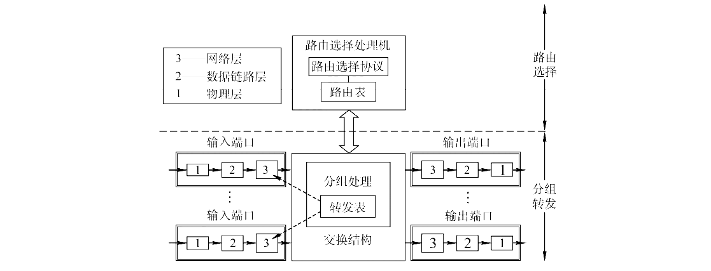

路由选择部分也称控制部分，核心构件是**路由选择处理机**，其任务是根据所选定的路由选择协议构造出路由表，同时经常或定期地和相邻路由器交换路由信息而不断更新和维护路由表。


分组转发部分由交换结构、一组输入端口和一组输出端口组成。**交换结构/交换组织**的作用是根据转发表对分组进行处理，将某个输入端口进入的分组从一个合适的输出端口转发出去，其本身就是一个“在路由器中的网络”。路由器的端口中都有物理层、数据链路层和网络层的处理模块，**输入端口**在物理层接收比特流，在数据链路层提取出帧，剥去帧的首部和尾部后，分组就被送入网络层的处理模块，**输出端口**执行相反的操作。端口在网络层的处理模块中都设有一个缓冲队列，用来暂存等待处理或已处理完毕待发送的分组，还可用来进行必要的差错检测，具有一定的时延。若分组处理的速率赶不上分组进入队列的速率，就会使后面进入队列的分组因缓冲区满而只能被丢弃，路由器中的输入或输出队列产生溢出是造成分组丢失的重要原因。网络层的处理模块还具备查找和转发功能，这对于路由器的交换功能是最重要的。


**软件定义网络（Software Defined Network，SDN）（22）**


网络层的主要任务是分组转发和路由选择，可以将网络层抽象地划分为**数据平面/层面**和**控制平面**，转发是数据平面实现的功能，路由选择是控制平面实现的功能。


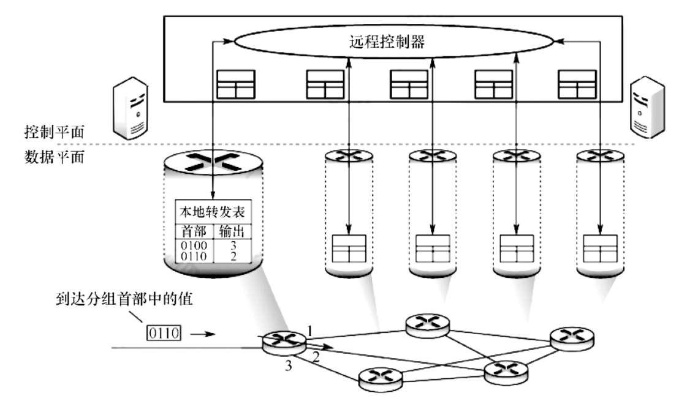

SDN采用集中式的控制平面和分布式的数据平面，两个平面相互分离，控制平面利用**控制-数据接口**对数据平面上的路由器进行集中式控制，方便软件来控制网络。控制和数据平面分离后，尤其是在使用开放的接口协议后，就实现了网络设备的制造与功能软件的开发相分离，从而有效降低了成本。


在网络的控制平面有一个逻辑上的多个服务器组成的远程控制器，它掌握各主机和整个网络的状态，为每个分组计算出最佳路由，然后通过**Openflow协议**或其他途径将**流表（即转发表）**下发给路由器。传统网络中的路由器既有转发表，又有路由选择软件，即既有数据平面，又有控制平面，但是SDN结构中的路由器不需要路由选择软件，路由器之间不再相互交换路由信息，只是完成分组转发的任务，即接收分组、查找转发表、转发分组。


SDN全局集中式控制和分布式高速转发，既利于控制平面的全局优化，又利于高性能的网络转发。本来互联网是分布式的，SDN并非要把整个互联网都改造成集中控制模式，这是不现实的，但是在某些具体条件下，特别是像一些大型的数据中心之间的广域网，使用SDN模式来建造可使网络的运行效率更高。SDN存在安全风险，集中管理容易受攻击，若崩溃，则整个网络会受到影响。另外，原本分布式的控制平面集中化后，随着网络规模扩大，控制器可能成为网络性能的瓶颈。


灵活可编程与性能的平衡，控制和转发功能分离后，使得网络可以由专有的自动化工具以编程方式配置。SDN通过为开发者提供强大的编程接口，使得网络具有很好的编程性。对上层应用的开发者，SDN提供的编程接口称为**北向接口**，北向接口提供了一系列丰富的API，开发者可以在此基础上设计自己的应用，而不必关心底层的硬件细节。SDN控制器和转发设备建立双向会话的接口称为**南向接口**，通过不同的南向接口协议如Openflow，SDN控制器就可兼容不同的硬件设备，同时可在设备中实现上层应用的逻辑。SDN控制器集群内部控制器之间的通信接口称为**东西向接口**，用于增强整个控制平面的可靠性和可拓展性。


## 应用层


【考纲内容】


（一）网络应用模型：客户/服务器模型；P2P模型

（二）域名系统（DNS）：层次域名空间；域名服务器；域名解析过程

（三）文件传输协议（FTP）：FTP的工作原理；控制连接与数据连接

（四）电子邮件：电子邮件系统的组成结构；电子邮件格式与MIME；SMTP与POP3

（五）万维网（WWW）：WWW的概念与组成结构；HTTP


应用层精确定义了**位于不同主机中的多个应用进程之间**的通信和协同必须遵循严格的规则。应用进程借助**应用层协议（application layer protocol）**来使用网络所提供的通信服务。应用层协议应当定义如下内容：应用进程交换的报文类型，如请求报文和响应报文；各种报文类型的语法，即报文中的各个字段及其详细描述；字段的语义，即包含在字段中的信息的含义；进程何时、如何发送报文，以及对报文进行响应的规则。


### 网络应用模型（19）


**客户/服务器（Client/Server，C/S）模型**


客户是服务请求方，服务器是服务提供方。服务器启动后就一直不断地运行，被动等待并接收来自各地客户的请求，服务器上运行着专门用来提供某种服务的程序，可以同时处理多个远程或本地客户的请求。使用C/S模型的常见应用包括Web、文件传输协议（FTP）、远程登录和电子邮件等。


服务器不需要知道客户程序的地址，客户程序必须知道服务器程序的地址。网络中各计算机的地位不平等，服务器可通过对用户权限的限制来达到管理客户机的目的。整个网络的管理工作由少数服务器负责，因此网络的管理非常集中和方便。客户机相互之间不直接通信。可扩展性不佳，受服务器硬件和网络带宽的限制，服务器支持的客户机数量有限。


**P2P模型**


在C/S模型中，服务器性能的好坏决定了整个系统的性能，当大量用户请求服务时，服务器就必然成为系统的瓶颈。P2P模型的思想是整个网络中的传输内容不再被保存在中心服务器上，每个节点都同时具有下载、上传的功能，其权利和义务都是大体对等的，任意一对计算机，即对等方（Peer）直接相互通信。实际上，P2P模型从本质上来看仍然使用客户/服务器模型，每个节点既作为客户访问其他节点的资源，又作为服务器提供资源给其他节点访问。


P2P模型的优点：减轻了服务器的计算压力，消除了对某个服务器的完全依赖，可以将任务分配到各个节点上，因此大大提高了系统效率和资源利用率。多个客户机之间可以直接共享文档。可扩展性好，传统服务器有响应和带宽的限制，因此只能接受一定数量的请求。网络健壮性强，单个节点的失效不会影响其他部分的节点。


P2P模型的缺点：在获取服务的同时，还要给其他节点提供服务，因此会占用较多的内存，影响整机速度。例如，经常进行P2P下载还会对硬盘造成较大的损伤。据某互联网调研机构统计，某些年份P2P程序占了互联网50%-90%的流量，使网络变得非常拥塞，因此各大互联网服务提供商（ISP）如电信、网通等通常都对P2P应用持反对态度。


### 域名系统（DNS，Domain Name System）（10，16，18，20-21）


DNS系统被设计成为一个联机分布式数据库系统，采用C/S模型，其协议默认使用UDP，且最大报文长度为 512B，使用53号端口。当响应报文超过 512B 时，服务器返回一个“截断标志”（TC=1），指示响应被截断。在这种情况下，UDP 的一次查询-响应交互只需一个 RTT（即客户端发送查询，服务器返回截断响应）。


在某些特殊情况下，DNS需要使用传输层的TCP（DNS服务器仍使用熟知端口号53），例如DNS响应报文过大，使得将其封装成UDP用户数据报后长度超过了DNS规定的512B，或者主DNS服务器向从DNS服务器同步整个区域数据时，涉及大容量数据传输，必须使用TCP。


从概念上可将DNS分为层次域名空间、域名服务器和解析器三部分。


**域名结构**


因特网采用层次树状结构的命名方法，任何连接在互联网上的主机或路由器都有一个唯一的层次结构的名字，即**域名（domain name）**​。域名和IP地址、主机不具备一一对应关系，多台主机可以映射到同一个域名上，如负载均衡；一台主机也可以映射到多个域名上，如虚拟主机。​“域”​是名字空间中一个可被管理的划分，还可以继续划分子域，就形成了顶级域、二级域、三级域等。DNS既不规定一个域名需要包含多少个下级域名，也不规定每一级的域名代表什么意思。各级域名由其上一级的域名管理机构管理，最高的顶级域名则由ICANN进行管理。


互联网的名字空间是按照机构的组织来划分的，与物理的网络无关，与IP地址中的“子网”也没有关系，域名只是个逻辑概念，并不代表计算机所在的物理地点。变长的域名使用有助记忆的字符串，而IP地址是定长的32位二进制数字，非常便于机器进行处理。另外，域名中的“点”和点分十进制IP地址中的“点”也无一一对应的关系。


DNS规定，域名中的标号都由英文字母和数字组成；每个标号不超过63个字符，但为了记忆方便最好不要超过12个字符；也不区分大小写字母；除连字符外不能使用其他的标点符号；域名的级别从右到左依次递增；由多个标号组成的完整域名总共不超过255个字符。


**域名服务器**


DNS服务器按照层次安排，但是管辖范围不是以“域”为单位，而是以“区”为单位。一个DNS服务器所负责管辖的或有权限的范围叫做区（zone）​，区是“域”的子集。各单位根据具体情况来划分自己管辖范围的区，区中的所有节点必须是能够连通的。每一个区设置相应的**权限域名服务器（authoritative name server）**​，用来保存该区中的所有主机的域名到IP地址的映射。


**根域名服务器（root name server）​**是最高层次也是最重要的域名服务器，所有根域名服务器都知道所有的顶级域名服务器的域名和IP地址。不管是哪一个本地域名服务器，只要无法解析域名，首先要求助于根域名服务器。互联网的根域名服务器只有13个域名，由13套装置（13 installations）构成，每套装置在多地安装镜像根服务器，这些镜像服务器使用同一个域名，常用从A到M来表示13组根域名服务器。根域名服务器由美国负责运营，但是位置遍布全世界，为了提供更可靠的服务，根域名服务器往往由多台机器组成，实际上是冗余服务器的集群，为了安全起见有些服务器的具体地点还是保密的​。由于根域名服务器采用了**任播（anycast）技术**，因此当DNS客户向某个根域名服务器的IP地址发出查询报文时，互联网上的路由器就能找到离这个DNS客户最近的一个根域名服务器。这样做不仅加快了DNS的查询过程，也更加合理地利用了互联网的资源。根域名服务器用来管辖顶级域，通常并不直接把待查询的域名直接转换成IP地址，也没有存放这种信息​，而是告诉本地域名服务器下一步应当找哪一个顶级域名服务器进行迭代查询。


**顶级域名服务器**负责管理在该顶级域名服务器注册的所有二级域名，如果查到DNS查询请求的结果，就给出相应的回答，如果查不到，就返回下一步应当查找的域名服务器的IP地址。


每台主机都必须在**权限/授权域名服务器**处登记，权限域名服务器总能将其管辖的主机名转换为该主机的IP地址。为了更加可靠地工作，一台主机最好至少有两个权限域名服务器。实际上，许多域名服务器都同时充当本地域名服务器和权限域名服务器。


每个**因特网服务提供者（ISP）**，或一所大学，甚至一所大学中的各个系，都可以拥有一个**本地域名服务器**。当一台主机发出DNS查询请求时，这个查询请求报文就发送给该主机的本地域名服务器。在408中，主机和本地域名服务器位于同一个局域网中。


**域名解析**


域名到IP地址的解析是由运行在域名服务器上的程序完成的，每个域名服务器不但能够进行一些域名到IP地址的解析，而且必须具有连向其他域名服务器的信息。当自己不能进行域名到IP地址的转换时，能够知道到什么地方去找其他域名服务器。DNS使用了大量的域名服务器，它们按层次方式组织。没有一台域名服务器具有因特网上所有主机的映射，相反该映射分布在所有的域名服务器上。


大多数域名都能在本地进行解析（resolve），仅少量解析需要在互联网上通信，因此DNS系统的效率很高。当某一个应用进程需要把主机名解析为IP地址时，调用解析程序（resolver）成为DNS的一个客户，把待解析的域名放在**DNS请求报文**中，以**UDP用户数据报方式**发给本地域名服务器（使用UDP是为了减少开销）​。本地域名服务器在查找到域名后，把对应的IP地址放在**回答报文**中返回；若本地域名服务器不能回答该请求，则此域名服务器就暂时成为DNS中的另一个客户，并向其他域名服务器发出查询请求。


主机只需要知道本地域名服务器的IP地址，其他工作由本地域名服务器完成，即主机向本地域名服务器的查询都采用递归查询，而本地域名服务器向其他域名服务器可以采用递归查询或迭代查询。某客户机想获知某个域名对应主机的IP地址，域名解析过程最多需要使用8个UDP报文，其中4个查询报文和4个回答报文。


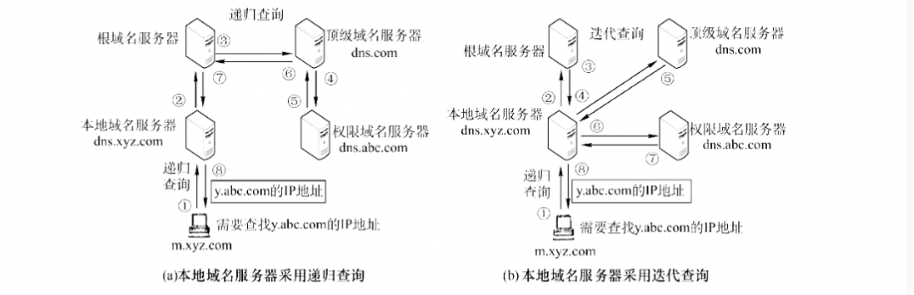

**递归查询**是指本地域名服务器只需向根域名服务器查询一次，后面的几次查询都是递归地在其他几个域名服务器之间进行的。因为递归方法给根域名服务器造成的负载过大，所以实际中几乎不使用。


**迭代查询**是指当域名服务器收到本地域名服务器发出的**迭代查询请求报文**时，要么给出所要查询的IP地址，要么告诉本地域名服务器下一步应当向哪个域名服务器进行查询，让本地域名服务器进行后续的查询，而不替本地域名服务器进行后续的查询。


i. 客户机查询本机最近的域名高速缓存，在408中默认主机不缓存域名。


ii. 客户机向其本地域名服务器发出DNS请求报文（递归查询）。


iii. 本地域名服务器收到请求后，查询本地缓存，若没有该记录，则以DNS客户的身份向根域名服务器发出解析请求报文（迭代查询）。根域名服务器收到请求后，判断该域名属于.com域，将对应的顶级域名服务器dns.com的IP地址返回给本地域名服务器。


iv. 本地域名服务器向顶级域名服务器dns.com发出解析请求报文（迭代查询）。顶级域名服务器dns.com收到请求后，判断该域名属于abc.com域，因此将对应的权限域名服务器dns.abe.com的IP地址返回给本地域名服务器。


v. 本地域名服务器向权限域名服务器dns.abc.com发起解析请求报文（迭代查询）。权限域名服务器dns.abc.com收到请求后，将查询结果返回给本地域名服务器。


vi. 本地域名服务器将查询结果保存到本地缓存，同时返回给客户机。


为了提高DNS的查询效率，并减少因特网上的DNS查询报文数量，在域名服务器中广泛地使用了高速缓存，用来缓存最近查询过的域名的相关映射信息。因为主机名和IP地址之间的映射不是永久的，所以DNS服务器将在一段时间后丢弃高速缓存中的信息。在主机中同样也很需要高速缓存，许多主机在启动时从本地域名服务器下载域名和地址的全部数据库，维护存放自己最近使用的域名的高速缓存，只在从缓存中找不到域名时才使用域名服务器。


### 动态主机配置协议（Dynamic Host Configuration Protocol，DHCP）（15，22）


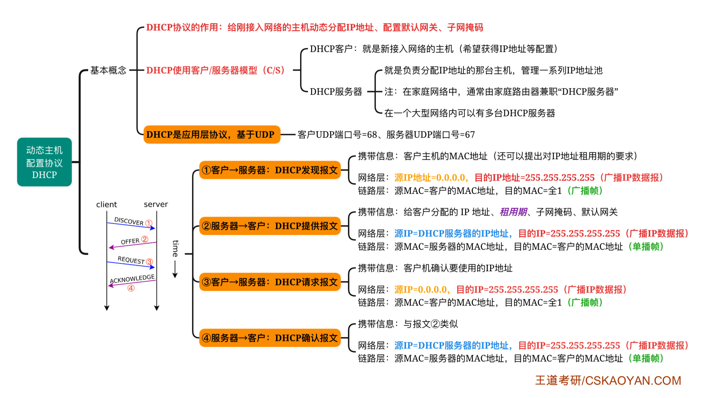

无论是手机还是笔记本，在没有连接到网络之前是没有IP地址的，设备想要获得IP地址，需要向DHCP服务器申请。DHCP服务器通过DHCP协议，给刚接入网络的主机进行动态配置，即分配IP地址、子网掩码和默认网关（默认路由器的IP地址）。它提供了即插即用的联网机制，允许一台计算机加入新的网络和自动获取IP地址而不用手工参与。


DHCP协议分配IP地址分为静态分配和动态分配方式，静态分配由网络管理员手工配置某台客户端特定的IP地址，当客户端请求分配时，DHCP服务器就将手动配置的IP地址分配给客户端；自动分配是指当DHCP客户端第一次向服务器端租用到第一个IP地址后，就将这个IP地址永久分配给客户端使用，直到客户端关机或离开DHCP服务器的负责区域。


DHCP是基于UDP的应用层协议，因为TCP需要建立连接，若连对方的IP地址都不知道，则更不可能通过双方的套接字建立连接。


DHCP使用C/S模型，需要IP地址的主机在启动时就向DHCP服务器广播发送**发现报文（DISCOVER）**，这时该主机就成为DHCP客户。本地网络上的所有主机都能收到这个广播报文，但只有DHCP服务器才能回答该广播报文。DHCP服务器先在其数据库中查找该计算机的配置信息，找到则返回找到的信息，若找不到就从服务器的IP地址池中取一个地址，将IP地址等配置信息封装成**提供报文（OFFER）**法给该主机。再经过**DHCP请求（REQUEST）**和**DHCP确认（ACK）**，IP地址被分配给主机，同时将子网掩码、网关IP地址、DNS服务器地址交给主机。


DHCP服务器分配给DHCP客户的IP地址是临时的，因此DHCP客户只能在一段有限的时间内使用这个分配到的IP地址。DHCP称这段时间为租用期，数值应由DHCP服务器自己决定，DHCP客户也可在自己发送的报文中提出对租用期的要求。DHCP客户可随时提前终止服务器提供的租用期，这时只需向DHCP服务器发送**释放报文**。


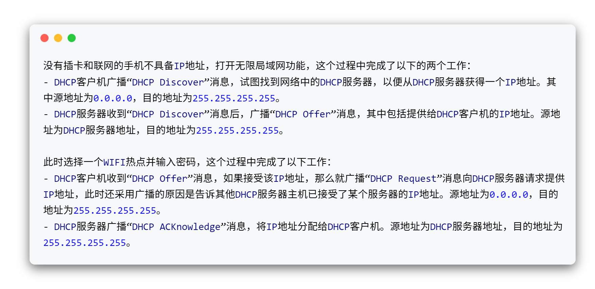

在一台主机在尚未分配IP地址时，主机只能使用0.0.0.0作为源IP地址，代表本主机。DHCP客户和服务器端需要通过广播方式来进行交互，因为DHCP执行初期，客户机不知道服务器端的IP地址，而在执行中，客户机并未被分配IP地址，从而导致两者之间的通信必须采用广播的方式，所以只能以255.255.255.255这个广播地址作为目的IP地址。


0.0.0.0在DHCP中表示本主机，在路由表中0.0.0.0表示默认路由，当实在不知道转发到何处时，会转发到0.0.0.0这个表项对应的端口。255.255.255.255和主机号全1的IP地址都是广播地址，如果已知该子网的地址块，则使用主机号全1形式的广播IP地址，如果对链路信息完全不清楚，采用255.255.255.255。在408中，只有DHCP协议需要用到广播地址255.255.255.255。不管是主机号全1的广播IP地址，还是255.255.255.255这个广播IP地址，其对应的链路层目的MAC地址统一都是ff-ff-ff-ff-ff-ff。


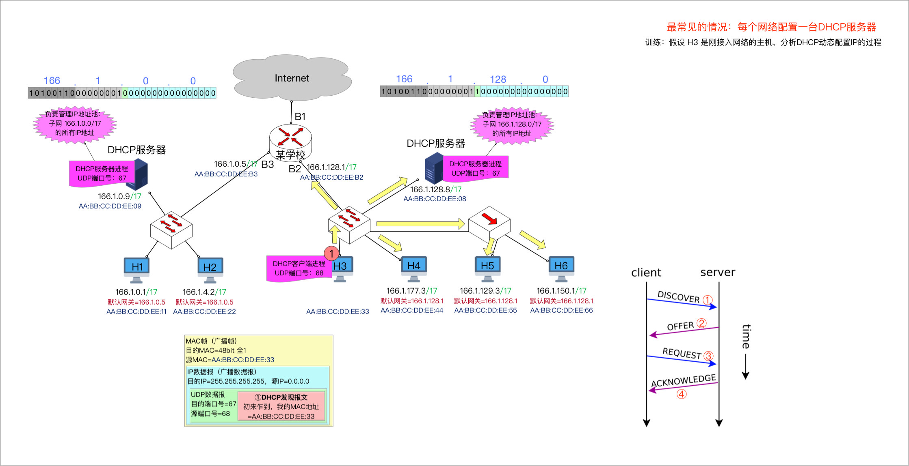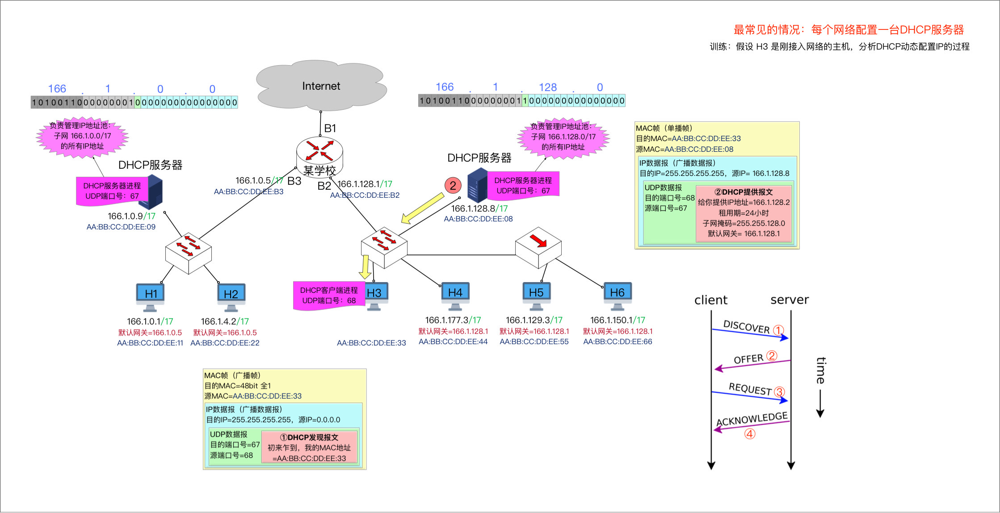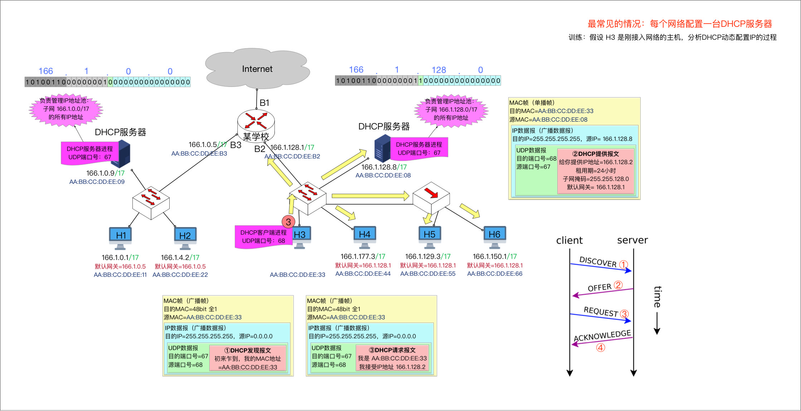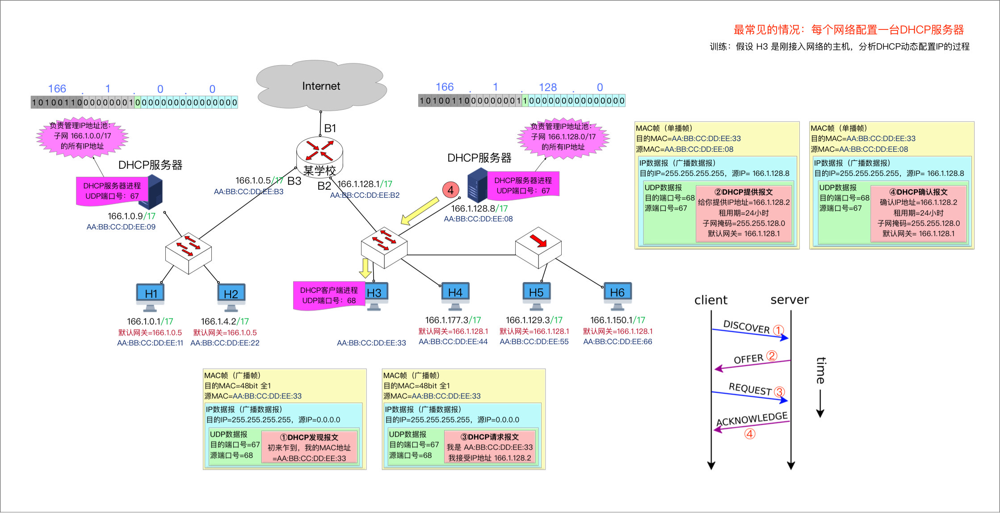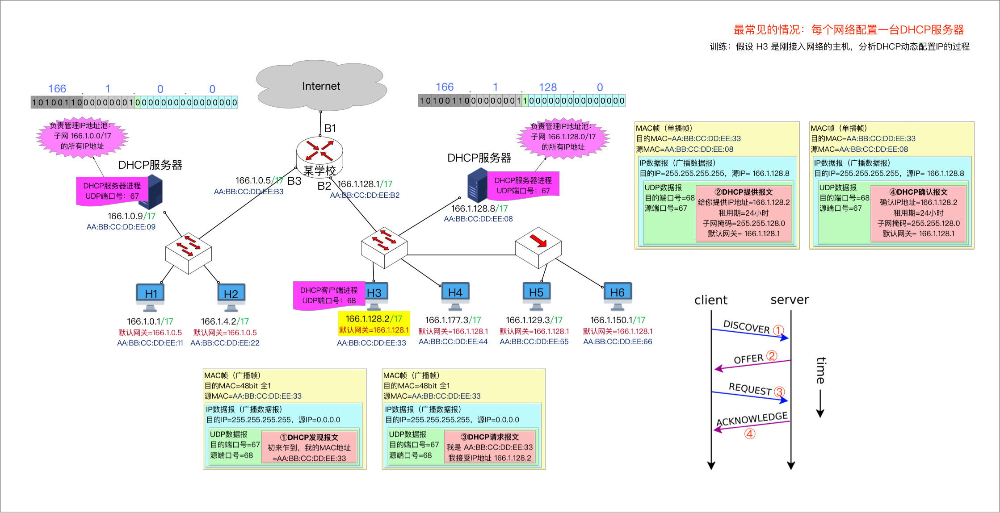

### 万维网（World Wide Web，WWW）（18）


万维网是一个分布式、联机式的信息存储空间，是无数个网络站点和网页的集合，与电子邮件、Usenet和新闻组等在一起构成了Internet。万维网以C/S模式工作，浏览器是在用户主机上的万维网客户程序，万维网文档所驻留的主机则运行服务器程序，客户程序向服务器程序发出请求，服务器程序向客户程序送回客户所要的万维网文档。万维网万维网的内核部分是由三个标准构成：


**统一资源定位符（URL）**是对可以从因特网上得到的资源的位置和访问方法的一种简洁表示，相当于文件名在网络范围的扩展，负责标识万维网上的各种文档，并使每个文档在整个万维网的范围内具有唯一的标识符。URL不区分大小写，一般形式是<协议>://<主机>：<端口>/<路径>。<协议>指用什么协议获取万维网文档，常见的协议有http、ftp等；<主机>是存放资源的主机在因特网中的域名或IP地址；<端口>和<路径>有时可省略。


万维网使用链接的方法从因特网上的一个站点访问另一个站点，主动地按需获取丰富的信息。**超文本标记语言（HTML）**是一种文档结构的标记语言，它使用一些约定的标记对页面上的各种信息（包括文字、声音、图像、视频等）、格式进行描述，使得万维网页面的设计者很方便地用一个超链接从本页面的某处链接到因特网上的任何一个页面，并能在自己的计算机屏幕上显示这些页面。


### 超文本传输协议（HTTP）（14-15，20-22，24）


HTTP是**面向事务（Transaction-oriented）**的应用层协议，它规定了在浏览器和服务器之间的请求和响应的格式与规则，使用TCP连接进行可靠传输。


浏览器要访问WWW服务器时，首先向DNS请求解析WWW服务器的域名。一旦获得了服务器的IP地址，就通过TCP向服务器发送连接建立请求。每个万维网站点都有一个服务器进程，它不断地监听TCP的默认端口80，当监听到连接请求后便与浏览器建立连接。然后浏览器向服务器发送请求获取某个Web页面的HTTP请求。服务器收到请求后构建所请求Web页的必需信息，通过HTTP响应返回给浏览器。浏览器解释渲染信息，将Web页显示给用户。


**HTTP的特点**


**无连接**，虽然HTTP使用了TCP连接，但通信的双方在交换HTTP报文之前不需要先建立HTTP连接，不必考虑数据在传输过程中被丢弃后又怎样被重传。


**无状态**，同一个客户第二次访问同一个服务器上的页面时，服务器的响应与第一次被访问时的相同，因为服务器并不记得曾经服务过的这个客户。这种无状态特性简化了服务器的设计，使之更易支持大量并发的请求。


在实际应用中，通常使用**Cookie**加数据库的方式来跟踪用户的活动。用户初次浏览某个使用Cookie的网站时，该网站服务器会为用户产生一个唯一的Cookie识别码，并以此为索引在后端数据库中创建一个项目，用来记录用户访问该网站的各种信息。接着在给用户的HTTP响应报文中添加一个Set-cookie的首部行“Set cookie:12345”，用户收到响应后，就在它管理的特定Cookie文件中添加该服务器的主机名和Cookie识别码。当用户再次浏览这个网站时，会取出这个网站的识别码，并在HTTP请求报文中添加一个Cookie首部行“Cookie:12345”。服务器根据Cookie识别码就能从数据库中查询到该用户的活动记录，进而执行一些个性化的工作，如根据用户的历史浏览记录向其推荐新商品等。


HTTP既可使用非持续连接（HTTP/1.0），又可使用持续连接（HTTP/1.1支持）。


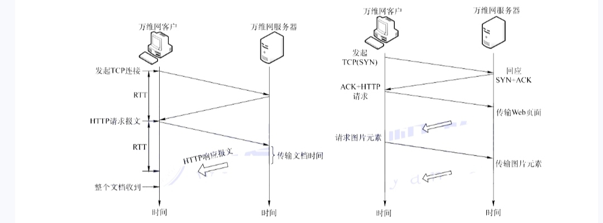

**非持续连接**，每个网页元素对象的传输都需要单独建立一个TCP连接。请求一个万维网文档所需的时间是该文档的传输时间（与文档大小成正比）加上两倍RTT，一个RTT用于TCP连接，另一个RTT用于请求和接收文档。每请求一个对象都导致2RTT的开销，此外每次建立新的TCP连接都要分配缓存和变量，使万维网服务器的负担很重。为了减小时延，浏览器通常会建立多个并行的TCP连接以同时请求多个对象。


**持续连接**，万维网服务器在发送响应后仍然保持这条连接，使同一个客户和该服务器可以继续在这条TCP连接上传送后续的HTTP请求报文和响应报文。HTTP/1.1默认使用持续连接（Connection:Keep-Alive），但是可以设置HTTP首部字段Connection为Close使用非持续连接。持续连接又分为非流水线和流水线两种工作方式。对于**非流水线方式**，客户在收到前一个响应后才能发出下一个请求，服务器在发送完一个对象后，其TCP连接就处于空闲状态，浪费了服务器资源。对于**流水线方式**，客户可以连续发出对各个对象的请求，服务器就可连续响应这些请求。若所有的请求和响应都是连续的，所有对象共计经历1RTT延迟，而不是像非流水线方式那样，每个对象都必须有1RTT延迟。这种方式减少了TCP连接中的空闲时间，提高了效率。此外，因为HTTP是基于TCP的，所以每RTT内传送的数据量还要受到TCP发送窗口的限制。


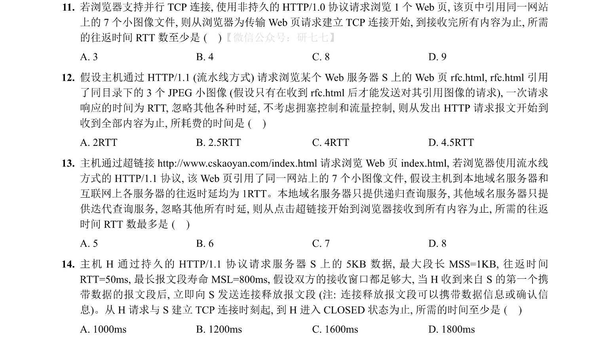

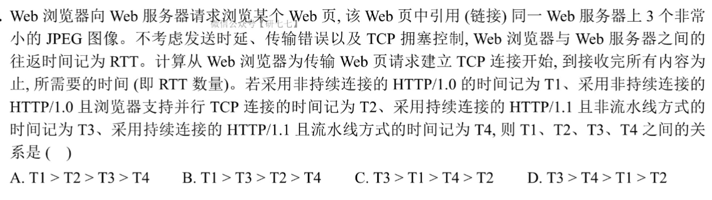

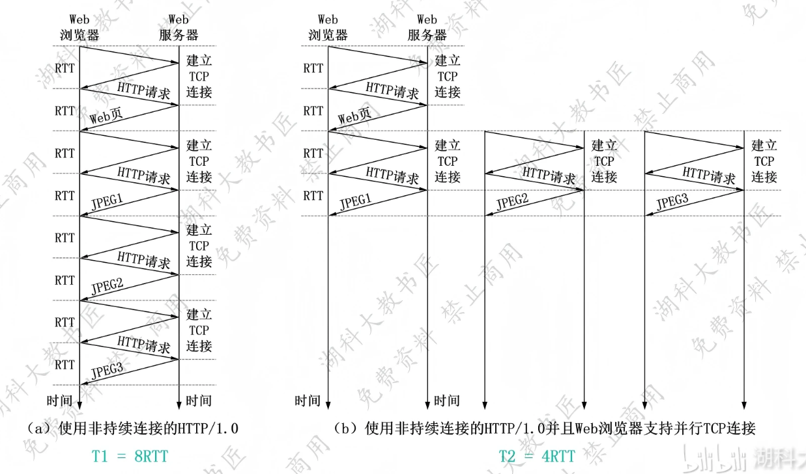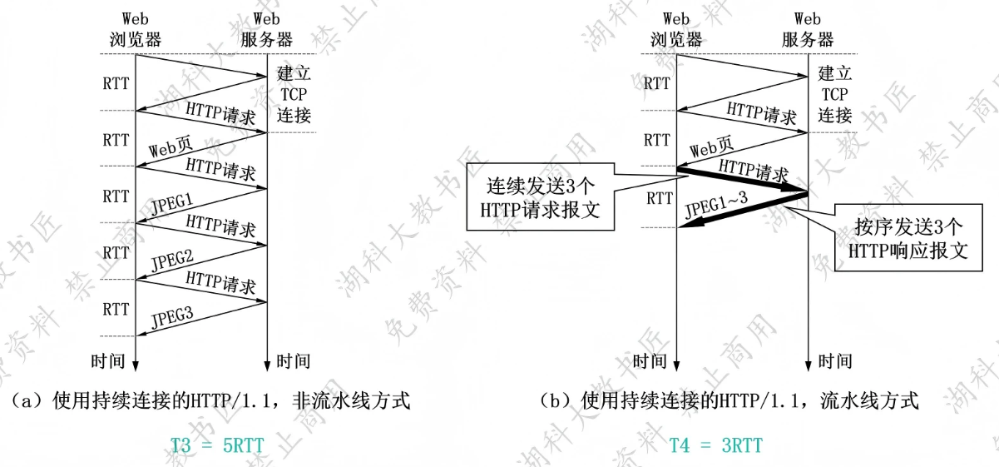

**HTTP的报文结构**


HTTP是**面向文本的（Text-Oriented）**，因此报文中的每个字段都是一些ASCII码串，并且每个字段的长度都是不确定的，分为请求报文和响应报文，两种报文都由三个部分组成，区别是开始行不同。


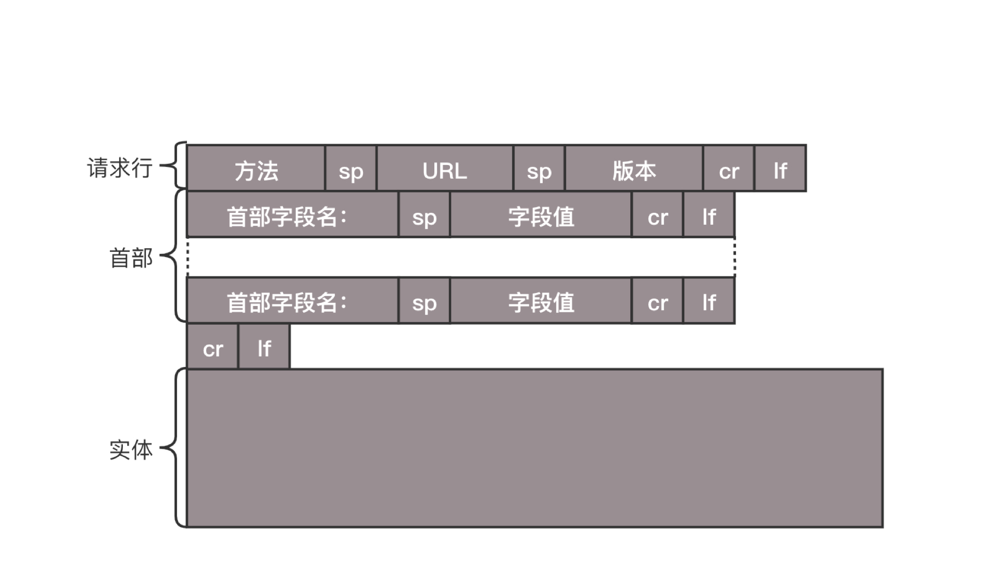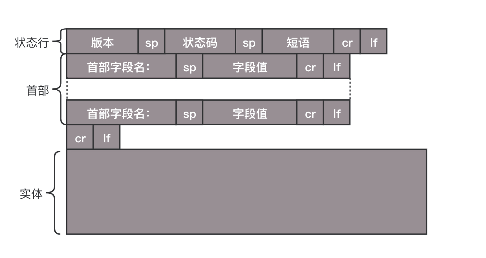
**开始行**，请求报文中的开始行称为请求行，响应报文中的开始行称为状态行。开始行的三个字段之间都以空格分隔，最后的“CR”和“LF”分别代表“回车”和“换行”。请求报文的“请求行”中的“方法”是对所请求对象进行的操作，这些方法实际上也就是一些命令。


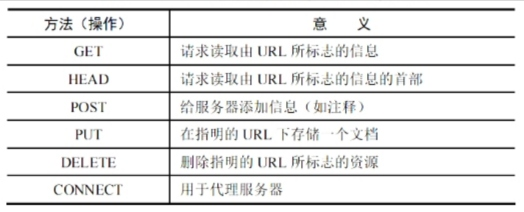

HTTP的服务器往往是不允许上传文件的，在实际使用过程中，POST往往用来创建一个资源，而PUT往往是用来修改一个资源的。使用HEAD方法时，服务器可对HTTP报文进行响应，但是不返回对象，主要用于调试。


**首部行**，用来说明浏览器、服务器或报文主体的一些信息。首部可以有几行，但也可以不使用。在每个首部行中都有首部字段名和它的值，每一行的结束都要有“回车”和“换行”。整个首部行结束时，还有一空行将首部行和后面的实体主体分开。


**实体主体**：请求报文中一般不用这个字段，响应报文中也可能没有这个字段。例如，当服务器无法找到客户所请求的文件时，服务器返回的响应报文就没有实体主体字段，此时在响应报文的状态行中会返回一个状态码404。


下而是一个典型的HTTP请求报文：


```plain
GET /bbs/index.htm HTTP/1.1  指明方法“GET”、相对URL、HTTP版本；
Host:www.cskaoyan.com        指明服务器的域名；
Connection: Keep-Alive       要求服务器在发送完被请求的文档后保持这条连接；
User-Agent: Mozilla/5.0      表明用户代理是浏览器Mozilla/5.0；
Accept-Language:cn           表示用户希望优先得到中文版本的文档；
```


下面是HTTP响应报文中常见的三种状态行：


```plain
HTTP/1.1 202 Accepted        接受请求；
HTTP/1.1 400 Bad Request     错误的请求；
HTTP/1.1 404 Not Found       找不到页面；
```


### 文件传输协议（File Transfer Protocol，FTP）（09，17-18，23）


**工作原理**


FTP是因特网上使用得最广泛的文件传输协议，它提供交互式的访问，一个主要特征是允许客户指明文件的类型与格式，并允许文件具有存取权限。FTP屏蔽了各计算机系统的细节，因而适合于在异构网络中的任意计算机之间传送文件。除此之外，还提供不同种类主机系统（硬、软件体系等都可以不同）之间的文件传输能力，具备以用户权限管理的方式提供用户对远程FTP服务器上的文件管理能力，以匿名FTP的方式提供公用文件共享的能力。


FTP采用C/S的工作方式，使用TCP可靠的传输服务。一个FTP服务器进程可同时为多个客户进程提供服务，服务器进程由一个负责接收新的请求的主进程，和有若干负责处理单个请求的从属进程组成，主进程与从属进程是并发执行的。从属进程对客户进程的请求处理完毕后即终止。


FTP服务器必须在整个会话期间保留用户的状态信息，特别是服务器必须把指定的用户账户与控制连接联系起来，服务器必须追踪用户在远程目录树上的当前位置。


**控制连接**


服务器监听21号熟知端口等待客户连接，建立在这个端口上的连接称为控制连接，用来传输如连接请求、传送请求等控制信息。FTP客户发出的传送请求，通过控制连接发送给服务器端的控制进程，但控制连接并不用来传送文件。控制连接在整个会话期间一直保持打开状态，在传输文件时还可以使用，如客户在传输中途发一个中止传输的命令。


**数据连接**


服务器端的控制进程在接收到FTP客户发送来的文件传输请求后，就创建“数据传送进程”和“数据连接”。数据连接用来连接客户端和服务器端的数据传送进程，数据传送进程实际完成文件的传送。数据连接是非连续的，每次数据传送都要建立数据连接，在传送完毕后关闭数据传送连接并结束运行。


数据连接有两种传输模式，这是针对服务器而言的，选择权在客户端，一般默认为采用主动模式。**主动模式（PORT）**中，客户端连接到服务器的21端口，登录成功后要读取数据时，客户端随机开放一个端口，并发送**PORT命令**告知服务器，服务器收到命令和端口号后，通过20端口和客户端开放的端口连接，发送数据。**被动模式（PASV）**中，客户端要读取数据时，发送**PASV命令**到服务器，服务器在本地随机开放一个端口，并告知客户端，客户端再连接到服务器开放的端口进行数据传输。


因为FTP使用了一个分离的控制连接，所以也称FTP的控制信息是**带外（Out-of-band）传送**的。使用FTP时，要修改服务器上的文件，就需要先将此文件传送到本地主机，然后将修改后的文件副本传送到原服务器，来回传送耗费很多时间，并不适合在两个计算机之间共享读写文件。**网络文件系统（NFS）**采用另一种思路，它允许进程打开一个远程文件，并能在该文件的某个特定位置开始读写数据，用户只需复制一个大文件中的一个很小的片段，而不需要复制整个大文件。


### 电子邮件系统（e-mail）（12-15，18）


电子邮件是一种异步通信方式，通信时不需要双方同时在场。电子邮件把邮件发送到收件人使用的邮件服务器，并放在其中的收件人邮箱中，收件人可以随时上网到自己使用的邮件服务器进行读取。


电子邮件系统一般具有三个主要构件。其中，**用户代理（User Agent，UA）**是用户与电子邮件系统的接口，至少应当具有撰写、显示和邮件处理的功能，通常情况是一个运行在PC上的程序，即电子邮件客户端软件如Outlook和Foxmail等。**邮件服务器**的功能是发送和接收邮件，同时还要向发件人报告邮件传送的情况（已交付、被拒绝、丢失等），以C/S模式工作，能够同时充当客户和服务器。**邮件发送协议**用于用户代理向邮件服务器发送邮件或在邮件服务器之间发送邮件，如SMTP。SMTP用的是PUSH的通信方式，即用户代理向邮件服务器发送邮件及在邮件服务器之间发送邮件时，SMTP客户将邮件推送到SMTP服务器。**邮件读取协议**用于用户代理从邮件服务器读取邮件，如POP3。POP3用的是PULL的通信方式，即用户读取邮件时，用户代理向邮件服务器发出请求，拉取用户邮箱中的邮件。


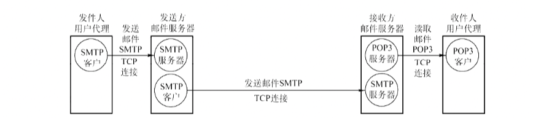

#### 简单邮件传输协议（Simple Mail Transfer Protocol，SMTP）


SMTP采用C/S模式，负责发送邮件的SMTP进程是SMTP客户，负责接收邮件的SMTP进程是SMTP服务器。


**连接建立**


发件人的邮件发送到发送方邮件服务器的邮件缓存中后，SMTP客户就每隔一定时间对邮件缓存扫描一次，如果发现有邮件，就与接收方邮件服务器的SMTP服务器的熟知端口号25建立TCP连接。连接建立后，接收方SMTP服务器发出220 Service ready（服务就绪），然后SMTP客户向SMTP服务器发送**HELLO命令**，附上发送方的主机名。


SMTP不使用中间的邮件服务器，不管相隔多远，在传送过程中要经过多少个路由器，TCP连接总是在发送方和接收方这两个邮件服务器之间直接建立。当接收方邮件服务器因故障暂时不能建立连接时，发送方的邮件服务器只能等待一段时间后再次尝试连接。


**邮件传送**


邮件的传送从**MAIL命令**开始，MAIL命令后面有发件人的地址，如MAIL FROM:<fh@hit.edu.cn>。若SMTP服务器已准备好接收邮件，则回答250 OK，下面跟着一个或多个**RCPT命令**，格式为RCPT TO: <收件人地址>。每发送一个RCPT命令，都应有相应的信息从SMTP服务器返回，如250 OK或550 No such user here（无此用户）。RCPT命令的作用是，先弄清接收方系统是否已做好接收邮件的准备，然后才发送邮件，以便不至于发送了很长的邮件后才知道地址错误，进而避免浪费通信资源。获得OK的回答后，客户端就使用**DATA命令**，表示要开始传送邮件的内容。正常情况下，SMTP服务器返回的信息是`354 Start mail input; end with <CRLF>.<CRLF>`。此时SMTP客户就可开始传送邮件内容，并用<CRLF>.<CRLF>表示邮件内容的结束。


**连接释放**


邮件发送完毕后，SMTP客户应发送**QUIT命令**。SMTP服务器返回的信息是221（服务关闭），表示SMTP同意释放TCP连接，邮件传送的全部过程就此结束。


#### 邮局协议3（Post Office Protocol 3，POP3）


POP也采用C/S模式，使用TCP，端口号为110。接收方的用户代理必须运行POP客户程序，而接收方的邮件服务器中则运行POP服务器程序。邮局协议POP是常用的邮件读取协议，不允许用户在邮件服务器上管理自己的邮件（如创建文件夹、对邮件进行分类管理等）。


POP有两种工作方式，由客户端决定，在**“下载并保留”**方式下，用户从邮件服务器上读取邮件后，邮件依然会保存在邮件服务器上，用户可再次从服务器上读取该邮件；而使用**“下载并删除”**方式时，邮件一旦被读取，就被从邮件服务器上删除。POP3在传输层使用明文传输密码。每个账号在服务器上只能由一个邮件接收目录。用户只能以下载并删除方式或下载并保留方式从邮件服务器下载邮件到用户计算机。


#### 因特网报文存取协议（IMAP）


IMAP是目前最常用的邮件读取协议，最新版本为IMAP4。IMAP4比POP3的功能强大，用户在自己的计算机上就可以操控邮件服务器中的邮箱，就像在本地操控一样，因此IMAP是一个**联机协议**。IMAP为用户提供了创建文件夹、在不同文件夹之间移动邮件及在远程文件夹中查询邮件等联机命令，为此IMAP服务器维护了会话用户的状态信息。支持在线管理邮件，允许用户在服务器上进行邮件的在线管理，包括创建文件夹、标记邮件等，需要一个持续的TCP连接，以便实时同步邮件和状态。允许多个设备访问同一邮箱，并且可以同步邮件状态，例如已读、未读、标记等。


另外，IMAP允许用户代理只获取报文的某些部分，例如可以只读取一个报文的首部，或多部分MIME报文的一部分。这非常适用于低带宽的情况，用户可能并不想取回邮箱中的所有邮件，尤其是包含很多音频或视频的大邮件。IMAP 允许用户在线查看邮件，并且可以选择下载邮件，不同于 POP3，它只支持下载。


POP3和IMAP4都采用基于TCP连接的客户/服务器（C/S）模型，POP3服务器使用熟知端口号110，IMAP4服务器使用熟知端口号143。


#### 基于WWW的电子邮件


目前，越来越多的用户使用基于万维网的电子邮件，如Hotmail、Gmail等。这种电子邮件的特点是，用户浏览器与邮件服务器之间的邮件发送或接收使用HTTP协议，仅在不同邮件服务器之间传送邮件时才使用SMTP。通过浏览器登录（提供用户名和密码）邮件服务器万维网网站，就可以撰写、收发、阅读和管理电子邮件。基于万维网的电子邮件的工作模式与IMAP很类似，不同的是用户计算机无需安装专用的用户代理程序，只需要使用通用的万维网浏览器即可。


#### 多用途因特网邮件扩展（MIME）


因为SMTP、POP3只能传送7位ASCII码文本邮件，许多其他非英语国家的文字如中文、俄文，甚至带重音符号的法文或德文无法传送，且无法传送可执行文件及其他二进制对象，所以提出了MIME。当发送端发送的邮件中包含有非ASCII码数据时，不能直接使用SMTP进行传送，而要通过MIME进行转换，将非ASCII码数据转换为ASCII码数据，之后就可以使用SMTP进行传送。接收端也要使用MIME对接收到的ASCII码数据进行逆转换，以便可以得到包含有非ASCII码数据的邮件。


MIME并未改动或取代SMTP，只是相较于SMTP多了如下内容：MIME版本、内容描述、内容标识、传送编码和内容类型5个新的邮件首部字段；定义了许多邮件内容的格式，对多媒体电子邮件的表示方法进行了标准化；定义了传送编码，可对任何内容格式进行转换，而不会被邮件系统改变。


## 传输层


【考纲内容】

（一）传输层提供的服务：传输层的功能；传输层寻址与端口；无连接服务和面向连接服务

（二）UDP：UDP数据报；UDP检验

（三）TCP：TCP段；TCP连接管理；TCP可靠传输；TCP流量控制与拥塞控制


### 传输层提供的服务


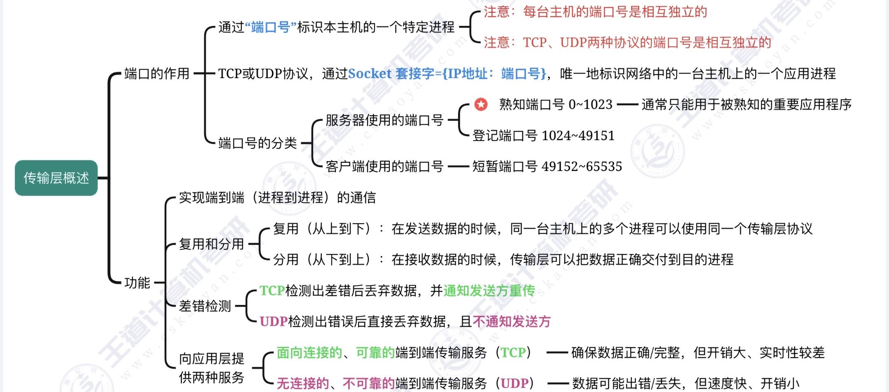

#### 传输层的功能


**应用进程之间的逻辑通信**


**逻辑通信**是指对等层之间的通信好像是沿水平方向传送的，但两个对等层之间并没有一条水平方向的物理连接。数据链路层提供链路上相邻节点之间的逻辑通信，网络层提供主机之间的逻辑通信，传输层为运行在不同主机上的进程之间提供逻辑通信，也称端到端的逻辑通信。


**复用和分用**


**复用**是指发送方不同的应用进程（目的端口相同）都可以使用同一个传输层协议传送数据，**分用**是指接收方的传输层在剥去报文的首部后能够把这些数据正确交付到目的应用进程（源端口相同）。网络层也有复用和分用的功能，但网络层的复用是指发送方不同协议的数据都可被封装成IP数据报发送出去，分用是指接收方的网络层在剥去首部后把数据交付给相应的协议。


**差错检测**


传输层要对收到的报文（首部和数据部分）进行差错检测。对于TCP，若接收方发现报文段出错，则要求发送方重发该报文段。对于UDP，若接收方发现数据报出错，则直接丢弃或交付给上层。在网络层，IP数据报首部中的检验和字段只检验首部是否出错，而不检查数据部分。


**提供面向连接和无连接的传输协议**


传输层属于面向通信部分的最高层，同时也是用户功能中的最低层。即使网络层协议不可靠（网络层协议使分组丢失、混乱或重复），传输层同样能为应用程序提供可靠的服务。只有主机的协议栈才有传输层，而路由器在转发分组时都只用到下三层的功能（在通信子网中没有传输层，传输层只存在于通信子网以外的主机中）。


传输层向高层用户屏蔽了低层网络核心的细节（如网络拓扑、路由协议等），它使应用进程看见的是在两个传输层实体之间好像有一条端到端的逻辑通信信道，这条逻辑通信信道对上层的表现却因传输层协议不同而有很大的差别。当传输层采用面向连接的TCP协议时，尽管下面的网络是不可靠的（只提供尽最大努力的服务），但这种逻辑通信信道就相当于一条全双工的可靠信道。但当传输层采用无连接的UDP时，这种逻辑通信信道仍然是一条不可靠信道。


#### 传输层的寻址


数据链路层的服务访问点为帧的“类型”字段，网络层的服务访问点为IP数据报的“协议”字段，传输层的服务访问点为“端口号”字段，应用层的服务访问点为“用户界面”。


操作系统通过进程描述符PID来标识各应用进程，但是网络中不同操作系统使用的PID格式并不统一，因此网络中使用端口号来标识主机中的应用进程。特别注意，端口号只具有本地意义，每台主机上的端口号是独立的，与TCP和UDP协议绑定的端口号也是独立的。


端口号长度为16bit，能够表示2^16=65535个不同的端口。其中0-1023是熟知端口号，给服务器端使用，互联网地址指派机构（IANA）将它们指派给了TCP/IP最重要的一些应用程序，让所有用户都知道。1024-49151是登记端口号，供没有熟知端口号的应用程序使用，也是服务器端使用的端口号。49152-655535是客短暂端口号，供客户程序运行时动态选择，通信结束后释放。


|AP|FTP|TELNET|SMTP|DNS|TFTP|HTTP|POP3|SNMP|SNTP|BGP|HTTPS|RIP|DHCP|
|:----|:----|:----|:----|:----|:----|:----|:----|:----|:----|:----|:----|:----|:----|
|PORT|20、21|23|25|53|69|80|110|161|161|179|443|520|67168|
|P|TCP|TCP|TCP|UDP|UDP|TCP|TCP|UDP||||||


为了唯一的标识“网络中的一台主机的一个应用进程”，引入了**套接字（Socket）**的概念，由IP地址和端口号构成，是一个通信端点。其中IP地址用来标识和区分网络中不同的主机，端口号用来标识和区分该主机上的应用进程。网络的发送方和接受方通过Socket来识别端点，操作系统会根据Socket给传输层数据添加目的端口号，给网络层数据添加目的IP地址。


TCP把连接作为最基本的抽象，每条TCP连接有两个端点，TCP连接的端点不是主机，不是主机的IP地址，不是应用进程，也不是传输层的协议端口，而是Socket，每条TCP连接唯一地被通信的两个端点，即两个套接字所确定。


### 用户数据报协议（UDP，User Datagram Protocol）（14，18，21，24）


#### UDP的特点


UDP仅在IP层的数据报服务之上增加了端口、复用、分用和差错检测的功能。应用开发者选择UDP而非TCP，使得应用程序几乎直接与IP打交道，这是因为UDP具有如下优点。


无须建立连接，因此不会引入建立连接的时延。不维护连接状态，不跟踪接收和发送缓存、拥塞控制参数和序号与确认号的参数，无需在内核中维护维持连接的数据结构，因此能支持更多的活动客户机。首部开销小，TCP有20B的首部开销，而UDP仅有8B的开销。常用于一次性传输较少数据的网络应用，如DNS、SNMP等，若采用TCP将为连接创建、维护和拆除带来不小的开销。不面向连接使得可以承载广播或者多播的协议，比如DHCP。不保证可靠交付，所有维护可靠性的工作可由用户在应用层来完成，应用开发者可根据需求灵活设计自己的可靠性机制。没有拥塞控制，因此网络中的拥塞不会影响源主机的发送速率，常用于对于丢包不敏感、对实时性要求较高的应用，如IP电话、实时视频会议、流媒体等多媒体应用，可靠数据传输对这些应用来说并不是最重要的，但TCP的拥塞控制导致数据出现的较大延迟是不可容忍的。另外，UDP适用于客户机/服务器、远程调用，但是不适用于需要安全性的远程登陆。


#### UDP报文段


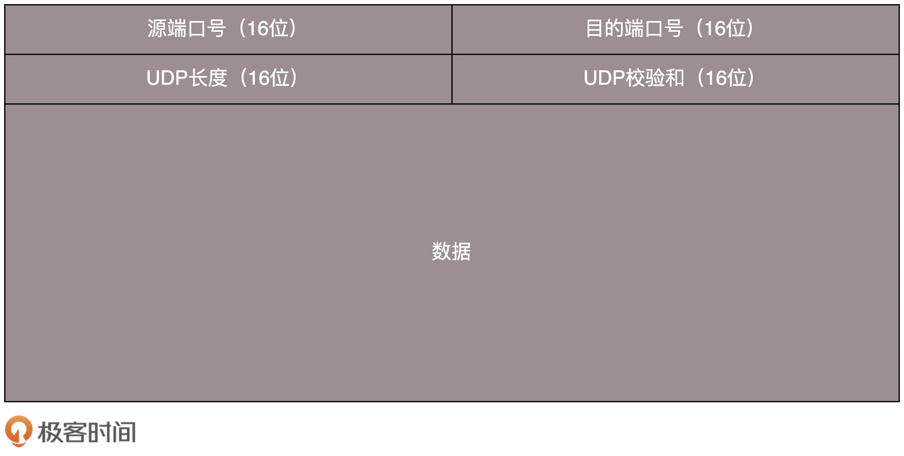

UDP数据报包含首部字段和数据字段，首部长8B，由4个2B的字段组成，各字段的意义如下：源端口，在需要对方回信时选用，不需要时可用全0。目的端口，在终点交付报文时必须使用到。UDP数据报的长度，包括首部和数据，仅有首部没有数据时取最小值是8，理论最大值为2^16=65535。检验和，检测UDP数据报（包括首部和数据部分）在传输中是否有错，当源主机不想计算检验和时直接令为全0。


当传输层从IP层收到UDP数据报时，就根据首部中的目的端口，把UDP数据报通过相应的端口，上交给应用进程，若接收方UDP发现不存在对应端口号的应用进程，则就丢弃该报文，并由ICMP发送“端口不可达”差错报文给发送方。


#### UDP的检验


UDP计算检验和的方法检验能力弱，但是简单、容易实现，它和计算IP数据报首部检验和的方法不同的是，IP数据报的检验和只检验IP数据报的首部，但UDP的检验和要将首部和数据部分一起检验。


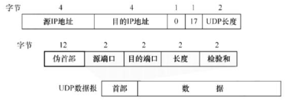

**检验和计算**作用在发送方的传输层：i. 将检验和字段置为全0；ii. 在UDP数据报之前添加伪首部；iii. 将伪首部、UDP数据报以16bit为一组，不足16bit的末尾以0填充；iv. 按二进制反码计算出这些16位字的和，与二进制加法的不同是需要把进位部分加到低16bit上（回滚），再取反码得到检验和；写入检验和字段封装成UDP数据报并发送，伪首部和填充不发送。


**UDP检验**作用在接收方的传输层：i. 在UDP数据报之前添加伪首部；ii. 将伪首部、UDP数据报以16bit为一组，不足16bit的末尾以0填充；iii. 按二进制反码计算出这些16位字的和；iv. 如果结果全为1，说明没有发生比特错误，否则丢弃该UDP数据报。


### 传输控制协议（TCP，Transmission Control Protocol）（09-17，19-24）


#### TCP的特点


TCP在不可靠的IP层上实现可靠的数据传输，主要解决传输的可靠、有序、无丢失和不重复问题，主要特点如下。


面向连接，TCP连接是一条逻辑连接，每条连接一对一的，只能有两个端点。提供可靠交付的服务，保证传送的数据无差错、不丢失、不重复且有序。提供全双工通信，允许通信双方的应用进程在任何时候都能发送数据，为此TCP连接的两端都设有发送缓存和接收缓存，发送缓存暂时存放“发送应用程序”传送给发送方TCP准备发送的数据，和TCP已发送但尚未收到确认的数据；**接收缓存**暂时存放按序到达但尚未被“接收应用程序”读取的数据和不按序到达的数据。面向字节流，虽然应用程序和TCP的交互是一次一个大小不等的数据块，但TCP把应用程序交下来的数据仅视为一连串的无结构的字节流。


UDP报文的长度由发送应用进程决定，而TCP报文的长度则根据接收方给出的窗口值和当前网络拥塞程度来决定。若应用进程传送到TCP缓存的数据块太长，则TCP就把它划分得短一些再传送；若太短，则TCP也可等到积累足够多的字节后再构成报文段发送出去。


#### TCP报文段


TCP传送的数据单元称为报文段，既可用来运载数据，又可用来建立连接、释放连接和应答。一个TCP报文段分为首部和数据两部分，首部前20B是固定的，最短为20B，后面4N字节是根据需要而增加的选项，长度为4B的整数倍。


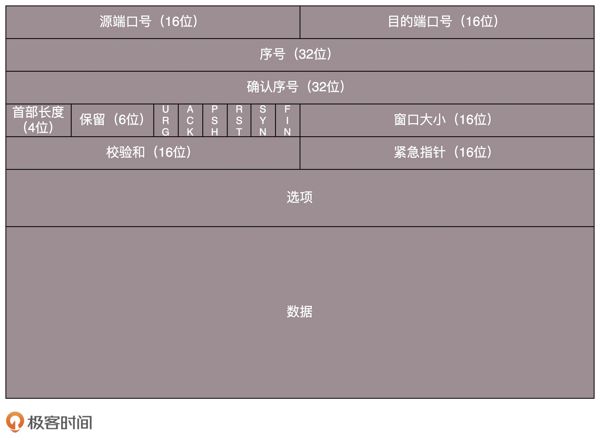

**数据偏移，即首部长度**，与IP数据报分片的那个数据偏移不同，它指出TCP报文段的数据起始处到TCP报文段的起始处的距离。“数据偏移”的单位是32位（以4B为计算单位），不足4B依靠填充位填充。4位二进制数能表示的最大值为15，所以TCP首部的最大长度为60B；首部最小是20B，数据偏移为5。


**保留**，预留给今后使用，目前应置为0。


**紧急位URG**，为1时表明紧急指针字段有效，告诉系统此报文段中有紧急数据，应尽快传送，不会占用窗口和接受缓存。


**推送位PSH**，接收方收到PSH=1的报文段后，就尽快交付给接收应用进程，而不再等到整个缓存都填满了后再向上交付。


**复位位RST**，当RST=1时，表示TCP连接中出现严重差错如主机崩溃等，必须释放连接，然后重新建立传输连接，此外它还可用于拒绝一个非法的报文段。


**紧急指针**，仅在URG=1时才有意义，它指出本报文段中的紧急数据的字节数。紧急数据被插入至报文段数据的最前面，紧急指针字段指向紧急数据的最后一个字节。即使窗口为零，也可以发送紧急数据。在实践中，URG、紧急指针、PSH并未使用。


**选项**，长度可变，最长可达40B。当不使用选项时，TCP首部长度是20B。


**填充**，为了使整个首部长度是4B的整数倍。


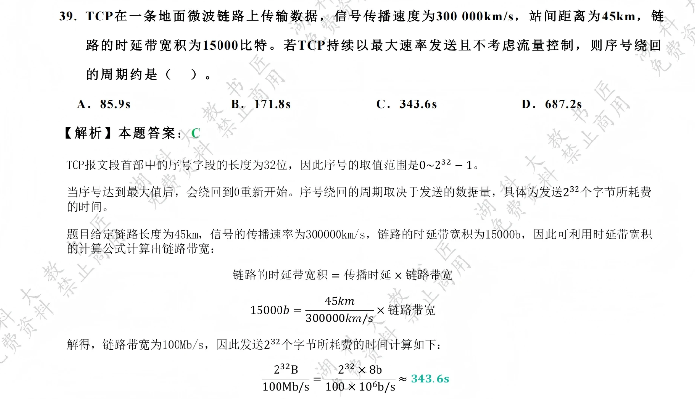

#### TCP连接管理


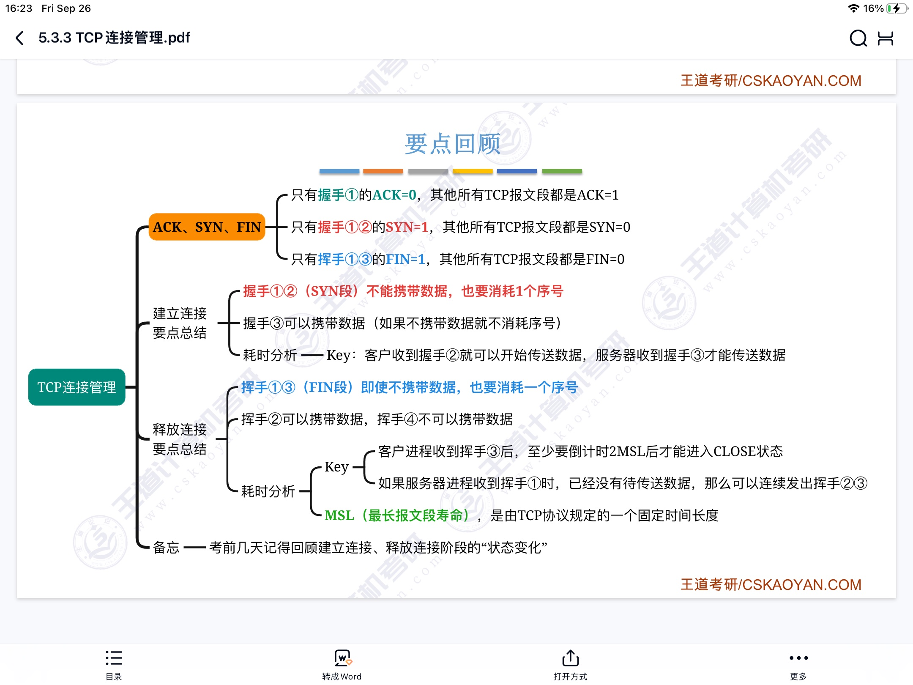

TCP是面向连接的协议，因此每个TCP连接都有连接建立、数据传送和连接释放三个阶段，其中连接建立和释放的有限状态机如图所示。


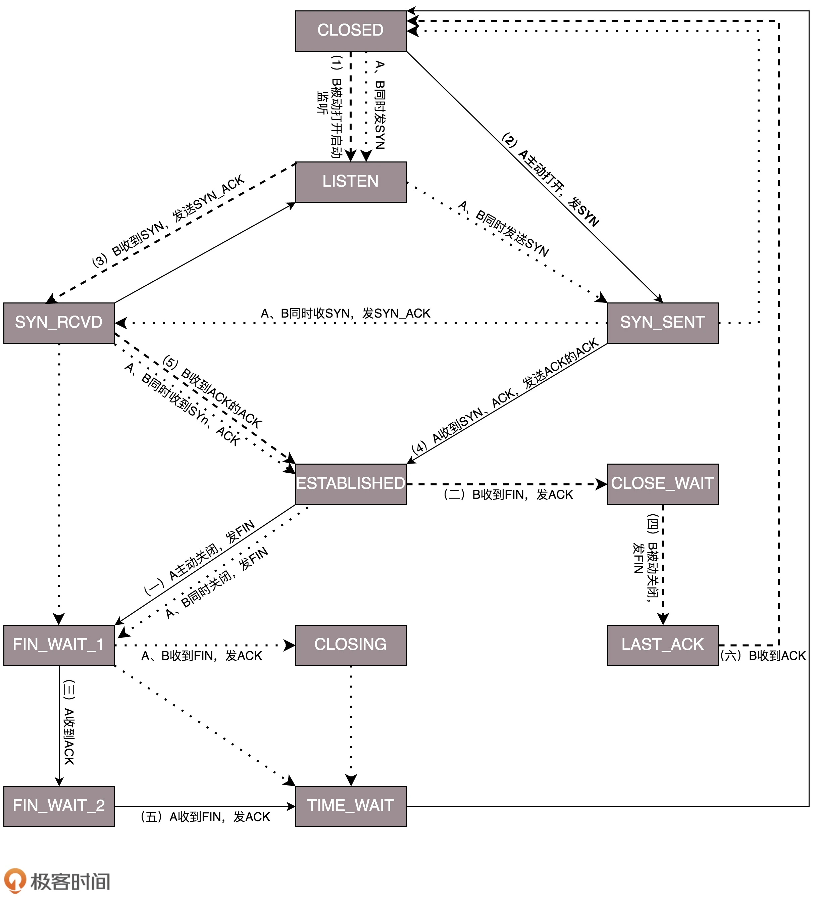

**建立连接**


所谓的建立连接，是为了在客户端和服务端维护维护双方交互的状态而建立的数据结构，以此来保证面向连接的特性。由于维护TCP连接需要在内核维护这些数据结构，因而一台机器能够支撑的TCP连接数目是有限的。TCP连接的建立采用客户/服务器模式，主动发起连接建立的应用进程称为客户（Client），而被动等待连接建立的应用进程称为服务器（Server）。在TCP连接建立的过程中，要解决以下三个问题：如何使每一方能够确知对方的存在；如何协商最大窗口值、是否使用窗口扩大选项、时间戳选项等参数；如何能够对运输实体资源，如缓存大小、连接表中的项目等进行分配。


TCP建立称为三次握手，主要解决连接建立和序号问题。~~服务器会先生成传输控制块TCB，包括TCP连接表，发送、接受缓存的指针，指向重传队列的指针，当前发送和接受的序号。~~


##### 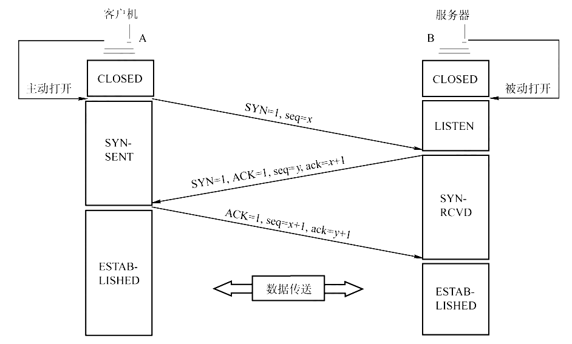


第一步：客户机选择一个初始序号seq=x，先向服务器发送**连接请求报文段/SYN报文段**。TCP规定SYN报文段SYN=1，不能携带数据，但要消耗一个序号。


第二步：服务器收到连接请求报文段后，如果同意建立连接，则为该TCP连接分配缓存和变量，并选择一个初始序号seq=y，向客户机发回SYN**确认报文段**。TCP规定确认报文段也不能携带数据，要消耗一个序号。


第三步：客户机收到确认报文段后，还要再向服务器发出**确认报文段/ACK报文段**，该报文段可以携带数据，若不携带数据则不消耗序号，下一个数据报文段的序号仍为x+1。


成功进行三次挥手后就建立了TCP连接，TCP提供全双工通信，通信双方的应用进程在任何时候都能发送数据。


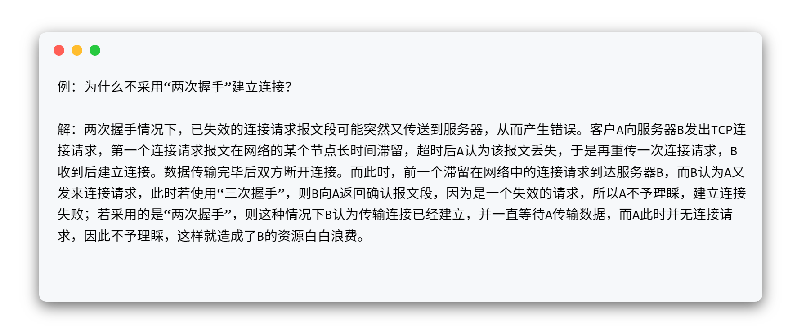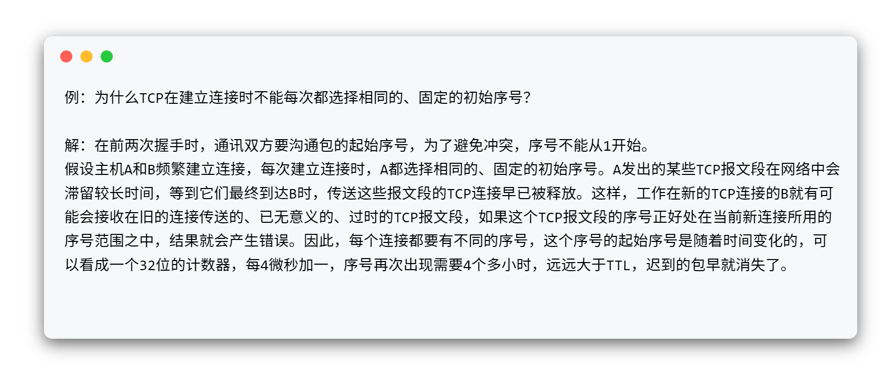

**释放连接**


参与TCP连接的两个进程中的任何一个都能终止该连接，称为四次挥手。


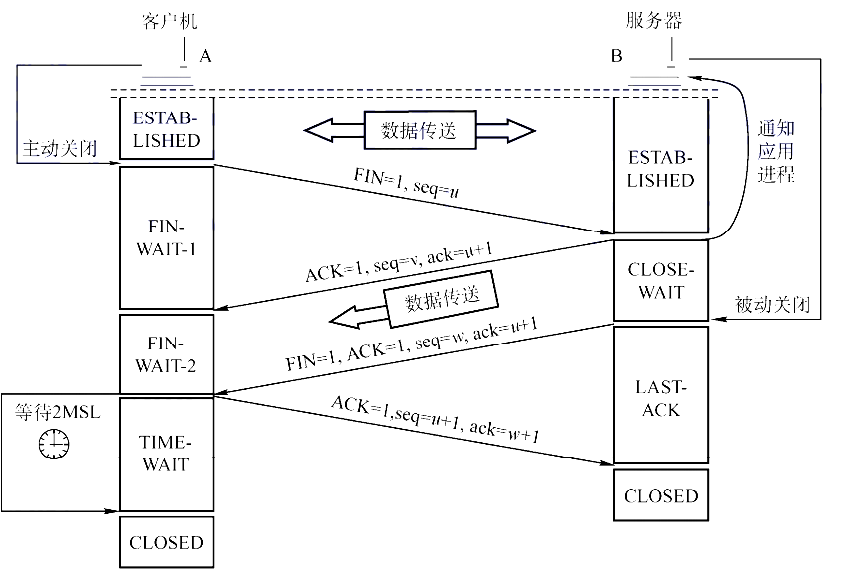

第一步：客户机打算关闭连接，则停止发送数据，向服务器发送**连接释放报文段/FIN报文段**，该报文段seq=u，即前面已传送的数据的最后一个字节的序号加1。TCP规定FIN报文段即使不携带数据，也要消耗一个序号。


第二步：服务器收到连接释放报文段后即发出确认，seq等于它前面已传送过的数据的最后一个字节的序号加1（即使不再需要客户端的数据）。此时从客户机到服务器这个方向的连接就释放了，由于TCP是全双工的，从服务器到客户机这个方向的连接并未关闭。客户机收到来自服务器的确认后，可以继续接受数据，并等待服务器发出的连接释放报文段。


第三步：若服务器已经没有要向客户机发送的数据，就向其发送**连接释放报文段/FIN报文段**，该报文段seq=w，因为处于半关闭状态的服务器可能又发送了一些数据，还必须重复发送上次已发送的ack=u+1。


第四步：客户机收到连接释放报文段后，必须再发出确认。客户机经过**时间等待计时器**设置的时间**2MSL**后，才进入CLOSED状态。**MSL（MaximumSegmentLifetime，最长报文段寿命）**是任何报文在网络上存在的最长时间，超过这个时间报文将被丢弃。因为TCP报文基于是IP协议的，而IP头中有一个TTL域，是IP数据报可以经过的最大路由数，每经过一个处理他的路由器此值就减1，当此值为0则数据报将被丢弃，同时发送ICMP报文通知源主机。协议规定MSL为2分钟，实际应用中常用的是30秒，1分钟和2分钟等。


若服务器收到连接释放请求后不再发送数据，则从客户机发出FIN报文段时刻算起，客户机释放连接的最短时间为1RTT+2MSL，服务器释放连接的最短时间为1.5RTT。


除时间等待计时器外，TCP还使用一个**保活计时器**，以避免客户机突然出现故障，而导致服务器一直无效等待。服务器每收到一次客户的数据，就会重置保活计时器，若计时到期后还没有收到客户的数据，服务器就每隔75秒发送一个**探测报文段**。若连续发送10个探测报文段后仍未收到客户的响应，则服务器认为客户机出了故障，关闭这个连接。


#### TCP可靠传输


TCP在不可靠的IP层上实现可靠的数据传输，使用检验、序号、确认和重传等机制来保证传输的可靠、有序、无丢失和不重复，需要用到首部的序号、确认号、检验和字段。


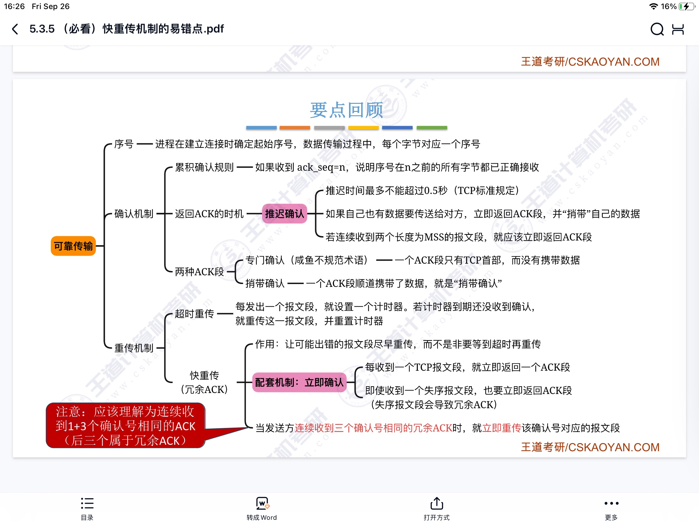

**检验**


和UDP一样，要在TCP报文段的前面加上12B的伪首部，只需将UDP伪首部的协议字段的17改成6，UDP长度字段改成TCP长度，检验的范围包括首部和数据两部分，将检验和写入检验和字段。


**序号**


使用首部中的**序号字段（seq）**，保证数据能有序提交给应用层。TCP把数据视为一个无结构但有序的字节流，序号建立在传送的字节流之上，序号指的是本报文段所发送的数据的第一个字节的序号。例如一报文段seq=301，携带100B的数据，则该报文段数据最后一个字节的序号是400，那么下一个报文段的seq=401。


**确认**


使用首部中的**确认号字段（ack/ack_seq）**，表示期望收到对方的下一个报文段数据的第一个字节的序号，即下一报文段的序号。例如，B正确收到了A发出的seq=501的报文段，数据长度是200B，则表明序号700及以前的数据均被B正确接受，B期望收到A的下一个seq=701，于是B在发送给A的确认报文段中把ack=701。


TCP默认使用**累计确认/累计应答（cumulative acknowledgment）**，即TCP只确认数据流中第一个丢失字节之前的字节，这样可以减小传输开销。接收方可在合适的时候发送确认，也可在自己有数据要发送时**捎带确认**。例如，接收方B收到了A发送的包含字节1-2及字节6-7的报文段，由于某种原因未收到字节3-5的报文段，6-7就成了**失序报文段**，那么此时B仍在等待字节3和其后而的字节，因此B到A的下一个报文段将确认号字段置为3。


发送方缓存区会继续存储那些己发送但未收到确认的报文段，以便在需要时重传，有两种事件会导致TCP重传报文段。


**超时事件重传**


TCP每发送一个报文段，就对这个报文段设置一个**超时计时器**。计时器设置的重传时间到期但还未收到确认时，就要重传这一报文段，并上报超时事件。


因为TCP的下层是互联网环境，IP数据报所选择的路由变化很大，所以传输层的往返时延的方差也很大。为了计算超时计时器的**超时重传时间（RetransmissionTime-Out，RTO）**，TCP采用一种**自适应重传算法（Adaptive Retransmission Algorithm）。**它会对**报文段的往返时间（Round-Trip Time，RTT）**进行实时采样，即计算一个报文段发出到收到相应确认的所需的时间。TCP维护了RTT的一个**加权平均往返时间（RTTS）**，它会随新测量RTT样本值的变化而变化。超时计时器设置的RTO应略大于RTTS，但也不能大太多，否则当报文段丢失时TCP不能很快重传，导致数据传输时延大。


TCP的策略是**超时间隔加倍**，每当遇到一次超时重传的时候，都会将下一次超时时间间隔设为先前值的两倍。两次超时，就说明网络环境差，不宜频繁反复发送。


**冗余确认事件快重传**


超时触发重传的超时周期太长，不过发送方通常可在超时事件发生前通过注意冗余ACK检测丢包情况。冗余ACK就是再次确认某个报文段的ACK，而发送方先前已经收到过该报文段的确认。TCP规定，每当比期望序号大的失序报文段到达时，接收方就发送一个冗余ACK指明下一个期待字节的序号。当发送方收到对同一个报文段的3个冗余ACK（即收到四个相同的ACK）时，就认为跟在这个被确认报文段之后的报文段已经丢失，可以立即重传缺失的报文段，这种技术通常称为**快速重传**。


例如，发送方A发送了序号为1、2、3、4、5的TCP报文段，其中2号报文段在链路中丢失无法到达接收方B，因此3、4、5号报文段对于B来说就成了失序报文段，于是B就发送3个对1号报文段的冗余ACK，表示自己期望接收2号报文段。当A收到3个对于1号报文段的冗余ACK时，可以认为2号报文段己经丢失，可以立即重传2号报文段。其中，正确收到但失序的报文并不会丢弃，而是缓存起来，这是TCP方式和GBN的显著区别。使用GBN时，A需要重传分组2，以及所有后继分组3、4、5。相反TCP至多重传一个报文段，即报文段2。


另外，TCP中提供一个**选择确认选项（SACK，Selective ACK，Selective Acknowledgment）**，使用选择确认选项时，需要在TCP头里加一个SACK，可以将**缓存的地图**发送给发送方，TCP看起来就和SR非常相似，因此TCP的差错恢复机制可视为GBN和SR协议的混合体。例如，可以发送ACK6、SACK8、SACK9，有了地图，发送方一下子就能看出来是7丢了。


流量控制是速度匹配服务，即匹配发送方的发送速率与接收方的读取速率，限制发送方向网络注入报文的速率，以便让接收方及时接收，避免接收缓存溢出。


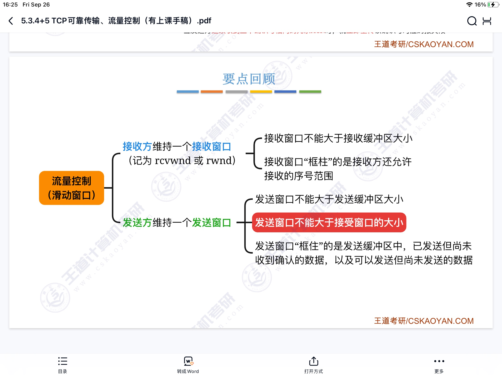

TCP利用**滑动窗口机制**来实现流量控制，TCP要求接收方根据当前接收缓存的大小，维持一个**接收窗口（rwnd，Advertised window）**，大小在使用过程中动态调整。接收方将其放在TCP报文段首部中的**“窗口”字段**，以通知发送方，从本报文段首部中的确认号算起，目前允许对方发送的数据量（以字节为单位）。发送方总是根据最新收到的rwnd值来限制自己发送窗口的大小，以限制发送方将未确认的数据量控制在rwnd大小之内。例如，某确认报文段的ack=701，窗口字段是1000，这表明从701号算起，发送此报文段的一方还有接收1000字节数据（701～1700）的接收缓存空间。


当接收方的rwnd=0时，不允许发送方再发送数据，发送方暂停发送的状态将持续到接收方重新发出一个新的窗口值为止。TCP为每个连接设置了一个**持续计时器**，只要发送方收到对方的**零窗口通知**，就启动持续计时器。若计时器超时，就发送一个**零窗口探测报文段**，而对方在**确认探测报文段**时给出现在的窗口值。若窗口仍然为零，发送方收到确认报文段后就重新设置持续计时器。当接收方比较慢的时候，要防止**低能窗口综合征**，窗口太小的时候不更新窗口，直到达到一定大小，或者缓冲区一半为空，才更新窗口。


传输层和数据链路层的流量控制的区别是，传输层实现的是端到端，即两个进程之间的流量控制；数据链路层实现的是两个中间的相邻节点之间的流量控制。此外，数据链路层的滑动窗口协议的窗口大小不能动态变化，传输层的窗口大小则可以动态变化。


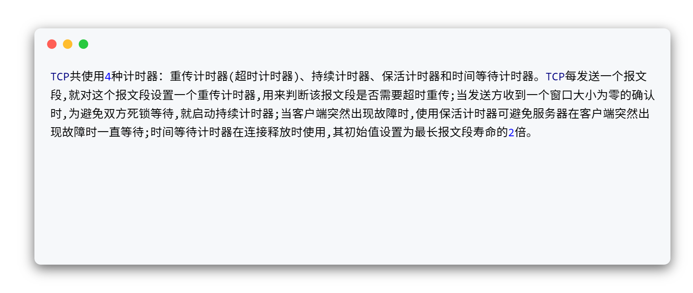

#### TCP拥塞控制


为防止过多的数据注入网络，保证网络中的路由器或链路不致过载，TCP采取拥塞控制机制，要求发送方维持一个**拥塞窗口（cwnd）**，其大小取决于网络的拥塞程度，并且动态地变化。


网络环境对于TCP而言是一个黑盒，出现拥塞时，端点并不了解拥塞发生的细节，只是表现为通信时延的增加。TCP的拥塞控制主要避免包丢失和超时重传，一旦出现了这些现象就说明发送速度太快。


流量控制是照顾通信对象，发送方发送数据的量由接收方决定；拥塞控制是照顾通信环境，发送方自己通过检测网络状况来决定，但是它们都通过控制发送方发送数据的速率来达到控制效果。发送方在确定发送报文段的速率时，既要考虑接收方的接受能力，又要从全局考虑不要使网络发生拥塞，因此发送方发送窗口上限值取rwnd和cwnd中的较小者。


假设数据为单方向传送，接收方只传送确认报文，且有足够大的缓存空间，即不考虑接收窗口大小，发送窗口的大小由网络的拥塞程度决定，采用**最大报文段长度（MSS）**作为拥塞窗口大小的单位。


MSS的规定并不是考虑接收方的缓存可能放不下TCP报文段中的数据，实际上MSS与接收窗口没有关系。TCP报文段的数据部分，至少要加上至少20B的TCP首部和至少20B的IP首部才能组装成一个IP数据报。若选择较小的MSS值，网络的利用率就很低。到了数据链路层还要加上一些开销，网络的利用率还会进一步降低。但反过来，若TCP报文段很长，则在IP层传输时有可能要分解成多个短数据报片，在终点还要把收到的各个短数据报片装配成原来的TCP报文段，传输出错时还要进行重传，这些也都会使开销增大。因此MSS应尽可能大一些，只要在IP层传输时不再分片就行。IP数据报所经历的路径是动态变化的，在一条路径上确定的不需要分片的MSS若改走另一条路径，则可能需要进行分片，因此最佳的MSS是很难确定的。MSS的默认值为536B，因此在互联网上的所有主机都应能接受的报文段长度是536+20=556B。TCP建立前客户机和服务器不知道对方的MSS是多少，在第一次和第二次握手时才告知对方，一般是1460B。


传输层将数据进行拆分成小的分组，并不是IP数据报分片。对于TCP，将14600B的进程数据拆分成10个大小为1460B的分组，是因为以太网的MTU只有1500B，减去TCP和IP最小首部后只有1460B。TCP将14600B的数据拆分后，生成10个TCP报文段，分别封装在10个IP数据报中进行发送，每个IP数据报的标识字段均不同，所有IP数据报在主机发到以太网链路时都不需要进行IP数据报分片。


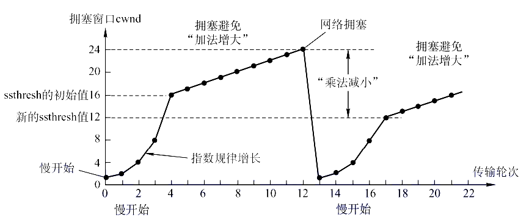

**慢开始算法**


发送方刚开始发送数据时并不清楚网络的负荷情况，若立即把大量数据注入网络，则有可能引发网络拥塞。因此在慢开始阶段先将cwnd设置为1，发送少量数据探测一下，若没有发生拥塞，每收到一个对新报文段的确认ACK就把cwnd值加1，也即每经过一个传输轮次（RTT），cwnd就会加倍，cwnd的值随传输轮次指数增长。为了防止cwnd增长过大而引起网络拥塞，还需要设置一个**慢开始门限（ssthresh，阈值）**，若当前2cwnd>ssthresh，则下一个RTT后的cwnd等于ssthresh，不等于2cwnd，改用拥塞避免算法。若当前cwnd=ssthresh，可以继续使用慢开始算法，不过默认此时改用拥塞避免算法。


**拥塞避免算法**


采用“加法增大”的方法，每经过一个RTT就把发送方的cwnd加1，而不是加倍，使拥塞窗口cwnd按线性规律缓慢增长。拥塞避免并不能完全避免拥塞，而是在拥塞避免阶段将拥塞窗口控制为按线性规律增长，使网络比较不容易出现拥塞。


**网络拥塞处理**


采用“乘法减小”的方法，无论在慢开始阶段还是在拥塞避免阶段，只要发送方判断网络出现拥塞（超时），就要首先把ssthresh调整为出现拥塞时cwnd值的一半（但不能小于2），然后把cwnd重新设置为1执行慢开始算法。这样可以迅速减少主机发送到网络中的分组数，使得发生拥塞的路由器有足够时间把队列中积压的分组处理完。


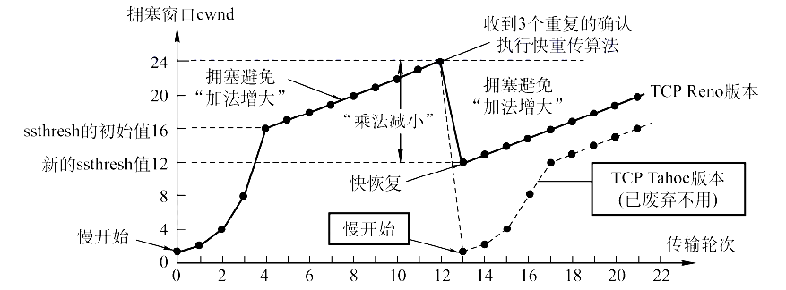

**快重传算法**


有时网络并未发生拥塞，但是某个个别报文段在网络中丢失，使发送方迟迟收不到确认会产生超时，误认为网络发生了拥塞，这将导致发送方错误地启动慢开始算法，从而降低传输效率。


为了让发送方尽早知道发生了个别报文段的丢失，快重传算法要求接收方不要捎带确认，而是要立即发送确认，并且要求接收方收到了失序的报文段立即发出对己收到报文段的重复确认，发送方一旦连续收到3个冗余ACK，就立即重传相应的报文段，而不是等该报文段的超时计时器超时再重传。


**快恢复算法**


当发送方连续收到3个冗余ACK时，为了预防网络发生拥塞，把慢开始门限ssthresh调整为当前cwnd的一半。但是发送方认为网络很可能没有发生（严重）拥塞，否则就不会连续收到重复确认。因此它把cwnd值也调整为当前cwnd的一半，即等于ssthresh值，而不是设置为1，然后开始执行拥塞避免算法。即TCP连接建立和网络出现超时时，采用慢开始和拥塞避免算法（ssthresh=cwnd/2，cwnd=1）；当发送方收到3个冗余ACK时，采用快重传和快恢复算法（ssthresh=cwnd/2，cwnd=ssthresh）。


## 网络层


【考纲内容】

（一）网络层的功能：异构网络互连；路由与转发；SDN基本概念；拥塞控制

（二）路由算法：静态路由与动态路由；距离-向量路由算法；链路状态路由算法；层次路由

**（三）IPv4**：IPv4分组；IPv4地址与NAT；子网划分与子网掩码、CIDR、路由聚合、ARP、DHCP与ICMP

（四）IPv6：IPv6的主要特点；IPv6地址

**（五）路由协议**：自治系统；域内路由与域间路由；RIP路由协议；OSPF路由协议；BGP路由协议

（六）IP多播：多播的概念；IP多播地址

（七）移动IP：移动IP的概念；移动IP通信过程

（八）网络层设备：路由器的组成和功能；路由表与路由转发


### 功能概述


网络层提供主机到主机的通信服务，主要任务是将分组从源主机经过多个网络和多段链路传输到目的主机。


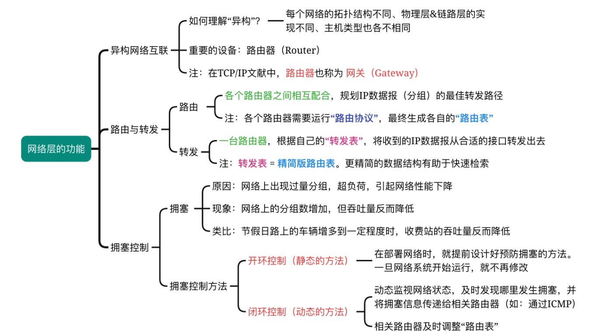

#### 异构网络互连


网络的**异构性**是指拓扑结构、寻址方案、差错处理方法、传输介质、数据编码方式、链路控制协议及不同的数据单元格式和转发机制，这些特点分别在物理层协议和数据链路层协议中定义。路由器是第三层设备，向传输层及以上层隐藏下层的具体实现，所以在路由器互联的多个局域网的结构中，每个局域网的物理层、数据链路层、网络层协议（使用特定的路由器连接IPv4与IPv6网络）可以不同，而网络层之上的协议数据是路由器所不能处理的，因此网络层以上的高层协议必须相同。互联网是由全球范围内数以百万计的异构网络互连起来的，网络层所要完成的任务之一就是实现这些异构网络的互连，将两个以上的计算机网络，通过一定的方法用一些中继系统相互连接起来，以构成更大的网络系统。


根据所在的层次，中继系统分为以下4种：物理层中继系统，如转发器、集线器；数据链路层中继系统，如网桥或交换机；网络层中继系统，如路由器；网络层以上的中继系统，如网关。物理层和数据链路层的中继系统只是把一个网络扩大了，从网络层的角度看仍然是同一个网络，因此一般并不称为网络互连，网络互连通常是指用路由器进行网络连接和路由选择。由于历史原因，许多有关TCP/IP的文献也将网络层的路由器称为网关。


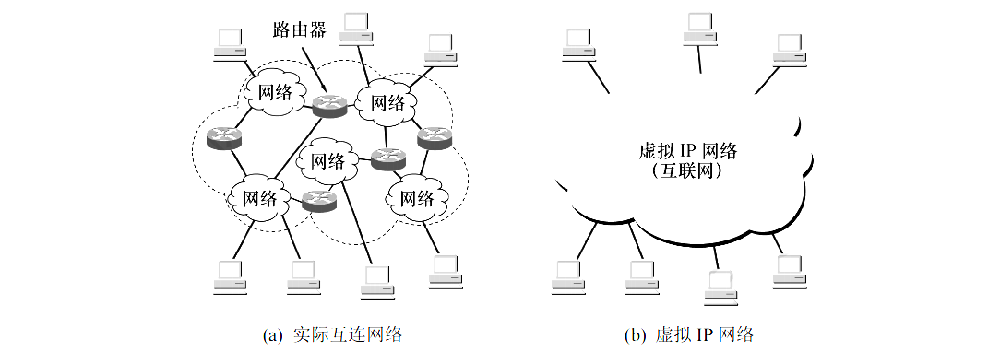

TCP/IP在网络互连方面的做法是在网络层采用标准化协议，但相互连接的网络可以是异构的。互联网是一个逻辑互连网络，通过IP协议，性能各异的多个异构网络在网络层看起来是一个统一的虚拟互连网络，简称**IP网络**。当IP网上的主机进行通信时，看不见互连的各个网络的编址方案、路由选择协议等具体异构细节，就好像在单个网络上通信一样。


#### 拥塞控制


随着网络负载的增加，网络的吞吐量明显小于正常的吞吐量，则网络就可能已进入轻度拥塞状态；若网络的吞吐量随着网络负载的增大而下降，则网络就可能已进入拥塞状态。拥塞控制通过获取网络中发生拥塞的信息，利用这些信息进行控制，以避免因拥塞而出现分组的丢失，确保网络能够承载所达到的流量，这是一个全局性的过程，涉及网络中所有的主机、路由器及导致网络传输能力下降的所有因素，单一地增加资源并不能解决拥塞。


**开环控制**，在设计网络时事先将有关发生拥塞的因素考虑周到，力求网络在工作时不产生拥塞，这是一种静态的预防方法，一旦整个系统启动并运行，中途就不再需要修改。开环控制手段包括确定何时可接收新流量、何时可丢弃分组及丢弃哪些分组，确定何种调度策略等，所有这些手段的共性是，在做决定时不考虑当前网络的状态。


**闭环控制**，事先不考虑有关发生拥塞的各种因素，采用监测网络系统去监视，及时检测哪里发生了拥塞，然后将拥塞信息传到合适的地方，以便调整网络系统的运行，并解决出现的问题，是一种基于**反馈环路**的动态方法。


#### 路由选择


**路由选择**，指根据路由选择协议构造路由表，同时经常或定期地与相邻路由器交换信息，获取网络最新拓扑，动态更新维护路由表，以决定分组到达目的地节点的最优路径。路由表是根据路由选择算法得出的，而转发表是从路由表得出的。转发表的结构应使查找过程最优化，路由表则需要最优化网络拓扑变化的计算。在讨论路由选择的原理时，往往不区分转发表和路由表，而笼统地使用路由表一词。


#### 分组交换（20）


**分组转发**指路由器处理通过的数据流，根据转发表将分组从合适的端口转发出去，关键操作是转发表查询、转发及相关的队列管理和任务调度等。分组交换网根据其通信子网向端点系统提供的服务，还可进一步分为面向连接的虚电路服务和无连接的数据报服务。OSI参考模型曾主张在网络层使用面向连接的虚电路服务，由网络自身来保证通信的可靠性；而TCP/IP体系的网络层提供的是无连接的数据报服务，由用户主机来保证通信的可靠性。


1.“尽最大努力交付”有哪些含义？

1）不保证源主机发送的IP数据报一定无差错地交付到目的主机。

2）不保证源主机发送的IP数据报都在某一规定的时间内交付到目的主机。3）不保证源主机发送的IP数据报一定按发送时的顺序交付到目的主机。4）不保证源主机发送的IP数据报不会重复交付给目的主机。

5）不故意丢弃IP数据报。丢弃IP数据报的情况是：路由器检测出首部检验和有错误；或者因为网络中通信量过大，路由器或目的主机中的缓存已无空闲空间。

但要注意，IP数据报的首部中有一个“首部检验和”字段。当它检验出IP数据报的首部出现了差错时，就丢弃该数据报。因此，凡交付给目的主机的IP数据报都是IP首部没有差错的或没有检测出差错的。也就是说，在传输过程中，出现差错的IP数据报都被丢弃了。

现在互联网上绝大多数的通信量都属于“尽最大努力交付”。若数据必须可靠地交付给目的地，则使用IP的高层软件必须负责解决这一问题。


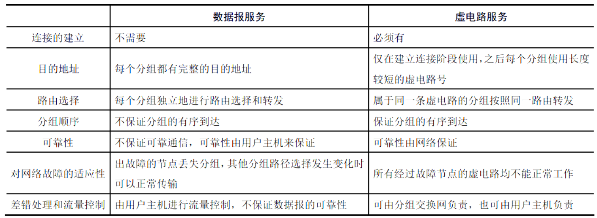

**虚电路（Virtual Circuit，VC）服务**


OSI参考模型的网络层打算提供既可以进行有连接的传输服务，也可以实现无确认无连接的传输服务，并以有连接的传输服务为主体，具体功能实现就是虚电路网络。虚电路是一种分组交换技术，它可以采用存储转发的方式工作。虚电路采用面向连接的方式，当两台计算机进行通信时，先在发送方和接收方之间建立一个虚拟的通路，也就是建立一条逻辑上的虚电路对应的物理路径，一旦建立就固定不变，所有的分组沿着固定的通路顺序传送。这种连接是逻辑上的连接，并不是物理上的连接，不需要为每条虚电路预先分配带宽。


与电路交换类似，整个通信过程分为虚电路建立、数据传输与虚电路释放三个阶段。虚电路不只是临时性的，它提供的服务包括**永久性虚电路(PVC)**和**交换型虚电路(SVC)**，其中前者是一种提前定义好的、基本上不需要任何建立时间的端点之间的连接，而后者是端点之间的一种临时性连接，这些连接只持续所需的时间，且在会话结束时就取消这种连接。


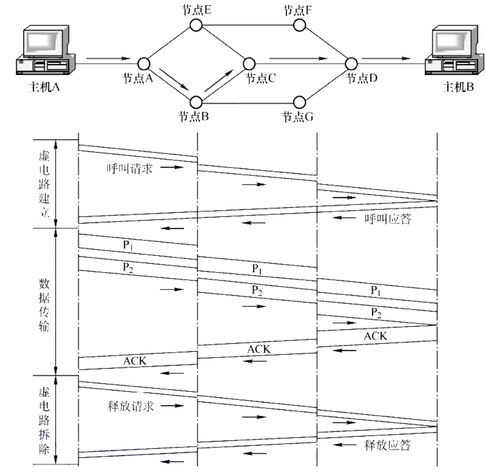

**虚电路建立阶段**，主机A发出**“呼叫请求”分组**，该分组通过中间节点送往主机B。若主机B同意连接，则发送**“呼叫应答”分组**予以确认。


虚电路的路由选择体现在连接建立阶段，连接建立后，就确定了传输路径。网络层建立虚电路，决定发送方与接收方之间的路径，即该虚电路的所有分组要通过的一系列链路与路由器。网络层为沿着该路径的每条链路分配一个未用过的**虚电路号（VCID）**，在虚电路网络中的每个节点上都维持一张**虚电路表**，表中每项记录一个打开的虚电路的信息，包括在接收链路和发送链路上的VCID、前一节点和下一节点的标识（入接口，入VCID，出接口，出VICD）。分配完VCID，网络层在沿着路径的每台路由器的转发表中增加一个表项。虚电路提供的是可靠的通信服务，本身就可实现差错控制。多站点同时使用一段物理链路实现虚电路交换不会产生冲突，因为每个分组都有一个虚电路号来标识所属的虚电路。分组的首部仅在连接建立时使用完整的目的地址，之后每个分组的首部只需携带这条虚电路的编号，相对于数据报方式开销较小。


**数据传输阶段**，一旦创建了虚电路，主机A和主机B就沿着已建立的虚电路按序传送分组。虚电路提供了可靠的通信功能，能保证每个分组正确且有序到达。此外，还可对两个端点的流量进行控制，当接收方来不及接收数据时，可以通知发送方暂缓发送。


**虚电路释放阶段**，当发送方或接收方希望终止该虚电路时，通过发送**“释放请求”分组**来拆除虚电路，逐段断开整个连接。网络层通知网络另一侧的端系统结束呼叫，并更新路径上每台分组路由器中的转发表以表明该虚电路已不存在了。


虚电路通信链路的建立和拆除需要时间开销，对交互式应用和少量的短分组情况显得很浪费，但对长时间、频繁的数据交换效率较高。


虚电路有一个致命的弱点，当网络中的某个节点或某条链路出现故障而彻底失效时，所有经过该节点或该链路的虚电路将遭到破坏。虚电路之所以是虚，是因为这条电路不是专用的，每个节点到其他节点之间的链路可能同时有若干条虚电路通过，也可能同时在多个节点之间建立虚电路。虚电路是有方向的，同一条链路上若有两条方向相反的虚电路，对应的VCID不同。


**数据报服务**


在互联网采用的TCP/IP体系结构中，网络层向上只提供简单灵活的、无连接的、尽最大努力交付的数据报服务，该服务的功能实体是IP协议，通信的可靠性可以由更高层的传输层来负责。也就是说，所传送的分组可能出错、丢失、重复、失序或超时，这就使得网络中的路由器可以做得比较简单，而且价格低廉。采用这种设计思路的好处是与电话网络相比造价大大降低，运行方式灵活，能够适应多种应用。互联网能够发展到今日的规模，充分证明了当初采用这种设计思想的正确性。


网络在发送分组前不需要先建立连接，发送方可随时发送分组，网络中的节点可随时接收分组。源主机的高层协议将报文拆成若干较小的数据段，并加上地址等控制信息后构成分组。发送的分组中要包括发送方和接收方的完整地址，以便可以独立传输。网络为每个分组独立地选择路由，转发的路径可能不同，因此分组不一定按序到达目的节点。中间节点存储分组很短一段时间，找到最佳的路由后，尽快转发每个分组。分组在交换节点存储转发时，需要排队等候处理，这会带来一定的时延，当网络发生拥塞时，这种时延会大大增加，交换节点还可根据情况丢弃部分分组。网络具有冗余路径，当某个交换节点或一条链路出现故障时，可相应地更新转发表，寻找另一条路径转发分组，对故障的适应能力强。收发双方不独占某条链路，资源利用率较高。


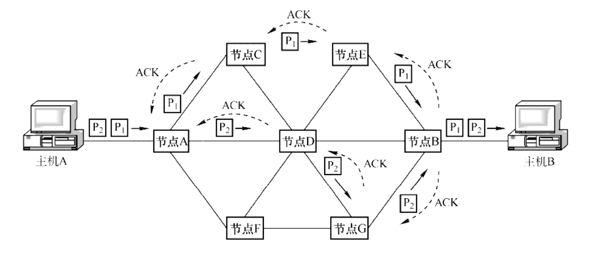

假定主机A向主机B发送分组，主机A先将分组逐个发往与它直接相连的交换节点A，交换节点A缓存收到的分组。然后查找自己的转发表。因为不同时刻的网络状态不同，所以转发表的内容可能不完全相同，所以有的分组转发给交换节点C，有的分组转发给交换节点D。网络中的其他节点收到分组后，类似地转发分组，直到分组最终到达主机B。当分组正在某一链路上传送时，分组并不占用网络其他部分的资源。因为采用存储转发技术，资源是共享的，所以主机A在发送分组时，主机B也可同时向其他主机发送分组。


### 数据层/转发层


#### IPv4协议（11-12、14-19、21-24）


IPv4是现在普遍使用的**网际协议（Internet Protocol，IP）**，定义了数据传送的基本单元——IP分组及其确切的数据格式，也包括一套规则，指明分组如何处理、错误怎样控制。


##### IPv4数据报格式


一个IP分组/数据报由首部和数据部分组成，首部前一部分是所有IP分组必须具有的，长度固定为20B，后面的长度可变，由一些用来提供错误检测及安全等机制的可选字段组成。


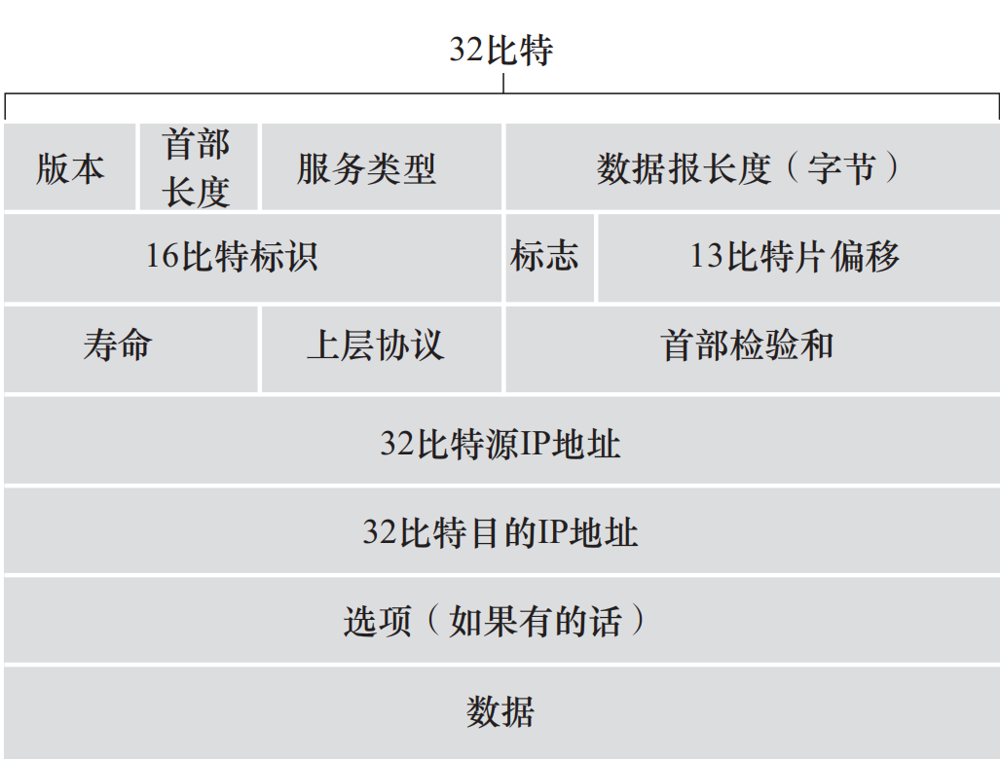

**版本号**，这4位规定了数据报的IP协议版本，不同版本的数据包格式不同，路由器通过该字段确定如何解释IP数据报的剩余部分，IPv4数据报中该字段的值是4。


**首部长度**，用来确定数据报中载荷部分开始的位置。以4B为单位，首部长度最小是20B（5*4B），最大可表示的首部长度为60B（15×4B）。注意IP首部前两个字节往往以0x45开头，即采用IPv4协议，且首部不包含选项。


**总长度**，指首部和数据之和的长度，单位为字节，因此数据报理论最大长度为65535B。然而，数据报的总长度不能超过下面的数据链路层的MTU值，因此很少超过1500B。


**生存时间（TTL，Time-To-Live）**，数据报在网络中可通过的路由器数的最大值，标识数据报在网络中的寿命，以确保数据报不会永远在网络中循环。路由器在转发数据报前，先将TTL减1，若TTL被减为0，则该数据报必须丢弃。


**协议**，告知目的主机此数据报携带的数据使用何种协议，应该交给哪个运输层协议进行处理，其中值为6表示TCP，值为17表示UDP，值为1标识ICMP。协议号类似端口号起的作用，是网际层向传输层提供的**服务访问点（SAP）**，协议号将网络层和运输层联系起来，端口号将运输层和应用层联系起来。


**首部检验和**，用于帮助路由器检测收到的IP数据报中的比特错误，计算方式是用反码算法对将首部中的每2个字节求和（与运输层的算法类似，只是不需要添加伪首部，且只检验首部）。若首部中的检验和和路由器计算得到的结果不一致，路由器一般会丢弃检测出错的数据报。如果源地址出错，那么差错报告报文就失去意义，因此路由器不会发送ICMP报文。数据报每经过一个路由器，其首部中的某些字段（如TTL、总长度、标志、片偏移、源/目的地址）都可能发生变化，因此每台路由器必须要重新计算首部检验和。


例：分析IP协议首部45 00 00 30  01 9b 40 00  80 06 1d e8  c0 a8 00 08  d3 44 47 50中蕴含的信息。


假设无选项，一个IP数据报有总长20B的首部，如果数据报承载一个TCP报文，则每个无分片的数据报共承载总长40B的首部（包括20B的TCP首部）和应用层报文。


##### IPv4数据报分片


一个链路层数据帧能承载的最大数据量称为**最大传送单元（MTU）**。IP数据报被封装在链路层的帧中，因此链路层的MTU严格地限制了IP数据报的长度，而且在IP数据报的源与目的地路径上的各段链路可能使用不同的链路层协议，有不同的MTU。当IP数据报的总长度大于链路MTU时，就需要将IP数据报中的数据分装在多个较小的IP数据报中，这些较小的数据报称为**片**。目前，在IPv6中已不再进行分片。


目的主机在网络层使用IP首部中的**标识、标志和片偏移字段**来完成对片的重组。主机每创建一个IP数据报，就为其加上一个标识号。由于IP是无连接服务，所以标识并不是“序号”。以太网帧由最短帧长和最长帧长的限制（46-1500），当路由器所收到数据报的长度超过MTU时必须分片，形成的每个小数据报（片）都具有原始数据报的标识号。当目的主机收到来自同一主机发送的一批数据报时，通过检查标识号来确定属于同一个原始数据报的分片。IP首部中的标志位占3位，只有后两位有意义，**DF（Don't Fragment）**=0表示该IP数据报可被分片，**MF（More Fragment）**=1表示相应的原始数据报还有后续的片，MF=0表示该数据报是相应原始数据报的最后一个片。目的主机在对片进行重组时，使用片偏移字段来确定该片应放在原始IP数据报的哪个位置。片偏移以8B为偏移单位，除最后一个分片外，每个分片的长度一定是8B的整数倍。


IP分片涉及一定的计算，一个长4000B的IP数据报（首部20B，数据部分3980B）到达一个路由器时，若需要转发到一条MTU为1500B的链路上，原始数据报中的3980B数据必须分配到3个独立的片中，每片也是一个IP数据报，数据部分依次为1480B、1480B和1020B。因为偏移值的单位是8B，所以除最后一个片外，其他所有片中的数据部分都为8B的倍数。


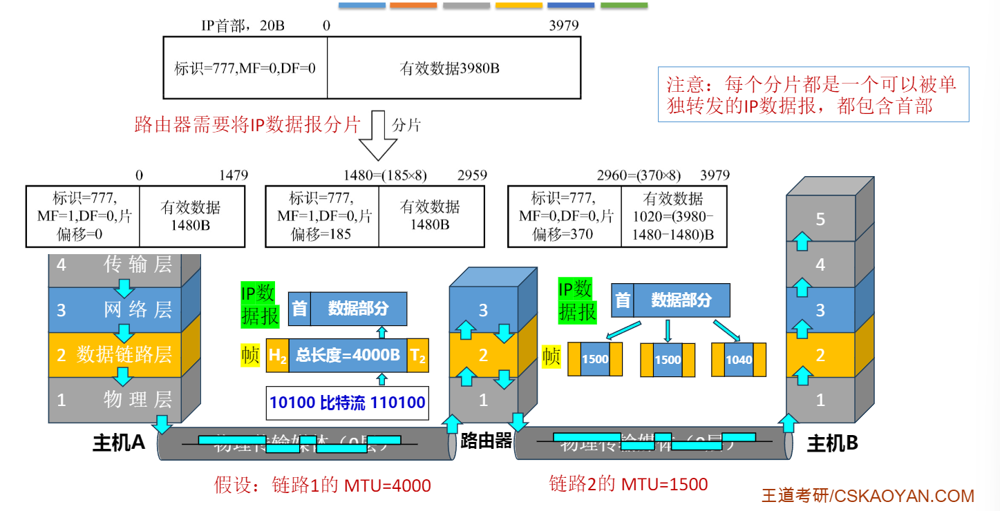

##### IPv4编址


主机在链路上发送数据报，一台主机通常只有一条链路连接到网络，主机与链路之间的边界叫作**接口（interface）**。路由器的任务是从链路上接收数据报并从某些其他链路转发出去，所以路由器必须拥有两条或更多条链路与它连接，路由器与它的任意一条链路之间的边界也叫作**接口**。每台主机与路由器都通过接口发送和接收IP数据报，因此IP要求每台主机和路由器的接口拥有自己的IP地址。因此，从技术上讲，一个IP地址与一个接口相关联，而不是与包括该接口的主机或路由器相关联。当一台主机同时连接到两个网络时，该主机就必须同时具有两个相应的IP地址，其网络号必须是不同的。路由器至少应具有两个或两个以上的IP地址，每个端口都有一个不同网络号的IP地址。


IP地址是一种分等级的地址结构，每个IP地址都由网络号和主机号组成。IP地址管理机构在分配IP地址时只分配网络号，主机号则由得到该网络的单位自行分配。路由器仅根据目的主机所连接的网络号来转发分组，而不考虑目标主机号，从而减小了路由表所占的存储空间。


在同一个局域网上的主机或路由器接口的IP地址中的网络号必须是相同的，用转发器或桥接器连接的若干LAN仍然是同一个网络/广播域，该LAN中所有主机的IP地址的网络号必须相同，主机号必须不同。在IP地址中，所有分配到网络号的网络，无论是LAN还是WAN都是平等的。


**分类编址法**


互联网早期IPv4协议将IP地址分成A-E五类网络（按照非平均划分方式划分的），其中**网络号（net-id）**标志主机或路由器所连接到的网络，在整个互联网范围内必须是唯一的；**主机号（host-id）**标志该主机或路由器，在网络号所指明的网络范围内必须是唯一的，这样一个IP地址在整个互联网范围内是唯一的。


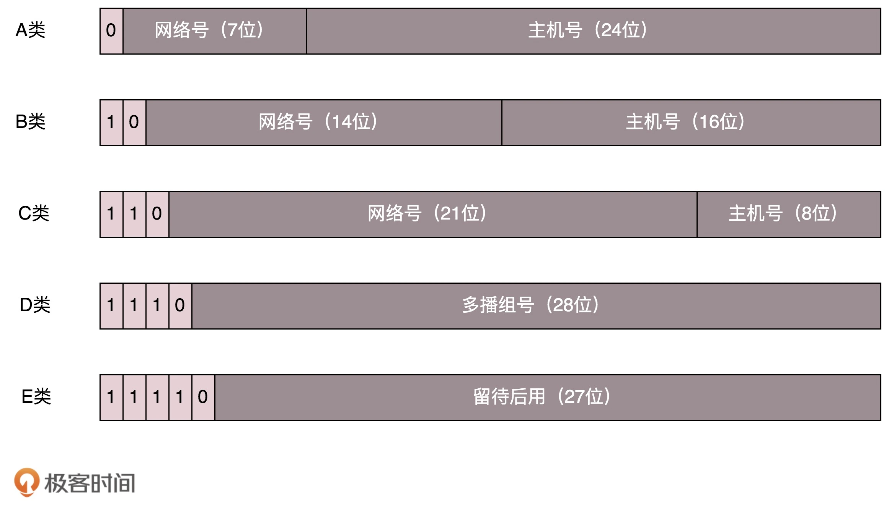

在各类IP地址中，有些IP地址具有特殊用途，不用作主机的IP地址。


**不能分配的网络号**：A类地址中网络号全1的IP地址，即127.×.×.×保留作为本地软件**环回接口（lo，loopback）**，往往使用127.0.0.1用于本机通信，数据报经过内核处理后直接返回，不会在任何网络中出现；A类地址中网络号全为0的IP地址是保留地址，意思是“本网络”，如0.0.0.2代表本网络中主机号为2的主机，可以作为源地址但不能作为目的地址；B类网络号128.0和C类网络号192.0.0（网络号全零）早期标准规定不能指派，但现在都能指派[RFC6890]。


**不能分配的主机号**：主机号全为0表示本网络本身，不能作为源地址和目的地址，如202.98.174.0代表网路号为202.98.174的C类网络；主机号全为1表示本网络的广播地址，也称**直接广播地址**，不能作为源地址但能作为目的地址，如一个目的地址为202.98.174.255的数据报，能够被202.98.174网络内的所有主机收到。


**特殊的IP地址**：32位全为0，即0.0.0.0，当主机未被分配IP地址时用于表示本网络上的本主机，只能作为源地址，不能作为目的地址，也可以作为转发表中的默认路由；32位全为1，即255.255.255.255，表示**受限广播地址**，只在本网络上进行广播，路由器丢弃该分组而不会转发，只能作为目的地址，不能作为源地址；（见DHCP）环回接口地址127.0.0.1可以作为IP数据报的目的地址，理论上也可以作为源地址，但是会被防火墙隔离而无法发送到网络上。


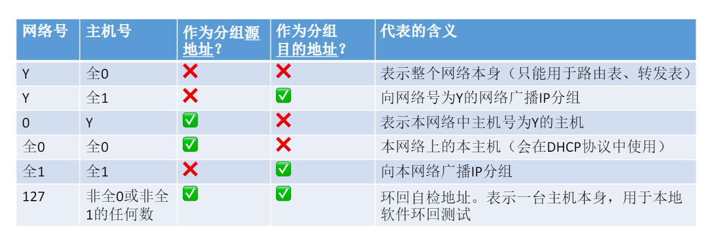

**三级IP地址**


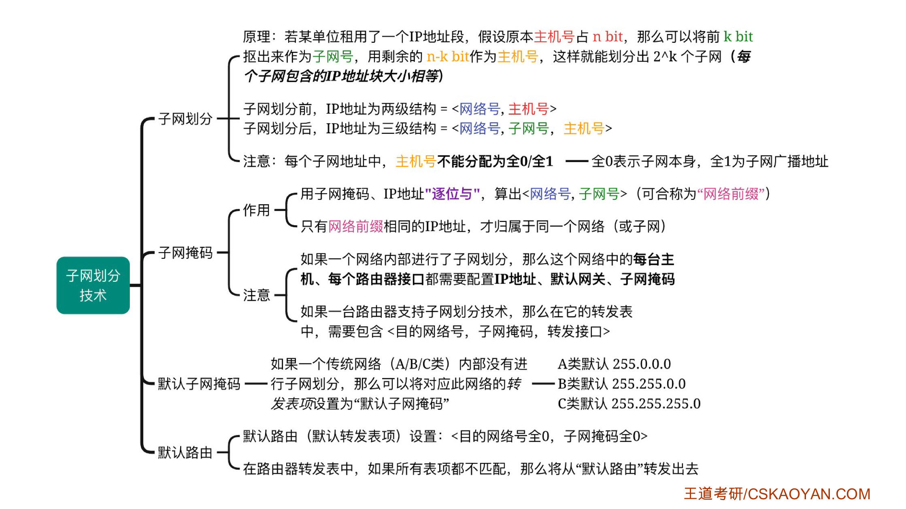

两级IP地址不够灵活，地址空间的利用率有时很低，而且给每个物理网络分配一个网络号会使路由表变得太大，降低网络性能。**划分子网**不改变IP地址原来的网络号，而是从网络的主机号借用若干位作为子网号，在IP地址中又增加了一个子网号字段，使两级IP地址变成了三级IP地址，IP地址：={<网络号>，<子网号>，<主机号>}，增加了灵活性，减少了广播域的小大，但减少了能够连接在网络上的主机总数。


从一个IP地址本身无法判断该主机所连接的网络是否进行了子网划分，划分子网是组织内部的事情，对外仍表现为没有划分子网的一个网络。路由器转发分组根仍然依据IP数据报的目的网络号，本单位的路由器收到IP数据报后，再按目的网络号和子网号找到目的子网，最后把IP数据报交付给目的主机。子网中主机号全0或全1的地址不能被指派，前者为子网的网络地址，后者为子网的广播地址。


**子网掩码**用来指明分类IP地址的主机号部分被借用了多少位作为子网号，是一个由一串1和跟随的一串0组成，与IP地址相对应的，长32位的二进制串，1对应于IP地址中的网络号及子网号，而0对应于主机号。主机或路由器只需将IP地址和其对应的子网掩码逐位“与”就可得出相应子网的网络地址。现在的互联网标准规定，所有网络都必须使用子网掩码，若一个网络未划分子网，则该网络的子网掩码就使用默认子网掩码，A、B、C类地址的默认子网掩码分别为255.0.0.0、255.255.0.0、255.255.255.0。


子网掩码是一个网络的重要属性，一台主机在设置IP地址信息的同时，必须设置子网掩码；同属于一个子网的所有主机及路由器的相应端口，必须设置相同的子网掩码；路由器相互之间交换路由信息时，必须将自己所在网络的子网掩码告诉对方。分组转发时，路由器将分组的目标地址和某网络的子网掩码按位相与，若结果与该网络地址一致，则路由匹配成功，路由器将分组转发至该网络。


**默认网关**是子网与外部网络连接的设备，也就是连接本机或子网的路由器接口的IP地址。当主机发送数据时，根据所发送数据的目的IP地址，通过子网掩码来判定目的主机是否在子网中，若目的主机在子网中，则直接发送；若目的主机不在子网中，则将该数据发送到默认网关，由网关（路由器）将其转发到其他网络，进一步寻找目的主机。


**无分类域间路由选择（Classless Inter-Domain Routing，CIDR）**


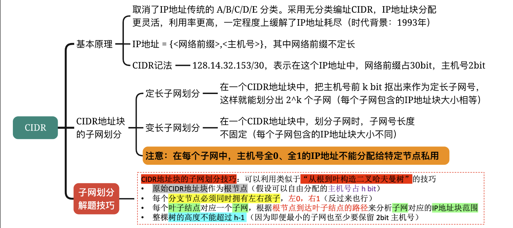

上述传统分类的IP地址已成为历史，近年来广泛使用无分类IP地址进行路由选择。CIDR是在变长子网掩码的基础上提出的，若一个单位需要2000个地址，则给它分配一个2048地址的块，而不是分配一个完全的B类地址，因此可更有效地分配IPv4的地址空间。


CIDR的记法是，IP地址：={<网络前缀>，<主机号>}，还可以使用**斜线记法/CIDR记法**，记为“IP地址/网络前缀所占的位数”。网络前缀对应原来网络号的部分，但它的长度是可变的。斜线及后面的数字不能省略，否则仅从斜线左边的IP地址无法知道其网络地址。对于128.14.32.5/20这个地址，它的掩码是20个连续的1和后续12个连续的0组成，计算机通过和IP地址逐位“与”或直接截取前20位的方法可得该IP地址的网络前缀。


CIDR将网络前缀相同的连续IP地址组成一个CIDR地址块，地址块中的地址数一定是2的整数次幂，网络前缀越短，其地址块包含的地址数就越多。只要知道CIDR地址块中的任何一个地址，就能知道这个地址块的最小地址和最大地址，以及地址块中的地址数。主机号全0代表网络号，主机号全1为广播地址，通常只使用在这两个特殊地址之间的地址。


CIDR记法不能用在IP数据报的源IP和目的IP字段上，因为IP数据报的首部字段格式已经固定，无法容纳掩码字段的位置，也就无法标记出网络前缀的位数。CIDR记法主要用在路由表中，作为现代路由器中的路由表中的地址字段的内容，路由表会单独设置一个地址掩码字段，用于保存地址块的掩码信息。


由于CIDR不使用子网，并没有在32位地址中指明若干位作为子网字段。但分配到一个CIDR地址块的单位，仍可在本单位内根据采用延长网络前缀的方法来灵活地划分子网。例如，某单位分配到地址块/20，就可从主机号中借用3位来继续划分为8个子网，这时每个子网的网络前缀就变成了23位。


**定长子网划分**，与三级地址结构所用的子网划分技术同理，所划分的每个子网都使用相同的子网掩码，并且每个子网所分配的IP地址数量也相同。这种方式的IP地址资源分配不够灵活，IP地址利用率低，容易造成地址资源的浪费，有限的IP地址资源将很快耗尽。


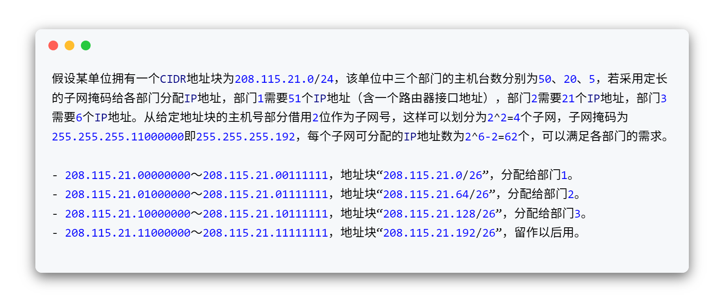

**变长子网划分**，与分类编址法采用的划分方法同理，所划分的每个子网可以使用不同的子网掩码，并且每个子网所分配的IP地址数量可以不同，这样就尽可能地减少了对地址资源的浪费。采用非平均划分的方式最重要的是保证子网号不重复，可以借用哈夫曼编码的策略进行划分。


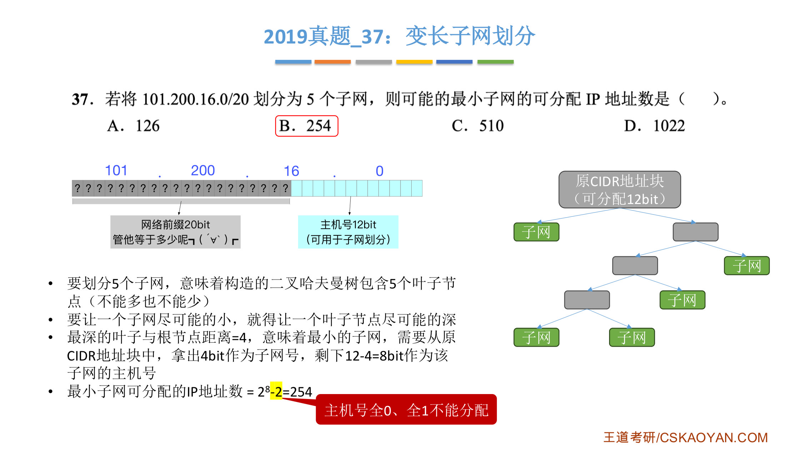

子网主机号全0或全1的地址通常不分配，但是点对点链路是一个最小的子网，至少要保留2bit作为主机号，可以分配一个/30地址块。为了节省IP地址资源，最新标准规定，直接连线的两个路由器的接口可以不分配IP地址。若分配了IP地址，这一段连接就构成一种只包含一段点对点链路的特殊“网络”，主机号可以是0或1，因此可以使用“/31”地址块。


#### IPv6协议（23）


采用CIDR、NAT只能延长IPv4使用寿命，只有采用具有更大地址空间的新版本的IPv6才能从根本上解决IP地址耗尽问题。IPv6将地址从IPv4的32位增大到128位，地址空间是IPv4的26倍，因为地址空间很大，所以可以划分为更多的层次。


IPv6不需要使用DHCP，支持即插即用（自动配置）。IPv6支持资源的预分配，支持实时音/视频等要求保证一定带宽和时延的应用。IPv6只有源主机才能分片，是端到端的，不允许类似IPv4在中间路由器进行分片。虽然IPv6与IPv4不兼容，但总体而言它与所有其他的互联网协议兼容，包括TCP、UDP、ICMP、IGMP和DNS等，只是在少数地方做了必要的修改，大部分是为了处理长地址。


##### IPv6数据报格式


IPv6数据报由**基本首部**和**有效载荷/净负荷**两部分组成，有效载荷由零个或多个**扩展首部**及其后面的数据部分构成，扩展首部不属于IPv6数据报的首部。与IPv4相比，IPv6取消了首部长度字段，首部长度固定为40B。IPv4规定的选项和功能固定不变，选项放在首部的可变部分，而IPv6的选项灵活可变，允许不断扩充功能，放在有效载荷中。IPv6定义了许多可选的扩展首部，可提供比IPv4更多的功能，例如采用身份鉴别和保密功能增大安全性，而且由于因为路由器对逐跳扩展首部外的其它扩展首部不进行处理（由路径两端的主机处理），还能提高路由器的处理效率。


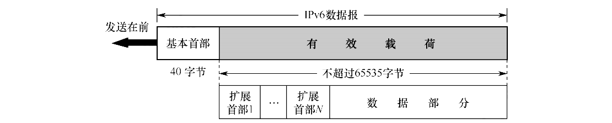

**通信量类**用来区分不同的IPv6数据报的类别或优先级。流指互联网上从特定源点到特定终点（单播或多播）的一系列数据报，这个“流”所经路径上的路由器都保证指明的服务质量，所有属于同一个流的数据报都具有相同的**流标号**。IPv4使用服务类型字段区分不同的服务质量，但是一般不使用，IPv6采用**优先级**和**流标号**字段实现服务类型字段的功能。


IPv6取消了IPv4的总长度字段，改用**有效载荷长度**字段指明IPv6数据报除基本首部以外的字节数，所有扩展首部都算在有效载荷之内，这个字段的最大值是65535B。IPv6取消了标识、标志和片偏移字段，这些功能已包含在分片扩展首部中。IPv6中不允许在中间路由器进行分片，若路由器发现到来的数据报太大而不能转发到链路上，则丢弃该数据报，并向发送方发送一个指示分组太大的 ICMP 报文。IPv6把TTL字段改称为**跳数限制**字段，源点在每个数据报发出时即设定某个限制值（最大为255），路由器每次转发时将其值减1，减为0时就将该数据报丢弃。IPv6取消了协议字段和可选字段，改用**下一个首部**字段，当IPv6没有扩展首部时，其作用与IPv4的协议字段一样，指明所运载的数据是何种协议数据单元；当IPv6带有扩展首部时，它就标识后面第一个扩展首部的类型。IPv6支持**QoS**，即指在有限的带宽资源下，为业务提供端到端的服务质量保证，以满足实时、多媒体通信的需要。因为目前网络传输介质的可靠性较高，所以出现比特错误的可能性很低，且数据链路层和传输层有自己的检验，为了效率，IPv6没有检验和字段。


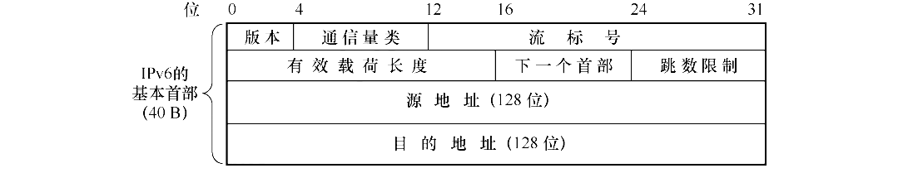

由于取消了首部中不必要的功能，IPv6基本首部的字段数减少到只有8个，但是由于IPv6地址长度为128位，所以IPv6基本首部的长度反而增大到40B。


##### IPv6编址


IPv6数据报的目的地址有单播、多播和任播有三种基本类型，其中**任播**是IPv6增加的一种类型，其终点是一组计算机，但数据报只交付其中的一台计算机，通常是距离最近的一台计算机。


IPv6标准使用**冒号十六进制记法**，即把地址中的每4位用一个十六进制数表示，并用冒号分隔每16位。当16位域的开头有一些0时，可以采用一种缩写表示法，但在域中必须至少有一个数字。例如，可以把地址4BF5:0000:0000:0000:BA5F:039A:000A:2176缩写为4BF5:0:0:0:BA5F:39A:A:2176。当有相继的0值域时，还可以进一步缩写，即左侧零省略，连续零压缩（**双冒号法**），但是在一个地址中仅能出现一次，因为0值域的个数没有编码，需要从指定的总的域的个数来推算，前述地址可被书写成4BF5::BA5F:39:A:2176。另外，斜线记法仍然适用。


IPv6地址中，**未指明地址**不能用作目的地址，只能用于还未配置IPv6地址的主机作为源地址；**环回地址**的作用与IPv4的环回地址相同，但IPv6的环回地址仅此一个；**多播地址**的作用和IPv4的一样，这类地址占IPv6地址空间的1/256；**本地链路单播地址**的作用类似于IPv4的私有IP地址。


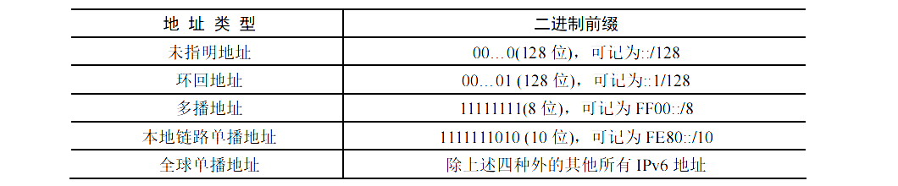

**全球单播地址**是用得最多的地址，采用**三级地址结构**，第一级为48位**全球路由选择前缀**，用于互联网中的路由选择，相当于IPv4分类地址中的网络号；第二级为6位**子网标识符**，用于各机构构建自己的子网；第三级为**接口标识符**，用于指明主机或路由器的单个网络接口，相当于IPv4分类地址中的主机号。与IPv4不同，IPv6地址的接口标识符有64位之多，足以对各种接口的硬件地址直接进行编码，IPv6可以直接从128位地址的最后64位中直接提取出相应的硬件地址，而不需要使用ARP进行地址解析。


##### 从IPv4向IPv6过渡


从IPv4向IPv6过渡只能采用逐步演进的办法，同时还必须使新安装的IPv6系统能够向后兼容，即IPv6系统必须能够接收和转发IPv4分组，且能够为IPv4分组选择路由。


**双协议栈**，是指在一台设备上同时装有IPv4和IPv6两个协议栈，分别配置了一个IPv4地址和一个IPv6地址，因此这台设备既能和IPv4网络通信，又能和IPv6网络通信，通过DNS获知目的主机采用的是哪种地址。


**隧道技术**，是指在IPv6数据报要进入IPv4网络时，把整个IPv6数据报封装成IPv4数据报的数据部分，使原来的IPv6数据报就好像在IPv4网络的隧道中传输。当IPv4数据报离开IPv4网络时，再将其数据部分交给主机的IPv6协议。


由于IPv6与IPv4一样，都不确保数据报的可靠交付，因此IPv6也需要使用网际控制报文协议ICMP来向发送IPv6数据报的源主机反馈一些差错信息，相应的ICMP版本为ICMPv6。ICMPv6比ICMPv4要复杂得多，它合并了原来的地址解析协议ARP和网际组管理协议IGMP的功能。因此与IPv6配套使用的网际层协议就只有ICMPv6这一个协议。


#### 分组转发（09，11，13-15，18）


**转发表**


分组的实际转发是直接查找转发表，而不是查找路由表，二者并不相同。路由表总是用软件来实现的，而转发表可以用软件来实现，甚至也可以用特殊的硬件来实现。转发表是从路由表得出的，其表项和路由表项有直接的对应关系，但二者格式不同。转发表的结构应使查找过程最优化，而路由表则需对网络拓扑变化的计算最优化。


转发表每个表项包括分组将要发往的目的网络，以及分组的下一跳，即下一步接收者的MAC地址。分组转发基于目的主机所在的网络，因为互联网上的网络数远小于主机数，这样可以极大地压缩转发表的大小。当分组到达路由器后，路由器根据目的IP地址的网络前缀来查找转发表（将目的地址与表项中的掩码相与），确定下一跳应当到哪个路由器。通过多次间接交付，IP数据报最终一定可以找到目的主机所在目的网络上的路由，当到达最后一个路由器时，才试图向目的主机进行直接交付。


在路由表中可以增加**特定主机路由**，即对特定目的主机的IP地址专门指明一个路由，以方便网络管理员控制和测试网络，特定主机路由条目的匹配优先级最高。若特定主机的IP地址是a.b.c.d，则转发表中对应项的目的网络是a.b.c.d/32。/32表示的子网掩码没有意义，但是，这个特殊的前缀可以用在转发表中。


转发表中还可设置一条**默认路由**，用特殊前缀0.0.0.0/0表示，全0掩码和任何目的地址进行按位与运算，结果必然为全0，即必然和前缀0.0.0.0/0相匹配。只要目的网络不在转发表中，就一律选择默认路由转发，默认路由表项的匹配优先级最低。默认路由通常用于路由器到互联网的路由，互联网包括无数的网络集合，不可能在路由表项中一一列出，因此只能采用默认路由的方式。


**分组转发算法**


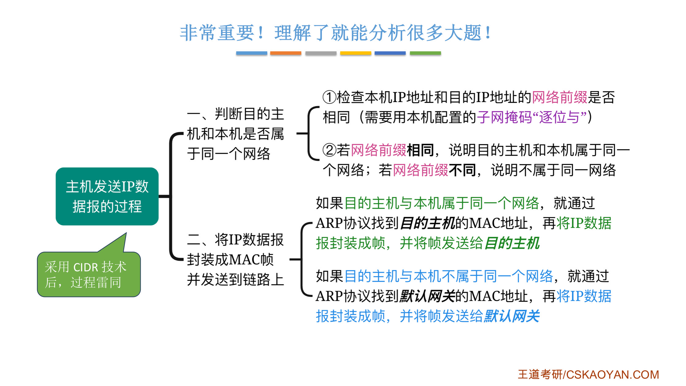
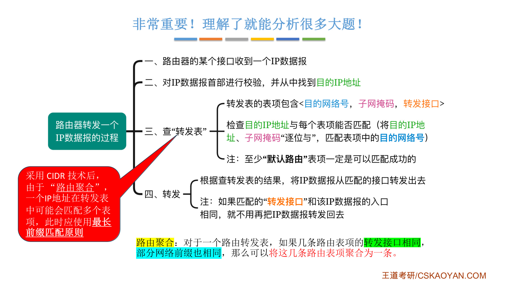

当收到一个IP分组时，路由器从分组的首部提取出目的主机的IP地址。查找转发表，若查找到特定主机路由，则按照这条路由的下一跳转发分组；否则从转发表中的下一条（按前缀长度的顺序）开始检查。将这一行的子网掩码与目的地址逐位相与，若运算结果与本行的前缀匹配，则查找结束，按照“下一跳”指出的地址进行处理，或者直接交付本网络上的目的主机，或通过指定接口发送到下一跳路由器。否则，若转发表还有下一行，则对下一行进行检查。若目的网络不再转发表中，但是转发表中有一个默认路由，则把分组传送给默认路由；否则，报告转发分组出错。


值得注意的是，转发表（或路由表）并没有给分组指明到某个网络的完整路径，只是指出到某个网络应当先到某个路由器（下一跳路由器），到达下一跳路由器后，再继续查找其转发表，知道再下一步应当到哪个路由器。得到下一跳路由器的IP地址后，并不是直接将该地址填入待发送的数据报，而是将该IP地址通过ARP转换成MAC地址，将此MAC地址填入MAC帧首部，然后根据这个MAC地址找到下一跳路由器。在不同网络中传送时，MAC帧的源地址和目的地址要发生变化。


**最长前缀匹配**


网络前缀越长，其地址块就越小，路由就越具体。采用CIDR编址时，若一个分组在转发表中可以找到多个匹配的前缀，则采用**最长前缀匹配/最佳匹配**的方法，从中选择具有最长网络前缀的路由。为了更快地查找转发表，可以按照前缀的长短，将前缀最长的排在第1行，按前缀长度的降序排列。这样，从第1行最长的开始查找，只要检索到匹配的，就不必再继续查找。为了更有效地查找最长前缀匹配，将无分类编址的路由表存放在一种层次式数据结构中，通常采用二叉线索，然后自上而下地按层次进行查找。


**路由聚合**


一个大的CIDR地址块中包含很多小地址块，因此在路由表中，如果几条表项的转发接口以及部分网络前缀相同，那么可以将这几条表项聚合为一条，这种地址成为**路由聚合/构成超网**。CIDR的网络前缀长度灵活，上层网络的前缀长度短，则相应的路由表的项目就少。路由聚合可以压缩了路由表所占的空间，从而提高网络性能，但是也会引入额外的无效地址。例如，网络1-3的网络前缀在二进制表示的情况下前27位都相同，第28位分别是0、1、1，并且从R1到网络1-3路由的下一跳皆为R2。若不使用路由聚合，则R1的路由表中需要分别有到网络1-3的路由表项；若使用路由聚合，到网络1-3的三条路由就可聚合成一个/27地址块。


**实例分析**


分析两台主机之间传输IP数据报的过程：H3→H6（同一子网内的两台主机），H1→H3（不同子网内的两台主机），H1→H7（采用子网划分技术的网络→传统网络），H7→H1（传统网络→采用子网划分技术的网络），主机H1发往Internet的某个IP数据报如何传输？（设目的IP地址=111.2.3.4）。


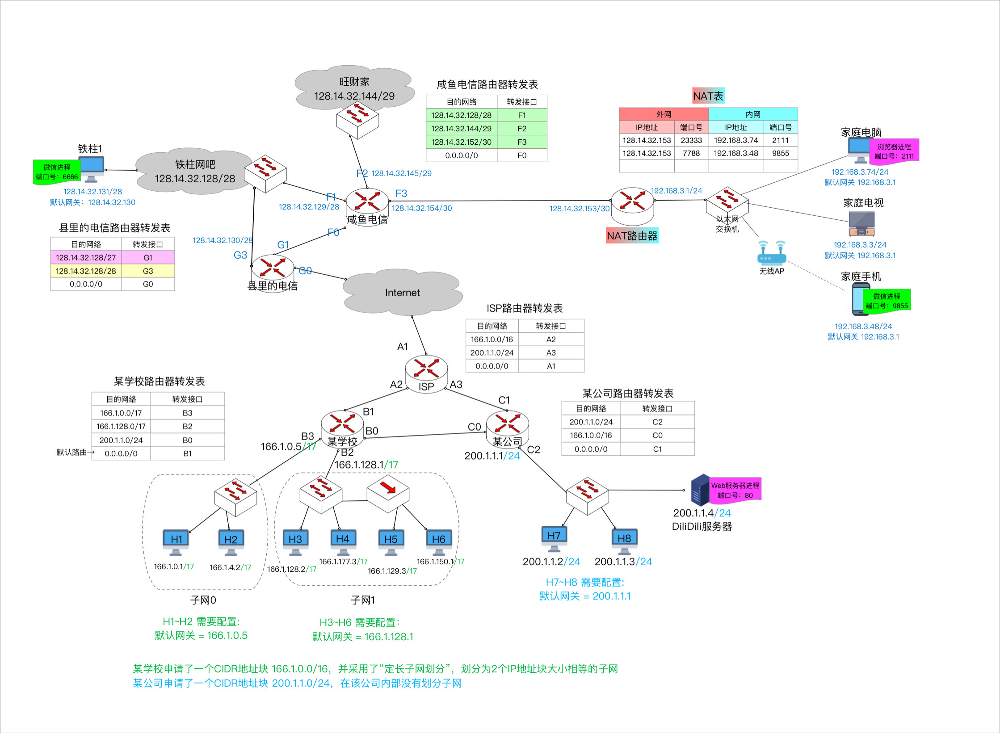

#### 网络地址转换（11，16，19-20，23）


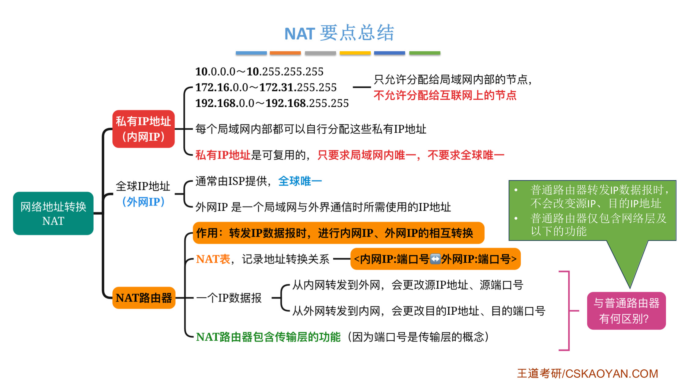

**私有IP地址/可重用地址/内网IP**


为了网络安全，划出了三个只用于LAN，不用于WAN连接的私有IP地址块，私有IP地址不能直接用于互联网，必须通过网关利用NAT将私有IP地址转换为互联网中合法的全球IP地址后，才能出现在互联网上，并且允许私有IP地址被LAN重复使用，这有效地解决了IP地址不足的问题。这三个私有IP地址块分别是，10.0.0.0/8、172.16.0.0/12、192.168.0.0/16，分别相当于1个A类网络，16个连续的B类网络，256个连续的C类网络。


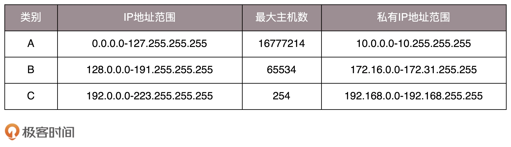

在互联网中的所有路由器，对目的地址是私有地址的数据报一律不进行转发，这种采用私有IP地址的互联网络称为**专用互联网或本地互联网**。通信只能由专用网内部发起，外网主机无法直接向其发送通信，除外采用内网穿透，内网主机无法成为服务器。


**网络地址转换（Network Address Translation，NAT）协议**


通过将专用网络地址转换为公用地址，从而对外隐藏内部管理的IP地址，使得整个专用网只需要一个全球IP地址就可与互联网连通。专用网本地IP地址是可重用的，大大节省了IP地址的消耗。同时，它隐藏了内部网络结构，降低了内部网络受到攻击的风险。


使用NAT时需要在专用网连接到互联网的路由器上安装NAT软件，NAT路由器至少有一个有效的外部全球IP地址。运行了NAT协议的路由器会生成并维护一张**NAT转发表**，存放着{本地IP地址：端口}到{全球IP地址：端口}的映射，用于私有地址和公网地址的转换。通过这种映射方式，可让多个私有IP地址映射到一个全球IP地址。使用私有地址的整个子网抽象为一台逻辑主机，逻辑主机的IP地址为NAT路由器的公网IP，而子网内的主机对外表现为逻辑主机的进程端口。


普通路由器在转发IP分组时，其源IP地址和目的IP地址都不会改变。而NAT路由器在转发IP分组时，一定要转换源IP地址或目的IP地址，从内网转发到外网需要更换源IP和源端口，从外网转发到内网需要更换目的IP和目的端口。普通路由器仅工作在网络层，而NAT路由器转发数据报时需要查看和转换传输层的端口号，因此NAT路由器其实是**网关**。


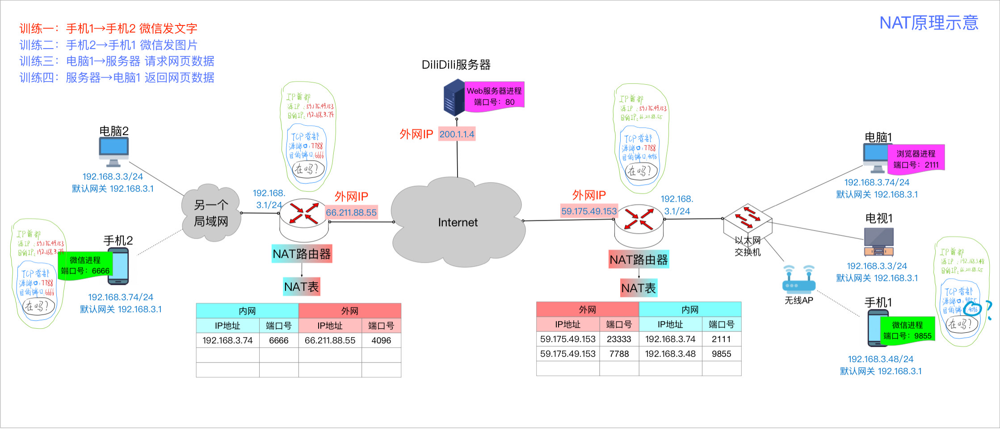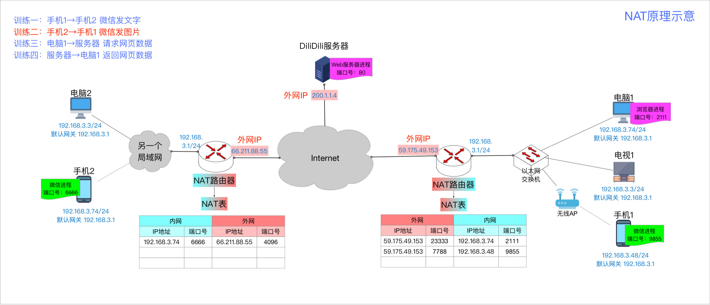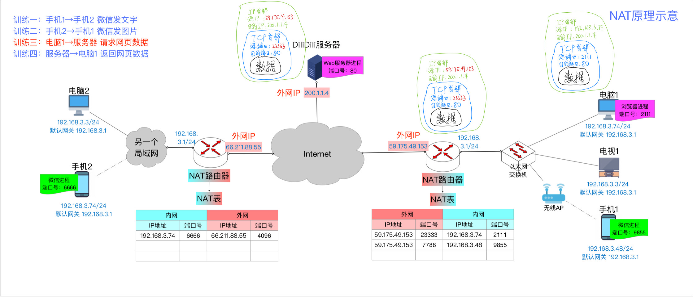

#### 网络地址解析（11-12，15，21）


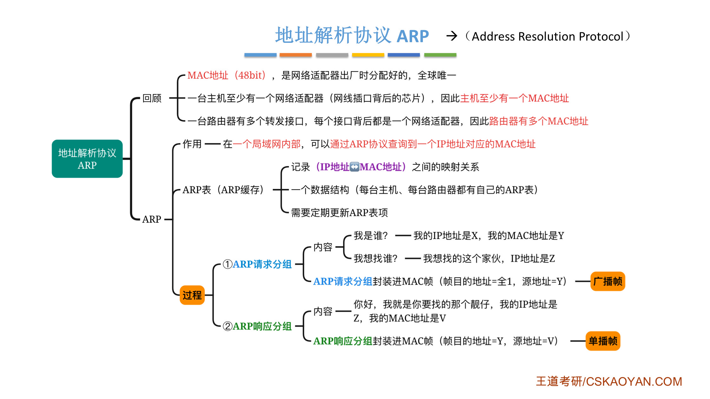

一台主机必须知道接收方的IP地址才能发送IP数据报给另一台主机，但是IP数据报必须封装成帧才能在实际网络的链路上传送数据。在以太网环境中，数据的传输所依赖的是MAC地址，无论网络层使用什么协议，最终必须使用硬件地址。**地址解析协议（Address Resolution Protocol，ARP）**用于解决同一局域网上的主机或路由器的IP地址和硬件地址的映射问题，可以通过IP地址获取MAC地址。每台主机都设有一个**ARP高速缓存**，用来存放本局域网上各主机和路由器的IP地址到MAC地址的映射表，称为**ARP转发表**。主机使用ARP协议来动态维护ARP表，ARP对高速缓存中的每个映射表项都设置了生存时间（如20min），超时的项目会从高速缓存中删除。


主机A欲向本局域网内的某台主机B发送IP数据报时，先检查主机B的IP地址，若发现主机A，B在同一个子网中，主机A就在自己的ARP高速缓存中查看有无主机B的IP地址。若有B的IP地址，则可以查出其对应的硬件地址，可将此硬件地址写入MAC帧，然后通过局域网将该MAC帧发往此硬件地址。若没有B的IP地址，则通过使用目的MAC地址为FF-FF-FF-FF-FF-FF的帧来封装并广播**ARP请求分组（广播）。**同一个局域网里的所有主机都收到此ARP请求，其他主机丢弃该帧，只有主机B接收并向主机A发出**ARP响应分组（单播）**，分组中包含主机B的IP地址与MAC地址的映射关系。主机A收到ARP响应分组后就将此映射写入ARP缓存，然后按查询到的硬件地址发送MAC帧。ARP因为“看到了”IP地址，所以它工作在网络层，而NAT路由器因为“看到了”端口，所以它工作在传输层。


主机A欲向其他局域网上的某台主机C发送IP数据报时，先检查主机C的IP地址，若发现主机A，C并不在同一个子网中，那么主机A就把这个IP数据报发送给默认网关，由网关路由器代为转发。主机A检查自己的ARP转发表，发现没有网关路由器的MAC地址，则主机A广播一个ARP请求帧，帧的目标MAC全1，目的IP是网关路由器的私有IP地址。该子网中的所有主机以及路由器均收到这条广播帧，但其他主机丢弃这个帧，只有网关路由器接收并向主机A发送ARP响应帧。主机A拿到网关路由器的MAC地址后更新转发表，然后把IP数据报封装在链路层转发给网关路由器，此后主机A就不再管这个IP数据报后续是如何在链路层转发的。网关路由器收到这个帧后，查询路由表后确定应该从哪个端口转发和下一跳的IP地址，然后查询ARP转发表看是否有下一跳路由器的MAC地址，若有则将IP数据报封装成帧后转发，若无则继续发送ARP请求帧请求其MAC地址。路由器把IP数据报封装成帧进行转发后，就不再管这个IP数据报后续是如何在链路层转发的，最后由某个路由器将该数据转发给主机C。


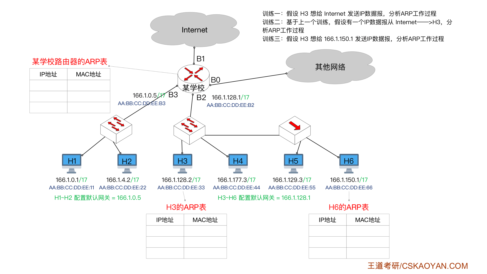
MAC帧首部的变化，在上面的IP层中是看不见的。从IP地址到硬件地址的解析自动进行，主机的用户并不知道这种地址解析过程。只要主机或路由器和本网络上的另一个已知IP地址的主机或路由器进行通信，ARP就自动地将这个IP地址解析为数据链路层所需的硬件地址，然后插入MAC帧。


#### 网络差错报告（12，22）


为了有效地转发IP数据报，提高交付成功的机会，在网络层使用了**网际控制报协议（Intemet Control Message Protocol，ICMP）**让主机或路由器报告差错和异常情况。ICMP报文被封装在IP数据报中发送，但ICMP不是高层协议，而是网络层的协议。封装了ICMP报文的IPv4数据报的协议字段为1，当路由器收到这个IP数据报，检查IP数据报头部，发现协议字段为1，从而获悉内部封装了ICMP报文。


**ICMP差错报告报文**


用于目标主机或到目标主机路径上的路由器，向源主机报告差错和异常情况，共有以下5种常用的类型。当路由器或主机不能交付数据报时，如IP分组首部的DF=1，但是发送到一条MTU小于分组长度的链路时，就向源点发送**终点不可达报文**。当路由器或主机因为拥塞而丢弃数据报时，就向源点发送**源点抑制报文**，使源点知道应当把数据报的发送速率放慢。ICMP标准在不断更新，最新的ICMP标准[RFC6633]已不再使用“源点抑制报文”。当路由器收到一个数据报时，会将其首部中生存时间（TTL）的值减1，若结果不为0，则路由器将该数据报转发出去；若结果为0，则路由器不但要丢弃该数据报，而且要向源点发送**时间超过报文**。当终点在预先规定的时间内不能收到一个数据报的全部数据报片时，就把已收到的数据报片都丢弃，并向源点发送**时间超过报文**。当路由器或目的主机收到的数据报的首部中有的字段（注意不是任意字段）的值不正确时，就丢弃该数据报，并向源点发送**参数问题报文**。路由器把**改变路由/重定向报文**发送给主机，让主机知道下次应将数据报发送给另外的路由器（可通过更好的路由）。


对ICMP差错报告报文，第一个分片的数据报片的所有后续数据报片，具有多播地址的数据报，具有特殊地址（如127.0.0.0或0.0.0.0）的数据报，不发送ICMP差错报告报文。


**ICMP询问报文**


**回送请求和回送回答报文**，用来测试目的主机是否可达以及了解其有关状态。**时间戳请求和回答报文**，利用报文中记录的时间戳，发送方可计算出当前的往返时延。


ICMP的两个常见应用是**分组网间探测PING**和**Traceroute**（UNIX中的名字，在Windows中是Tracert）。其中，PING工作在应用层，它直接使用网络层的ICMP的回送请求和回答报文，用来测试两台主机之间的连通性；Traceroute（Tracert）工作在网络层，使用了ICMP时间超过报文、回送请求和回答报文，用来跟踪分组经过的路由。


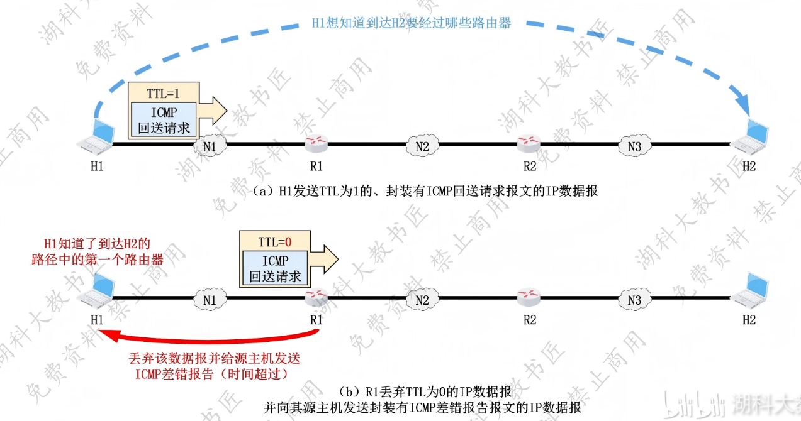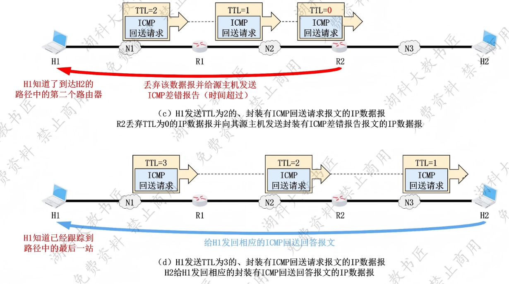

### 控制层


#### 路由表


转发是路由器根据转发表把收到的IP数据报从合适的端口转发出去，它仅涉及一个路由器，而路由选择则涉及很多路由器，路由表是许多路由器协同工作的结果。这些路由器按照复杂的路由算法，根据从各相邻路由器得到的关于网络拓扑的变化情况，动态地改变所选择的路由，并利用路由聚合构造出整个路由表，主要用途是路由选择。从历年统考真题可以看出，标准的路由表有4个项目：目的网络IP地址、子网掩码、下一跳IP地址、接口。


#### 路由算法（21）


所有最短路径算法都依赖于一个性质：“两点之间的最短路径也包含了路径上其他顶点间的最短路径。”


路由选择协议的核心是路由算法，给定一组路由器以及连接路由器的链路，路由算法要找到一条从源路由器到目的路由器的“最佳”路径。**静态路由算法/非自适应算法**是指由网络管理员手工配置每一条路由，简单且开销较小，需要维护整个网络的拓扑结构信息，但不能及时适应网络状态的变化，不会估计流量和结构来调整其路由决策，适用于简单的小型网络。非自适应算法的路由选择不是不能改变的，事实上用户可以随时配置路由表。**动态路由算法/自适应算法**根据网络流量负载和拓扑结构的变化来动态调整自身的路由表，自动发现并维护路由信息，能及时适应网络状态的变化，实现复杂且开销较大，适用于较复杂的大型网络，常用的动态路由算法可分为距离-向量路由算法和链路状态路由算法两类。动态路由选择和静态路由选择都使用路由表。


**距离矢量路由（distance vector routing）**


**距离向量**是指节点到网络中其他节点的一组距离。距离向量算法以**Bellman-Ford算法**为基础，每个节点维护下列路由信息：本节点到每个邻居的距离，本节点的距离向量，每个邻居的距离向量。每个节点仅与它的直接邻居交谈，定期地向它的每个邻居发送自己的距离向量副本。当节点接收到一个新距离向量时，首先保存该距离向量，然后使用Bellman-Ford公式更新自己的距离向量。若节点的距离向量因这个更新步骤而改变，就向它的每个邻居发送其更新后的距离向量，而没有变化的节点不用发送更新报文。接收到邻居的更新报文后，节点又重新计算它们的距离向量，此次没有节点更新，因此也无更新报文发送，算法进入静止状态。距离向量路由算法适用于小规模网络，最常见的是RIP算法、BGP协议。


**链路状态路由算法（link state routing）**


**链路状态**是指相邻的路由器以及相应链路的代价。链路状态算法要求每个节点都具有全网拓扑结构图，这个拓扑结构图在全网范围内是一致的。每个节点主动测试所有相邻节点的状态，定期地通过**链路状态报文**将链路状态传播给所有其他节点。因此，每个节点都知道全网共有多少个节点、哪些节点是相连的、其代价是多少等，于是每个节点都可使用**Dijkstra最短路径算法**计算出到达其他节点的最短路径。


在链路状态算法中，节点每收到一个链路状态报文，便用其更新自己的网络状态“视野图”，一旦链路状态发生变化，就使用Dijkstra算法重新计算到达所有其他节点的最短路径。节点的链路状态只涉及相邻节点的连通状态，与整个互联网的规模并无直接关系，所以链路状态算法适用于大型的或路由信息变化聚敛的互联网环境，典型的链路状态路由算法是OSPF算法。


链路状态算法的主要优点是，每个节点都使用同样的链路状态数据独立地计算路径，而不依赖中间节点的计算。链路状态报文不加改变地传播，因此采用该算法易于查找故障。当一个节点从所有其他节点接收到报文时，它就在本地立即计算出正确的路径，保证一步汇聚。因为链路状态报文仅运载来自单个节点关于直接链路的信息，其大小与网络中的节点数量无关，所以链路状态算法比距离-向量算法有更好的规模可伸展性。每个节点通过广播的方式与所有其他节点交谈，但它只告诉它们与它直接相连的链路的费用。


#### 路由选择协议


路由表建立的依据是路由协议，互联网采用的是自适应的、分布式路由选择协议。因为互联网的规模非常大，许多联网单位不愿让外界了解自己单位网络的布局细节，所以互联网采用分层次的路由选择协议。为此，可以把整个互联网划分为许多较小的**自治系统（Autonomous System，AS）**，它是一组在单一技术管理下的路由器，这些路由器使用相同的内部路由选择协议和共同的度量。


AS之间的路由选择也称**域间路由选择**，AS内部的路由选择也称**域内路由选择**。每个AS自己决定在本AS内部运行哪个内部网关协议，但每个AS都有一个或多个路由器，除了要运行本系统的内部网关协议外，还要运行外部网关协议。


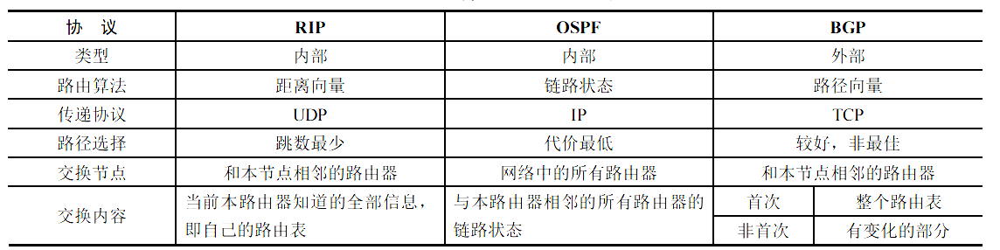
补充：三个方式的目的IP地址类型分别是广播、多播、单播，OSPF的组播地址为224.0.0.5。

##### 内部网关协议（Interior Gateway Protocol，IGP）


即在一个AS内部使用的路由选择协议，它与在互联网中的其他AS选用什么路由选择协议无关。目前这类路由选择协议使用得最多，如RIP和OSPF。


###### 路由信息协议（Routing Information Protocol，RIP）（10，16-17，24）


RIP是应用层协议，它使用UDP传送数据，使用520号端口。从报文封装的角度看，RIP属于应用层，但是它的核心功能——路由选择属于网际层。


**基本思想**


RIP规定，网络中每个路由器都要维护从它自身到其他每个目的网络的唯一最佳距离记录。到达目的网络的距离使用**跳数（Hop Count）**来衡量，规定路由器到其直连网络的距离为1，每经过一个路由器距离就加1。一条路径最多允许包含15个路由器，距离等于16时表示网络不可达，因为距离向量路由可能会出现环路的情况，这样可以防止分组不断在环路上循环，减少网络拥塞的可能性，因此RIP只适用于小型互联网。RIP根据最少跳数进行路径选择，选择的路径不一定是时间最短的，但一定是具有最少的路由跳数。


每个路由器仅和相邻路由器周期性地交换并更新路由信息，交换的信息是本路由器所知道的全部信息，即自己的路由表。每个路由表项都有（目的网络、距离、下一跳路由器地址）三个关键字段。当网络拓扑发生变化时，路由器会及时向相邻路由器通告拓扑变化后的路由信息，即**触发更新**。另外，经过固定的时间间隔（通常为30秒），路由器之间也会交换路由信息，即**周期性更新**。


**RIP交互报文**


路由器刚开始工作时，只知道自己到几个直连网络的距离为1，此时它会立即向所有邻居路由器发送**RIP请求消息**，以便快速获得整个RIP网络的路由信息。另外，运行中的路由器也可以随时根据自身需要向它的所有邻居发出RIP请求信息，每个路由器发送请求消息的时间是不同的。


RIP路由器接收到RIP请求消息后，会立即发出**RIP响应消息**进行回应。RIP路由器总是每隔30s向它的所有邻居路由器发送RIP响应消息，其中携带该路由器的RIP路由表中的最新路由信息。另外，如果一个路由器路由信息发生变化，一般会主动发送响应给所有邻居路由器，广播自己的新路由，而不是发送确认（但是题目中出现过只给一个邻居发送响应的情况）。


**路由算法**


RIP是一种分布式的基于距离向量的路由选择协议，对每个相邻路由器发送来的RIP报文都执行如下步骤。


1. 对于地址为X的相邻路由器发来的RIP报文，把“下一跳”字段中的地址都改为X，并把所有“距离”字段的值加1。

2. 对于修改后的RIP报文中的每个项目，若原来的路由表中没有目的网络N，则把该项目添加到路由表中，表明这是新的目的网络；若原来的路由表中有目的网络N，且下一跳路由器的地址是X，用收到的项目替换原路由表中的项目，因为要以更新的消息为准；若原来的路由表中有目的网络N，下一跳路由器的地址不是X，且收到的项目中的距离d小于路由表中的距离，则进行更新；否则什么也不做。

3. 若达到**RIP默认超时时间180秒**后还没有收到相邻路由器的更新路由表，则把此相邻路由器记为不可达的路由器，即把距离设置为16。若再过120s未收到，直接删除该项目。

4. 经过若干次交换和更新后，所有的路由器最终都会知道到达本AS内任何网络的最短距离和下一跳路由器的地址，此时网络设备的路由表与网络拓扑结构保持一致，称为**收敛**。


**收敛过程**


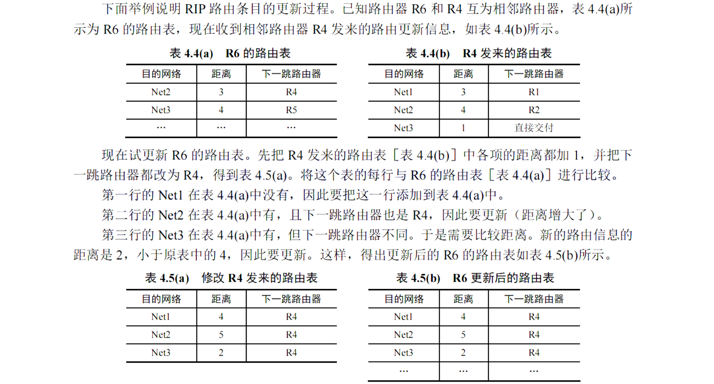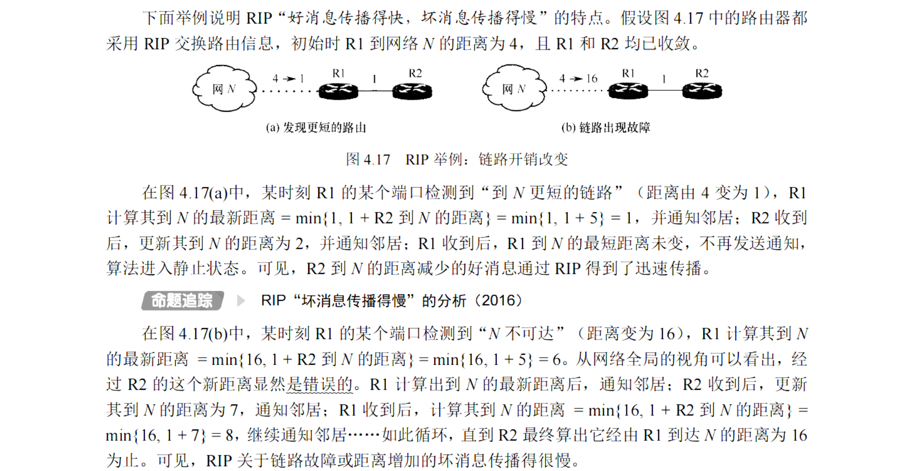

**优缺点**


RIP实现简单、开销小、收敛过程较快。若一个路由器发现了更短的路由，则这种更新信息就传播得很快，在较短时间内便可被传至所有路由器，俗称“好消息传播得快”。


但是，RIP限制了网络的规模，它能使用的最大距离为15。路由器之间交换的是路由器中的完整路由表，更新报文的大小与网络中的节点数量成正比，因此网络规模越大，开销也越大。


当网络出现故障时，路由器之间需反复多次交换信息才能完成收敛，要经过较长时间才能将故障消息传送到所有路由器，称为**慢收敛现象**，俗称“坏消息传播得慢”。通过设置RIP最大值为15，触发更新和**水平分割**（某接口收到某特定路由信息后不再让该信息通过此接口反向传送）的方式减少该问题的发生，但是无法彻底解决。


###### 开放式最短路径优先（Open Shortest Path First，OSPF）（17，24）

###### 

OSPF协议是使用分布式链路状态路由算法的典型代表，广泛应用在数据中心用于路由决策，也是IGP的一种。


**基本特点**


OSPF使用**洪泛法（Flooding）**向本AS中所有路由器发送信息，即路由器通过所有输出端口向所有相邻的路由器发送信息，而每个相邻的路由器又将此信息发往所有的相邻路由器，但不再发送给刚刚发来信息的那个路由器。这样，最终整个区域中所有的路由器都得到了整个自治系统的链路状态，路由器可以根据链路状态通过Dijkstra算法建立路由表。


OSPF发送的信息是与本路由器相邻的所有路由器的链路状态，这只是路由器所知道的部分信息。因为一个路由器的链路状态只涉及与相邻路由器的连通状态，与整个网络的规模并无直接关系，所以当互联网规模很大时，OSPF要比RIP好得多。


采用OSPF的路由器只有当链路状态发生变化时，才用洪泛法向所有路由器发送此信息，并且更新过程收敛得快，不会出现RIP“坏消息传得慢”的问题。而在RIP中，不管网络拓扑是否发生变化，路由器之间都要定期交换路由表的信息。为了确保链路状态数据库与全网的状态保持一致，OSPF还规定每隔一段时间（如30分钟）要刷新一次数据库中的链路状态。


OSPF是网络层协议，它不用UDP或TCP，而直接用IP数据报传送（与ICMP相同），即将该信息直接作为IP数据报的数据部分，其IP数据报首部的协议字段为89。OSPF构成的数据报很短，这样做可减少路由信息的通信量，可以不必将长的数据报分片传送，分片传送的数据报只要丢失一个，就无法组装成原来的数据报，而整个数据报就必须重传。而RIP是应用层协议，它在传输层使用UDP，即将RIP报文作为UDP报文的数据。


所谓“链路状态”就是说明本路由器都和哪些路由器相邻，以及该链路的“度量”。OSPF将这个“度量”用来表示费用、距离、时延、带宽等，这些都由网络管理人员来决定，因此较为灵活。有时为了方便就称这个度量为“代价”，OSPF允许对每条路由设置成不同的代价，对于不同类型的业务可计算出不同的路由。


若到同一个目的网络有多条相同代价的路径，则可将通信量分配给这几条路径进行负载均衡，这常常被称为**等价路由**。对于数据中心的网络，应用的接入层会有负载均衡LVS，可以和OSPF一起实现高吞吐量的接入层设计。


OSPF分组具有鉴别功能，从而保证仅在可信赖的路由器之间交换链路状态信息。OSPF支持可变长度的子网划分和无分类编址CIDR。每个链路状态都带上一个32位的序号，序号越大，状态就越新。RIP2也支持变长子网掩码，CIDR，简单的鉴别功能和多播。


**基本工作原理**


因为各路由器之间频繁地交换链路状态信息，所以所有路由器最终都能建立一个**链路状态数据库LSDB**，即全网的拓扑结构图。然后，每个路由器利用链路状态数据库中的数据，使用Dijkstra算法计算自己到达各目的网络的最优路径，构造出自己的路由表。此后，当链路状态发生变化时，每个路由器重新计算到达各目的网络的最优路径，构造出新的路由表。虽然使用Dijkstra算法能计算出完整的最优路径，但路由表中不会存储完整路径，而只存储“下一跳”，只有到了下一跳路由器，才能知道再下一跳应当怎样走。每个路由器都有一张**邻居表**，每个表项包含（邻居ID，接口，判活倒计时）。


OSPF不限制网络规模，为了使其能够用于大型网络，采用分层路由将路由器进行划分，使得AS被再划分为若干更小的范围，称为**区域**，这样可以把洪泛法交换链路状态信息的范围局限在各个区域，而不是整个AS，从而减少了整个网络上的通信量。区域内路由器（所有接口都在区域内）只知道本区域的完整网络拓扑，对于其他区域内的结构毫不知情，**区域边界路由器**负责为流向该区域以外的分组提供路由选择。采用分层次划分区域的方法虽然使交换信息的种类增多了，同时也使 OSPF 协议更加复杂了。


在AS内只有一个区域配置成**主干区域**，它包含AS内的所有区域边界路由器，可能还包含一些非边界路由器，这些路由器称为**主干路由器BBR**。主干区域的作用是连通其他区域，当分组在AS内的不同区域之间传送时，要先找到本区域内的一个区域边界路由器，再通过主干区域路由到位于目的区域的区域边界路由器，最后路由到目的地。每个区域至少有一个区域边界路由器，主干区域还要有一个路由器专门负责和本AS外的其他AS交换路由信息，称为**自治系统边界路由器ASBR**。每个区域都有一个32bit的区域标识符，主干区域的标识符为0.0.0.0。


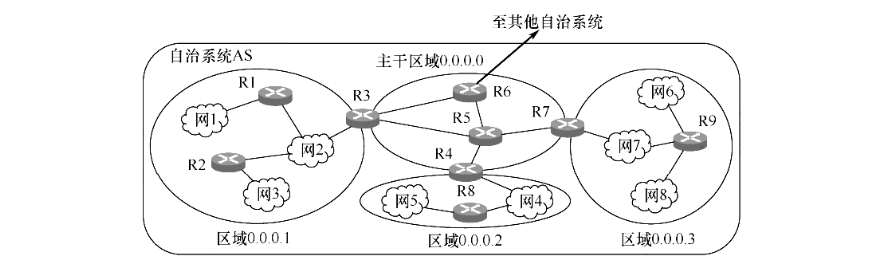

**分组类型**


**问候分组HELLO**用来发现和维持邻站的可达性，通常网络中传送的大多数OSPF分组都是问候分组，封装在IP数据报中，发送组播地址224.0.0.5。OSPF规定两个相邻路由器每隔10秒要交换一次问候分组，以便知道哪些邻站可达，若有40秒没有收到某个相邻路由器发来的问候分组，则认为该相邻路由器不可达，应立即修改链路状态数据库，并重新计算路由表。


**链路状态更新分组LSU**用洪泛法对全网更新链路状态，它是OSPF最核心的部分，**链路状态确认分组LSAck**对链路更新分组的确认。在网络运行的过程中，只要一个路由器的链路状态发生变化，该路由器就要使用链路状态更新分组，用洪泛法向全文更新链路状态，收到重复的更新分组无需转发，只需要发送一次确认。在网络运行的过程中，只要一个路由器的链路状态发生变化，该路由器就要使用链路状态更新分组，用可靠的洪泛法向全网更新链路状态，其他路由器在收到更新分组后要发送链路状态确认分组。为了确保链路状态数据库与全网的状态保持一致，OSPF还规定每隔一段时间（如30分钟）要刷新一次数据库中的链路状态。


**数据库描述分组DBD**向邻站给出自己的链路状态数据库中的所有链路状态项目的摘要信息，**链路状态请求分组LSR**，向对方请求发送某些链路状态项目的详细信息。路由器刚开始工作时，它只能通过问候分组得知它与哪些路由器相邻，以及相应链路的代价。为了得到链路状态数据库，若让所有路由器都将自己的本地链路状态信息进行全网广播，则未免开销太大。因此，OSPF让每个路由器使用数据库描述分组和相邻路由器交换本数据库中已有的链路状态摘要信息。然后，路由器使用链路状态请求分组，向对方请求发送自己所缺少的某些链路状态项目的详细信息。通过一系列的这种分组交换，就建立了全网同步的链路数据库。


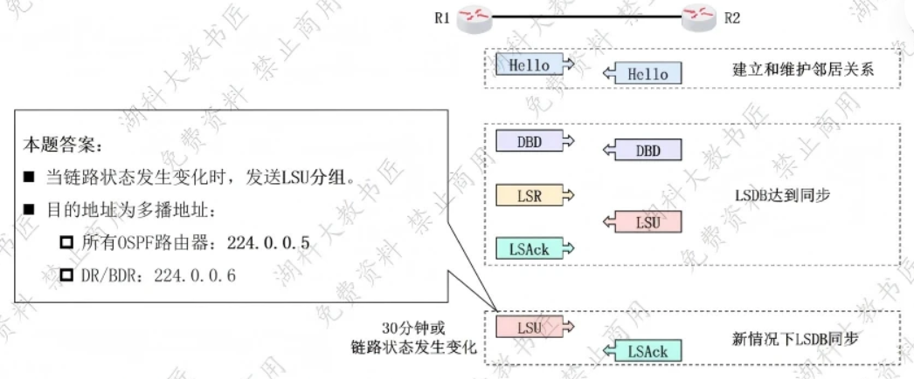

为了减少网络中HELLO分组和LSU分组的数量，可以选举指定路由器DR和备用指定路由器BDR，当DR故障时用BDR替代。其他路由器只与DR和BDR建立邻居关系和交换信息，这样可以使得邻居关系数量从$$\frac{n(n-1)}{2}\rightarrow2(n-1)+1$$，复杂度从$$O(n^2)\rightarrow O(n)$$。


##### 外部网关协议（External Gateway Protocol，EGP）


若源主机和目的主机处在不同的AS中，则当数据报传到一个AS的边界时，就需要使用一种协议将路由选择信息传递到另一个AS中，这样的协议就是EGP，目前使用最多的EGP是BGP-4。


###### 边界网关协议（Border Gateway Protocol，BGP）（13，17，24）


**基本特点**


内部网关协议主要是设法使分组在一个AS中尽可能有效地从源站传送到目的站，在一个AS内部也不需要考虑其他方面的策略。然而BGP使用的环境却不同，主要原因是互联网的规模太大，使得AS之间路由选择非常困难，每个主干网路由器表中的项目数都非常庞大。对于AS之间的路由选择，由于各个AS内无统一的路由度量，要寻找最佳路由没有意义。除此之外，AS之间的路由选择必须考虑政治、安全或经济等有关因素，如AS在国外，AS不可过或需要付费。


BGP常用于互联网的网关之间，力求寻找一条能够到达目的网络且比较好的路由，而并非要寻找一条最佳路由。BGP采用了**路径向量协议**，它与距离向量协议（如RIP）和链路状态协议（如OSPF）都有很大的区别。BGP是基于TCP的应用层协议。


**BGP路由**


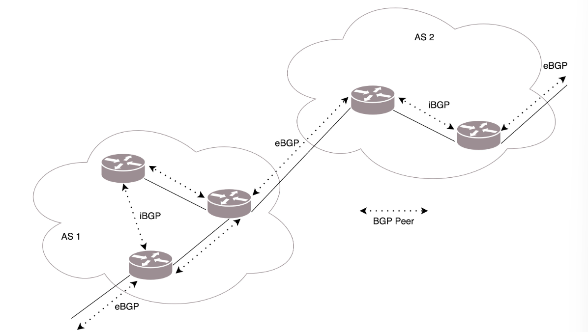

两个相邻的AS通过各自的边界路由器直接相连，两个边界路由器通过端口号为179建立半永久TCP连接（双方交换信息后仍保持连接状态）交换BGP路由信息，AS内部的路由器之间也有很多半永久TCP连接来传送BGP路由信息。每对TCP连接端点的两个路由器称为**BGP对等方**，用来发送BGP报文的TCP连接称为**BGP会话**。


BGP不仅运行在AS之间，还运行在AS的内部，分为eBGP和iBGP。自治系统间边界路由器之间使用eBGP广播路由，跨越两个AS的BGP会话称为**外部BGP（eBGP，external）会话。**同一个AS中的两个路由器之间的BGP会话称为**内部BGP（iBGP，internal）会话**，边界路由器通过运行iBGP将BGP学习到的路由导入到内部网络，使得内部的路由器能够找到到达外网目的地的最好的边界路由器。


BGP路由的一般格式如下：BGP路由=<CIDR前缀，BGP属性>。BGP支持CIDR，因此BGP的路由表也就包含目的网前缀、下一跳路由器以及到达该目的网络索要经过的各个AS序列，后两者是一个路由器通过BGP会话向对等方通告一条BGP路由时最重要的两个BGP属性。**AS-PATH（自治系统路径）**是通告的BGP路由所经过的AS，通常用一个全局唯一的**自治系统号（ASN）**来标识，BGP路由每经过一个AS，就将其ASN加入AS-PATH。可见，BGP路由必须指出通过哪些AS，但不指出路由要通过哪些路由器。**NEXT-HOP（下一跳）**是通告的BGP路由起点。BGP协议使用的算法是**路径矢量路由协议（path-vector protocol）**，它是距离矢量路由协议的升级版，这两个属性可以避免坏消息传得慢的问题。


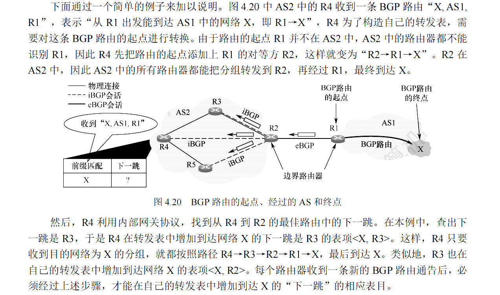

**BGP路由选择**


若从一个AS到另一个AS中的网络X只有一条BGP路由，则不存在选择BGP路由的问题，此时BGP路由是唯一的。然而，若到网络X有两条或更多的BGP路由可供选择，则应根据下列原则，并按下面给出的先后顺序，选择一条较好的BGP路由。


**首先选择本地偏好值（LOCAL PREF）最高的路由**，在BGP路由的属性中有一个称为本地偏好的选项，一条路由的本地偏好可能由该路由器管理员设置，也可能是从同一AS中的另一个路由器学习得到的。若在几条BGP路由中找不出本地偏好值最高的路由，如它们的本地偏好值都相同，则采用下面的方法。


**选择AS跳数最少，即AS-PATH最短的路由**。然而分组在较大的AS中可能要经过更多次数的转发，花费更长的时间，所以AS跳数最少的路由未必是最好的。


**使用热土豆路由选择算法**，假设几条BGP路由的本地偏好值都相同，所经过的AS个数也相同，就要进入BGP路由的AS执行热土豆路由选择算法。选择最靠近NEXT-HOP路由器的路由，让分组经过最少的转发次数离开本AS，这时要使用内部网关协议，对不同的路由器，得出的选择结果是不同的。


**选择BGP标识符的数值最小的路由**，当以上三种方法都无法找出最好的BGP路由时使用。在BGP报文的首部有一个32位的称为**BGP标识符（ BGP ID）的**字段，该字段作为运行BGP的路由器的唯一标识符，通常以IPv4地址的形式表示，全网唯一。在BGP会话建立过程中，BGP ID通过OPEN报文在BGP对等体之间传递，用于识别和区分不同的BGP路由器。由于路由器有多个接口，因此有多个IPv4地址，BGP ID就使用该路中器的IP地址中数值最大的那个。


**BGP的四种报文**


当BGP刚运行时，BGP会话的两端要相互交换整个**BGP路由表**，但以后只需在BGP发生变化时更新有变化的部分，这样做对节省网络带宽和减少路由器的开销方面都有好处。一般路由器启动后会立即构建并交换初始距离向量，然后每隔一段时间交换一次最新的距离向量。


**Open（打开）报文**是两个路由器之间建立TCP连接后接着必须发送的报文，其作用是相互识别对方，协商一些协议参数，使通信初始化。收到Open报文的路由器发回**Keepalive（保活）报文**表示接受建立BGP连接。BGP连接一旦建立，两个对等方就要彼此周期性地交换Keepalive报文（如每隔60秒）维持连接，周期性地证实邻站的连通性。Keepalive报文只有19B，不会造成网络上太大的开销。**Update（更新）报文**是BGP的核心，用于撤销它以前通知过的一条或多条路由，或者宣布增加新的一条路由。**Notification（通知）报文**，用来发送检测到的差错。


### 移动IP


**移动IP技术**是指移动站以固定的IP地址实现跨越不同网络的漫游功能，并保证基于IP的网络权限在漫游过程中不发生任何改变。


移动IP定义了移动节点、归属/本地代理、外部代理三种功能实体。**移动节点**是具有永久IP地址的移动主机，其连接点从一个网络或子网改变到另一个网络或子网。每个移动站都有一个原始地址，即**永久/归属/主地址**，移动站原始连接的网络称为**归属网络**，永久地址和归属网络的关联是不变的。在归属网络中代表移动节点执行移动管理功能的实体称为**本地/归属代理**，通常是原始连接到的归属网络上的路由器。本地代理根据移动用户的转交地址，采用**隧道技术**转交移动节点的数据报，它实现的代理功能是在应用层完成的。当移动站移动到另一地点时，所接入的外地网络称为**被访网络，**在外部网络中帮助移动节点完成移动管理功能的实体称为**外地/外部代理**，通常就是连接在被访网络上的路由器。外地代理完成转交地址的注册和登记任务，即为移动站创建**临时/转交/辅地址**，并及时把该地址告知其归属代理。转交地址是外地代理为移动站临时分配的，网络号显然和被访网络一致，当主机离开后撤销。另外，转交地址是供移动站、归属代理及外地代理使用的，各种应用程序都不会使用。


移动IP的基本工作过程可以分为代理发现、注册、分组路由与注销四个阶段。例如，一台手机在未插卡或未联网状态下并不具备IP地址，当插入了一张北京移动的电话卡后，该手机就成为了一个具有永久IP地址的移动节点，记该手机的永久地址是131.8.6.7/16，归属网络是131.8.0.0/16。移动结点到达新的网络后，通过注册过程将自己新的可达信息通知外部代理。用户持有该手机到达江苏南京后，则进入了外部网络15.0.0.0/8。南京移动网络会先为主机创建一个临时地址15.5.6.7/8，并把该临时地址告诉主机的归属代理，归属代理记录主机的临时地址。


再如，某用户将笔记本关机后从家里带到办公室重新上网，在办公室通过DHCP自动获取了新的IP地址，即使笔记本更换了地点及所接入的网络，也不是移动IP。但是，若在移动中需要进行TCP传输，那么在移动站漫游时应一直保持这个TCP连接，否则该TCP连接就会断断续续，所以必须使笔记本的IP地址在移动中保持不变。


**网络层通信**


为了支持移动性，在网络层中应增加移动站到外地代理的登记协议，外地代理到归属代理的登记协议，归属代理数据报封装协议，外地代理拆封协议。


当移动站点刚漫游到外部网络时，会通过**外部代理广播报文**获得一个临时的转交地址，然后通过外部代理发送**注册报文**（包含永久地址和转交地址）向归属代理登记该地址。归属代理接收请求，构建一条通向转交地址的隧道将移动节点的永久地址和转交地址绑定，以后到达该归属代理且要发往移动节点的数据报将被封装并以隧道方式发给转交地址，并返回**注册响应报文**。外部代理接收注册响应，并转发给移动节点。若移动站移动到了下一个网络，会在新外部代理登记注册一个转交地址，新外部代理给本地代理发送新的转交地址以覆盖旧的转交地址。若移动站回到了归属网络，会向本地代理注销转交地址。


通信者B要和移动站A进行通信，B不知道A的具体位置，只能使用其永久地址作为发送的IP分组中的目的地址。如果移动站A在归属网络，按传统的TCP/IP方式进行通信。如果移动站A漫游到被访网络，A的归属代理会将截获的发送给A的IP分组进行再封装，并通过隧道发送给被访网络的外地代理。外地代理把收到的封装的IP分组进行拆封，恢复成原始的IP分组，然后发送给移动站A，所有发往移动站的数据包都通过被访网络的外部代理转发。位于外部网络的移动站A对外发送IP分组，则使用自己的永久地址作为IP分组的源地址，此时无须通过归属代理转发，而是直接通过外部代理代为转发。


**链路层通信**


移动IP的IP数据报仍然会封装在802.11无线局域网帧中。见802.11局域网的MAC帧。


### IP多播/组播


**多播**是指源主机一次发送单个分组可以抵达用一个组地址标识的若干目的主机，即一对多的通信，在互联网上进行的多播称为**IP多播**。与单播相比，在一对多的通信中，仅发送一份数据，并且只需发送一次，只有在传送路径出现分岔时才将分组复制后继续转发，因此大大减轻了发送者的负担和网络的负载，可大大节约网络资源。多播需要路由器的支持才能实现，能够运行多播协议的路由器称为**多播路由器**。多个单播可以仿真多播，但是一个多播所需的带宽要小于多个单播带宽之和;用多个单播仿真一个多播时，路由器的时延将很大，而处理一个多播分组的时延是很小的。


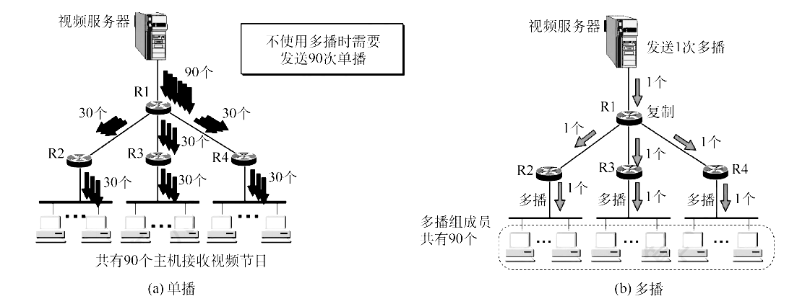

**IP多播地址**


多播数据报和一般的IP数据报的区别是，前者使用D类IP地址作为目的地址224.0.0.0-239.255.255.255，并且首部中的协议字段值是2，表明使用IGMP。每个D类IP地址标志一个多播组，一台主机可以随时加入或离开一个多播组。多播数据报也是“尽最大努力交付”，不提供可靠交付。多播地址只能用于目的地址，而不能用于源地址。对多播数据报不产生ICMP差错报文。多播机制仅应用于UDP，它能将报文同时发送给多个接收者。而TCP是一个面向连接的协议，它意味着分别运行在两台主机的进程之间存在一条连接，因此会一对一地发送。


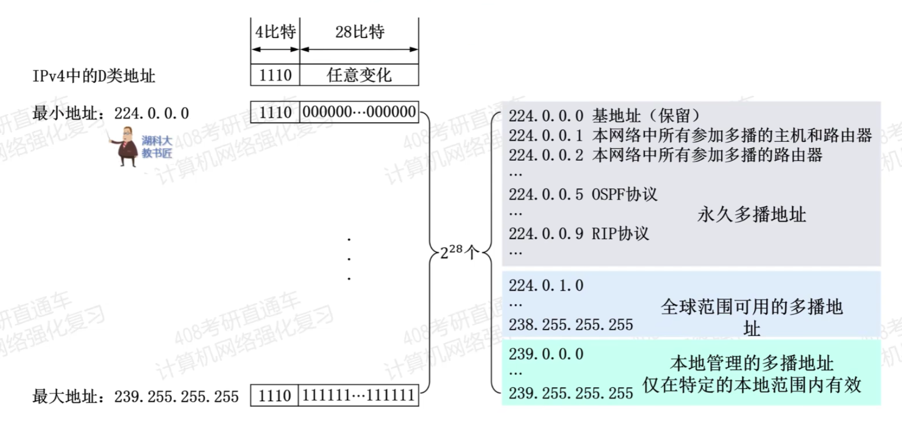

**硬件多播**


因为局域网支持硬件多播，所以只要把IP多播地址映射成**多播MAC地址**，即可将IP多播数据报封装在局域网的MAC帧中，而MAC帧首部的目的MAC地址字段就设置为由IP多播地址映射成的多播MAC地址。


IANA拥有的以太网多播地址的范围是01-00-5E-00-00-00~01-00-5E-7F-FF-FF，在这些地址中只有后23位可用作多播，但D类IP地址可供分配的有28位，即这28位中的前5位无法映射到以太网多播地址，因此两者是多对一的映射关系。例如，IP多播地址224.128.64.32（E0-80-40-20）和另一个IP多播地址224.0.64.32（E0-00-40-20）转换成以太网的多播地址都是01-00-5E-00-40-20，因此收到多播数据报的主机，还要在IP层利用软件进行过滤，把不是本主机要接收的数据报丢弃。


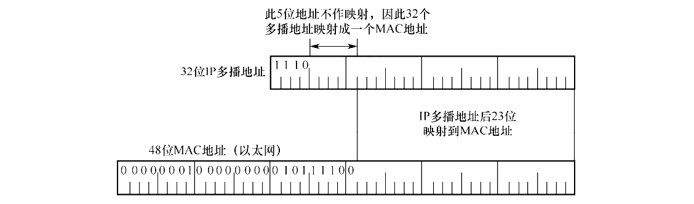

IP多播可以分为只在本局域网上进行**硬件多播**和在互联网的范围内进行多播。目前大部分主机都是通过局域网接入互联网的，因此在互联网上进行多播的最后阶段，还是要把多播数据报在局域网上用硬件多播交付给多播组的所有成员。


**互联网范围多播**


路由器要获得多播组的成员信息，需要利用**网际组管理协议（Internet Group ManagementProtocol，IGMP）**。连接到局域网上的多播路由器还必须和互联网上的其他多播路由器协同工作，以便把多播数据报用最小代价传送给所有组成员，这就需要使用**多播路由选择协议/播路协议**。


IGMP并不是在互联网范围内对所有多播组成员进行管理的协议，它不知道IP多播组包含的成员数，也不知道这些成员分布在哪些网络上。IGMP是让连接到本地局域网上的多播路由器，知道本局域网上是否有主机参加或退出了某个多播组。


IGMP报文被封装在IP数据报中传送，但它也向IP提供服务，因此不把IGMP视为一个单独的协议，而视为整个网际协议IP的一个组成部分。IGMP的工作可分为两个阶段。


第一阶段：当某台主机加入新的多播组时，该主机应向多播组的多播地址发送一个IGMP报文，声明自己要成为该组的成员。本地的多播路由器收到IGMP报文后，还要利用多播路由选择协议，把这种组成员关系转发给互联网上的其他多播路由器。


第二阶段：组成员关系是动态的，本地多播路由器要周期性地探询本地局域网上的主机，以便知道这些主机是否仍然是组的成员。只要对某个组有一台主机响应，多播路由器就认为这个组是活跃的。但一个组在经过几次探询后仍然没有一台主机响应，多播路由器就认为本网络上的主机都已离开了这个组，因此就不再把这个组的成员关系转发给其他的多播路由器。


多播路由选择实际上就是要找出以源主机为根节点的**多播转发树**，因为树具有不存在环路的特性，每个分组在每条链路上只传送一次，避免环路，在多播转发树上的路由器不会收到重复的多播数据报。不同的多播组对应于不同的多播转发树，同一个多播组，对不同的源点也会有不同的多播转发树。水平分割用于避免距离-向量路由算法中的无穷计数问题，TTL 字段用于防止IP分组因为环路而在网络中无限循环。


## 数据链路层（Data Link）


【考纲内容】

（一）数据链路层的功能

（二）组帧

（三）差错控制：检错编码；纠错编码

（四）流量控制与可靠传输机制

（五）介质访问控制：信道划分；随机访问；轮询访问

（六）局域网：局域网的基本概念与体系结构；以太网与IEEE802.3；IEEE802.11无线局域网；VLAN的基本概念与基本原理

（七）广域网：基本概念；点对点协议（PPP）

（八）数据链路层设备：以太网交换机及其工作原理


数据链路层提供相邻两节点之间以帧为单位的数据交互，其中链路上的节点有主机节点（主机或服务器）和路由节点（路由器）。IEEE802标准定义的局域网参考模型只对应于OSI参考模型的数据链路层和物理层，并将数据链路层拆分两个子层。**介质访问控制（MAC）子层**与接入的传输介质有关，它向上层屏蔽对物理层访问的各种差异，主要功能包括组帧和拆卸帧、比特传输差错检测、透明传输。**逻辑链路控制（LLC）子层**与传输介质无关，它向网络层提供**无确认无连接、面向连接、带确认无连接、高速传送**四种不同的连接服务类型。因为在局域网市场中的垄断地位，**以太网（有线局域网）**几乎成为局域网的代名词，802委员会制定的LLC子层作用已经不大，所以现在许多网卡仅装MAC协议而不装LLC协议。


### 逻辑链路控制子层（LLC）


数据链路层使用的信道主要有两种。**点对点信道，**使用一对一的通信方式，它的某些概念对广播信道也是适用的，PPP是目前使用最广泛的点对点协议。**广播信道**，使用一对多的广播通信方式，信道上连接的主机很多，采用共享广播信道的有线局域网普遍使用CSMA/CD协议，而无线局域网则使用CSMA/CA协议。


**链路/物理链路**，指从一个节点到相邻节点的一段物理线路，是一条路径的组成部分，当进行数据通信时两台计算机之间的通信路径往往要经过多段链路。当在一条链路上传送数据时，除了需要链路本身，还需要一些必要的通信协议来控制这些数据的传输，把实现这些协议的硬件和软件加到链路上，就构成了**数据链路/逻辑链路**。**帧**是数据链路层对等实体之间进行逻辑通信的协议数据单元，数据链路层把网络层下交的数据构成帧发送到链路上，并把接收到的帧中的数据取出并上交给网络层。


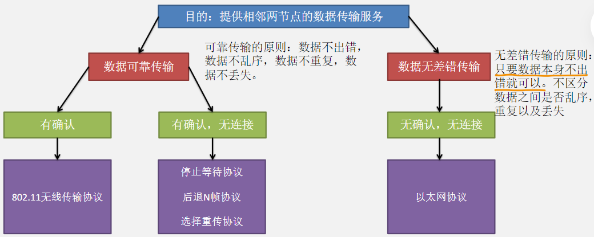

在面向连接的情况下，LLC层会建立数据链路层的逻辑链接。数据链路层连接的建立、维持和释放过程称为**链路管理**，它主要用于面向连接的服务。链路两端的节点要进行通信，必须首先确认对方已处于就绪状态，并交换一些必要的信息以对帧序号初始化，然后才能建立连接，在传输过程中要能维持连接，而在传输完毕后要释放该连接。


在带确认无连接的情况下，LLC层会给帧添加**逻辑链路控制子层号**。不同的帧可能具有相同的目的MAC地址，因此除非检索其中的内容，否则无法从MAC地址上区分出帧和帧的区别。逻辑链路控制子层序号相当于给帧加上了逻辑顺序，这样无需访问帧的内容就可以区别不同数据的帧。发送方会维持一组**发送帧序号**，根据帧序号的个数和每个帧的逻辑链路控制子层序号确定，序号的个数取决于编码的比特数。例如，发送方有100个帧要发送，那么会给这100个帧分别赋予0-99的逻辑链路控制子层序号。发送序号字段为3bit，代表共有8个帧序号0-7。如果下一个帧是24号帧，其对应的发送序号为24%8=0。


滑动窗口协议会将帧序号与数据内容共同构成数据部分。接收方不确定帧的数目，只会识别数据的帧序号，不会识别数据的逻辑链路控制子层序号。


#### 流量控制（19）


链路两端节点的工作速率和缓存空间存在差异，如果发送方的发送能力大于接收方的接收能力，前面来不及接收的帧将被后面不断发送来的帧“淹没”，造成帧的丢失而出错。流量控制实际上就是限制发送方的发送速率，使接收方有足够的缓冲空间来接收每个帧。这个过程需通过某种反馈机制，使发送方知道在什么情况下可以接着发送下一帧，而在什么情况下必须暂停发送，以等待收到某种反馈信息后继续发送。


在OSI体系结构中，数据链路层具有流量控制的功能，而在TCP/IP体系结构中，流量控制功能被移到了传输层。它们都用到了滑动窗口协议，但是控制的对象不同，数据链路层控制的是相邻节点之间的流量，而传输层控制的是端到端的流量。数据链路层的控制手段是通过确认机制控制发送方的窗口向前移动，接收方收不下时就不返回确认，传输层的控制手段是接收方通过确认报文段中的窗口值来调整发送方的发送窗口。


##### 停止-等待流量控制


发送方每次只允许发送一个帧，接收方每接收一个帧都要反馈一个确认信号，只有该确认信号到达发送方后才能发送下一帧，因而传输效率相对较低。


##### 滑动窗口流量控制


**发送窗口**是发送方维持的一组连续的允许发送的帧的序号，表示在还未收到对方确认信息的情况下，发送方最多还能发送多少个帧，能发送哪些帧。发送方每收到一个按序确认的确认帧，就将发送窗口向前滑动一个位置，序号落入发送窗口内的数据帧可以继续发送。当窗口内没有可以发送的帧，即窗口内的帧全部是已发送但未收到确认的帧时，发送方就停止发送。


**接收窗口**是接收方维持的一组连续的允许接收帧的序号，表示可以接收哪些帧和不可以接收哪些帧。接收方每收到一个序号落入接收窗口的数据帧，就将接收窗口向前滑动一个位置，序号落入接收窗口内的数据帧即为准备接收的帧。若收到的帧落在接收窗口之内，则发回确认；若收到的帧落在接收窗口之外，则一律丢弃。当接收窗口大小为1时，只有收到该帧后才允许接收下一帧，因此可保证帧的有序接收。


当接收窗口向前滑动，同时接收方发送了确认且发送方收到确认时，发送窗口向前滑动，因此只有接收窗口向前滑动，发送窗口才可能向前滑动。与传输层不同，在数据链路层的滑动窗口协议中，窗口大小在传输过程中是固定的。停止-等待协议中，发送窗口W_T=1，接收窗口W_R=1；后退N帧协议中，发送窗口W_T>1，接收窗口W_R=1；在选择重传协议中，发送窗口W_T>1，接收窗口W_R>1。若采用n比特对帧编号，后两种滑动窗口协议还需满足$$W_T+W_R≤ 2^n$$。


#### 可靠传输（带确认无连接）（09，11，17，24）


有线网络中的链路的误码率较低，为了降低开销，可靠传输的问题由其上层处理。而无线网络的链路易受干扰，误码率较高，因此要求数据链路层必须向其上层提供可靠传输服务。OSI的观点是必须让数据链路层向上提供可靠传输，因此在CRC检错的基础上，增加了帧编号、确认和超时重传机制，以确保接收方接收到的帧不丢失、不重复、不乱序。**自动重传请求（Automatic Repeat reQuest，ARQ）**采用了上述机制，可以在引导型传输媒体（网线、光纤等）上提供可靠传输，其基本原理并不仅限于数据链路层，还可应用到其上各层。


##### 停止-等待（Stop-and-Wait，S-W）协议


对于发送方，每次只允许发送一个分组，在计时器规定时间内，如果接收到确认分组就发送下一个分组，如果未收到确认分组，则进行超时重传该分组，如此重复直到收到该分组的确认分组。对于接收方，如果接收到的数据分组正确，就正常接收并发送确认分组，如果数据分组出错，则丢弃该分组。


如果发生数据帧出错、数据帧丢失、确认帧丢失的情况，发送方收不到确认帧就会进行超时重传。试想，接收方已收到正确的分组，但是发送方未收到确认并进行了超时重传，那么接收方收到相同的数据时会丢弃该分组，并重传一个该分组对应的确认。


由于每发送一个数据分组就停止等待，发送窗口和接收窗口大小均为1，因此编号仅需要1比特，发送的分组交替地用Data0和Data1来标识，确认分组分别用ACK0和ACK1来表示。若连续出现相同序号的数据分组，则表明发送方进行了超时重传；若连续出现相同序号的确认分组，则表明接收方收到了重复分组。


为了超时重传和判定重复分组，发送方和接收方都要设置一个缓冲区。当发送方发送完数据分组时，必须在其发送缓存中保留该数据分组的副本，这样才能在出现差错时进行重传，只有在收到对方发来的确认分组后，方可清除该副本。


S-W协议的信道利用率很低，因此产生了**连续ARQ协议**，采用流水线传输，即发送方可连续发送多个分组，只要发送窗口足够大，就可使信道上有数据持续流动，而不是每发完一个帧就停止等待确认。


##### 后退N帧协议（Go-Back-N，GBN）


对于发送方，只要数据分组的序号在发送窗口内，这些数据分组均可全部发送出去。当发送方接收到某个分组的确认分组后，即可将发送窗口内的后续分组发送出去；当某个数据分组超时时，该分组及其随后的多个分组均会被重传。对于接收方，为了降低开销，接收方采用累积确认的方式，在连续收到多个正确的数据分组时，仅对最后一个数据分组发回确认信息，代表该分组和之前所有的数据分组均已正确无误地收到。如果收到的分组不在接收窗口，接收方会丢弃该分组及其后面的全部分组，重传已发送的确认分组，防止已发送的确认分组丢失。


如果一组数据分组中某数据分组丢失、出错或某些数据分组乱序到达，接收方只会接收正确的分组，其后的全部分组均会被丢失。此时发送方只能接收到部分分组的确认分组，后续分组将会超时重传。如果确认分组丢失，则发送方会重传全部分组，接收方会接收正确到达的连续分组并累计确认，而重复分组会被丢弃。


接收窗口W_R=1，可保证接收方按序接收数据分组。若采用n比特对分组编号，则发送方的发送窗口应满足$$1<W_T≤2^n-1$$，若W大于2”-1，可能会出现接收方无法分辨新数据分组和旧数据分组的情况。假设n等于3，发送窗口为8，发送方发送完0~7号共8个数据帧后，暂停发送。若所有确认帧都丢失，经过一段超时计时器控制的时间后，发送方重传这8个旧数据帧，其编号仍为0~7。于是，当接收方第二次收到编号为0~7的8个数据帧时，就无法判定这是8个新数据帧还是8个重传的旧数据帧。


GBN协议可以连续发送数据帧，提高了信道利用率。但是仅因一组分组的前面有一个分组出错，必须重传原来已正确到达的分组，降低了传送效率。当信道误码率较大时，GBN协议接收分组的速度较慢，性能不一定优于S-W协议。


##### 选择重传协议（Selective Repeat，SR）


为进一步提高信道的利用率，可以设法只重传出现差错和计时器超时的数据分组。首先，必须加大接收窗口，以便先收下序号落在接收窗口内的失序但正确到达的那些数据分组，收齐后再一并送交上层。其次，

接收方不能再采用累积确认，而要对每个正确接收的数据帧逐一进行确认。选择重传协议还采用了更有效的差错处理策略，即一旦接收方检测到某个数据分组出错，就向发送方发送一个**否定分组NAK**，要求发送方立即重传NAK指定的数据分组。


SR协议比GBN协议更复杂，接收方需要设置足够的接收缓冲区来暂存那些失序但正确到达且序号落在接收窗口内的数据分组，接收缓冲区的数量等于接收窗口大小。在发送方，每个发送缓冲区对应一个计时器，当计时器超时的时候，缓冲区的分组就重传。若接收方收到重复的数据分组，则丢弃该分组，并重传与该分组对应的确认分组（以免该分组的确认分组丢失）。


SR协议的接收窗口W_R和发送窗口W_T都大于1，一次可以发送或接收多个帧。若采用n比特对帧编号，需满足$$W_R+W_T≤2^n$$，否则在接收方的接收窗口向前移动后，若有一个或多个确认帧丢失，发送方会超时重传之前的旧数据帧，接收窗口内的新序号与之前的旧序号出现重叠，接收方就无法分辨是新数据帧还是重传的旧数据帧。此外，还应满足$$W_R≤W_T$$，否则接收窗口永远不可能填满，接收窗口多出的空间就毫无意义，因此$$W_R≤2^n-1$$。一般情况下，W_r和W_T的大小是相同的。


##### 信道利用率（09-10、12、14-15、17-18、20、23）


信道利用率是指信道的效率，即发送方在一个发送周期内，有效发送数据的时间与整个发送周期之比。**发送周期**是指发送方开始发送分组到收到第一个确认分组所需的时间，有效发送数据的时间是指发送方发送数据到信道上的时间，即**传输时间**。**信道吞吐率**指数据实际/平均的传输速率，等于数据传输速率（信道带宽）*信道利用率=发送周期内发送的数据量/发送周期。


**停止-等待协议**


假定在发送方和接收方之间有一个直通的信道来传送分组，分组正确到达接收方后立即发回确认，那么发送方经过$$T_D+RTT+T_A$$时间后就可再发送下一个分组。其中，T_D是发送方发送分组的发送时延，等于分组长度除以数据传输速率，RTT是往返传播时延，T_A是接收方发送确认分组的发送时延。确认分组的发送时延、接收方处理分组的时间、发送方处理确认分组的时间可以忽略不计。因为仅在T_D内才用来发送数据分组，因此停止-等待协议的信道利用率：


$$U= \frac{T_D}{T_D+RTT+T_A}$$.


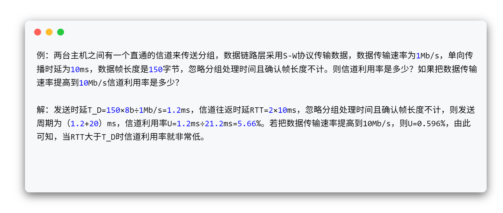

**连续ARQ协议**


假设发送窗口为n，即发送方可连续发送n个分组，当$$nT_D≥T_D+RTT+T_A$$时，在一个发送周期内发不完或刚好发完n个分组，只要不发生差错，发送方就可不间断地发送分组，信道利用率为1；当$$nT_D<T_D+RTT+T_A$$时，在一个发送周期内可以发送完n个分组，信道利用率为：


$$\frac{nT_D}{T_D+RTT+T_A}$$.


由于相同帧序号位数情况下，GBN比SR的发送窗口更大，因此其最大信道利用更也更大。

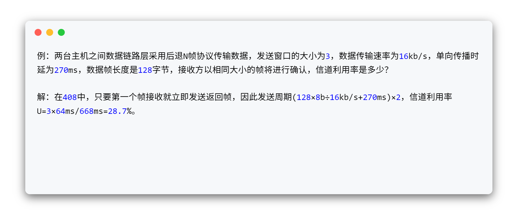
### 介质访问控制层（Medium Access Control，MAC）


数据链路层协议有多种，但有三个基本问题则是共同的，即封装成帧、透明传输和差错检测。MAC层的功能由给帧添加MAC地址或拆除帧的MAC地址，提供差错检验机制，并实现透明传输。


#### 组帧/封装成帧（13）


发送方依据一定的规则，将网络层递交的分组添加首部和尾部，封装成数据链路层的传送单元，实际是由网卡（DMA控制器）负责把从内存收到的数据，加上自身网卡地址，目的网卡地址以及差错校验字段。数据链路层将比特组合成以帧为单位传输，在出错时只重发出错的帧，提高效率。


组帧主要解决帧定界、帧同步、透明传输等问题。**帧定界，**指帧的首部和尾部中含有很多控制信息，用于确定帧的界限，例如，在HDLC协议中用标识位F（01111110）来标识帧的开始和结束。为了提高帧的传输效率，应当使帧的数据部分的长度尽可能地大于首部和尾部的长度，但随着帧长的增加，传输差错发生的概率也随之提高，发生差错时重传的代价也越大，因此每种链路层协议都规定了帧的数据部分的长度上限，即**最大传送单元**。分组/IP数据报是包含在帧中的数据部分，因此不需要加尾部来定界。**透明传输**，指不论什么样的比特组合的数据，都能够无差错地在这个数据链路上传输，即使数据中恰好出现与帧定界符相同的比特组合，也不会误认为“传输结束”而丢弃后面的数据，因此链路层对于数据是透明的。


**字符计数法**


只有**帧开始定界符**，在首部使用一个1字节的**字节计数字段**来记录该帧所含的字节数，表示包括计数字段自身该帧所占字节。接收方读出该计数值确定后面跟随的字节数，从而确定帧结束位置。因为帧与帧之间是连续传输的，所以也能确定下一帧的开始位置。（没有帧间间隔？）若计数字段出错，接收方会失去帧边界划分的依据，便无法判断所传输帧的结束位和下一帧的开始位，收发双方将失去同步。


**字节填充法**


使用特定字节来定界一帧的开始与结束，例如，将**控制字符SOH（start of the header，01H）**放在帧的最前面，控制字符**EOT（end of the transmission，04H）**放在帧的最后。为使信息位中出现的特殊字符不被误判为帧的首尾定界符，可在特殊字符之前填充一个**转义字符ESC**来加以区分，数据中出现的转义字符ESC前也插入转义字符，接收方收到数据后会删除这个插入的ESC字符，以实现数据的透明传输。PPP协议在异步传输时采用字节填充法。


**零比特填充法**


使用一个特定的比特串01111110来标志一帧的开始和结束，为了不使数据字段中出现的比特流01111110被误判为帧的首尾标志，发送方先扫描整个数据字段，每遇到5个连续的“1”，就自动在其后插入一个“0，保证数据字段中不会出现6个连续的“1”。接收方每收到5个连续的“1”，就自动删除后面紧跟的“0”，以恢复原始数据。零比特填充法很容易由硬件来实现，性能优于字节填充法，在数据链路层早期使用的HDLC协议采用这种比特填充的首尾标志法实现透明传输。


**违规编码法**


在物理层进行比特编码常用，例如，曼彻斯特编码方法将数据比特“1”编码成“高-低”电平对，将数据比特“0”编码成“低-高”电平对，而“高-高”电平对和“低-低”电平对（无跳变）在数据比特中是违规的，因此可借用这些违规编码序列来定界帧的起始和终止，局域网IEEE802标准就采用了这种方法。


违规编码法不采用任何填充技术便能实现数据的透明传输，但只适用于采用**冗余编码**的特殊编码环境。因为字符计数法中计数字段的脆弱性和字节填充法实现上的复杂性与不兼容性，目前较常用的组帧方法是零比特填充法和违规编码法。


#### 差错控制（23）


由于信道噪声等原因，帧在传输过程中可能会出现错误，其中，**位错**指帧中某些位出现差错，通常采用循环冗余检验（CRC）来发现位错；帧错指帧丢失、帧重复或帧失序等错误，属于传输差错。


过去OSI的观点是必须让数据链路层向上提供可靠传输，因此在CRC检错的基础上，增加了帧编号、确认和重传机制。接收方收到正确的帧就要向发送方发送确认，发送方在一定期限内若未收到对方的确认，就认为出现了差错，因此进行重传，直到收到确认为止。现在，在通信质量较差的无线传输中，数据链路层依然使用确认和重传机制，向上提供可靠的传输服务。对于通信质量良好的有线链路，数据链路层已不再使用确认和重传机制，即不要求向上提供可靠传输的服务，而仅需进行CRC检错，目的是将有差错的帧丢弃，保证上交的帧都是正确的，而对出错的帧的重传任务则由高层协议完成。


差错控制通常利用编码技术，在ARQ方式中，当接收方检测到差错时，就设法通知发送方重发，直到收到正确的数据为止；在**前向纠错（Forward Error Correction，FEC）方式**中，接收方不但能发现差错，而且能确定错误的位置并加以纠正，由此分为检错和纠错编码。


##### 检错编码


检错编码都采用**冗余编码技术**，核心思想是在有效数据/信息位被发送前，按某种关系附加一定的**冗余位/检验位**，构成一个符合某一规则的码字后发送，接收方根据收到的码字是否仍符合原规则来判断是否出错。


**奇偶检验码**


奇偶检验码是奇检验码和偶检验码的统称，是一种最基本的检错码，由n-1位数据和1位检验位组成。奇检验码是指附加一个检验位后，n位的码字中“1”的个数为奇数。奇偶检验码只能检测出奇数个位出现错误的情况，但不知道哪些位错了，也不能发现偶数位的出错情况。偶检验码是指附加一个检验位后，n位的码字中“1”的个数为偶数，在硬件上可以通过对数据逐位异或（模2加）的方式计算出偶检验位实现偶校验。


**循环冗余码（Cyclic Redundancy Code，CRC）检错技术**


实际通信链路都不是理想的，比特在传输过程中可能产生差错，例如比特流中的1可能变成0，0也可能变成1，这就是传输错误中的**比特差错**。接收方和发送方双方通常采用CRC校验算法给数据添加**校验字段（FCS）**，它能判断出帧是否发生比特错误，若未发生比特错误，网卡将帧上交给上层，否则将该帧丢弃。


1）收发双方约定一个生成多项式G（x），要求最低位必须为1。k位位串可视为阶数为k-1的多项式的系数序列，例如可用多项式x^3+x^2+1表示位串1101。


2）发送方根据G（x）的阶数在数据后面加零，通过模2除和异或运算计算出**冗余码**（帧检验序列FCS），将冗余码附加到数据后面组帧一起发送，这个帧刚好能被预先确定的多项式G（x）整除。


3）接收方收到数据和冗余码后，用相同的多项式去除收到的帧，出现误码且余数R仍为0的概率极低，因此若余数为0，则认为无差错。通过CRC检错技术，可以做到对帧的无差错接受，即“凡是接收方数据链路层接受的帧，我们都能以非常接近1的概率认为这些帧在传输过程中未产生差错”；而接收方丢弃的帧虽然曾经收到，但最终因为有差错而被丢弃，即未被接受。


CRC技术可检测出所有奇数位比特错，所有双比特错误，所有小于等于检验位长的错误。CRC具有纠错功能，只是数据链路层仅使用了它的检错功能，假设信息位为k位，FCS为r位，则当2^r>=k+r+1时可以纠正1位错。发送方的FCS生成和接收方的CRC检验都是由硬件实现的，处理很迅速，不会影响数据的传输。


##### 纠错编码（海明码）脑图


在有效信息位中加入几个检验位形成海明码，并把海明码的每个二进制位分配到几个奇偶检验组中。海明码具有一位纠错能力，某一位出错后，就会引起有关的几个检验位的值发生变化，这不但可以发现错位，而且能指出错位的位置。


**码距/海明距离**


码距是指两个码字对应位取值不同的比特数量，任何一种编码的检错能力和纠错能力都与该编码的最小距离有关。


计算码距的一种方法是对两个位串进行异或（xor）运算，结果中1的个数即为码距。例如，0110⊕0011=0101，异或结果中有两个1，说明这两个码字有2个比特不同，因此0110和0011的码距为2。在一个编码集中，任意两个码字的码距的最小值称为该编码集的码距。例如，对于编码集{10011，01011，11110，00001}，尽管11110和00001的码距为5，但10011和01011的码距为2，取最小值，因此该编码集的码距为2。


根据纠错理论，编码方案的检错能力和纠错能力与码距/的关系如下：l=d+c+l，d2c即码距/越大，其检错的位数d就越大，纠错的位数c也就越大，且纠错能力恒小于或等于检错能力（能纠错必然能检错）。例如，当码距1=3时，这种编码最多能检错2位，或能纠错1位。此外，考虑到c=0和d=c的两种边界情况，还可以推出如下结论：


1）为了检测d位错误，需要一个码距为d+1的编码方案。当一个有效码字发生d位错误时，不可能变成另一个有效码字。可见，码距为1的编码方案无法检测任何错误。


2）为了纠正c位错误，需要一个距为2c+1的编吗方案。当一个有效吗字发生c位错误时，它还是离原来的码字最近，从而能确定原来的码字，达到纠错的目的。


**编码过程**


现以数据1010为例讲述海明码的编码过程。


1）确定海明码的位数


设信息位有n位，检验位为k位，k位检验位能表示2种状态，信息位和检验位共有n+k种1位出错的状态，此外还需要一种表示正确的状态，因此n和k应满足2^k > n+k+1。


海明码位数4+3+1≤2^3成立，则n=4、k=3满足条件。设信息位为D4D3D2D1（1010），共4位，检验位为P3P2P1，共3位，对应的海明码为H2HH3HH3H2H1。


2）确定检验位的分布


规定检验位P在海明位号为2^k的位置上，其余各位为信息位。因此，P1的海明码位号为2^0=1，即H1为P1。P2的海明码位号为2^1=2，即H2为P2。 P3的海明码位号为2^2=4，即H4为P3。


|H7|H6|H5|H4|H3|H2|H1|
|:----|:----|:----|:----|:----|:----|:----|
|D4|D3|D2|P3|D1|P2|P1|
|111|110|101|2，3，4|001|3，4|1，2，4|


3）分组以形成检验关系


每个数据位用多个检验位进行检验，但要满足被检验数据位的海明位号等于检验该数据位的各检验位海明位号之和。另外，检验位不需要再被检验。


其中，D1放在H3上（011），由P3P2检验；D2放在H5上（101），由P3P1检验；D3放在H6上（110），由P3P2检验；D4放在H7上（111），由P3P2P1检验。


换个角度，D1放在H3上（011），D2放在H5上（101），D3放在H6上（110），D4放在H7上（111），P1检验第一位为1的所有数据，即D1D2D4，P2检验第二位为1的所有数据，即D1D3D4，P3检验第三位为1的所有数据，即D2D3D4。


4）检验位取值


检验位Pi的值为第i组（由该检验位检验的数据位）所有位求异或。 则P1=0，P2=1，P3=0，所以，1010对应的海明码为1010010。


5）海明码的检验原理


每个检验组分别利用检验位和参与形成该检验位的信息位进行奇偶检验检查，构成k个检验方程。若S2S2S1的值为“000”，则说明无错；否则说明出错，且这个数就是错误位的位号，如S3S2S1=001，说明第1位出错，即H1出错，直接将该位取反就达到了纠错的目的。


#### 介质访问控制


为每个使用介质的节点隔离来自同一信道上其他节点所传送的信号，以协调活动节点的传输，MAC子层提供了用来决定广播信道中信道分配的协议。下面的介质访问控制方法中，前者是静态划分信道的方法，而后两者是动态分配信道的方法。


##### 信道划分介质访问控制（14）*


采用静态划分信道的方法，将使用同一传输介质的多个设备的通信隔离开来，把时域和频域资源合理地分配给这些设备。信道划分介质访问控制通过**复用技术**实现，在发送端把多个发送方的信号组合在一条物理信道上进行传输，在接收端把收到的复用信号分离出来，并发送给对应的接收方。当传输介质的带宽超过传输单个信号所需的带宽时，通过在一条介质上传输多个信号，能提高传输系统的利用率。


信道划分的实质是通过分时、分频、分码等方法，将原来的一个广播信道，逻辑上分为几个用于在两个节点之间进行通信的互不干扰的子信道，即将广播信道转变为若干个点对点信道。


###### 时分复用（Time Division Multiplexing，TDM）


将信道的传输时间划分为一段段等长的时间片，称为**TDM帧**，每个用户在每个TDM帧中占用固定序号的时隙，每个用户所占用的时隙周期性地出现，其周期就是TDM的长度，所有用户在不同的时间占用同样的信道资源。


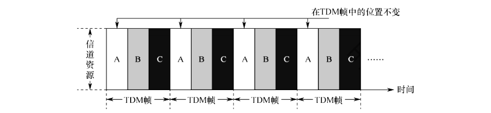

从某个时刻来看，时分复用信道上传送的仅是某对用户之间的信号；从某段时间来看，传送的是按时间分割的复用信号。因为时分复用是按固定次序给用户分配时隙的，当用户在某段时间暂无数据传输时，其他用户也无法使用这个暂时空闲的线路资源，所以时分复用后的信道利用率不高。


**统计时分复用（Statistic TDM，STDM）/异步时分复用**是对TDM的一种改进。STDM帧与TDM帧不同，它并不固定分配时隙，而按需动态分配时隙，当用户有数据要传送时，才会分配到STDM帧中的时隙，因此可以提高线路的利用率。


例如，假设线路的数据传输速率为6000b/s，3个用户的平均速率都为2000b/s，当采用TDM方式时，每个用户的最高速率为2000b/s，而在STDM方式下，每个用户的最高速率可达6000b/s。


###### 频分复用（Frequency Division Multiplexing，FDM）


将信道的总频带划分为多个子频带，每个子频带作为一个子信道，每对用户使用一个子信道进行通信，只适合模拟信号。所有用户在同一时间占用不同的频带资源。每个子信道分配的频带可不相同，但它们的总和不能超过信道的总频带。在实际应用中，为了防止子信道之间互相干扰，相邻信道间还要加入“**隔离频带**”。频分复用的优点在于充分利用了传输介质的带宽，系统效率较高，实现也较容易。


###### 波分复用（Wavelength Division Multiplexing，WDM）


即**光的频分复用**，一根光纤中可以传输多种不同波长/频率的光信号，因为波长不同，各路光信号互不干扰，最后用**光分用器**将各路波长分解出来。因为光波处于频谱的高频段，有很大的带宽，所以可以实现多路的波分复用。


###### 码分多址（Code Division Multiple Access，CDMA）


采用不同的编码来区分各路原始信号，将每个比特时间再划分成m个短的时间槽，称为**码片（Chip）**，通常m的值是64或128。每个站点被指派一个唯一的m位码片序列，发送1时，站点发送它的码片序列；发送0时，站点发送该码片序列的反码。当两个或多个站点同时发送时，各路数据在信道中线性相加。为了从信道中分离出各路信号，要求各个站点的码片序列相互正交。使用接收到的序列和每个站点的码片序列做内积，若值为零代表该站点未发送数据；若值为1代表该站发送了比特1，若值为-1代表该站点发送了反码向量0。


简单理解就是，A站向C站发出的信号用一个向量S来表示，B站向C站发出的信号用另一个向量T来表示，两个向量要求相互正交。向量中的分量，就是所谓的码片。两个向量在信道中先行相加得到(S+T)，到达C站后再进行数据分离。若要得到来自A站的数据，则C站就必须知道A站的码片序列，让S与S+T进行规格化内积。根据叠加原理，其他站点的信号都在内积的结果中被过滤掉，内积的相关项都是0，而只剩下A站发送的信号，得到S·（S+T）=1。所以A站发出的数据是1。同理，若要得到来自B站的数据，则T·（S+T）=-1，因此从B站发送过来的信号向量是一个反码向量，代表0。


频分复用和波分复用共享时间而不共享频带，时分复用共享频带但不共享时间，码分复用既共享信道的频率，又共享时间。码分复用技术具有频谱利用率高、抗干扰能力强、保密性强、语音质量好等优点，还可以减少投资及降低运行成本，主要用于无线通信系统，特别是移动通信系统。


##### 随机访问介质访问控制


在**随机访问协议**中，不采用**集中控制方式**解决发送信息的次序问题，所有用户都能根据自己的意愿随机地发送信息，占用信道的全部速率。在总线形网络中，当有两个或多个用户同时发送信息时，就会产生**帧冲突/碰撞**，导致所有冲突用户的发送均以失败告终。因此每个用户需要按照一定的规则反复地重传它的帧，直到该帧无冲突地通过，这些规则就是**随机访问介质访问控制协议/争用型协议**，其核心思想是胜利者通过争用获得信道，进而获得信息的发送权。节点之间的通信既不共享时间，又不共享空间，因此随机介质访问控制实质上是一种将广播信道转换为点到点信道的机制。


###### ALOHA协议*


**纯ALOHA协议**


当总线形网络中的任何站点需要发送数据时，可以不进行任何检测就发送数据。若在一段时间内未收到确认，则该站点就认为传输过程中发生了冲突。为防止多个站点同时重传数据造成冲突，发送站点需要等待一段随机的时间后再发送数据，直至发送成功。


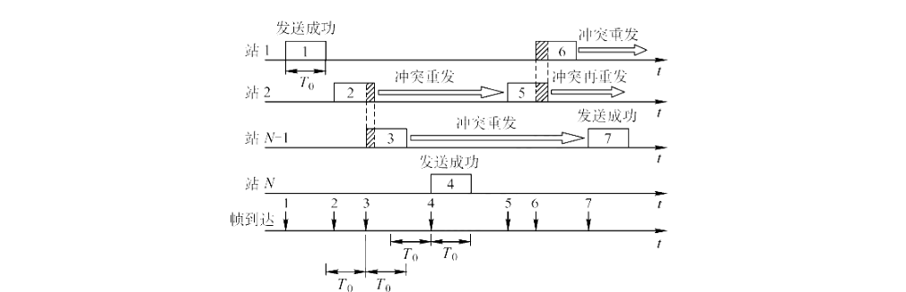

不过，随机延迟虽然能够克服部分数据冲突的问题，但是第一次发送数据时仍会很容易出现冲突，为了克服这个问题，提高吞吐量，便产生了时隙ALOHA协议。


**时隙ALOHA协议**


时隙ALOHA协议同步各站点的时间，即所有的主机共享一个时间，并将时间划分为一段段等长的**时隙（Slot）**，站点只能在每个时隙开始时才能发送帧，发送一帧的时间必须小于或等于时隙的长度。避免了用户发送数据的随意性，降低了产生冲突的可能性，提高了信道的利用率。


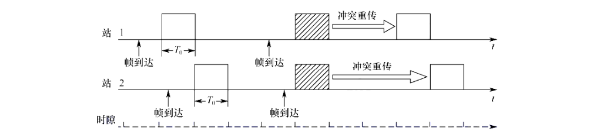

每个帧到达后，一般都要在缓存中等待一段小于时隙T的时间才能发送出去。当在一个时隙内有两个或两个以上的帧到达时，在下一个时隙将产生冲突，所有结点在该时隙结束之前检测到该碰撞事件，发生碰撞的节点以概率p在后续的每个时隙中重传它的帧，直该帧被无碰撞地传输出去。


###### 载波监听多路访问（Carrier SenseMultiple Access，CSMA）协议


ALOHA网络发生冲突的概率很大，若每个站点在发送前都先监听公用信道，发现信道空闲后再发送，则会大大降低冲突的可能性，从而提高信道的利用率。CSMA协议是在ALOHA协议基础上提出的一种改进协议，主要区别是多了一个**载波监听装置**，监听的策略时检查接入点的信道，若接入点信道空闲则认为信道空闲。


**1-坚持CSMA**


“坚持”的含义是监听到信道忙时继续坚持监听信道，“1”的含义是监听到信道空闲时立即发送帧的概率为1。站点要发送数据时，首先监听接入点的信道，若信道空闲则立即发送数据，否则继续监听直至空闲。如果发生冲突，那么随机等待一段时间后，再重新开始侦听信道。


传播延迟对1-坚持CSMA协议的性能影响较大。结点A开始发送数据时，结点B也正好有数据要发送，但这时结点A发出数据的信号还未到达结点B，结点B侦听到信道空闲，于是立即发送数据，结果必然导致冲突。即使不考虑延迟，1-坚持CSMA协议也可能产生冲突。例如，结点A正在发送数据时，结点B和C也准备发送数据，侦听到信道忙，于是坚持侦听，结果当结点A发送完毕，结点B和C就会立即发送数据，同样导致冲突。


**非坚持CSMA**


当站点要发送数据时首先监听信道，若信道空闲则立即发送数据，否则放弃监听，等待一个随机的时间后再重新监听。在等待随机时间后在监听的过程中，可能信道已经空闲一段时间，这降低了多个站点等待信道空闲后同时发送数据导致冲突的概率，但也增加了数据在网络中的平均时延。


**p-坚持CSMA**


只适用于时分信道，该协议引入了时隙的概念，当站点要发送数据时首先在时隙开始处监听信道，若信道忙则等到下一个时隙再监听直至信道空闲，若信道空闲则以概率p发送数据，以概率1-p推迟到下一个时隙再继续监听，直到数据发送成功。p-坚持CSMA协议是前两种协议的折中，它降低了1-坚持CSMA中多个站点检测到信道空闲时同时发送帧的冲突概率，同时克服了非坚持CSMA中因随机等待造成的延迟时间较长的缺点。


###### 载波监听多路访问/冲突检测（CSMA/CD）协议（09-10，15-16，19，22-23）


CSMA/CD协议是CSMA协议的改进方案，适用于总线形网络或半双工网络环境。对于全双工网络，因为全双工采用两条信道，分别用来发送和接收，在任何时候发收双方都可以发送或接收数据，不可能产生冲突，所以不需要CSMA/CD协议。


每个站点在发送前和发送过程中都必须不停地检测信道，其中，在发送前检测信道（载波监听）是为了获得发送权，在发送过程中检测信道（冲突检测）是为了及时发现发送的数据是否发生冲突。**载波监听**，指网络上所有工作站在发送数据前都要确认总线上有没有数据传输，只有信道空闲时才能发送。**多路访问**，指网络上所有工作站收发数据共同使用同一条总线，且发送数据是广播式的，所有主机都能收到信道上传来的数据。**冲突检测（Collision Detection）**，指在发送数据的过程中，同时检测信道是否发生冲突。计算机的适配器边发送数据边检测信道上电压的变化情况，当电压的变化幅度超过一定的门限值时，表明发生了冲突，适配器要立即停止发送数据，等待一段随机时间后再次发送。


电磁波在总线上的传播速率总是有限的，因此当某时刻发送站检测到信道空闲时，信道不一定空闲。为了让发送站在发送数据的同时就能检测到发出的数据可能存在的碰撞，需要让整个帧的传输时延不小于端到端传播时延的二倍，即只有经过争用期还没检测到冲突，才能确定这次发送不会发生冲突。因为若在冲突窗口内没有发生冲突，之后若其他节点再要发送数据，则会监听到信道忙，而不会发送数据，从而不会再发生冲突。其中，传输时延是指数据从发送端口发送到总线上所需要的时间，传播时延是指数据在总线上传播所需要的时间，**争用期/碰撞窗口**是指以太网总线上两个端到端往返时间。


以太网规定的**最短帧长**，等于最大单向传播时延×数据传输速率×2，即争用期内可发送的最大数据长度。在争用期内若检测到冲突，就停止发送，此时已发送出去的数据一定小于最短帧长，因此凡长度小于这个最短帧长的帧，就都是因为冲突而异常中止的无效帧。两个主机的**最长距离**=传播时延*信号传播速度=最小帧长÷数据传输速率÷2*信号传播速度。若Hub在再生比特流过程中产生延时，最远距离会更小。


例如，以太网规定争用期为51.2µs，对于10Mb/s的以太网，在争用期内可发送512bit，即64B数据。若以太网发送的前64B数据未发生冲突，则后续数据也不会发生冲突，表示已成功抢占信道。换言之，若发生冲突，则一定在前64B。一旦检测到冲突就立即停止发送，所以这时发送出去的数据一定小于64B。于是，以太网规定最短帧长为64B，凡长度小于64B的帧，就都是因为冲突而异常中止   的无效帧，收到这种无效帧时应立即丢弃。若只发送小于64B的帧，如40B的帧，则需要在MAC子层中于数据字段的后面加一个整数字节的填充字段，以保证以太网的MAC帧的长度不小于64B。为了使接收方的接收缓存来得及清理，做好接收下一帧的准备，太网规定了**帧间最小间隔**为传输96比特时间，若在9.6µs的时间内信道保持空闲，则发送这个帧。


CSMA/CD采用**截断二进制指数退避算法/动态退避**来确定冲突后重传的时机，发生冲突的站点在推迟一个随机的时间再重新发送。截断二进制指数退避算法可使重传需要推迟的平均时间随重传次数的增大而增大，因此能降低发生冲突的概率，有利于整个系统的稳定。


算法的基本过程如下。1）确定基本退避时间，一般取争用期2τ，τ是总线端到端的传播时延。2）定义一个参数k=min[重传次数，10]，当重传次数不超过10时，参数k等于重传次数，但当重传次数超过10时，k就不再增大而一直为10。3）从离散的整数集合[0，1，2，3，…，2ᵏ-1]中随机取出一个数记为R，重传所需推迟的时间就是R*2τ。4）当重传达16次仍不成功时，说明网络太拥挤，认为该帧永远无法正确发出，抛弃该帧并向高层报告出错。


例如，适配器首次试图传送一帧，且在传送过程中检测到冲突。第1次重传时k=1，随机数R从整数集合{0，1}中选择，可选的重传推迟时间是0或2。若再次发生冲突，则第二次重传时，随机数从整数集合{0，1，2，3}中选择，因此重传推迟时间是在0，2，4，6这四个时间中随机选取的一个，以此类推。


###### 载波监听多点接入/碰撞避免（CSMA with collision avoidance，CSMA/CA）协议（11，18，20，24）


一旦某无线站点与一个AP相关联，它就可以经该接入点发送和接收数据帧。然而许多无线设备或AP可能同时希望经过相同信道传输数据帧，所以需要一个多路访问协议来进行协调，802.11无线局域网采用CSMA/CA随机接入协议。与以太网的CSMA/CD相似，CSMA/CA中的CSMA代表“载波侦听多路访问”，每个站点在传输之前侦听信道，若信道忙则抑制传输。不同于以太网的是，802.11使用**碰撞避免技术**而不是碰撞检测技术，而且由于无线信道具有相对较高的比特差错率，802.11使用链路层确认/重传（ARQ）方案——S-W协议，站点每次通过无线局域网发送一个帧，只有收到对方的确认帧后才能继续发送下一帧。


检测碰撞的能力要求站点具有同时发送和接收的能力，即站点能够同时发送信号和检测其他站点是否也在发送信号。由于无线信道的传输条件特殊，其信号强度随着传播而衰减太过严重，802.11适配器上接收信号的强度通常远远小于发送信号的强度，构建具有检测碰撞能力的硬件代价较大。更重要的是，即使适配器可以同时发送和监听信号，也会由于**隐藏终端问题**和**衰减问题**而无法检测到所有的碰撞。


由于802.11无线局域网不使用碰撞检测，一旦站点开始发送一个帧，就完全地发送该帧；也就是说，一旦站点开始发送，就不会返回。但冲突存在时仍发送整个帧，尤其是长数据帧会严重降低网络的效率或多路访问协议的性能，为了降低碰撞的可能性，802.11采用了几种碰撞避免技术，虽然不能完全避免冲突，但是可以尽量降低冲突发生的概率。


为了尽量避免冲突，802.11标准规定，所有站检测到信道空闲后，还要继续监听一段很短的时间才能发送帧，这段时间称为**帧间间隔（InterFrame Space，IFS）**，其长短取决于站点要发送的帧的类型。802.11标准使用了下列三种IFS，**短帧间间隔（SIFS）**是最短的IFS，用来分隔属于一次对话的各帧，使用SIFS的帧类型有ACK帧、CTS帧、分片后的数据帧，以及所有回答AP探询的帧等；**点协调帧间间隔（PIFS）**是中等长度的IFS，在PCF方式中使用；**分布式协调帧间间隔（DIFS）**是最长的IFS，在DCF方式下用来发送数据帧和管理帧。


802.11标准定义了两个MAC子层，**分布式协调功能（DCF）**不采用任何中心控制，各站通过争用信道来获得发送权，是802.11标准的默认方式；**点协调功能（PCF）**使用AP集中控制，用类似于探询的方法将发送权轮流交给各站，向上提供无争用服务，是802.11标准的可选方式，实际中很少使用。


当无线局域网中某站点发送一个帧时，该帧会由于多种原因不能无损地到达目的站点，为此802.11MAC提供了**链路层确认（link-layer acknowledgment）方案**。目的站点收到一个通过CRC校验的帧后，等待一个SIFS后发回一个确认帧。如果发送站点重传计时器规定时间内未收到确认帧，就假定出现了错误并重传该帧，使用CSMA/CA协议争用该信道，直到收到确认。如果在若干固定次重传后仍未收到确认，传输站将放弃发送并丢弃该帧。


CSMA/CA算法的归纳如下，假设一个站点（无线设备或者AP）有一个帧要发送。


1）如果某站点最初监听到信道空闲，它将在一个DIFS后发送该帧。当且仅当检测到信道空闲且这个数据帧是要发送的第一个数据帧时，才不使用退避算法，其他所有情况都必须使用退避算法。


2）如果某站点最初监听到信道忙，该站点选取一个**随机回退值**，并且在侦听到信道空闲时递减该值，在侦听到信道忙时，计数值保持不变。当计数值减为0时，此时只可能发生在信道被侦听为空闲时，该站点发送整个数据帧并等待确认。


3）如果收到确认，传输站知道它的帧已被目的站正确接收。若此时该站点要发送另一帧，它选择一个随机回退值重复开始CSMA/CA协议。（是从1开始吗）


4）如果未收到确认，传输站将重新进入**回退阶段**，并从一个更大的范围内选取随机值。CSMA/CA的退避算法与CSMA/CD稍有不同，第i次退避在[0……，（2^i+k-1）]个时隙中随机选择一个，扩大了随机选择退避时间的范围；且不同于CSMA/CD的最大时隙2^10-1=1023，当CSMA/CA的时隙范围最大达到2^6-1=255时不再增加。


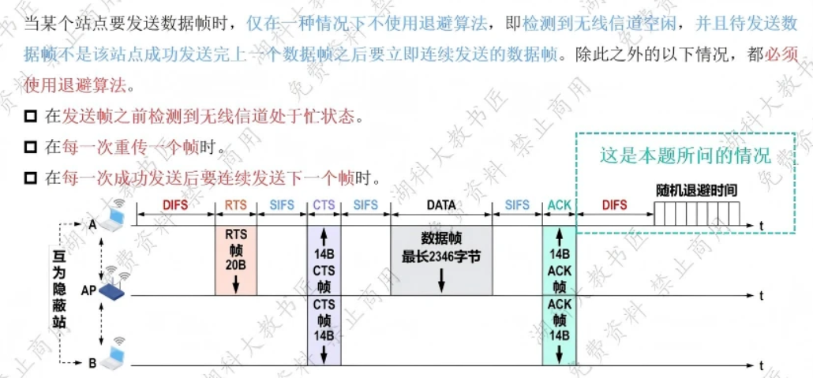

在以太网的CSMA/CD多路访问协议下，一旦侦听到信道空闲，站点便开始发送；然而在CSMA/CA下，该站点在倒计数时抑制传输，即使它侦听到该信道空闲也是如此。


假如两个站点分别有一个数据帧要发送，但是双方侦听到其他站点正在传输，就都未立即发送。若使用以太网的CSMA/CD协议，两个站点将会在检测到第三方发送完毕后立即开始发送，这将导致碰撞。不过，在CSMA/CD协议中碰撞并非一个严重的问题，因为两个站点检测到碰撞后都会放弃发送，从而避免了由于碰撞而造成的该帧剩余部分的无用发送。而802.11并不检测碰撞和放弃发送，遭受碰撞的帧仍将被完全传输，因此802.11无论如何都要尽可能地避免高代价的碰撞。如果两个站点侦听到信道忙，它们都将立即进入随机回退，希望选择一个不同的回退值。如果这些值不同，一旦信道空闲，其中的一个站点将在另一个之前发送，并且如果两个站点均未对对方隐藏，失败站点”将会听到“胜利站点”的信号，冻结它的计数器，并在胜利站点完成传输之前一直抑制传输。不过，使用802.11仍可能出现碰撞，比如两个站点可能互相是隐藏的，或者两者可能选择了非常靠近的随机回退值。


802.11MAC协议也包括一个可选项的预约方案，以便于在隐藏终端的情况下避免碰撞。如图，这两个无线站点都在该AP的覆盖范围内，并且两者都与该AP相关联。然而由于信号衰减，无线节点的信号范围有限，尽管每个无线站点对AP都不隐藏，两者彼此却是隐藏的。


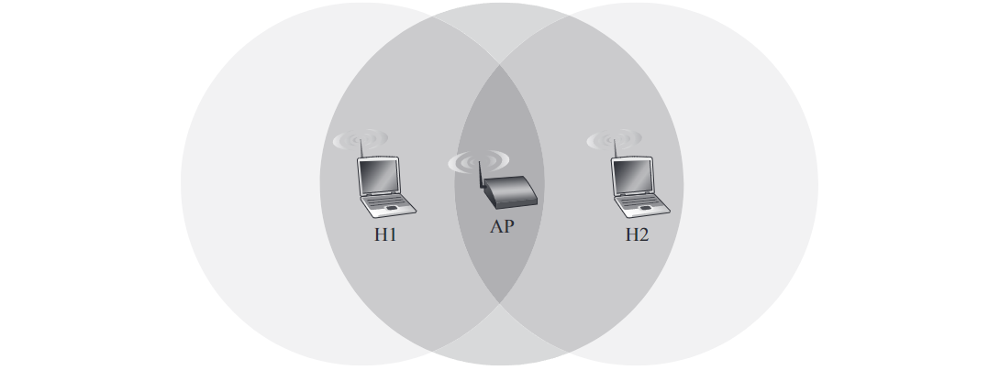

假设站点H1传输一个帧的中途，站点H2要向AP发送一个帧。由于H2未听到来自H1的传输，它将首先等待一个DIFS间隔，然后发送该帧。这导致产生了一个碰撞，使得在H1和H2的整个发送阶段，信道都被浪费了。为此，IEEE802.11协议允许站点使用**短请求发送（Request to Send，RTS）控制帧**和**允许发送（Clear to Send，CTS）控制帧**来预约对信道的访问。


1）当发送方要发送一个DATA帧时，先广播一个RTS帧，它包括源地址、目的地址和这次通信所需的持续时间（SIFS+CTS+SIFS+DATA+SIFS+ACK），覆盖范围内包括AP的所有站点都能听到。


2）当AP收到RTS帧，且信道空闲时，等待时间SIFS后广播一个CTS帧作为响应，也包括这次通信所需的持续时间（SIFS+DATA+SIFS+ACK），既给发送方明确的发送许可，同时指示其他站点在预约期内抑制发送。即使源站的屏蔽站检测不到源站发送给AP的RTS帧，也能检测到AP广播的CTS帧，根据该CTS帧中的持续时间设置自己的**网络分配向量（NAV）。**NAV（SIFS+DATA+SIFS+ACK）指出了信道忙的持续时间，意味着源站和AP以外的站点都不能在这段时间内发送数据。


3）源站收到CTS帧后，再等待SIFS，就可发送数据帧，数据帧也可携带本次通信所需的持续时间（Data+SIFS+ACK）。**“虚拟载波监听”**机制，表示其他站并未监听信道，而是因收到了源站的通知才不发送数据，这种效果就像是其他站都监听了信道。一个站点只要监听到RTS帧、CTS帧或数据帧中的任何一个，就能知道信道将被占用的持续时间，而不需要真正监听信道上的信号，从而减少隐蔽站带来的碰撞问题。


4）若AP正确收到了源站发来的数据，则等待时间SIFS后就向源站发送确认帧ACK。


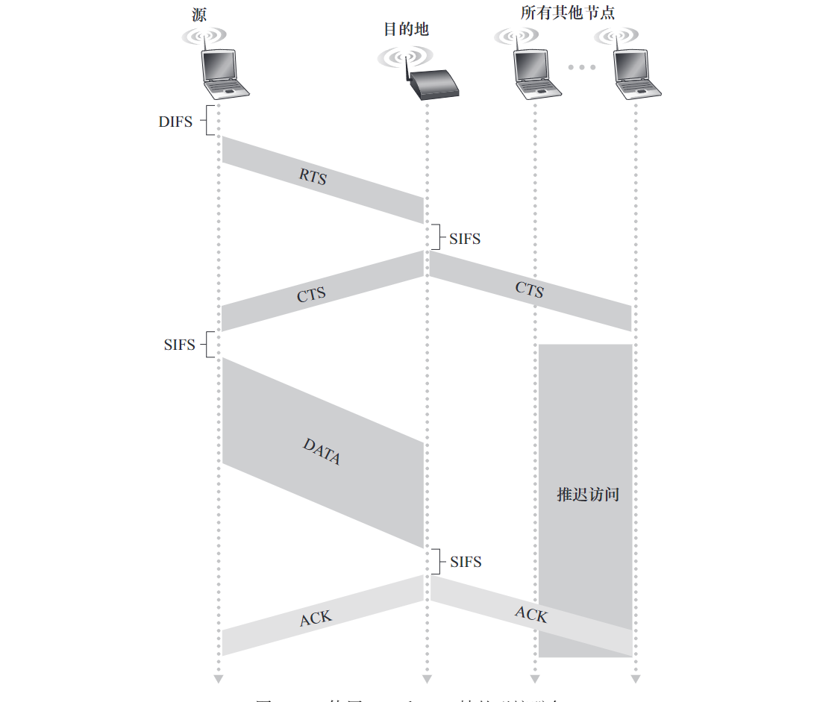

采用了RTS和CTS帧后，隐藏终端问题被缓解了，长DATA帧只有在信道预约后才被传输。另外，由于RTS和CTS帧较短，涉及RTS和CTS帧的碰撞将仅持续较短的持续期，而一旦RTS和CTS帧被正确传输，后续DATA和ACK帧应当能无碰撞地发送。


尽管RTS/CTS交换有助于减少碰撞，但它同样引入了时延并消耗了信道资源。因此，RTS/CTS交换仅仅用于为长数据帧预约信道。在实际中，每个无线站点可以设置一个**RTS门限值**，仅当帧长超过门限值时，才使用RTS/CTS序列。对许多无线站点而言，默认的RTS门限值大于最大帧长值，因此对于所有发送的DATA帧，RTS/CTS序列都被跳过。


CSMA/CA在发送数据帧之前先广播告知其他站点，让其他站点在某段时间内不要发送数据帧，以免发生冲突；CSMA/CD在发送数据帧之前监听，边发送边监听，一旦发生冲突，就立即停止发送。CSMA/CD可以检测冲突，但无法避免；CSMA/CA发送数据的同时不能检测信道上有无冲突，只能尽量避免。CSMA/CD用于总线形以太网，CSMA/CA用于无线局域网802.11a/b/g/n等。CSMA/CD通过电缆中的电压变化来检测；而CSMA/CA采用**能量检测**、**载波检测**和**能量载波混合检测**三种检测信道空闲的方式。


##### 轮流协议（taking-turns protocol）


多路访问协议的两个理想特性是，当只有一个节点活跃时，该活跃节点具有Rbps的吞吐量；当有M个节点活跃时，每个活跃节点的吞吐量接近R/Mbps。ALOHA和CSMA协议只具备第一个特性，但不具备第二个特性，这激发研究人员创造出了轮流协议。


###### 轮询协议（polling protocol）


在轮询访问中，用户不能随机地发送信息，而要通过一个集中控制的监控站以循环方式轮询每个节点，再决定信道的分配，应用在蓝牙协议中。轮询协议要求这些节点之一被指定为主节点，主节点以循环的方式轮询（poll）每个节点。例如，主节点首先向某个节点1发送一个报文，告诉它能够传输的帧的最多数量，节点1进行帧的发送。主节点能够通过观察在信道上是否缺乏信号，来决定一个节点何时完成了帧的发送。在节点1传输了某些帧后，主节点告诉节点2它能够传输的帧的最多数量，节点2进行帧的发送。


轮询协议消除了困扰随机接入协议的碰撞和空时隙，使得轮询取得更高的效率。但是，该协议引入了**轮询时延**，即通知某节点可以传输所需的时间。如果只有一个节点是活跃的，那么这个节点将以小于Rbps的速率传输，因为每次活跃节点发送了它最多数量的帧时，主节点必须依次轮询每一个非活跃的节点。另外，如果主节点有故障，整个信道都变得不可操作。


###### 令牌传递协议（token-passing protocol）


这种协议中没有主节点，一个**令牌（Token）**沿着环形总线在各站之间依次传递。令牌是一个特殊的控制帧，本身并不包含信息，仅控制信道的使用，确保同一时刻只有一个站独占信道。当一个节点收到令牌时，如果它没有要发送的帧，则将令牌传递给下一个节点；如果确实有帧要传输，就发送最大数目的帧，再把令牌转发给下一个节点。令牌只有一个，站点只有取得令牌后才能发送帧，因此令牌环网络不会发生冲突。令牌在网环上是按顺序依次传递的，对所有联网计算机而言，访问权是公平的。令牌传递是分散的，并有很高的效率，但是当一个节点发生故障时可能会使整个信道崩溃，或者如果一个节点偶然忘记了释放令牌，则必须调用某些恢复步骤使令牌返回到循环中来。


令牌环网络中令牌和数据的传递过程如下。1）当网络空闲时，环路中只有令牌帧在循环传递。2）当令牌传递到有数据要发送的站点时，该站点就修改令牌中的一个标志位，并在令牌中附加自己需要传输的数据，将令牌变成一个数据帧，然后将这个数据帧发送出去。3）数据帧沿着环路传输，接收到的站点一边转发数据，一边查看帧的目的地址，若目的地址和自己的地址相同，则接收站就复制该数据帧，以便进一步处理。4）数据帧沿着环路传输，直到到达该帧的源站点，源站不再转发该帧，而是查看数据传输过程中是否出错，若出错则重传。5）源站点传送完数据后，重新产生一个令牌，并传递给下一站点，交出信道控制权。


令牌传递协议非常适合负载很高的广播信道，多个节点在同一时刻发送数据的概率很大，若采用随机介质访问控制，则发生冲突的概率很大。令牌传递协议既不共享时间，又不共享空间。它实际上是在随机访问介质访问控制的基础上，限定了有权发送数据的节点只能有一个，因此即使是广播信道也可通过介质访问控制机制，使广播信道变为逻辑上的点对点信道，所以说数据链路层研究的是点到点之间的通信。


### 局域网（Local Area Network，LAN）


局域网是指在一个较小的地理范围内，将各种计算机、外部设备和数据库系统等通过双绞线、同轴电缆等连接介质互相连接起来，组成资源和信息共享的计算机互联网络。局域网为一个单位所拥有，且地理范围和站点数量均有限，能进行广播和多播。所有站点共享较高的总带宽，具有较低的时延和较低的误码率，相互之间为平等关系而非主从关系。


局域网的特性主要由拓扑结构、传输介质、介质访问控制方式三个要素决定，其中最重要的是介质访问控制方式，它决定着局域网的技术特性。常见的局域网拓扑结构主要有星形结构、环形结构、总线形结构，以及星形和总线形结合的复合型结构。局域网可以使用铜缆、双绞线和光纤等多种传输介质，其中双绞线为主流传输介质。局域网的介质访问控制方法主要有CSMA/CD协议、**令牌总线协议**和令牌环协议，其中前两种协议主要用于总线形局域网，令牌环协议主要用于环形局域网。


其中，以太网是目前使用范围最广的局域网，逻辑拓扑是总线形结构，物理拓扑是星形结构；**令牌环（Token Ring，IEEE802.5）**的逻辑拓扑是环形结构，物理拓扑是星形结构；**FDDI（光纤分布数字接口，IEEE802.8）**，逻辑拓扑是环形结构，物理拓扑是双环结构。


#### 802.3局域网/以太网（10-13，18-19）


以太网是目前最流行的有线局域网技术，严格来说，以太网是指符合DIX Ethernet V2标准的局域网，但DIX Ethernet V2标准与IEEE 802.3标准的差别很小，因此通常将802.3局域网简称为以太网。


以太网采用两项措施来简化通信：采用无连接的工作方式，既不对发送的数据帧编号，又不要求接收方发送确认，即以太网尽最大努力交付数据，提供的是不可靠服务，对差错的纠正则由高层完成；发送的数据都使用曼彻斯特编码的信号，每个码元的中间出现一次电压转换，接收方利用这种电压转换方便地将位同步信号提取出来。


##### 传输介质与网卡


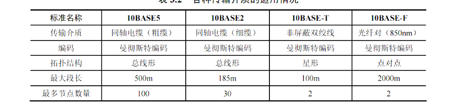

在上述标准中，10指标准的速率为10Mb/s，Base指基带以太网，早期标准Base之后的5或2指单段最大传输距离不超过500m或185m，Base之后的T指双绞线，F指光纤。


计算机与外界局域网的连接是通过主板上嵌入的一块**网络适配器（Adapter）/网络接口卡（Network Interface Card，NIC）**实现的，适配器上装有处理器和存储器，工作在数据链路层。适配器和局域网的通信是通过电缆或双绞线以串行方式进行的，而和计算机的通信则是通过计算机的I/O总线以并行方式进行的。因此，适配器的重要功能就是进行数据的串并转换。


适配器不仅能实现与局域网传输介质之间的物理连接和电信号匹配，还涉及帧的发送与接收、帧的封装与拆封、介质访问控制、数据的编码与解码及数据缓存等功能。当适配器收到正确的帧时，就使用中断来通知该计算机，并交付协议栈中的网络层。当计算机要发送IP数据报时，就由协议栈把IP数据报向下交给适配器，组帧后发送到局域网。


##### MAC地址/物理地址


IEEE802标准为局域网规定了一种48位的全球地址，固化在每台计算机的网络适配器的ROM中，用于控制主机在网络上的数据通信。全世界所有的局域网适配器都具有不同的地址，一台计算机只要没有更换适配器，不管其地理位置如何变化，其MAC地址都不会变化。


MAC地址长6字节，一般用由连字符或冒号分隔的12个十六进制数表示，如02-60-8c-e4-b1-21。高24位为厂商代码，低24位为厂商自行分配的适配器序列号。当路由器通过适配器连接到局域网时，适配器上的MAC地址就用来标志路由器的某个接口。路由器若同时连接到两个网络上，则它需要两个适配器和两个MAC地址。适配器从网络上每收到一个MAC帧，首先都要用硬件检查MAC帧中的目的地址，若是发往本站的帧则收下，否则丢弃该。其中，单播帧收到的帧的目的地址与本站的MAC地址相同，广播帧是全1地址，发送给本局域网上所有站点；多播帧是发送给本局域网上一部分站点的帧。


为什么不能只使用mac码进行通信？


mac是厂号和序列号，ip地址是按子网分的，要是用mac一个区域的人通信会复杂的多

* yes，but

* 首先，每个路由器需要存储存储因特网上的所有主机和路由器接口的mac地址；

* 其次，实际上，手工将mac地址配置到路由表中不可能，即使使用路由协议让路由器通过相互交换路由信息自动构建路由表，也会因为路由器需要海量mac地址信息严重占用通信资源；

* 并且，即使办到了，查表转发时延也非常大；

* 但如果采用分层的思想，只用一个网络的ip地址的网络号代表该网络内的所有IP地址和mac地址，只需要记录部分网络地址就能减少路由表中的路由记录，在网络内部传送时，查询arp表找到ip地址所对应的mac地址；

* 这种方法也是为了保证安全；

* 另外，由于路由器的隔离，路过路由器时，MAC帧头部的两个MAC地址会不断改变，IP网络无法通过mac地址完成跨网络的寻址，在网络层只能通过IP地址寻址；

* MAC地址虽然在局域网内用于设备识别，但不能单独用于网络通信的原因包括：

* 局域网限制：MAC地址仅在本地网络中有效，无法跨越不同的网络或互联网进行路由。

* 缺乏层次结构：MAC地址没有网络层的分层结构，无法处理复杂的路由任务，因此无法确定数据包的最佳传输路径。

* 广播通信问题：在大规模网络中，如果只依赖MAC地址进行通信，网络会遭受大量的广播流量，导致效率低下。

* 安全性问题：MAC地址可以被轻易伪造，这在安全性上构成威胁，而IP地址则可以通过各种安全措施进行管理。

* 这样的方式存在局限性：

* 无法跨网络：一旦需要跨越不同的网络或路由，MAC地址就无法发挥作用。

* 无路由功能：没有IP地址，数据包无法确定最佳传输路径，影响效率。

* 管理和控制：缺乏IP地址会使网络管理变得困难，无法进行细粒度的控制和监控。

那么可不可以仅使用ip地址，寻找该设备接口呢？

* 我的想法，是因为局域网使用的是二层设备，没办法看到ip地址；如果把二层设备都换成交换机呢？再者说了，直接让交换机在局域网内广播，不就能让目的主机收到吗？

* 另外ip地址不是全球唯一的，在专用网络中，本地ip是可重用的；


##### 以太网V2帧


以太网MAC帧格式有两种标准：DIX Ethernet V2标准和IEEE802.3标准，下面是最常用的以太网V2的MAC帧格式。（21年考研答案中给出的表述是CSMA/CD帧。）


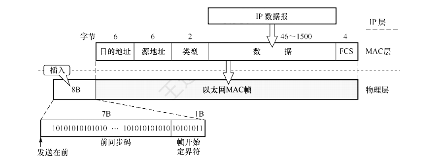

在帧前面插入的8字节**前导码**分为两个字段，第一个字段是7字节的**前同步码**，用来实现 MAC帧的比特同步，第二个字段是1字节的帧开始定界符，表示后面的信息就是MAC帧。


802.3帧格式与以太网V2帧格式的不同之处是，用长度域替代了V2帧中的类型域，指出了数据域的长度。在实践中两种机制可以并存，因为IEEE802.3数据段的最大字节数是1500，所以长度段的最大值是1500，于是从1501到65535的值可用于类型段标识符。


数据字段占46～1500字节，承载上层的协议数据单元（如IP数据报）。以太网的最大传输单元是1500字节，若IP数据报超过1500字节，则必须将该IP数据报分片。此外，由于CSMA/CD算法的限制，以太网帧必须满足最小长度是64字节，当IP数据报少于46字节时，MAC子层就在数据字段的后面加一个整数字节的填充字段，以确保帧长不小于64字节。


检验码（FCS）字段占4字节，检验范围从目的地址段到数据字段，算法采用32位CRC码，不但要检验MAC帧的数据部分，而且要检验目的地址、源地址和类型字段，但不检验前导码。


以太网帧不需要帧结束定界符，因为以太网传送的各帧之间必须有一定的间隙，接收方只要找到帧开始定界符，其后面连续到达的比特流就都属于同一帧。以太网采用了违规编码法的思想，因为以太网使用曼彻斯特编码，所以每个码元中间都有一次电压的跳变。发送方发完一帧后，发送方网络接口上的电压不再变化，这样接收方就能很容易地找到帧的结束位置，这个位置往前数4字节就是FCS字段，于是就能确定数据字段的结束位置。


##### 高速以太网


速率达到或超过100Mb/s的以太网称为高速以太网，以太网的演进证明了以太网是可扩展的（从10Mb/s到10Gb/s）、灵活的（多种传输介质、全/半双工、共享/交换），且易于安装，稳健性好。


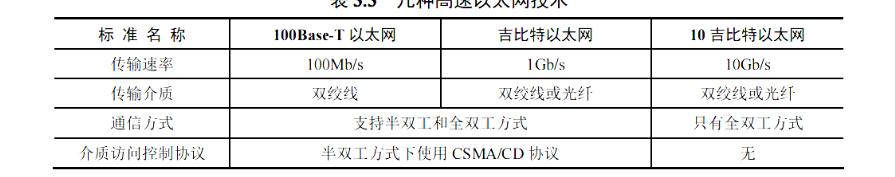

**100BASE-T以太网/快速以太网**是在双绞线上传送100Mb/s基带信号的星形拓扑以太网，既支持全双工方式，又支持半双工方式，在全双工方式下工作而无冲突发生，不使用CSMA/CD协议。100BASE-T的MAC帧格式仍然是802.3标准规定的帧格式，保持最短帧长不变，但将一个网段的最大长度减小到100m，帧间最小间隔从原来的9.6µs改为0.96µs。（如果不改变网段长度，最小帧长变为128B，单向传播时延变为5.12微秒。）


**吉比特以太网/千兆以太网**，允许在使用双绞线或光纤上以1Gb/s速率以全双工和半双工两种方式工作，在半双工方式下使用CSMA/CD协议，而在全双工方式不使用CSMA/CD协议。它仍然使用使用802.3协议规定的帧格式，与10BASE-T和100BASE-T技术向后兼容。


**10吉比特以太网**的帧格式与10Mb/s、100Mb/s和1Gb/s以太网的帧格式完全相同，还保留了802.3标准规定的以太网最小帧长和最大帧长，以便升级和向后兼容。10吉比特以太网只工作在全双工方式，不存在争用问题，当然也不使用CSMA/CD协议。


#### 802.11无线局域网/Wi-Fi（17，22）


##### 有固定基础设施的无线局域网


**固定基础设施**，指预先建立的、能覆盖一定地理范围的固定基站。对于有固定基础设施的无线局域网，IEEE制定了无线局域网的802.11系列协议标准，包括802.11a/b/g/n等，该标准使用星形拓扑，其中心称为**接入点（Access Point，AP）**，在MAC 层使用CSMA/CA协议。


802.11标准规定无线局域网的最小构件是**基本服务集（Basic Service Set，BSS）**，一个BSS包括一个AP和若干移动站。基本服务集覆盖的地理范围称为**基本服务区（Basic Service Area，BSA）**，无线局域网的BSA的直径一般不超过100m。各站在本BSS内的通信，或与本BSS外部站的通信，都必须通过本BSS的AP，即BSS中的**基站（base station）**。安装AP时，必须为其分配一个不超过32字节的**服务集标识符（Service Set IDentifier，SSID）**和一个信道，SSID是指使用该AP的无线局域网的名称。


BSS集可以是孤立的，也可通过AP连接到一个**分配系统（Distribution System，DS）**，然后连接到另一个BSS，构成一个**扩展的服务集（Extended Service Set，ESS）**，DS的作用是使ESS对上层的表现就像一个BSS。ESS还可通过一种称为**Portal（门户）**的设备为无线用户提供到有线连接的以太网接入，其的作用相当于网桥。


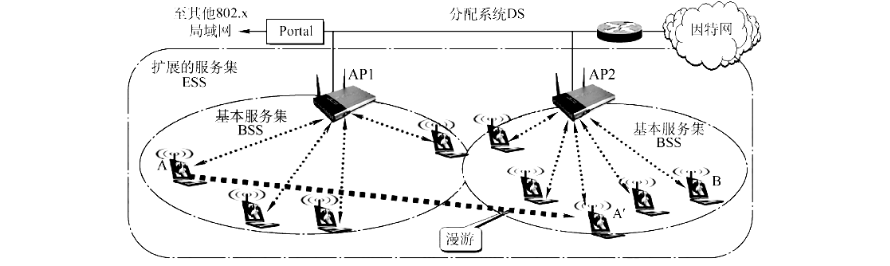

当移动站A从某个BSS漫游到另一个BSS时，仍可保持与另一个移动站B的通信，但A在不同的BSS中使用的AP改变了。// 详见移动IP


##### 无固定基础设施的移动自组织网络/自组网络（ad hoc network）


自组网络没有上述BSS中的AP，而有由一些平等状态的移动站相互通信组成的**临时网络**，各节点之间地位平等，中间节点都为**转发节点**，因此都具有路由器的功能。


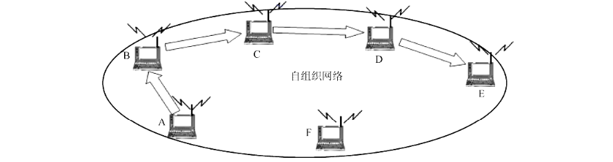

自组网络通常是这样构成的，一些可移动设备发现在它们附近还有其他的可移动设备，且要求和其他移动设备进行通信。自组网络中的每个移动站都要参与网络中其他移动站的路由发现和维护，同时由移动站构成的网络拓扑可能随时间变化很快，因此在固定网络中行之有效的一些路由选择协议对移动自组网络已不适用，需引起特别的关注。


自组网络和移动IP并不相同。移动IP技术使漫游的主机可用多种方法连接到因特网，其核心网络功能仍然基于固定网络中一直使用的各种路由选择协议。而自组网络是将移动性扩展到无线领域中的自治系统，具有自己特定的路由选择协议，且可以不和因特网相连。


##### 802.11局域网的MAC帧


802.11帧共有三种类型，即数据帧、控制帧和管理帧，其中数据帧的格式如图所示。


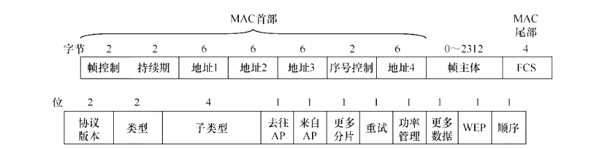

帧主体，即帧的数据部分，不超过2312字节，比以太网的最大长度长很多。


MAC首部共30字节，其中，**持续期字段**指CSMA/CA协议中信道预约的时间；802.11帧有控制帧、数据帧和管理帧三种类型，每种帧又分为若干子类型，如控制帧有RTS、CTS和ACK等不同的子类型，**帧控制字段**中的**类型字段**和**子类型字段**用来区分帧的功能。802.11帧的MAC首部中最重要的是4个地址字段，它们的内容取决于帧控制字段中的**“去往AP”**和**“来自AP”**这两个字段的数值。地址1是直接接收数据帧的节点地址，地址2是实际发送数据帧的节点地址，即地址1和地址2分别是无线通信中信道两端的接收地址和发送地址，地址3是目的地址或源地址，在有基础设施的网络中一般只使用前三种地址，仅在自组网络中使用目的地址4。


例如，一个BSS中的A站向B站发送数据帧。在A站发往AP的数据帧的帧控制字段中，“去往AP=1”而“来自AP=0”，因此地址1是AP的MAC地址，地址2是A站的MAC地址，地址3是B站的MAC地址。AP接收到数据帧后，转发给B站，此时在数据帧的帧控制字段中，“去往AP=0”而“来自AP=1”，因此地址1是B站的MAC地址，地址2是AP的MAC地址，地址3是A站的MAC地址。


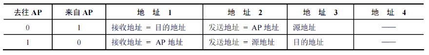

如图，两个AP有线连接到路由器，现在路由器要向AP1中的A站发送数据。路由器是网络层设备，它看不见链路层的AP，只认识A站的IP地址；而AP是链路层设备，它只认识MAC地址，而不认识IP地址。路由器从IP数据报获知A站的IP地址，并用ARP获取A站的MAC地址，然后通过接口R1将该IP数据报封装成802.3帧（只有两个物理地址）。该帧的源地址字段是R1的MAC地址，目的地址字段是A站的MAC地址。AP收到该802.3帧后，将该802.3帧转换为802.11帧。在帧控制字段中，“去往AP=0”而“来自AP=1”，因此地址1是A站的MAC地址，地址2是AP的MAC地址，地址3是R1的MAC地址。这样，A站就可以将数据报发送到子网中的路由器接口的MAC地址（地址3）。


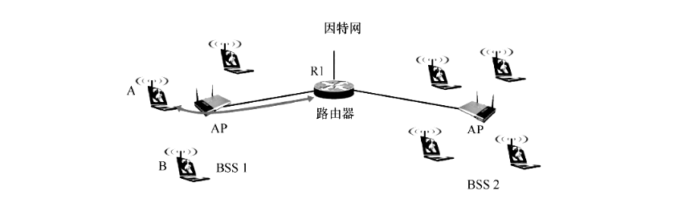

再如，此时A站向路由器接口R1发送数据，先生成一个802.11帧，在帧控制字段中“去往AP=1”，“来自AP=0”，因此地址1是AP的MAC地址，地址2是A站的MAC地址，地址3是R1的MAC地址。AP收到该802.11帧后，将其转换为802.3帧，该帧的源地址字段是A站的MAC地址，目的地址字段是R1的MAC地址。由此可见，地址3在BSS和有线局域网互联中起关键作用，它允许AP在构建以太网帧时确定目的MAC地址。


#### 虚拟局域网（Virtual LAN，VLAN）（24）


虚拟局域网只是局域网为用户提供的一种服务，并不是一种新型局域网。一个以太网是一个广播域，当一个以太网中包含的计算机太多时，往往会导致出现大量的广播帧，特别是经常使用的ARP和DHCP。一个单位的不同部门共享一个局域网，对信息保密和安全不利。VLAN可将一个较大的局域网分割成一些较小的与地理位置无关的逻辑上的VLAN，而每个VLAN是一个较小的广播域。


属于同一个VLAN的计算机之间可以直接通信（单播、广播），而不同VLAN的计算机之间不能直接通信（包括单播、广播），若要实现VLAN间的单播，可以采用多臂路由、单臂路由、三层交换机等方法。


##### 划分方式


**基于接口**。将交换机的若干接口划为一个逻辑组，这种方法最简单、最有效，若主机离开了原来的接口，则可能进入一个新的子网。


**基于MAC地址**。按MAC地址将一些主机划分为一个逻辑子网，当主机的物理位置从一个交换机移动到另一个交换机时，它仍属于原来的子网。


**基于IP地址**。根据网络层地址或协议划分VLAN，这样的VLAN可以跨越路由器进行扩展，将多个局域网的主机组成一个VLAN。


##### 802.1Q帧


**802.3ac标准**定义了支持VLAN的以太网帧格式的扩展，它在以太网帧中插入一个4字节的标识符（插在源地址字段和类型字段之间），称为**VLAN标签**，用来指明发送该帧的计算机属于哪个虚拟局域网。VLAN标签的前两个字节总是置为0x8100，表示这是一个802.1Q帧。在VLAN标签的后两个字节中，前4位实际上并没什么作用，后12位是该VLAN的**标识符VID**，它唯一地标识该802.1Q帧属于哪个VLAN，可识别4096个不同的VLAN。插入VLAN标签后，802.1Q帧最后的FCS必须重新计算。因为VLAN帧的首部增加了4字节，所以以太网帧的数据字段的最小长度从原来的46字节变为42字节，最大长度保持不变，因此以太网帧的最大帧长从原来的1518字节变为1522字节。


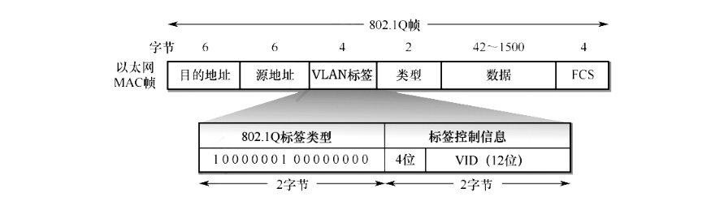

如图，交换机1连接7台计算机，该局域网划分为两个虚拟局域网VLAN-10和VLAN-20，这里的10和20就是802.1Q帧中的VID字段的值，由交换机管理员设定。各主机并不知道自己的VID值，但交换机必须知道，主机与交换机之间交互的都是标准以太网帧。一个VLAN的范围可以跨越不同的交换机，前提是所用的交换机能够识别和处理VLAN。交换机2连接5台计算机，并与交换机1相连，连接两个交换机接口之间的链路称为**汇聚链路/干线链路**。交换机2中的2台计算机加入VLAN-10，另外3台计算机加入VLAN-20。这两个VLAN虽然都跨越了两个交换机，但各自都是一个广播域。


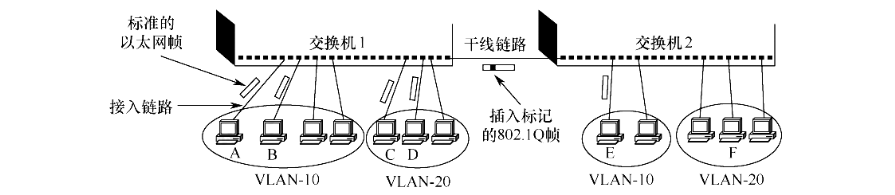

假定A站向B站发送帧，交换机1根据帧首部的目的MAC地址，识别B站属于本交换机管理的VLAN-10，因此就像在普通以太网中那样直接转发帧。假定A站向E站发送帧，交换机1必须把帧转发到交换机2，但在转发前，要插入VLAN标签，否则交换机2就不知道应把帧转发给哪个VLAN。因此，在干线链路上传送的帧是802.1Q帧。交换机2在向E站转发帧之前，要删除已插入的VLAN标签，因此E站收到的帧是A站发送的标准以太网帧，而不是802.1Q帧。若A站向C站发送帧，虽然A站和C站都连接到同一个交换机，但是它们已处在不同的网络中，需要通过上层的路由器来解决，也可在交换机中嵌入专用芯片，以便在交换机中实现第3层的转发功能。


**Trunk接口**的转发处理，对于帧的VID值等于接口的PVID值的802.1Q帧，将其“去标签”转发；对于帧的VID

值不等于接口的PVID值的802.1Q帧，将其直接转发。因此，从Trunk接口转发出的帧，可能是普通以太网

MAC帧，也可能是802.1Q帧。


### 广域网（Wide Area Network，WAN）/网络核心


**广域网**通常是指覆盖范围很广，远超一个城市的范围的长距离网络，任务是长距离运送主机所发送的数据，首要考虑的问题是通信容量必须足够大，以便支持日益增长的通信量。广域网不等于互联网，互联网可以连接不同类型的网络，通常使用路由器来连接，局域网可以通过广域网与另一个相隔很远的局域网通信。


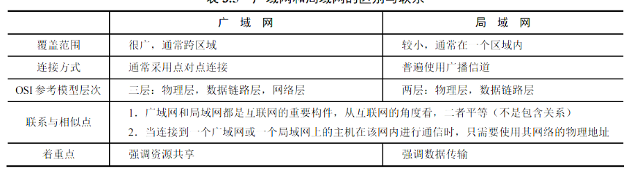

广域网由一些节点交换机及连接这些节点交换机的链路组成，这些的链路都是高速链路。节点交换机和路由器都用来存储转发分组，工作原理也类似，但是节点交换机在单个网络中转发分组，而路由器在多个网络构成的互联网中转发分组。节点之间都是点到点连接，但为了提高网络的可靠性，一个节点交换机往往与多个节点交换机相连。


#### 点对点协议（ Point-to-Point  Protocol，PPP）*


在通信线路质量较差的年代，能实现可靠传输的**高级数据链路控制（HDLC）**成为当时比较流行的数据链路层协议。但对现在误码率很低的点对点有线链路，更简单的PPP是目前使用最广泛的数据链路层协议。PPP主要有两种应用，一是用户通常都要连接到某个ISP才能接入互联网，PPP就是用户计算机与ISP通信时所用的数据链路层协议；一是两台网络设备之间的直连专用线路。PPP 只支持全双工的点对点链路，不支持多点线路。


**组成部分**


**链路控制协议（LCP）**用来建立、配置、测试数据链路连接，以及协商一些选项。PPP 的两端可以运行不同的网络层协议，但仍可使用同一个PPP进行通信。**网络控制协议（NCP）**为网络层协议建立和配置逻辑连接，PPP允许采用多种网络层协议，每个不同的网络层协议要用一个相应的NCP来配置。IP数据报在PPP帧中就是其信息部分，这个信息部分的长度受MTU的限制，PPP包含一种将IP数据报封装到串行链路的方法。


**PPP帧格式**


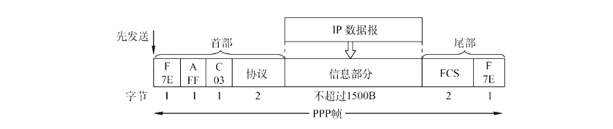

PPP帧的首部和尾部各有一个**标志字段（F）**，规定为0x7E（01111110），它表示一个帧的开始和结束，即PPP帧的定界符。当标志字段出现在信息段中时，就必须采取一些措施使这种形式上和标志字段一样的比特组合不出现在信息段中。当PPP使用同步传输时，采用零比特填充法来实现透明传输。当PPP使用异步传输时，采用字节填充法，将信息字段中出现的每一个0x7E字节转变为0x7D, 0x5E (2字节序列)，每一个0x7D字节转变为0x7D, 0x5D (2字节序列)，若出现ASCII码的控制字符(数值小于0x20的字符),则在该字符前面插入一个0x7D字节,同时将该字符的编码加上 0x20。


**地址字段（A）**规定为0xFF，**控制字段（C）**规定为0x03，这两个字段的意义暂未定义。PPP是面向字节的，所有PPP帧的长度都是整数个字节。**协议段**表示信息段运载的是什么种类的分组，若为0x0021，则信息字段是IP数据报；若为0xC021，则信息字段是PPP链路控制协议（LCP）的数据。**信息段**的长度是可变的，因为PPP是点对点的，并不是总线形，所以无须使用CSMA/CD协议，自然就不会有最短帧长的限制，所以信息段占0~1500字节，而不是46~1500字节。**帧检验序列（FCS）**是使用CRC检验的冗余码。PPP 虽然在连接建立的过程中使用了确认机制，但在数据帧的发送过程中只保证无差错接收（通过CRC检验），不使用序号和确认机制，因而是不可靠服务。


不使用序号和确认机制是出于以下考虑，若使用能够实现可靠传输的数据链路层协议（如HDLC），开销就会增大。当数据链路层出现差错的概率不大时，使用比较简单的PPP较为合理。在因特网环境下，PPP的信息字段放入的数据是IP数据报。假定我们采用了能实现可靠传输但十分复杂的数据链路层协议，当数据帧在路由器中从数据链路层上升到网络层时，仍有可能因网络拥塞而被丢弃。因此，数据链路层的可靠传输并不能保证网络层的传输也是可靠的。PPP在帧格式中有帧检验序列FCS字段。对于每个收到的帧，PPP都要使用硬件进行CRC检验，若发现差错则丢弃该帧。端到端的差错控制最后由高层协议负责。因此，PPP可以保证无差错接收。


**工作原理**


例如，当用户拨号接入ISP后，就建立了一条从用户到ISP的物理连接。用户先向ISP发送一系列的**LCP分组**，它们被封装成多个PPP帧，以便建立**LCP连接**。接下来，进行网络层配置，NCP给新接入的用户分配一个临时IP地址。通信结束后，依次释放网络层、数据链路层和物理层连接。


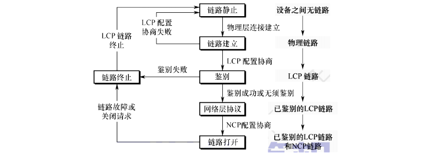

PPP链路的起始和终止都是**链路静止状态**，用户与ISP之间不存在物理层的连接。当检测到调制解调器的载波信号并建立物理层连接后，PPP就进入**链路建立状态**。在链路建立状态下，链路控制协议（LCP）开始协商一些配置选项，包括最大帧长、鉴别协议等，若协商成功双方就建立了LCP链路，然后进入**鉴别状态**，否则退回到链路静止状态。鉴别动态下，若通信双方无须鉴别或鉴别身份成功，则进入**网络层协议状态**，否则进入**链路终止状态**。进入网络层协议状态后，双方采用网络控制协议（NCP）配置网络层，配置完毕后就进入**链路打开状态**，双方就可以进行数据通信。数据传输结束后，链路一方发出终止请求且在收到对方发来的终止确认后，或者链路出现故障时，进入**链路终止状态**，载波停止后回到链路静止状态。 


## 物理层


【考纲内容】

（一）通信基础：基本概念；奈奎斯特定理与香农定理；编码与调制；数据交换；数据报与虚电路

（二）传输介质：双绞线、同轴电缆、光纤与无线传输介质；物理层接口的特性

（三）物理层设备：中继器；集线器 


### 通信基础（14）


**数据**是指传送信息的实体，**信号**是数据的电气或电磁表现，是数据在传输过程中的存在形式。数据和信号都有模拟或数字之分，模拟数据或模拟信号的取值是连续的，数字数据或数字信号的取值是离散的。在模拟信号系统中，**带宽/频率带宽**用来表示某个信道所能传输信号的频率范围，即最高频率与最低频率之差，单位是赫兹（Hz）。在计算机网络中，带宽用来表示网络的通信线路所能传输数据的能力，即最高数据率，此时带宽的单位不再是Hz，而是b/s。


在通信系统中，常用一个固定时长的信号波形表示一个k进制数，这个时长内的信号称为**码元，**可称k进制码元，而该时长称为**码元宽度**，也称**信号周期**。1码元可携带若干比特的信息量，例如在一个信号周期内可能出现2个信号，每个信号对应一个二进制数（1bit）；若一个信号周期内可能出现4个信号，则每个信号就对应一个四进制数（2bit）。


**速率**是指数据传输速率，表示单位时间内传输的数据量，常有两种描述形式：**码元传输速率/波特率/调制速率**，表示数字通信系统每秒传输的码元数/脉冲个数/信号变化个数，单位是波特（Baud）；**信息传输速率/比特率**，表示数字通信系统每秒传输的比特数，单位是比特/秒（b/s）。波特和比特是两个不同的概念，但波特率与比特率在数量上又有一定的关系。若一个码元携带n比特的信息量，则波特率M Baud对应的比特率为Mn b/s。码元既可以是多进制的，也可以是二进制的，码元速率与进制无关。


**数据通信系统**主要划分为信源、信道和信宿三部分，信源是产生和发送数据的源头；信宿是接收数据的终点；信道是信号的传输介质，一条双向通信的线路包含一个发送信道和一个接收信道。发送端信源发出的信息需要通过**变换器**转换成适合在信道上传输的信号，而通过信道传输到接收端的信号首先由**反变换器**转换成原始信息，然后发送给信宿。**噪声源**是信道上的噪声及分散在通信系统其他各处的噪声的集中表示。


信道按传输信号形式的不同，分为传送模拟信号的**模拟信道**和传送**数字信号**的数字信道；按传输介质的不同分为**无线信道**和**有线信道**。信道上传送的信号有基带信号和宽带信号之分，**基带信号**是由信源发出的未经过调制的原始电信号，当在信道中直接传送基带信号时，称为**基带传输**；**宽带信号**首先将基带信号进行调制 形成频分复用模拟信号，然后送到信道上传输，称为**宽带传输**。


数据传输方式分为串行传输和并行传输，串行传输是指逐比特地按序依次传输，并行传输是指若干比特通过多个通信信道同时传输。串行传输适用于长距离通信，如计算机网络。并行传输适用于近距离通信，常用于计算机内部，如CPU与主存之间。


从通信双方信息的交互方式看，可分为单向通信、半双工通信、全双工通信三种基本方式：**单向通信**只有一个方向的通信而没有反方向的交互，因此只需一个信道，如无线电广播、电视广播等；**半双工通信**的通信双方都可发送或接收信息，需要两个信道，每个方向一个信道，但任何一方都不能同时发送和接收信息；**全双工通信**的通信双方可同时发送和接收信息，也需要两个信道。


### 信道的极限容量（09、14、16-17、22-23）


任何实际的信道都不是理想的，信号在信道上传输时会不可避免地产生失真。但是，只要接收端能够从失真的信号波形中识别出原来的信号，这种失真对通信质量就没有影响。但是，若信号失真很严重，接收端就无法识别出每个码元。码元的传输速率越高，或者信号的传输距离越远，或者噪声干扰越大，或者传输介质的质量越差，接收端波形的失真就越严重。


#### 奈奎斯特定理/奈氏准则


具体的信道所能通过的频率范围总是有限的，信号中的许多高频分量往往不能通过信道，否则在传输中就会衰减，导致接收端收到的信号波形失去码元之间的清晰界限，这种现象称为**码间串扰**。奈奎斯特定理规定，在**理想低通（没有噪声、带宽有限）信道**中，为了避免码间串扰，极限码元传输速率为2W Baud，其中W是信道的频率带宽。若用V表示每个码元的**离散电平数量**（即不同的码元数量，若有16种不同的码元，则需要4个二进制位，因此数据传输速率是码元传输速率的4倍），则极限数据传输速率为理想低通信道的极限数据传输速率=2WlogV b/s。


对于奈氏准则，有以下结论。在任何信道中，码元传输速率是有上限的。若传输速率超过上限，则会出现严重的码间串扰问题，使得接收端无法完全正确地识别码元。信道的带宽越大，则传输码元的能力越强。奈氏准则给出了码元传输速率的限制，但并未限制信息传输速率，即未对一个码元最多可以携带多少比特给出限制。因为码元传输速率受奈氏准则制约，所以要提高数据传输速率，就要设法使每个码元携带更 多比特的信息量，此时需要采用多元制的调制方法。


#### 香农定理


实际的信道会有噪声，噪声是随机产生的。香农定理给出了**带宽受限且有高斯噪声干扰的信道**的极限数据传输速率，当用该速率传输数据时不会产生误差。香农定理定义了信道的极限数据传输速率为


$$Wlog_2(1+S/N) b/s$$.


其中，W为信道的频率带宽，S为信道内所传输信号的**平均功率**，N为信道内的**高斯噪声功率**。S/N为信噪比，即信号的平均功率与噪声的平均功率之比，有无单位记法和分贝（dB）记法两种表示形式。当采用无单位记法时，信噪比=S/N；当采用分贝记法时，信噪比=10log_10(S/N)（单位为dB），例如，当S/N=1000时，信噪比为30dB。很多时候，信号要比噪声强得多，如信号比噪声强10亿倍，若用数值表示，则1后面有9个0，很容易丢失0；若用分贝表示，则仅为90dB，因此要简单得多，且不容易出错。分贝对于表示特别大或特别小的数值极为方便，在通信领域中用途很广。注意，在使用香农定 理计算信道的极限数据传输速率时，信噪比应采用无单位记法。


对于香农定理，有以下结论。信道的带宽或信道中的信噪比越大，信息的极限传输速率越高。对一定的传输带宽和一定的信噪比，信息传输速率的上限是确定的。只要信息传输速率低于信道的极限传输速率，就能找到某种方法实现无差错的传输。香农定理得出的是极限信息传输速率，实际信道能达到的传输速率要比它低不少。


奈氏准则只考虑了带宽与极限码元传输速率之间的关系，而香农定理不仅考虑了带宽，还考虑了信噪比。这从另一个侧面表明，一个码元可以携带的比特数是有限的。


### 编码与调制（09，11，13，15，21-24）


信号是数据的具体表示形式，数据无论是数字的还是模拟的，为了传输的目的都要转换成信号。将数据转换为数字信号的过程称为**编码**，将数据转换为模拟信号的过程称为**调制**。数字数据可通过**数字发送器**转换为数字信号传输，也可通过**调制器**转换成模拟信号传输；同样，模拟数据可通过**PCM编码器**转换成数字信号传输，也可通过**放大器调制器**转换成模拟信号传输。这样，就形成了如下4种编码与调制方式。


在计算机内部或在相邻设备之间近距离传输时，可不经过调制就在信道上直接进行的传输方式称为**基带传输**，通常用于局域网。数字基带传输就是在信道中直接传输数字信号，且传输介质的整个带宽都被基带信号占用，双向地传输信息。


用数字信号对特定频率的载波进行调制（数字调制），将其变成适合传送的信号后再进行传输，这种传输方式就是**频带传输**。当采用远距离传输或无线传输时，数字信号必须用频带传输技术进行传输。利用频带传输，不仅解决了电话系统传输数字信号的问题，还可以实现多路复用，进而提高传输信道的利用率。


借助频带传输，可将链路分解成两个或多个信道，每个信道可携带不同的信号，这就是**宽带传输**。宽带传输中所有的信道能同时互不干扰地发送信号。例如，对信道进行频分复用，划分为2个互不相关的子信道，分别在两个子信道上同时进行频带传输，链路容量就会大大增加。


以两个主机相互传输信息为例说明物理层通信方式。首先，源主机将需要发送的数据转换成高低电平信号，发送到源主机中的网卡。网卡将收到的高低电平的数字信号编码为曼彻斯特编码，然后将其通过网线传输到路由器中。由于从源主机到路由器之间发送数字信号，所以这段链路上的信道属于数字信道。路由器将收到的数字信号调制成模拟信号，若使用的路由器是光纤路由器，则将数字信号调制成光信号，光信号最终到达目的主机的路由器。目的主机所在的路由器接收到的光信号编码成曼彻斯特编码这种数字信号，然后将该数字信号通过数字信道送打目的主机。


#### 数字数据编码为数字信号


数字数据编码用于**基带传输**中，即在基本不改变数字数据信号频率的情况下，直接传输数字信号。具体用什么样的数字信号表示0及用什么样的数字信号表示1，就是所谓的编码。编码的规则有多种，只要能有效区分0和1即可。


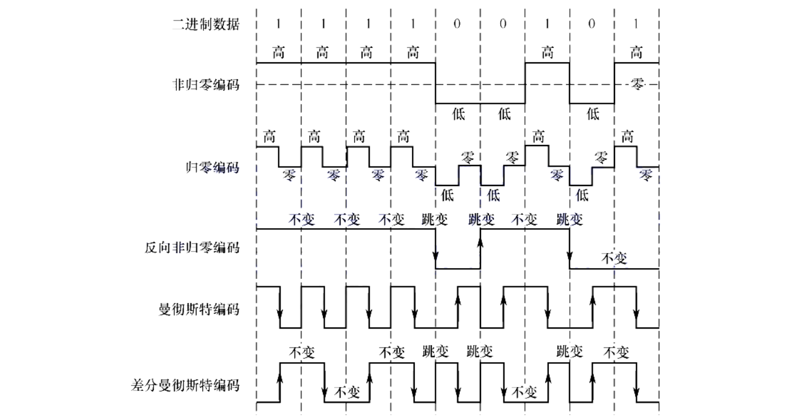

**归零（RZ）编码**用高电平表示1、低电平表示0（或者相反），每个码元的中间均跳变到零电平（归零），接收方根据该跳变调整本方的时钟基准，这就为收发双方提供了**自同步机制**。因为归零需要占用一部分带宽，所以传输效率受到了一定的影响。


**非归零（NRZ）编码**与RZ编码的区别是不用归零，一个时钟全部用来传输数据，编码效率最高。但NRZ编码的收发双方存在同步问题，为此需要双方都带有时钟线。


**反向非归零（NRZI）编码**与NRZ编码的区别是用电平的跳变表示0、电平保持不变表示1。跳变信号本身可作为一种通知机制。这种编码方式集成了前两种编码的优点，既能传输时钟信号，又能尽量不损失系统带宽。USB2.0的编码方式就是NRZI编码。


**曼彻斯特编码**每个码元的中间都发生电平跳变，电平跳变既作为时钟信号（用于同步），又作为数据信号。可用向下跳变表示1、向上跳变表示0，或者采用相反的规定，应用于标准以太网中。特别的，曼彻斯特编码用两个码元传输一比特信息，因此波特率是比特率的2倍。


**差分曼彻斯特编码**每个码元的中间都发生电平跳变，与曼彻斯特编码不同的是，电平跳变仅表示时钟信号，而不表示数据。数据的表示在于每个码元开始处是否有电平跳变：无跳变表示1，有跳变表示0。差分曼彻斯特编码拥有更强的抗干扰能力，被广泛用于宽带高速网中。


#### 模拟数据编码为数字信号


主要包括三个步骤，即采样、量化和编码，常用于对音频信号进行编码的PCM编码。**采样**是指对模拟信号进行周期性扫描，将时间上连续的信号变成时间上离散的信号。根据奈奎斯特定理，采样频率必须大于或等于模拟信号最大频率的两倍。**量化**是指将采样得到的电平幅值按照一定的分级标度转换为对应的数值并取整，这样就将连续的电平幅值转换为了离散的数字量。采样和量化的实质就是分割和转换。**编码**是指将量化得到的离散整数转换为与之对应的二进制编码。


#### 数字数据调制为模拟信号


**数字数据调制技术**在发送端将数字信号转换为模拟信号，而在接收端将模拟信号还原为数字信号，分别对应于调制解调器的调制和解调过程。


**调幅（AM）/幅移键控（ASK）**通过改变载波的振幅来表示数字信号1和0。例如，用有载波和无载波输出分别表示1和0。这种方式比较容易实现，但抗干扰能力差。


**调频（FM）/频移键控（FSK）**通过改变载波的频率来表示数字信号1和0。例如，用频率f1和频率f2分别表示1和0。这种方式容易实现，抗干扰能力强，目前应用较广泛。


**调相（PM）/相移键控（PSK）**通过改变载波的相位来表示数字信号1和0。例如，用相位0和π分别表示1和0，是一种**绝对调相**方式。与PSK 不同，**DPSK（差分相移键控）**是一种**相对调相**方式，它通过检测当前码元与前一个码元的载波相位差来传输数字信息。例如，使用相位有无变化分别表示1和0。


**正交幅度调制（QAM）**在频率相同的前提下，将AM与PM结合形成叠加信号，每个载波符号可以表示多个比特，其实就是奈氏准则。设波特率为B，采用m个相位，每个相位有n种振幅，则该QAM的数据传输速率R为R = Blog₂(mn) b/s。


#### 模拟数据调制为模拟信号


为了实现传输的有效性，可能需要较高的频率。这种调制方式还可使用**频分复用（FDM）技术**，充分利用带宽资源。电话机和本地局交换机采用模拟信号传输模拟数据的编码方式。


### 传输介质/媒体


传输介质是数据传输系统中发送器和接收器之间的物理通路。传输介质并不是物理层，因为传输介质在物理层的下面，而物理层是体系结构的第一层，所以有时称传输介质为0层。在传输介质中传输的是信号，但传输介质并不知道所传输的信号代表什么。也就是说，传输介质不知道所传输的信号什么时候是1、什么时候是0。但是，物理层因为规定了电气特性，所以能够识别传送的比特流。


#### 导向传输介质


如铜线或光纤等，电磁波被导向为沿固体介质传播。


**双绞线**


双绞线是最常用的传输介质，在局域网和传统电话网中普遍使用。双绞线由两根采用一定规则并排绞合、相互绝缘的铜导线组成，绞合可减少对相邻导线的电磁干扰。为了进一步提高抗电磁干扰的能力，还可在双绞线的外面加上一层金属丝编织成的屏蔽层，这就是**屏蔽双绞线（STP）**，无屏蔽层的双绞线称为**非屏蔽双绞线（UTP）**。


双绞线的价格便宜，模拟传输和数字传输都可使用双绞线，通信距离一般为几千米到数十千米。双绞线的带宽取决于铜线的粗细和传输的距离。距离太远时，对于模拟传输，要用放大器放大衰减的信号；对于数字传输，要用中继器来对失真的信号进行整形。随着技术的发展和集线器的出现，在局域网领域基本上都采用双绞线作为传输介质。


**同轴电缆**


同轴电缆由内导体、绝缘层、外导体屏蔽层和绝缘保护套层构成，一般分为两类，**50同轴电缆**，主要用于传送基带数字信号，在早期局域网中应用广泛；**75同轴电缆**，主要用于传送宽带信号，在有线电视系统中应用广泛。因为外导体屏蔽层的作用，所以同轴电缆具有良好的抗干扰特性而被广泛用于传输较高速率的数据。


**光导纤维/光纤**


光纤通信是指利用光纤传递光脉冲来进行通信，有光脉冲表示1，无光脉冲表示0。可见光的频率约为10MHz，因此光纤通信系统的带宽极大。光纤主要由纤芯和包层构成，**纤芯**很细，直径仅为8～100um，**包层**较纤芯有较低的折射率，光波通过纤芯进行传导。当光线从高折射率的介质射向低折射率的介质时，其折射角将大于入射角。因此，只要入射角大于某个临界角，就会出现全反射，即光线碰到包层时就会折射回纤芯，这个过程不断重复，光也就沿着光纤传输下去。


利用光的全反射特性，可让从不同角度入射的多条光线在一根光纤中传输，这种光纤称为**多模光纤**。光脉冲在多模光纤中传输的损耗更高，因此较适合近距离传输。当光纤的直径减小到只有一个光的波长时，光纤就像一根波导那样，可使光线一直向前传播，而不产生多次反射，这样的光纤就是**单模光纤**。单模光纤的纤芯很细，直径只有几微米，制造成本较高。同时，单模光纤的光源是定向性很好的半导体激光器，因此单模光纤的衰减较小，可传输数千米甚至数十千米而不必采用中继器，适合远距离传输。光信号在单模光纤中的传播速度是光速的2/3倍。


光纤不仅具有通信容量非常大的优点，而且传输损耗小，中继距离长，对远距离传输特别经济；抗雷电和电磁干扰性能好，在有大电流脉冲干扰的环境下这尤为重要；无串音干扰，保密性好，不易被窃听或截取数据；体积小，重量轻，在现有电缆管道已拥塞不堪的情况下这特别有利。


#### 无线传输/非导向传输介质


指自由空间（空气、真空或海水），电磁波在非导向传输介质中的传输称为**无线传输，**无线通信已广泛用于蜂窝移动电话领域。


**无线电波**具有较强的穿透能力，可以传输很长的距离，因此广泛用于通信领域，如无线手机通信、计算机网络中的无线局域网（WLAN）等。因为无线电波使信号向所有方向散播，所以有效距离范围内的接收设备无须对准某个方向，就可与无线电波发射者进行通信连接，大大简化了通信连接。这也是无线电波传输的最重要优点之一。


**微波、红外线和激光**是目前高带宽的无线通信主要使用三种技术，它们都需要在发送方和接收方之间有一条视线通路，有很强的**指向性**。不同的是，红外线通信和激光通信将要传输的信号分别转换为各自的信号格式，即**红外线信号**和**激光信号**，再直接在空间中传播。微波通信的频率较高，频段范围也很宽，载波频率通常为2～40GHz，因此通信信道的容量大。与通常的无线电波不同，微波通信的信号是沿直线传播的，因此在地面上的传播距离有限，超过一定距离后就要使用中继站来接力。卫星通信利用地球同步卫星作为中继站来转发微波信号，可以突破地面微波通信距离的限制。三颗相隔120°的同步卫星几乎就能覆盖整个地球表面，因此基本能实现全球通信。卫星通信的优点是通信容量大、距离远、覆盖广，缺点是保密性差、端到端传播时延长。


### 接口特性（12，18）


物理层考虑的是如何在连接各种计算机的传输介质上传输比特流，而不指具体的传输介质。网络中的硬件设备和传输介质的种类繁多，通信方式也各不相同。物理层应尽可能屏蔽这些差异，让数据链路层感觉不到这些差异，使其只需考虑如何实现本层的协议和服务。


物理层的主要任务是确定与传输介质的接口有关的一些特性，其中包括：**机械特性**，指明接口所用接线器的形状和尺寸、引脚数量和排列、固定和锁定装置等；**电气特性**，指明在接口电缆的各条线上的电压范围、传输速率和距离限制等；**功能特性**，指明某条线上出现的某一电平的电压的意义，以及每条线的功能；**过程特性/规程特性**，指明不同功能的各种可能事件的出现顺序。

